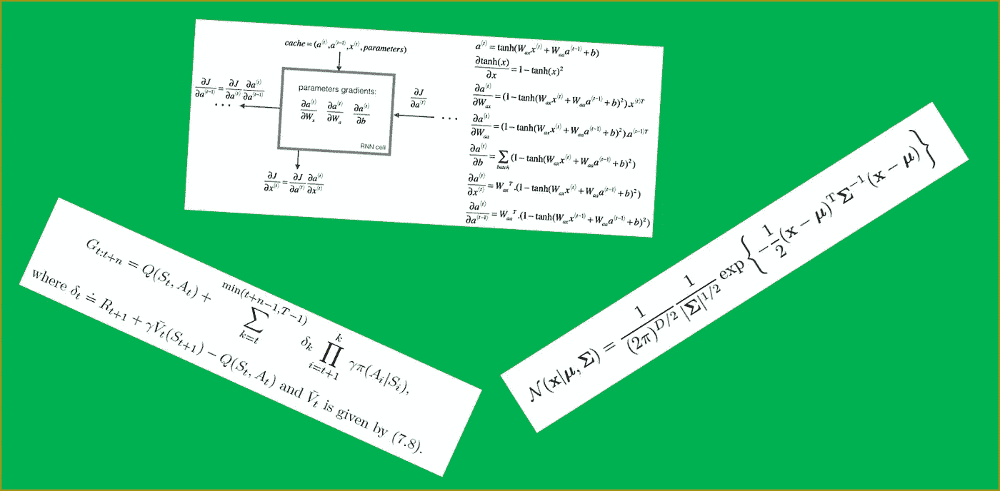
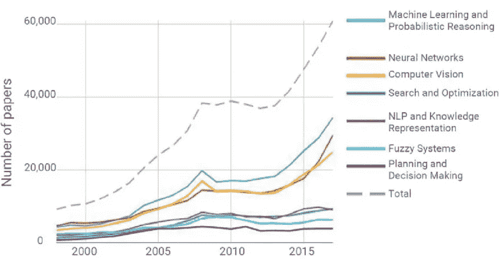

# 最性感的工作，但是…

> 原文：<https://towardsdatascience.com/sexiest-job-but-27b6e91ece8e?source=collection_archive---------3----------------------->

图片提供:Pixabay

## 作为人工智能、机器学习或数据科学从业者，在职业旅程中会有什么期待

《哈佛商业评论》的文章《数据科学家:21 世纪****最性感的工作**》在整个行业掀起了涟漪。毕竟是天价工资的梦想工作部门，所有关于人工通用智能，认知机器学习等的炒作。流行媒体痴迷于所谓的人工智能强国的每一次突破。将人工智能、数据科学家或机器学习与一个人的职业联系在一起，不仅性感，而且极具魅力。**

**但是最性感的工作并不意味着什么都性感。数据科学的许多方面令人毛骨悚然，有时甚至令人恐惧。**

**在本文中，我将交替使用数据科学、机器学习和人工智能。**

**不要看外表，如果你是认真的，最好知道如果你开始机器学习或人工智能之旅，你将在余下的职业生涯中面临什么。**

## **开始喜欢奇怪而复杂的数学符号**

****

**我每天都听到，“你们真幸运。只要用 fit/predict 写几行 python 代码，你的模型就好了”。我希望事情能这么简单。由于机器学习和人工智能在很大程度上依赖于数学，所以需要对数学的深刻理解(事实上，对于任何想在数据科学领域建立职业生涯的人来说，这是一种深度学习)。线性代数、统计学、微积分等。不仅对于博士来说，而且对于那些想要从事更高端(或者“性感”)的数据科学领域的人来说，具有高级应用水平是必要的。因此，如果你不喜欢复杂的方程或吓人的符号，最好从现在开始喜欢它。**

## **每天“深度学习”**

****

**图片提供:Pixabay**

**数据科学是一个包含多个学科知识领域的领域。新的领域作为灵感或想法和应用的扩展被包括进来。随着政府、公司和研究人员的兴趣，这一领域近年来以非凡的进步蓬勃发展。正在进行的研究工作的数量令人难以置信。该地区进展非常快，跟上了变化；从业者需要不断更新他们的技能和知识。每天都有新的论文问世，其中一些论文在很大程度上改进了以前的最先进水平。因此，我们别无选择，只能了解新的变化，并在工作、研究或应用中采用它。你需要每天对这门学科进行真正的“深度学习”。**

## **80%的数据科学工作非常无聊**

****

**图片提供:Pixabay**

**这一点我肯定是众所周知的，但我仍然想确保你没有任何误解。数据清理和数据预处理是数据科学中最讨厌但又无法逃避的部分。不要假设，如果你在一家世界知名的领先人工智能公司，你不会要求做这种肮脏的工作。只有前几%的人免于这种常规的折磨，如果你不在这前几%的人之列，那就下定决心，你必须执行这个肮脏的任务，清理污垢，刮去所有的短发或长发，从你在午休餐桌上听到的一些新来源获得更多的数据。这是非常重复的，就像处理丢失的数据，转换数据，合并数据，管理不同的管道，以一种你的模型理解的一致的格式，基本上是无聊工作的无限列表。但你必须这么做，无处可逃。习惯就好。**

## **卡格尔是！=现实世界问题**

****

**图片提供:Pixabay**

**在 Kaggle 中，你可能是一个超级明星，在许多比赛中你都进入了前 5 名，但抱歉，你会发现现实生活中的项目比任何 Kaggle 比赛都难 10 到 30 倍。大多数情况下，你会纠结于如何收集数据，定义一个清晰的范围和衡量成功的方式。你可能不需要和 100 个其他人竞争，每次你提交时，你都知道你的立场，但在现实生活中，除了你的团队为一份公司预算或达到一个目标而竞争之外，没有其他竞争。如果你有一个正在生产中运行的模型，那么你是幸运的，因为你知道有一个基线，并且你正在努力改进。Kaggle 有助于你的基础和名声，但不要忘记现实世界的问题要困难得多，成功才是**

## **哦，不，你可能要再次训练数据**

****

**图片提供:Pixabay**

**机器学习模型训练是需要时间的，很多时候是多次迭代。在这个深度学习的时代，有 100 多个隐藏层，数千个特征和数百万条记录，即使有数百个 GPU/TPU 单元，模型也需要很长时间来训练。因此，你必须学会如何度过这些反复，因为很多时候你必须重新开始。**

# **arXiv.org 每天都有大量的新报纸**

****

**图片提供:谷歌照片**

**如果你梦想成为一名顶尖的数据科学家，你必须习惯阅读档案库中专家提交的最新研究论文。研究论文呈爆炸式增长，论文的大部分主张都无法复制，因为它们没有提供具体细节或代码来执行基于作者倡导的新算法的测试。尽管如此，特殊的新想法正在出现，而让自己保持更新或采用提议的架构的唯一来源是通过对论文的更深入理解。你必须养成一种习惯，并且找到一种只关注相关事物的方法。**

## **哎呀，企业甚至不知道他们想要什么**

****

**图片提供:Pixabay**

**这可能并不奇怪，因为在许多其他部门中，企业也不知道他们需要或也想要什么。要求将会非常模糊，以至于连律师都很难解释这几行字(如果有的话)的意思。大多数组织的业务领导人不了解数据科学或人工智能的技术部分，但他们会假装什么都知道(就像许多患者认为他们比他们的医生知道得更多)。像我们希望通过这个人工智能项目彻底改变我们目前的业务方式，我们希望看到 30%的采用率增加等声明。就像你可能不得不处理的那样习惯它，这些非常高的期望，或者你可能不得不用你的业务部门仍然可能不理解的大量视觉解释和数据来解释模型的结果。如果你很幸运，并且在一家初创公司或技术领先的公司，那么你可能不会面临这种斗争，但总的来说，你会习惯这种情况，这在人工智能和人工智能采用刚刚开始的许多行业中非常常见。**

## **它是关于一次杂耍多个球**

****

**图片提供:Pixabay**

**是的，数据科学家的角色要求很高，在许多组织中，你需要成为数据科学方面的万事通。你需要知道端到端的机器学习管道是如何工作的。如何规划培训和测试管道。你必须参与数据科学团队的工程方面，参与服务器/存储配置、容器管理、Kubernetes、Kubeflow、与 Django 一起构建前端 web 界面，可能必须扮演全栈开发人员的角色。你需要为你的模型产品化做一个清理工作。这就像同时戴着许多帽子，因此要习惯数据科学角色中这些具有挑战性的部分。**

## **每隔几周，最先进的技术就会成为历史**

****

**图片提供:Pixabay**

**您可能在一个团队中工作，该团队正在使用最新的 NLP 架构进行一个任务关键型项目。尽管如此，由于超出任何人控制的多种原因，您的项目正在延期。经过三个月的努力，当你达到验收测试水平的时候，你已经意识到谷歌刚刚开源了一个新的艺术境界，而你的竞争对手已经开始着手这项工作了。欢迎来到数据科学领域的超音速变革。今天的新东西，很快就会过时。习惯这种新的职业生活方式。**

## **R&D，是的，这就是数据科学的大部分内容**

****

**图片提供:Pixabay**

**你会看到，在许多项目或决策点中，你必须尝试多种方法才能有所突破。数据科学不仅仅是科学也是一种艺术形式，这些黑艺术很多更像是有或没有理论支撑的试错法。在迈出一小步之前，你必须做大量的 R&D，因为完成同样的任务有多种方法，但每种方法给出的结果都略有不同。适用于项目 X 的方法可能不适用于项目 y。如果您的损失函数或优化程序没有给出预期的结果或速度，则需要重新发明轮子。您可能需要用较小的数据集来尝试其中的几种，看看哪一种有效。你需要尝试一些策略，如果没有一个奏效，你可能需要完全改变行动方针。底线是数据科学是一个与 R&D 领域非常相似的领域，你需要习惯这种工作文化。**

## **最后一个音符**

**很多事情让数据科学家的生活变得格外艰难，有时它感觉如何摆脱它。但是请记住，一旦你掌握了生存游戏，你就在做最性感的工作。许多人之所以成功，是因为他们接受了所有这些挑战，克服了所有这些缺点，从而变得成功。**

**我期待你的评论和分享，如果你有任何与这个行业的挑战相关的独特经验。感谢阅读。可以联系我@ [LinkedIn](http://www.linkedin.com/in/baijayantaroy) 。**

***每月只需 5 美元，就可以无限制地获取最鼓舞人心的内容……点击下面的链接，成为一名媒体会员，支持我的写作。谢谢大家！* **