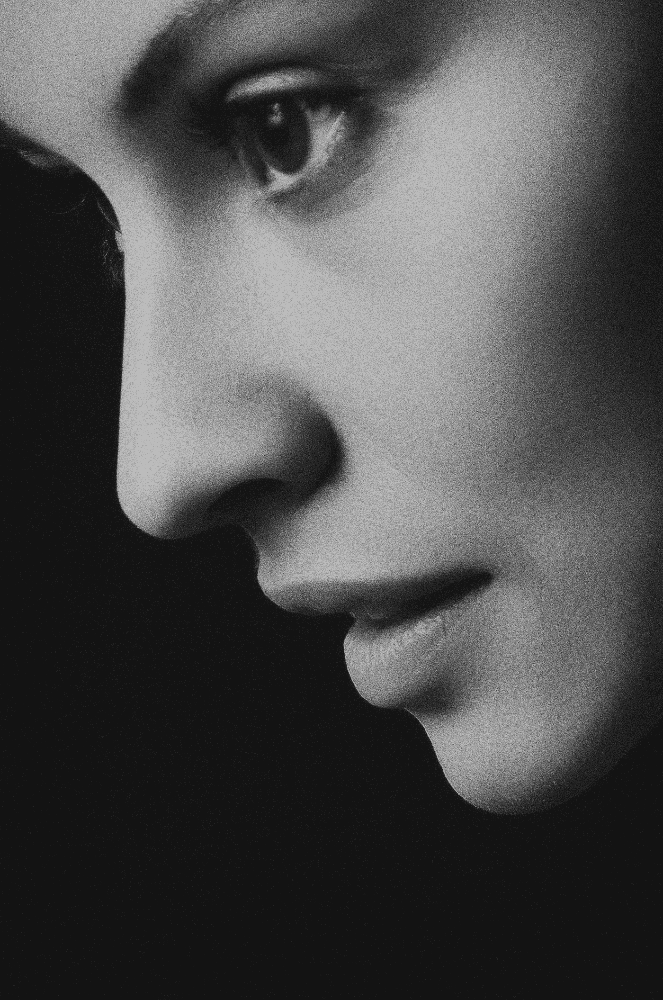
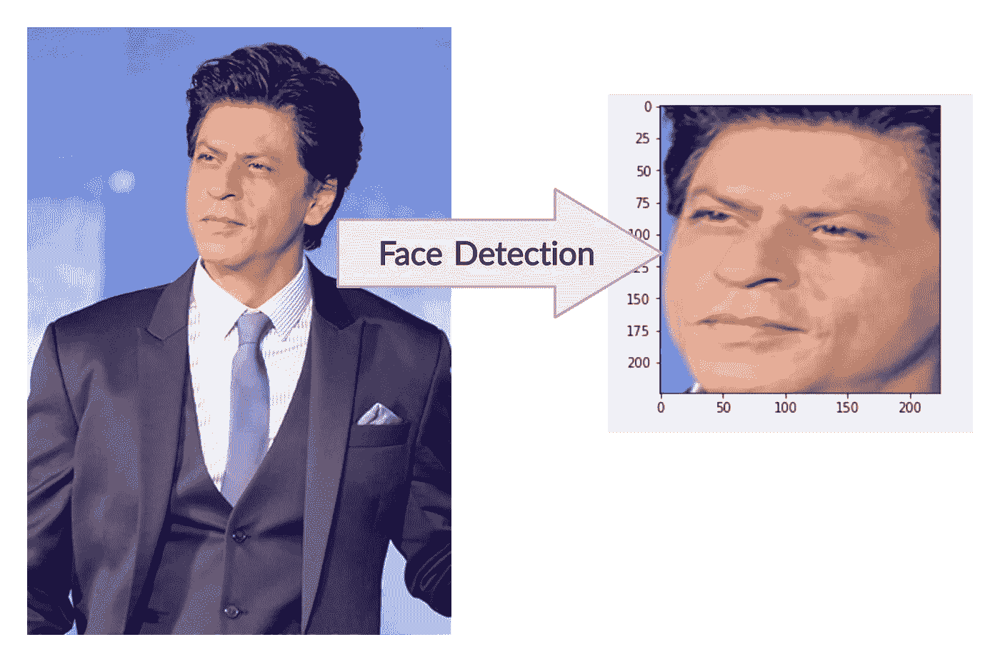
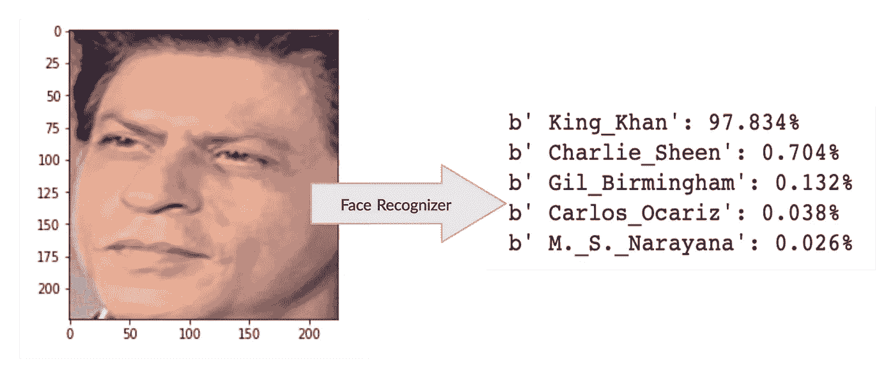

# 面部识别器—您的第四个 CNN

> 原文：<https://towardsdatascience.com/shahrukh-khan-face-recognizer-your-4th-cnn-38668dae5afc?source=collection_archive---------47----------------------->

亚历山大·克里维茨基在 [Unsplash](https://unsplash.com?utm_source=medium&utm_medium=referral) 上拍摄的照片

> 第四 CNN？

这是我在自己动手 CNN 模型系列的第四篇文章。像往常一样，格式将保持不变。我将为您提供一个 Colab 文件(它工作得非常好)，您必须在没有任何先决条件的情况下运行它，然后才能继续。原因是，一旦你自己运行它，你会变得更加重视这个问题，你会得到更深刻的见解。

你可以在这里查看我以前的文章:

*   [手写数字分类器](/handwritten-digit-classifier-your-first-end-to-end-cnn-in-5-minutes-5be3d9c6c4c0)
*   [猫狗分类器](/cats-vs-dogs-your-second-end-to-end-cnn-classifier-in-5-minutes-9adfbde08a09)
*   [斑马物体探测器](/zebra-detector-your-third-end-to-end-cnn-in-5-minutes-3ffea91d5566)

在这篇文章中，我们将解决和理解 CNN 最重要的问题之一——人脸识别。即给定一个人的照片，找出其姓名。我们将拍摄宝莱坞最著名的演员沙鲁克·汗的照片，并确定他的身份。

[来源](https://upload.wikimedia.org/wikipedia/commons/6/6e/Shah_Rukh_Khan_graces_the_launch_of_the_new_Santro.jpg)

那么，事不宜迟，让我把 [Colab 文件](https://colab.research.google.com/drive/1Nj4xLhVCtXWP-Fo9eEFMwYAe8K003Ox4?usp=sharing)交给你🚀。这不是我的作品，而是从各地抄袭来的。我在这里做的唯一一件事是确保它在 Colab 设置中运行良好(令人惊讶的是，这很难做到)。但是，尽管如此，它现在工作得很好，唷！

请随意上传您的图像并检测它们！现在，这个文件看起来可能有点吓人，但实际上并不是这样。像往常一样，我们先从理论开始，稍后将讨论实现细节。此外，根据我以前的文章，我会尽量保持简短和甜蜜。

# 人脸检测 vs 验证 Vs 识别器

首先，我们所说的识别器实际上指的是什么？

*   *人脸检测——它完全类似于物体检测。检测图像中的所有人脸并找到它们的位置*
*   *人脸验证——给出两张人脸，确定是否属于同一个人。*
*   *人脸识别器——识别被检测人的姓名。*

# *人脸检测*

这与目标是专门检测面部(而不是任何随机对象)的[对象检测](/zebra-detector-your-third-end-to-end-cnn-in-5-minutes-3ffea91d5566)完全一致。有几个著名的型号可供选择。我不会深入探讨这个问题，因为这超出了我的博客范围。

*   ***Dlib*** *:作用于梯度方向直方图(HOG)和线性 SVM。不过，这只能检测正面人脸。* [*阅读更多*](/cnn-based-face-detector-from-dlib-c3696195e01c) *。*
*   ***哈尔级联:*** *是 CNN 上的一个优化技术。所有的内核并没有一起应用。相反，它们被分成多个更小的组。如果在第一组中没有检测到任何东西，它就不会继续前进。*
*   ***MTCNN*** *:其 CNN 有多个阶段。第一种状态检测边界框，在后面的阶段消除误报，并选择人脸的最终边界标志。*

# 人脸识别器

现在，一旦检测到人脸，识别这个人的名字就完全是另外一个问题了。在继续之前，让我在这里介绍几个概念。

## **概念一:人脸嵌入**

这正是在单词嵌入方面。唯一的区别是它代表欧几里得空间中的人脸。

*   每张脸都被转换成一个矢量，这个矢量以某种方式代表了这张脸的所有特征。
*   *所有这些向量都被绘制成欧几里得空间上的点。*
*   *点越近，脸越相似*。

## 概念 2:连体网络

你听说过连体双胞胎吗？这些是长得一模一样的连体双胞胎。我们的网络也是如此。

因此，连体网络是一种具有两个并行神经网络的架构，每个神经网络接受不同的输入。两个单独的输出然后被组合以提供两个图像的相似性的预测。

# 暹罗网络培训技术

基于我们拥有的大量训练数据，通过两种技术，暹罗网络可以用来预测人的名字。

## 技巧 1:一次性学习

*什么时候用这个:当我们没有足够的学习数据的时候。*

*工作原理:*

*   ***训练数据:*** *100 个不同的人的 100 个不同的图像。*
*   ***场景:*** *检查一张图片是否符合以上 100 个人中的任何一个。*
*   ***解法:*** *计算出给定图片与上述所有 100 张图片的相似度得分。*
*   ***结果:****100 分中图像相似度得分最高的一个(高于截止值)，将被标记为匹配。*

## 技巧 2:三重态丢失

*什么时候用这个:当我们有足够的学习数据来很好地训练网络的时候。*

它是如何工作的？

*   ***训练数据:*** *1000 个不同的人的 1000 个不同的图像。*
*   ***训练步骤:*** *取一张锚点图像，用匹配图像和不匹配图像进行训练。并计算损失。这种损失叫做* ***三重损失*** *。*
*   ***场景:*** *检查一张图片是否符合以上 100 个人中的任何一个。*
*   ***解决方案:*** *就像其他 CNN 一样，把它作为输入发送给一个已经训练好的系统，得到相关的输出。*

为了实现人脸检测和识别，以沙鲁克·汗为例。正如你所看到的，人脸检测和识别是如何工作的，并给出如此准确的结果。这里使用了基于 MTCNN 的人脸检测和基于三元组丢失的人脸识别器。

请随意上传你最喜欢的演员的照片，并与它一起玩。