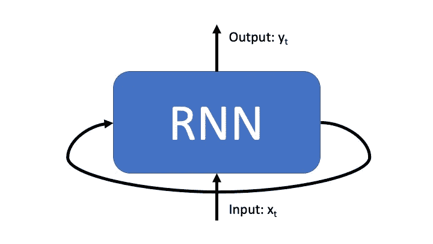

# 莎士比亚遇上谷歌的亚麻

> 原文：<https://towardsdatascience.com/shakespeare-meets-googles-flax-ecbd16f9d648?source=collection_archive---------34----------------------->

## 用 Flax 构建字符级语言模型

在 [Unsplash](https://unsplash.com/s/photos/flax?utm_source=unsplash&utm_medium=referral&utm_content=creditCopyText) 上由 [Amariei Mihai](https://unsplash.com/@mex_face_poze?utm_source=unsplash&utm_medium=referral&utm_content=creditCopyText) 拍摄的照片

> 有些人生来伟大，有些人成就伟大，有些人是被强加伟大的。
> 
> 威廉·莎士比亚，第十二夜，或者随便你

几个月前，谷歌研究人员介绍了机器学习领域的新星 Flax。从那以后发生了很多事情，预发布版也有了很大的改进。我自己用 CNN 在亚麻上做的实验[开花结果](/googles-approach-to-flexibility-in-machine-learning-170bd9d8f169)，与 Tensorflow 相比，我仍然对其灵活性感到惊讶。今天我将向大家展示 RNNs 在 Flax 中的一个应用:**字符级语言模型**。

在许多学习任务中，我们不必考虑对先前输入的时间依赖性。

但是如果我们没有独立的固定大小的输入和输出向量，我们能做什么呢？如果我们有向量序列呢？解决方案是**递归神经网络。**它们允许我们对如下所述的载体序列进行操作。

# **递归神经网络**

灵感来自[安德烈·卡帕西](http://karpathy.github.io/2015/05/21/rnn-effectiveness/)

在上图中，您可以看到不同类型的输入和输出架构:

*   **一对一**是我们典型的 CNN 或多层感知器，一个输入向量映射到一个输出向量。
*   **一对多**是一个很好的图像字幕 RNN 架构。输入是我们的图像，输出是描述我们图像的一系列单词。
*   **多对多:**第一种架构利用输入序列输出序列进行机器翻译，例如德语到英语的翻译。第二种适用于帧级别的视频字幕。

RNNs 的主要优点是它们不仅依赖于当前的输入，而且依赖于先前的输入。

RNN 是具有内部隐藏状态的单元，根据隐藏的大小用零初始化。在每个时间步 *t* 中，我们将输入 x_t 插入我们的 RNN 单元，并更新隐藏状态。现在，在下一时间步 *t+1* 中，隐藏状态不再用零初始化，而是用先前的隐藏状态初始化。因此，RNNs 允许保存关于几个时间步长的信息并生成序列。

灵感来自[安德烈·卡帕西](http://karpathy.github.io/2015/05/21/rnn-effectiveness/)

# 字符级语言模型

利用我们的新知识，我们现在要为我们的 RNN 构建第一个应用程序。字符级语言模型是许多任务的基础，例如图像字幕或文本生成。RNN 单元的输入是字符序列形式的大块文本。现在的训练任务是学习如何在给定一系列前一个字符的情况下预测下一个字符。所以我们在每个时间步长 t 生成一个字符，我们之前的字符是 x_t-1，x_t-2，…

作为一个例子，让我们把单词 FUZZY 作为我们的训练序列，现在词汇表是{'f '，' u '，' z '，' y'}。因为 RNN 只对向量起作用，所以我们把所有的字符都转换成所谓的一键向量。基于词汇表中的位置，一个 hot-vector 由 0 和 1 组成，对于“Z ”,转换的向量是[0，0，1，0]。在下图中，您可以看到给定输入“FUZZ”的示例，我们希望预测单词“UZZY”的结尾。我们神经元的隐藏大小是 4，我们希望输出层的绿色数字高，红色数字低。

灵感来自[安德烈·卡帕西](http://karpathy.github.io/2015/05/21/rnn-effectiveness/)

如果你对 RNNs 背后的数学感兴趣，请点击[链接](http://karpathy.github.io/2015/05/21/rnn-effectiveness/)。

# 最后，我们正在编码

请注意，我在之前关于 CNN 的[文章](/googles-approach-to-flexibility-in-machine-learning-170bd9d8f169)中解释了亚麻的一些基本概念。作为数据集，我们使用由如下对话组成的[小莎士比亚](https://raw.githubusercontent.com/karpathy/char-rnn/master/data/tinyshakespeare/input.txt):

> 爱德华:
> 
> 即使如此；然而你仍然是沃里克。
> 
> 格洛斯特:
> 
> 来吧，沃里克，抓紧时间；跪下，跪下:不，什么时候？现在就打，否则铁就凉了。

我再次使用 Google Colab 进行培训，因此我们必须再次安装必要的 PIP 包:

您应该使用具有 GPU 支持的运行时，因为训练任务要求非常高。您可以使用以下命令测试 GPU 支持的存在:

现在，我们准备从头开始创建我们的 RNN:

在这样一个真实的训练环境中，我们不用普通的 RNN 细胞，而是用 LSTM 细胞。这些是进一步的发展，可以更好地处理消失梯度的问题。为了达到更高的精度，我使用了三个堆叠的 LSTM 池。非常重要的是，我们将第一个单元的输出传递给下一个单元，并且用自己的隐藏状态初始化每个 LSTM 单元。否则，我们会失去对时间依赖性的跟踪。

最后一个 LSTM 池的输出在我们的致密层中给出。致密层有我们的词汇量那么大。在我们之前的“模糊”例子中，神经元的数量是四个。如果“FUZZ”被设置为我们的 RNN 的输入，神经元最多应该产生类似于[1.7，0.1，-1.0，3.1]的输出，因为该输出指示“Y”是最可能的字符。

因为我们有两种不同的模式，所以针对不同的情况，我们将 RNN 封装在另一个模块中。

这些案例是:

*   训练模式，我们想学习如何预测
*   预测模式，我们实际上采样一些文本

在训练我们的模型之前，我们需要用以下函数创建它:

我们的每个序列都有 50 个字符的长度，我们有 65 个不同字符的词汇表。

作为我们 RNN 的优化器，我选择 Adam 优化器，其初始学习率为 0.002，权重衰减以避免过大的权重。

# 培训模式

在训练模式中，我们将一批 32 个序列输入我们的 RNN。每个序列都来自我们的数据集，包含两个子序列，一个包含从 0 到 49 的字符，另一个包含从 1 到 50 的字符。通过这个简单的拆分，我们的网络可以学习最有可能的下一个字符。在每一批中，我们初始化隐藏状态，并将序列提供给我们的 RNN。

在我们的训练方法中，我们有两个子功能。loss_fn 通过将被解释为向量的输出神经元与期望的独热向量进行比较来计算交叉熵损失。同样，在我们的“模糊”示例中，我们会有一个输出[1.7，0.1，-1.0，3.1]和一个热向量[0，0，0，1]。我们现在用这个公式计算损失:

其中 y 是我们的标签，y_hat 是逻辑的 softmax 输出。我不得不稍微改写一下 CNN 例子中的代码，因为我们现在处理的是序列而不是简单的类:

训练步骤中的另一种方法是指数衰减。我使用 Adam 优化器，初始学习率为 0.002。但是对于每五个时期，我想降低学习率以避免太强的振荡。在每五个时期之后，因子 0.97ˣ乘以我们的初始学习速率，x 是我们到达五个时期的频率。

你可以再一次看到 Flax 的力量，它是一种简单而灵活的方式，你可以在运行中集成你自己的学习率调度程序。

# 预测模式

现在我们想要评估我们学习的模型，因此我们从我们的词汇表中随机挑选一个字符作为入口点。像在训练中一样，我们初始化我们的隐藏状态，但这次只是在采样开始时。子功能推理现在接受一个字符作为输入。对于隐藏状态，我们在每个时间步长后输出它们，并在下一个时间步长将它们输入到我们的 RNN 中。因此，我们不会失去我们的时间依赖性。

这种方法被称为“贪婪采样”，因为我们总是在输出向量中选择概率最高的字符。还有更好的采样方法，比如波束搜索，我不在这里讨论。

# 训练和样本循环

至少我们可以在训练和样本循环中调用所有编写的函数。

每 10 个时期后，我们生成一个文本示例，在开始时，它看起来非常重复:

> 顶峰水手们所有的商人的意义的意义的意义的意义的意义的意义…

但是模型变得越来越好，经过 100 个时期的训练，输出看起来像莎士比亚还活着，正在写新的文本！

> 这是一个受尊敬的女人向国王的转变，向这个最危险的士兵和财富的转变。
> 
> 安东尼奥:
> 如果她会在月亮的荣誉上出现，为什么，…

100 个周期后的训练准确率为 86.10%，我们的学习率衰减到 0.00112123。

# 结论

字符级语言模型在其基础上是完成文本的强大工具，并且可以用作自动完成。同样，给定文本的情感可以被学习来利用这个概念。但是如你所见，生成完整的新文本是一项非常困难的任务。我们的模型的输出句子看起来像莎士比亚的文本，但它缺乏意义。在下一篇文章中，我将使用这种模型，并根据有意义的输入创建更多有意义的句子。

尽管 Flax 拥有强大和众多的工具，但它仍处于早期开发阶段，但它们正在以自己的方式开发一个我喜欢的框架。真正巧妙的是，我只需要稍微修改一下我的“旧”CNN 代码，就可以在现有的基础上使用 RNN。

但是 Flax 仍然缺少自己的输入管道，因此我不得不用 Tensorflow 来写这个。您可以在 Github Repo 中找到数据集创建的代码和完整的 RNN。

如果你想自己试试我的代码，就看看我的 [Github Repo](https://github.com/Skyy93/CharacterLevelModelFlax) 。

不然我可以推荐[亚麻 Github Repo](https://github.com/google/flax/) 和他们的[文档](https://flax.readthedocs.io/)。

图片的灵感来自这个[博客](http://karpathy.github.io/2015/05/21/rnn-effectiveness/)。