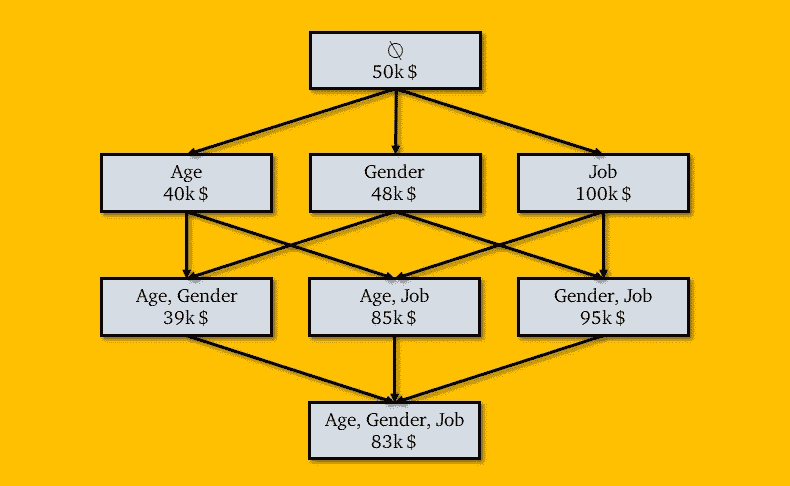
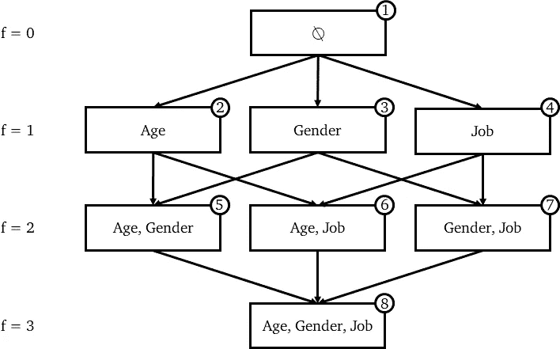
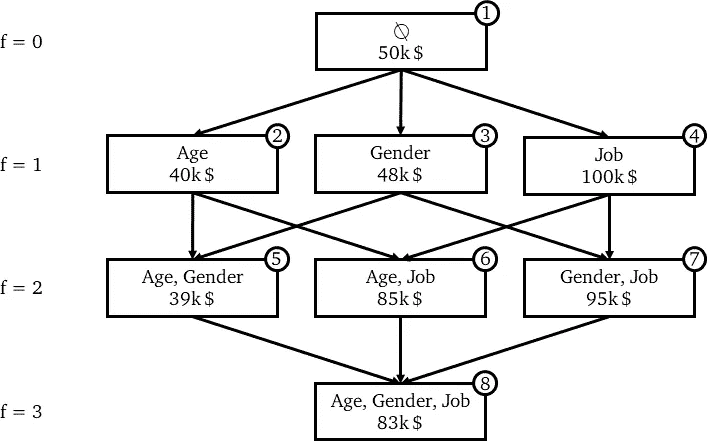
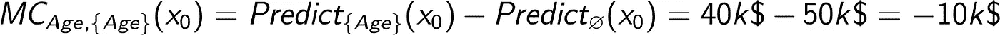
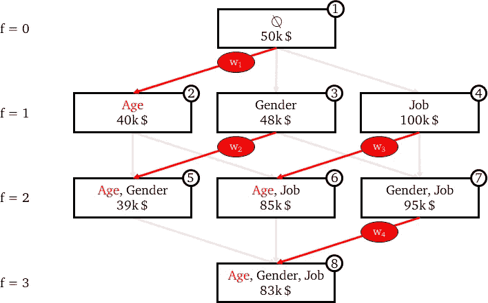
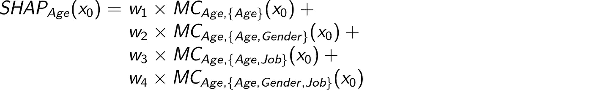
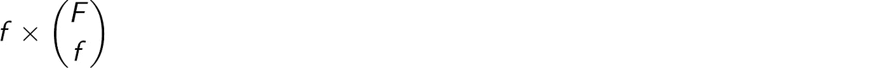
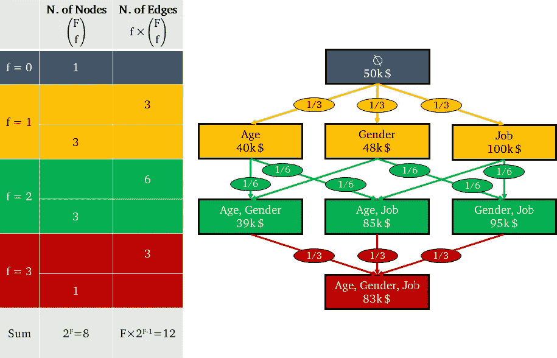
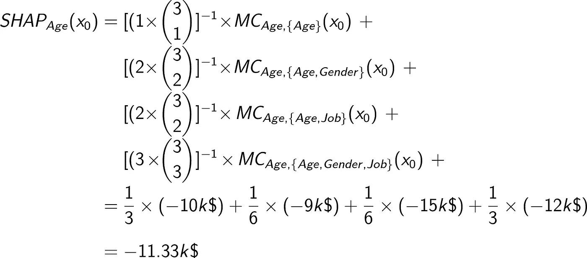
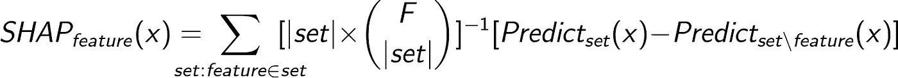

# SHAP 价值观准确地解释了你希望别人如何向你解释

> 原文：<https://towardsdatascience.com/shap-explained-the-way-i-wish-someone-explained-it-to-me-ab81cc69ef30?source=collection_archive---------0----------------------->

## 理解用于计算 SHAP 值的公式

# 去神秘化

SHapley 代表 SHapley Additive explaining——可能是机器学习可解释性的艺术状态。该算法由 Lundberg 和 Lee ( [此处](https://arxiv.org/abs/1705.07874)是原文)于 2017 年首次发表，它是对任何预测算法的输出进行逆向工程的一种出色方式。

简而言之，每当您有一个复杂的模型(可能是梯度增强、神经网络或任何将一些要素作为输入并产生一些预测作为输出的东西)并且您想要了解模型正在做出什么决策时，就会使用 SHAP 值。

> 预测模型回答“多少”。SHAP 回答了“为什么”。

在之前的一篇文章中([黑盒模型实际上比逻辑回归](/black-box-models-are-actually-more-explainable-than-a-logistic-regression-f263c22795d)更容易解释)，我们用 SHAP 来理解为什么梯度推进模型表明泰坦尼克号乘客生还的可能性更大或更小。换句话说，我们用 SHAP 揭开了黑箱模型的神秘面纱。但是，到目前为止，我们开发了 Python 的 [SHAP 库，而没有过多担心它是如何工作的。](https://github.com/slundberg/shap)

> 具有讽刺意味的是，我们把 SHAP 本身当成了一个黑盒！

然而，理解 SHAP 值计算背后的思想对于理解其结果至关重要。这就是为什么，在这篇文章中，我们将通过 Slundberg 和 Lee 的文章[中描述的 SHapley 加法解释的理论基础，并了解为什么 SHAP 值是以这种方式计算的。](https://arxiv.org/abs/1705.07874)

# 博弈论和机器学习

SHAP 价值观是基于沙普利价值观，一个来自博弈论的概念。但是博弈论至少需要两样东西:一个游戏和一些玩家。这如何应用于机器学习的可解释性？假设我们有一个预测模型，那么:

*   **“游戏”正在再现模型**的结果，
*   **“玩家”是模型**中包含的特征。

**沙普利做的是量化每个球员给游戏带来的贡献。SHAP 所做的是量化每个特征对模型所做预测的贡献。**

重要的是要强调，我们所谓的“游戏”涉及到一个单一的观察。**一局:一次观察**。事实上，SHAP 是关于预测模型的局部可解释性。

# 强大的功能集

举例来说，我们将想象一个机器学习模型(假设是线性回归，但它可以是任何其他机器学习算法)，该模型在知道一个人的年龄、性别和工作的情况下预测该人的收入。

Shapley 值基于这样一种想法，即应该考虑每个可能的玩家组合(或联盟)的结果，以确定单个玩家的重要性。在我们的例子中，这对应于 *f* 特征的每个可能组合(在我们的例子 3 中， *f* 从 0 到 *F* ， *F* 是所有可用特征的数量)。

在数学中，这被称为“[幂集](https://en.wikipedia.org/wiki/Power_set)”，可以用树来表示。

强大的功能集

**每个节点代表一个特性联盟。每条边代表包含一个先前联盟中不存在的特征**。

从数学上我们知道，幂集的基数是 2 ^ *n* ，其中 *n* 是原集合的元素个数。事实上，在我们的例子中，我们有 2 个^ f = 2 个^ 3 = 8 个可能的特征组合。

现在， **SHAP 要求为权力集中的每个不同联盟训练一个不同的预测模型，这意味着 2 个^ *F* 模型**。当然，**这些模型在超参数和训练数据方面是完全等价的。唯一改变的是模型中包含的一组特性。**

假设我们已经根据相同的训练数据训练了 8 个线性回归模型。然后我们可以进行一次新的观察(姑且称之为 *x₀* )，看看 8 个不同的模型对相同的观察 *x₀* 预测了什么。

不同模型对 *x₀.的预测*在每个节点中，第一行报告模型中包含的功能联盟，第二行报告该模型为 *x₀* 预测的收入。

这里，**每个节点代表一个型号**。但是边代表什么呢？

# 建筑 SHAP 公式(1/2) —特征的边际贡献

如上所述，由边连接的两个结点仅在一个特征上有所不同，也就是说，底部结点具有与上部结点完全相同的特征，外加一个上部结点没有的附加特征。因此，**两个连接节点的预测之间的差距可归因于该附加特征的影响。这被称为一个特性的“边际贡献”**。

因此，**每条边代表一个特征给一个模型带来的边际贡献**。

假设我们在节点 1，这是一个没有特征的模型。该模型将简单地预测所有训练观察的平均收入(50k $)。如果我们转到节点 2，这是一个只有一个特征(年龄)的模型，对 *x₀* 的预测现在是 4 万美元。这意味着知道了 x₀的年龄后，我们的预测降低了 1 万美元。

因此，年龄给只包含年龄作为特征的模型带来的边际贡献是-10k 美元。在公式中:

当然，为了获得年龄对最终模型的整体影响(即 *x₀* 的年龄 SHAP 值)，有必要考虑**年龄在所有存在年龄的模型中的边际贡献**。在我们的树表示中，这意味着考虑连接两个节点的所有边，使得:

*   上面的不包含年龄，和
*   最下面的一个包含年龄。

在下图中，这些边以红色突出显示。

年龄的边际贡献

所有这些边际贡献然后通过加权平均进行汇总。在公式中:

w₁+w₂+w₃+w₄=*1。*

# 构建 SHAP 公式(2/2)——权衡边际贡献

但是我们如何确定边的权重(即 4 个模型中年龄的边际贡献)？

这个想法是:

*   **对 1 特征模型的所有边际贡献的权重之和应该等于对 2 特征模型的所有边际贡献的权重之和，依此类推...**换句话说，同一“行”上所有权重的总和应该等于任何其他“行”上所有权重的总和。在我们的例子中，这意味着: *w₁ = w₂ + w₃ = w₄.*
*   **对于每个 *f*** ，所有对 *f* 特征模型的边际贡献权重应该彼此相等。换句话说，同一“行”上的所有边应该彼此相等。在我们的例子中，这意味着: *w₂ = w₃.*

因此，(记住它们的总和应该是 1)解决方案是:

*   *w₁* = 1/3
*   w₂ = 1/6
*   *w₃* = 1/6
*   *w₄* = 1/3

看上面的图，你能猜出在一个通用框架中确定权重的模式吗？

剧透:一条边的权重是同一“行”中边总数的倒数。或者，等效地，**对一个 *f* 特征模型的边际贡献的权重是对所有 *f* 特征模型**的可能边际贡献的倒数。

这个有公式计算吗？事实上，这很简单。

每个 *f* 特征模型都有 *f* 边际贡献(每个特征一个)，因此计算可能的 *f* 特征模型的数量并乘以 *f* 就足够了。因此，问题归结为计算可能的 *f* 特征模型的数量，给定 *f* 并且知道特征的总数是 *F* 。这就是二项式系数的简单定义。

综上所述，我们知道所有*f*-特征模型的所有边际贡献的数量——换句话说，每一“行”中的边的数量——是:

取这个的倒数就足够了，我们得到了对特征模型的边际贡献的权重。

下图举例说明了这一点:

如何从边的数量获得权重

现在，我们有了计算 *x₀* 年龄的 SHAP 值所需的所有元素:

# 包装它

我们建立了一个计算三要素模型中年龄的 SHAP 值的公式。推广到任何特征和任何 *F* ，我们得到 Slundberg 和 Lee 在[文章](https://arxiv.org/abs/1705.07874)中报道的公式:

应用于我们的示例，该公式得出:

*   shap _ age(*x₀*)=-11.33 千美元
*   shap _ gender(*x₀*)=-2.33 千美元
*   SHAP_Job( *x₀* ) = +46.66k 美元

将它们相加得到+33k $，这正好是完整模型的输出(83k $)和没有特征的虚拟模型的输出(50k $)之间的差。

这是 SHAP 值的一个基本特征:**对给定观测值的每个特征的 SHAP 值求和产生了模型预测和零模型预测之间的差异**(或其逻辑函数，如我们在这里看到的)。这实际上是他们的名字的原因:沙普利加法解释。

# 太好了！现在我可以自己计算 SHAP 值了

呃……不！

如上图所示，最初的 SHAP 公式需要训练 2 个^ *F* 模型。对于一个只有 50 个特征的模型，这意味着要训练 1e15 个模型！的确，随着 *F* 的增加，上面看到的公式很快就变得不适用了。

然而，像 Slundberg 写的[这样的库使用了一些出色的近似和采样(我将在后续的文章中讨论这个话题)使得这项工作变得可行。](https://github.com/slundberg/shap)