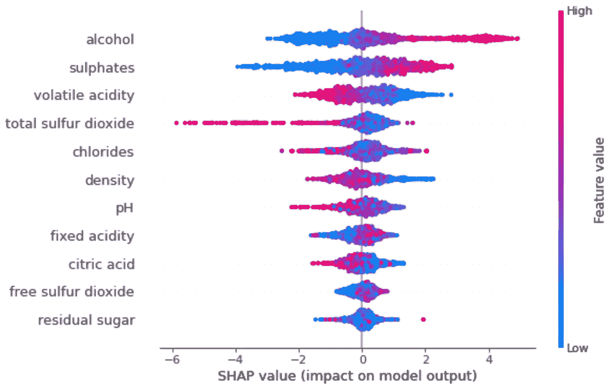

# SHAP:如何用 Python 解释机器学习模型

> 原文：<https://towardsdatascience.com/shap-how-to-interpret-machine-learning-models-with-python-2323f5af4be9?source=collection_archive---------8----------------------->

## 用一个函数调用就能解释的机器学习

没有人喜欢黑箱模型。有了复杂的算法和大量的数据准备，建立好的模型是很容易的，但是内部发生了什么？这就是*可解释的 AI 和*出现的地方。

在 [Unsplash](https://unsplash.com/s/photos/abstract?utm_source=unsplash&utm_medium=referral&utm_content=creditCopyText) 上[paweczerwiński](https://unsplash.com/@pawel_czerwinski?utm_source=unsplash&utm_medium=referral&utm_content=creditCopyText)拍摄的照片

不想看书？看看我关于这个主题的视频:

今天你将学习如何向大众解释机器学习模型。我们将使用三个不同的图进行解释——一个用于单个预测，一个用于单个变量，一个用于整个数据集。

读完这篇文章后，你应该对解释机器学习模型的预测和每个预测器的重要性没有任何问题。

这篇文章的结构如下:

*   什么是 SHAP？
*   模特培训
*   模型解释
*   结论

# 什么是 SHAP？

我们来看看创作者的一份官方声明:

> *SHAP(SHapley Additive explaints)是一种解释任何机器学习模型输出的博弈论方法。它将最优信用分配与使用博弈论及其相关扩展的经典 Shapley 值的本地解释联系起来。(*来源:[https://github.com/slundberg/sha*p)*](https://github.com/slundberg/shap))

这是许多花哨的词汇，但这里有一件你应该知道的事情——SHAP 帮助我们用匀称的值来解释机器学习模型。

*但是什么是匀称的价值观呢？*简而言之，它们是每个预测器(特征)在机器学习模型中的贡献的度量。这肯定是网络上最不花哨的定义，但我认为它很容易理解。

让我们接下来开始训练我们的模型，以便我们可以尽快开始解释。

# 模特培训

为了解释机器学习模型，我们首先需要一个模型——所以让我们基于[葡萄酒质量数据集](https://www.kaggle.com/piyushagni5/white-wine-quality)创建一个模型。下面是将它加载到 Python 中的方法:

葡萄酒数据集标题(图片由作者提供)

没有必要清理数据—所有数据类型都是数字，并且没有丢失数据。训练/测试分割是下一步。列`quality`是目标变量，它可以是*好的*或*坏的*。为了获得相同的分割，请将`random_state`的值设置为 42:

现在我们准备训练模型。`XGBoost`分类器会完成这项工作，所以确保首先安装它(`pip install xgboost`)。为了再现性，再次将`random_state`的值设置为 42:

开箱即用，我们有 80%的准确率(`score`)。现在我们有了开始解释这个模型所需要的一切。我们将在下一节中介绍这一点。

# 模型解释

为了通过 SHAP 解释这个模型，我们首先需要安装这个库。您可以通过从终端执行`pip install shap`来完成。然后我们可以导入它，基于 XGBoost 模型制作一个解释器，最后计算 SHAP 值:

我们准备好出发了！

## 解释单一预测

让我们从小而简单开始。有了 SHAP，我们可以对一个单一的预测做出解释。SHAP 图显示了有助于将输出从基础值(平均模型输出)推至实际预测值的特征。

红色表示将预测值推高的特征，蓝色表示相反的特征。

让我们来看看一款被归类为`bad`的葡萄酒的解读图:

对劣质葡萄酒的解读(图片由作者提供)

这是一个分类数据集，不用太担心`f(x)`值。只有`residual sugar`属性将这个实例推向了好的葡萄酒质量，但正如我们所看到的，这还不够。

接下来，我们来看看一款`good`葡萄酒的解读图:

一款优质葡萄酒的诠释(图片由作者提供)

这里完全是另一个故事。您现在知道了如何解释单个预测，所以让我们稍微增加一点趣味，看看如何解释单个特征对模型输出的影响。

## 解释单一特征

为了了解单个要素对模型输出的影响，我们可以绘制该要素的 SHAP 值与数据集中所有实例的要素值的关系图。

下图显示了随着`alcohol`值的变化，葡萄酒质量的变化。单一值的垂直离差显示了与其他特征的交互作用。SHAP 自动选择另一个特征来着色，以使这些交互更容易看到:

单个特征的解释(图片由作者提供)

现在，让我们检查整个数据集，以确定哪些要素对模型最重要，以及它们如何影响预测。

## 解释整个数据集

通过绘制摘要图表，我们可以直观地了解特性的重要性及其对预测的影响。下面的方法根据所有样本的 SHAP 量值总和对要素进行排序。它还使用 SHAP 值来显示每个要素的影响分布。

颜色代表特征值，红色表示高，蓝色表示低。接下来我们来看看剧情:

整个模型的解释(图片由作者提供)

解释为:

*   高酒精值增加了预测的葡萄酒质量
*   低挥发性酸度提高了预测的葡萄酒质量

您现在已经知道了足够开始解释您自己的模型。让我们在下一部分总结一下。

# 离别赠言

起初，解释机器学习模型似乎很复杂，但像 SHAP 这样的库让一切变得像函数调用一样简单。我们甚至不必担心数据可视化，因为有内置的函数可以实现这一点。

这篇文章应该为您提供更高级的解释可视化的基础，并为您的进一步学习提供足够的信息。

你对 SHAP 有什么看法？请在下面的评论区告诉我。

## [加入我的私人邮件列表，获取更多有用的见解。](https://mailchi.mp/46a3d2989d9b/bdssubscribe)

*喜欢这篇文章吗？成为* [*中等会员*](https://medium.com/@radecicdario/membership) *继续无限制学习。如果你使用下面的链接，我会收到你的一部分会员费，不需要你额外付费。*

 [## 通过我的推荐链接加入 Medium-Dario rade ci

### 作为一个媒体会员，你的会员费的一部分会给你阅读的作家，你可以完全接触到每一个故事…

medium.com](https://medium.com/@radecicdario/membership) 

*原载于 2020 年 11 月 9 日 https://betterdatascience.com***。**