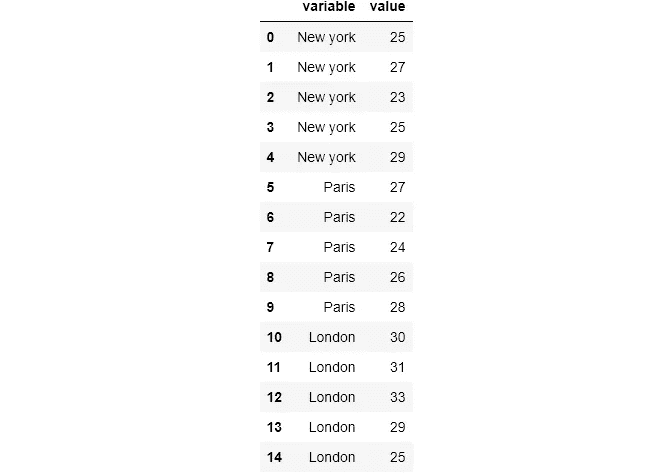
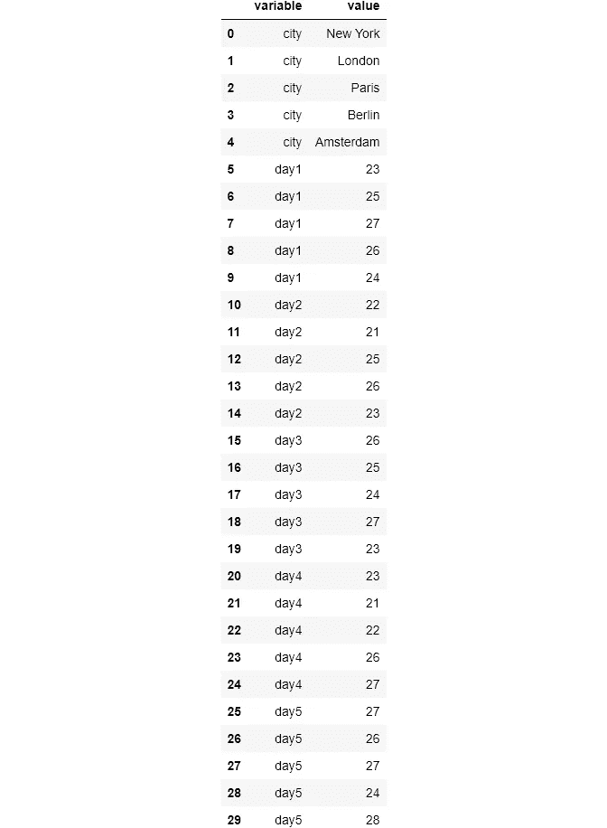
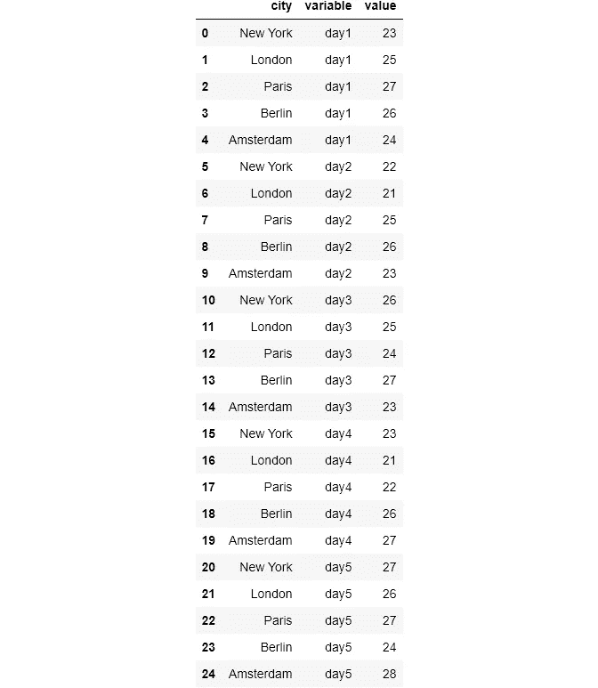
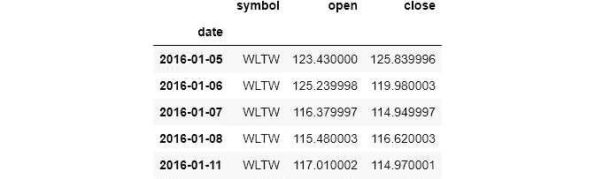
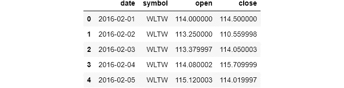
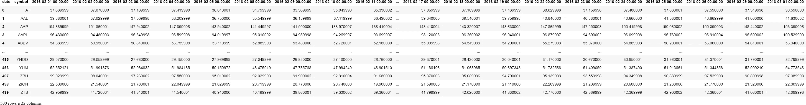
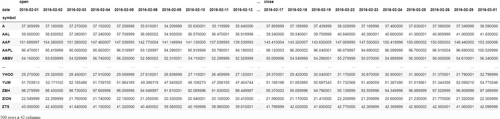

# 认识熊猫最难的功能，第三部分

> 原文：<https://towardsdatascience.com/shape-tables-like-jelly-with-pandas-melt-and-pivot-f2e13e666d6?source=collection_archive---------9----------------------->

## 用熊猫重塑桌子

## 形状像果冻的桌子有熊猫旋转()和融化()


照片由 [Anastase Maragos](https://unsplash.com/@visualsbyroyalz?utm_source=medium&utm_medium=referral) 在 [Unsplash](https://unsplash.com?utm_source=medium&utm_medium=referral) 上拍摄

## 介绍

我并不羞于承认。`melt()`和`pivot()`对我来说是`pandas`中最难学的。我花了 3-4 个多月才想明白。当我第一次看到它们时，我试了又试，但不明白它们是如何或何时被使用的。所以，我放弃了，继续前进，再次遇见他们。尝试过，失败过，继续前进，再相遇。重复了很多次。

令我感到困惑的是，在这个有数百万视频和博客教程的时代，我找不到一个简单的好的来源可以更好地解释这些功能。我最喜欢的`pandas`博客，实用商业 Python，它涵盖了`pandas`的许多硬功能，好心地把它们省略了*😔😔*。而且，他们的文档只有在你完全了解这些功能后才有意义，一些网站(如果你搜索这些功能，它们的排名总是很高)只是复制文档😶😶。

所以，就像我最近一直在写的`pandas`的硬功能一样(它们表现得真的很好)，现在是`melt()`和`pivot()`的时候了。我希望这篇文章对面临类似困难的人有用。

[](https://ibexorigin.medium.com/membership) [## 通过我的推荐链接加入 Medium-BEXGBoost

### 获得独家访问我的所有⚡premium⚡内容和所有媒体没有限制。支持我的工作，给我买一个…

ibexorigin.medium.com](https://ibexorigin.medium.com/membership) 

获得由强大的 AI-Alpha 信号选择和总结的最佳和最新的 ML 和 AI 论文:

[](https://alphasignal.ai/?referrer=Bex) [## 阿尔法信号|机器学习的极品。艾总结的。

### 留在循环中，不用花无数时间浏览下一个突破；我们的算法识别…

alphasignal.ai](https://alphasignal.ai/?referrer=Bex) 

## 可点击的目录(仅限网络)

∘ [简介](#d30b)
∘ [设置](#203e)
∘ [熊猫融()](#668c)
∘ [熊猫融()](#675b)
∘ [熊猫枢()](#0726)

> 你可以从[这个](https://github.com/BexTuychiev/medium_stories/tree/master/hardest_of_pandas3) GitHub repo 下载笔记本和样本数据。在每个函数第一次出现时，我还用超链接链接了它们的文档。

## 设置

## 熊猫融化()

让我们从一个非常愚蠢的例子开始。我将创建一个 1x1 的数据帧，保存一个城市名称和一天的温度。然后，我会在它上面调用`[melt()](https://pandas.pydata.org/docs/reference/api/pandas.melt.html)`，看看它有什么效果:


```
>>> df.melt()
```


因此，在没有任何参数的情况下，`melt()`获取一列，并将其转换为包含两个新列的行(不包括索引)。让我们再添加两个城市作为列:


如果你注意到，这种数据帧格式不容易使用，而且不干净。最理想的是将列转化为行，它们的温度值在右边:

```
df.melt()
```


让我们为城市添加更多的温度:


如果我们在这个版本的数据帧上调用`melt()`，你认为会发生什么？手表:

```
df_larger.melt()
```



正如预期的那样，它将每个列值转换成一行。例如，让我们以一个键值对为例。纽约的气温是[25，27，23，25，29]。这意味着有 5 个键值对，当我们使用`melt()`，`pandas`获取每一个键值对，并将它们显示为一行两列。在`pandas`与`New York`完成之后，它移动到其他列。

当`melt()`在两列中显示每个键-值对时，它为这两列提供默认名称`variable`和`value`。可以将它们更改为更有意义的内容:


`var_name`和`value_name`可用于改变熔化数据框的列的标签。

如果我们继续添加列，`melt()`将总是把每个值转换成一个包含两列的行，这两列包含前一列的名称和它的值。

现在，让我们严肃一点。假设我们有这个数据框架:


这一次，我们已经把城市列成了一列。但是，这种类型的表格格式仍然没有用。该数据集包含 5 个城市 5 天的温度信息。我们甚至不能对这种类型的数据进行简单的计算，比如平均。让我们尝试熔化数据帧:

```
>>> temperatures.melt()
```



这不是我们想要的，`melt()`把城市名也变成了行。理想的情况是，我们将城市保留为列，并将剩余的列追加为行。`melt()`有一个名为`id_vars`的参数可以做到这一点。

如果我们只想把一些列变成行，那么把要保留的列作为一个列表(即使是单个值)传递给`id_vars`。`id_vars`代表身份变量。

```
temperatures.melt(id_vars=['city'])
```



使用`id_vars`后，`city`列作为列留了下来。但是它变长了。原因是每个城市都有 5 天的观测时间。当我们从列中获取这些观察值并将其显示为行时，`pandas`会自动添加新的行来适应新的值。

即使我们有了更好的表，列名也不是我们想要的。我们可以直接用`melt()`来做，而不是在融化表格后手动更改它们:


具有不同列标签的相同数据帧。

## 熊猫在真实世界的数据上融化()

现在，是时候我们在真实世界的数据集上工作来证明这一点了。我将加载纽约股票数据集，可以使用这个[链接](https://www.kaggle.com/dgawlik/nyse/download)从 Kaggle 下载。它包含超过 501 家公司 2016 年的股票信息:



我将只对一个月进行子集划分，因为每天都有观察:



现在，为了向您展示如何在真实世界的数据上使用`melt()`，我将使用`pivot()`执行一个操作，我将在本文后面教您。

数据现在是这样的格式:



500 行，22 列

它为所有公司提供了 500 行，为 2 月份的 22 天提供了 22 列。每个单元格包含股票在某一天的收盘价。我为什么选择这种格式？因为现实世界的数据经常是这种形状。

例如，当记录这个数据集时，假设他们想为新的一天添加一个新值。有 500 家公司，如果您不将新的一天作为新列添加，您将不得不再次写出 500 家公司，向数据集中再添加 500 行。对于记录这些数据的人来说，添加新的观察值作为新的列非常方便。

因此，现在我们想使用`melt()`将这个`stocks_small`数据集转换回它的原始格式，以便更容易处理。如果您再次查看数据，我们希望将所有日期列转换成两列，其中包含(日期，收盘价)键-值对，保留`symbol`列。就像我们在前面的例子中所做的一样，如果我们将`symbol`传递给`id_vars`，它保持为一列，其他日期将变成行:


```
Number of rows in melted table: 10500
```

将其与原始数据进行比较:

简而言之，`melt()`采用宽数据帧，并使其变长变细。

## 熊猫枢轴()

`[pivot()](https://pandas.pydata.org/pandas-docs/stable/reference/api/pandas.DataFrame.pivot.html)`与`melt()`完全相反。有时，您会希望将干净的长格式数据转换为宽格式数据。让我们看看我是如何将子集`stocks`转换成更宽的格式的。这里有数据提醒你:

```
stocks_small.head()
```


现在，我将旋转表格:



500 行，42 列

```
>>> pivoted.shape
(500, 42)
```

当您使用`pivot()`时，请记住以下几点:

1.  `pandas`将接受您为`index`参数传递的变量，并将其唯一值显示为索引。
2.  `pandas`将接受您为`columns`传递的变量，并将其唯一值显示为单独的列。

如果你注意到了，上面的数据帧不是我们在`melt()`中使用的那个。那是因为它还包含了不仅仅是收盘价的股票价格。在`pivot()`中，有一个名为`values`的参数，如果没有指定，它会告诉`pandas`将所有剩余的列包含到旋转数据帧中。这次我们只选择`close`价格:


500 行，21 列

```
>>> pivoted2.shape
(500, 21)
```

`pivot()`差不多就是这样。令人惊讶的是，它是`pandas`中最难的函数之一，然而它只有 3 个参数，甚至没有一个额外的参数来填充缺失的值。

对于`pivot()`，只需记住它接受两个分类变量，并将它们的唯一值显示为索引和列。这个结果表将是这两个变量的网格。如果没有指定`values`参数，所有剩余的列将作为单元格值给出，这将使表格更宽。

# 如果你喜欢这篇文章，请分享并留下反馈。作为一名作家，你的支持对我来说意味着一切！

阅读更多与主题相关的文章:

[](/meet-the-hardest-functions-of-pandas-part-i-7d1f74597e92) [## 认识熊猫最难的功能，第一部分

### 掌握 pivot_table()、stack()、unstack()的时机和方式

towardsdatascience.com](/meet-the-hardest-functions-of-pandas-part-i-7d1f74597e92) [](/meet-the-hardest-functions-of-pandas-part-ii-f8029a2b0c9b) [## 认识熊猫最难的功能，第二部分

### 掌握交叉表的时间和方式()

towardsdatascience.com](/meet-the-hardest-functions-of-pandas-part-ii-f8029a2b0c9b) [](/ever-wanted-progress-bars-in-jupyter-bdb3988d9cfc) [## 想要 Jupyter 的进度条吗？

### 对你的长时间循环进行健全性检查(和一点视觉风格)

towardsdatascience.com](/ever-wanted-progress-bars-in-jupyter-bdb3988d9cfc) [](/from-kagglers-best-project-setup-for-ds-and-ml-ffb253485f98) [## 来自 Kagglers:DS 和 ML 的最佳项目设置

### 来自顶级 Kagglers 的项目成功最佳实践的集合

towardsdatascience.com](/from-kagglers-best-project-setup-for-ds-and-ml-ffb253485f98) [](/how-i-customarily-bin-data-with-pandas-9303c9e4d946) [## 我习惯如何将数据与熊猫绑定

### 您可能只使用了默认值

towardsdatascience.com](/how-i-customarily-bin-data-with-pandas-9303c9e4d946) [](/masteriadsf-246b4c16daaf) [## 掌握连接:Pandas 合并、连接、追加方法

### 从半连接/反连接到验证数据合并

towardsdatascience.com](/masteriadsf-246b4c16daaf)