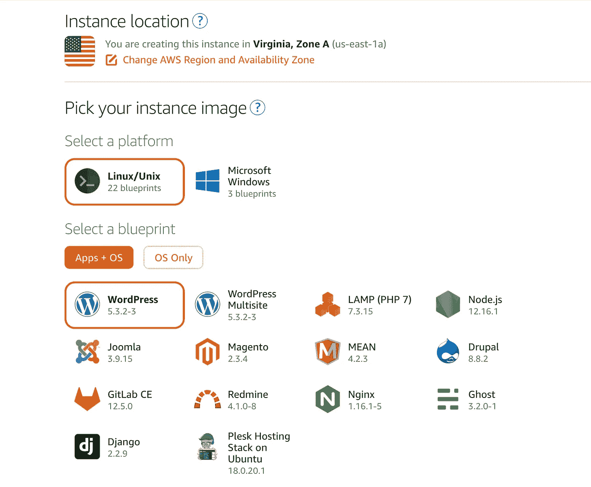
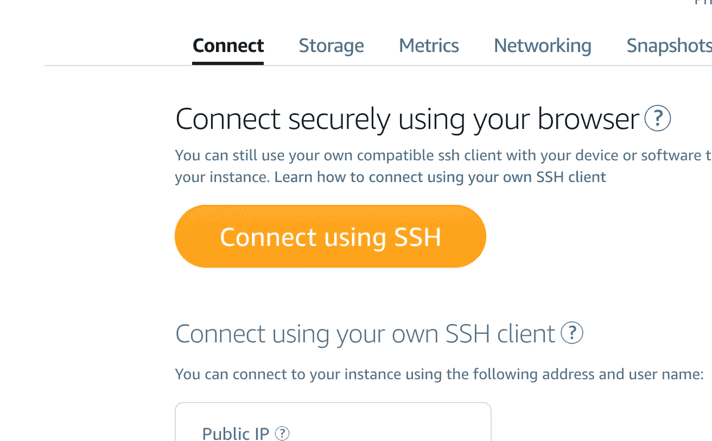
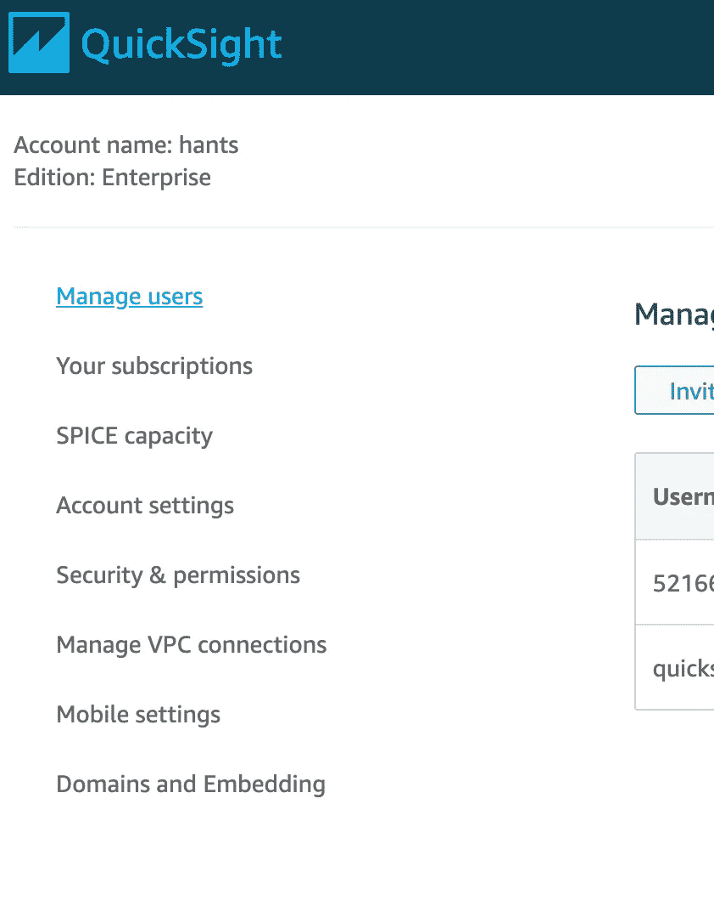
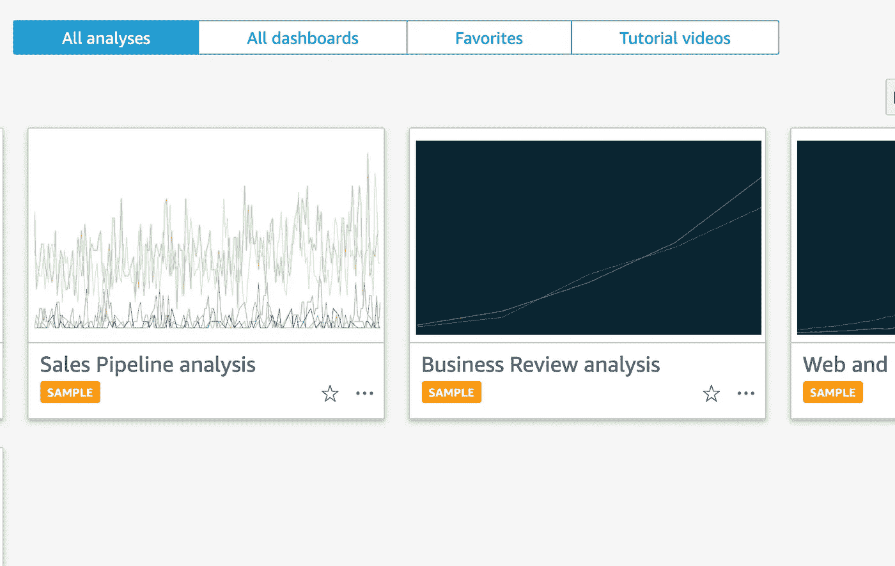
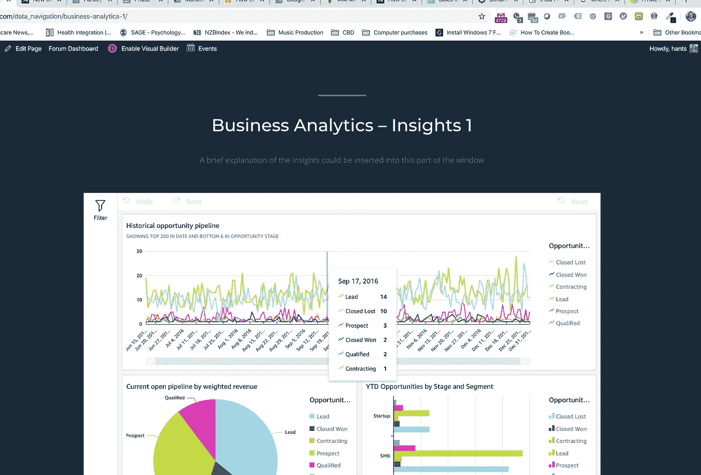

# 共享数据信息学:AWS Quicksight with Wordpress

> 原文：<https://towardsdatascience.com/sharable-data-informatics-aws-quicksight-with-wordpress-4f5793469123?source=collection_archive---------24----------------------->

## 了解如何在 Wordpress 中使用 AWS Quicksight

# 为什么要使用带有 AWS Quicksight 的 Wordpress？

Wordpress 可以说是最简单、下载量最大的内容管理平台(CMS ),任何人都可以在几分钟内快速建立网站并展示内容。

那么亚马逊网络服务 [(AWS) Quicksight](https://aws.amazon.com/quicksight/) 呢？简而言之，Quicksight 是一个完全托管的数据可视化解决方案。其竞争对手有 Tableau、Looker、Domo、qLik、SiSense、微软 Power BI 等等。您只需编写很少的代码，主要使用拖放式 GUI，并且不需要管理任何服务器、安全、备份等。

它提供了一个简单的用户仪表板，让您能够创建各种不同的可视化，**动态编辑数据**，从各种不同的来源(mySQL、postgres、csv/xls/)引入数据。json、presto、spark 等……)此外，您可以使用**预建的第三方连接器** (Salesforce、github、Twitter、吉拉、雪花等)，具有开箱即用的兼容性( [**HIPAA 和 HITRUST**](https://aws.amazon.com/compliance/services-in-scope/) )，并且可以轻松(？？？)嵌入在其他应用程序中。

> 因为我在医疗保健行业工作，所以 AWS quicksight 是一个很容易尝试的工具，因为它符合 HIPAA & HITECH，并且具有很高的可扩展性。

# 你今天要学什么？

在接下来的文章中，我将详细介绍如何将 AWS Quicksight 仪表板连接到 Wordpress 实例中。

这会给你留下一个坚实的 MVP。您应该对 Wordpress (PHP、HTML)、AWS (IAM 策略)、SSH(终端导航)有所了解，才能按照步骤进行操作。

*   第 1 部分:让服务器启动并运行
*   第 2 部分:获取 AWS **Quicksight** 设置和**发布带有虚拟数据的仪表板**
*   第 3 部分:在 AWS 中配置 IAM 凭证,这样我们就可以通过 Wordpress 服务器以编程方式访问 AWS Quicksight
*   第 4 部分:和**创建一些定制的 PHP** 来检索动态生成的带有安全密钥的 URL，以便仪表板在 Wordpress 中显示

您将使用的工具包括

```
**## Tools/Themes Utilized for This MVP** - INSTALLED on the Wordpress Server:  
  - AWS CLI 2.0
  - JQ 
  - Wordpress **theme**: Divi (but you can choose whatever) 
  - Wordpress **host**: AWS lightsail + AWS Route 53 
  - Wordpress **plugins**:
    - ZYZ PhP Code 
- SERVERLESS AWS tools: 
  - AWS IAM  
  - AWS Quicksight
```

**重要提示**:要完全完成本教程，您需要启用企业版 Quicksight。 *AWS 只允许在企业版中嵌入仪表盘*。企业与*一个创造者的成本将是每月 18.00 元*美元。所以，如果你能在这个教程上挥霍一点，那就去做吧…否则我建议你还是跟着做，因为我希望 AWS Quicksight 会尽快发布这个功能到他们的标准计划中。

现在让我们开始吧！

# 第 1 部分:获取 Word Press 设置

为了让一个 Wordpress 实例快速运行起来没有太多麻烦，我推荐 AWS [Lightsail](https://lightsail.aws.amazon.com/ls/webapp/home/instances) (如果你已经在使用其他 AWS 服务的话)。这是非常简单的设置。例如，使用 Lightsail，您不需要像配置 EC2 实例那样配置端口(如:80 或 443 ),这样站点就可以被互联网上的外部查看者查看，并且它简化了域名管理和 VPCs/其他网络需求的流程。

出于我们的目的，带有 Wordpress 5 . 3 . 2–3 蓝图的 linux 平台将满足我们的需求。参考消息 AWS 提供的 Wordpress 风格是一个[位图图像](https://docs.bitnami.com/aws/apps/wordpress/)。

如果你在这一步遇到困难，请点击此处观看视频说明



创建完映像后，您将希望通过 SSH 进入平台来安装一些工具。AWS 让这变得非常简单，只需点击“使用 SSH 连接”的大按钮



这将在您的 web 浏览器中打开一个终端，我们将使用它来安装一些程序:

**工具 1: AWS CLI 2.0** :这是 AWS 提供给我们的命令行工具，我们可以通过终端使用它们的服务。您应该能够用两个命令来安装它:

```
curl "https://awscli.amazonaws.com/awscli-exe-linux-x86_64.zip" -o "awscliv2.zip"unzip awscliv2.zip && sudo ./aws/install
```

您现在应该已经安装了 AWS CLI。您可以通过执行以下命令来确认它已成功安装

```
aws --version
```

工具 2:https://stedolan.github.io/jq/的 JQ 是一个命令行工具，它将帮助我们在终端中解析来自 AWS CLI 的 JSON 响应。相当酷！该程序的安装非常简单，只需执行:

```
sudo apt-get install jq
```

为了让这个练习更加真实，我建议你将一个域映射到你的新 Wordpress 实例。因此，你和潜在用户可以不去 37.125.157.64，而是去像*ilikedatastuff.com、*这样人类可读的地方，或者为你已经拥有的域名创建一个新的子域(*wordpress.ilikedatastuff.com*)。

此外，还要启用 SSL。如果你对 AWS Lightsail 上的 Bitnami Wordpress 站点的免费 SSL 感兴趣，请跟随这篇教程。

最后，你可能已经注意到在网站的右下角有一个烦人的`Powered by Bitnami`横幅。要将横幅 SSH 移回到运行 Wordpress 的服务器中，请执行以下命令:

```
sudo /opt/bitnami/apps/wordpress/bnconfig --disable_banner 1 sudo /opt/bitnami/ctlscript.sh restart apache
```

**工具 3:插入 PHP 代码片段**

现在，我们需要在 Wordpress 服务器上安装的最后一个工具在前端。用凭证登录你的 Wordpress 站点的管理门户(www.domainname.com/**管理员**):

**用户名** : `user`

密码:`password`位于你的 Wordpress 服务器上一个名为`bitnami_credentials`的文件中。你可以通过 SSH 进入文件夹服务器，使用 nano 文本编辑工具做`nano bitnami_credential`来打开它。

如果您在这一步遇到困难，请在此处观看视频说明/

现在转到管理门户的插件部分，搜索*插入 PHP 代码片段*插件。通过安装这个插件，我们将能够编写一点点定制的 PHP 代码来自动查看 Wordpress 中的仪表板。


## 现在到 AWS Quicksight！

# 第 2 部分:获取 AWS Quicksight 设置

当你安装 AWS quicksight 时，你首先要做的是点击右上角的人物头像并导航到`Manage Quicksight`

## 步骤 1:管理 Quicksight

启用企业版后，您应该会看到如下所示的内容，版本为:Enterprise。



**如果您没有看到上面显示的所有选项，这很可能意味着您没有启用企业版的 quicksight，并且在启用之前无法执行仪表板嵌入。**

现在先导航到`Domains and Embedding`部分。

在这里，我们将把您的域名列入白名单，方法是输入您选择的带有*www.DOMAINNAME.com*和*DOMAINNAME.com*但不带 www 的域名。


这将确保一旦我们将仪表板嵌入到我们的站点中，它们将有适当的安全权限来显示。如果我们不将域名放在这里，我们将会收到与不正确的查看权限相关的错误消息。如果您使用的是子域，请确保通过`Include Sub-domains?`问题点击/启用复选标记框。

## 步骤 2:发布虚拟数据

幸运的是，Quicksight 已经提供了一些虚拟数据。

当您在主屏幕上的 *All Analyses* 下时，您将看到四组虚拟数据(仪表板),其中包含各种不同的图表。



挑一个你想要的。为了发布，一旦您选择了仪表板(您想要使用的示例数据),请转到右上角，那里有一个标记为`Share`的按钮


为仪表板命名。在`Advanced publish option`下，您可以选择想要启用的选项。我选择了它们来全面测试所有功能。

接下来，您可以选择深入了解谁有权访问这组特定的数据。因为这是一个演示环境，并且很可能您没有任何其他用户——您可以保持选中`Share with all users in this account`。然后单击共享。


呜哇！一大步完成了。现在，在你浏览器的顶部有你的地址栏，现在我们需要复制部分的网址。例如，我的链接如下所示(为了安全起见，我稍微修改了数字):

```
https://us-east-1.quicksight.aws.amazon.com/sn/dashboards/69301f52-e492-44fd-69cf-dfd79e622dc6
```

与我们相关的部分是跟在**…/sn/dashboards/{重要数字集}** 后面的 URL 代码

对我来说，应该是:`**92301f69-e492-44fd-69cf-dfd79e6ffdc6**`这部分 URL 是**静态的**，将被 Wordpress 服务器上的 AWS CLI 工具使用。

现在，当一个外部应用程序(node.js、python、php)试图使用这个嵌入的 URL 时，它还需要将一个额外的安全密钥附加到这个静态 URL。这个安全密钥是通过对 AWS 的 API 请求生成的，大约每 10 分钟过期一次(？)来维护安全。我为什么要提这个？

> 因为拥有这个 URL 还不足以让仪表板嵌入工作。你不能只是将这个 URL 嵌入到 iFrame 中，然后期望它能工作——它不会工作，因为它缺少安全密钥。

因此，要做到这一点，我们必须创建几行自定义 PHP 代码，允许我们的 Wordpress 站点调用 AWS Quicksigh API，并向它提供一些用户详细信息，然后接收包含我们的安全密钥的响应，以显示 Quicksight 仪表板。如果这还没有意义，那也没关系。有一些关于 AWS 的[文档详细介绍了这一点。](https://docs.aws.amazon.com/quicksight/latest/user/embedded-dashboards-with-iam-setup-step-3.html)

# 第 3 部分:IAM 凭证

登录 AWS 管理控制台，导航到 IAM，然后导航到策略。


我们希望创建一个新策略，并将其附加到我们现有的帐户(或另一个帐户)中，以授予 1)获取注册 Quicksight 用户和 2)嵌入仪表板 URL 的权限。对于那些跟随的人，这在 AWS 文档的[第 2 部分中有描述。](https://docs.aws.amazon.com/quicksight/latest/user/embedded-dashboards-with-iam-setup-step-2.html)

当您阅读他们的文档时，您会看到类似这样的内容:

```
{
    "Version": "2012-10-17",
    "Statement": [
        {
            "Action": "quicksight:RegisterUser",
            "Resource": "*",
            "Effect": "Allow"
        },
        {
            "Action": "quicksight:GetDashboardEmbedUrl",
            "Resource": "arn:aws:quicksight:us-west-2:11112222333:dashboard/22a7dcbd-7890-6956-9f87-ffd9876ab432",
            "Effect": "Allow"
        }
    ]
}
```

在很大程度上，我们可以将所有这些内容复制并粘贴到我们的新策略中，但有以下例外。我们想要更改的部分在下面以粗体显示:

```
{
    "Version": "2012-10-17",
    "Statement": [
        {
            "Action": "quicksight:RegisterUser",
            "Resource": "*",
            "Effect": "Allow"
        },
        {
            "Action": "quicksight:GetDashboardEmbedUrl",
            "Resource": "arn:aws:quicksight:**us-west-2:11112222333**:dashboard/**22a7dcbd-7890-6956-9f87-ggd9876ab432**",
            "Effect": "Allow"
        }
    ]
}
```

第一部分是位置和帐户标识(**us-west-2:1111222333)**，第二部分是我们想要共享的仪表板的静态 URL(**69 a7 dcbd-7890–6956–9 f87-ffd 9876 ab 469)**。

例如，我的仪表板位于 us-east-1，我的帐号位于 AWS quicksight 的用户下。静态 URL 应该替换为您之前保存的自己的 URL。

一旦您修改了策略，请保存它。然后，您应该将此策略分配给已经创建的用户帐户，或者创建一个新用户，然后将此策略分配给他们。确保您拥有用户访问密钥 ID(一个类似于 AKIZX…leug1 的 20 个字符的密钥)以及一个类似于 XLUz…reqjnlag 3 fy…的 40 个字符的密钥。NdDsHF)。

## 现在到了最后一步！

# 第 4 部分:用 Quicksight 连接 Wordpress

以管理员身份登录你的 Wordpress 站点，并导航到我们在第 1 部分中安装的 PHP 插件。

您应该会看到类似如下的菜单:


正如你所看到的，我已经创建了 2 个包含一些 PHP 的短代码，分别命名为 *dashboard1* 和 *dashboard2* 。

点击按钮`Add New PHP Code Snippet`并插入以下代码块。我用粗体显示了您将在自己的数据中插入的部分:

```
<?php
$region='**YOUR REGION**';
$key='**YOUR KEY ID**';
$secret= '**YOUR SECRET**';
putenv('AWS_DEFAULT_REGION=' . $region);
putenv('AWS_ACCESS_KEY_ID=' . $key);
putenv('AWS_SECRET_ACCESS_KEY=' . $secret);
$cmd2 = "aws quicksight get-dashboard-embed-url --aws-account-id **YOURACCOUNTID** --dashboard-id **YOURDASHBOARDURL** --identity-type IAM | jq -r '.EmbedUrl'";
$exec2 = shell_exec($cmd2);
settype($exec2, "string");
$regions= '"'.$exec2 .'"';
$regions = preg_replace('/\s+/', '', $regions);
echo $regions;
?>
```

# 上面这个东西是做什么的？

首先，它为我们的 AWS 帐户创建了三个变量，分别包含 region、key 和 secret(第 2–4 行)。然后，它利用`putenv`将这些存储为环境变量(第 5–7 行)。接下来，我们创建一个名为`cmd2`的变量，它将存储一个终端命令，该命令利用我们的`AWS CLI`工具请求生成一个新的安全密钥以及我们的嵌入式 url(第 8-10 行)，并解析用`jq`返回的 JSON 响应，以提取我们的新嵌入式 URL 和安全密钥。然后，它使用`*shell_exec*` 运行终端命令，并将输出保存在一个名为 exec2 的变量中(第 11 行)，使该变量成为一个字符串(第 12 行)，向它添加双引号(第 13 行)，最后删除任何空格(第 14 行)*。*最后一行`echo $regions`打印出我们最终的、干净的 URL，带有现在可以被 iFrame 接收的安全代码。

现在来看粗体部分。让我们填入这些变量。*下面是一些* ***假数据*** *的例子，包含* ***右结构和字符数* :**

```
**YOUR REGION**: us-east-1
**YOUR KEY ID**: AKIAKF9MOV69S9LEVQG9
**YOUR SECRET**: EHavae9Lf4VNSA1I696w+EInQpAvQr2U5bTf5+Ju
**YOURACCOUNTID:** 351333326999 **YOURDASHBOARDURL**: 69401f25-e469-4a7f-92gm-dfd69e611dc6
```

所以最终版本应该是这样的:

```
<?php
$region='us-east-1';
$key='AKIAKF9MOV69S9LEVQG9';
$secret= 'EHavae9Lf4VNSA1I696w+EInQpAvQr2U5bTf5+Ju';
putenv('AWS_DEFAULT_REGION=' . $region);
putenv('AWS_ACCESS_KEY_ID=' . $key);
putenv('AWS_SECRET_ACCESS_KEY=' . $secret);
$cmd2 = "aws quicksight get-dashboard-embed-url --aws-account-id 351333326999 --dashboard-id 69401f25-e469-4a7f-92gm-dfd69e611dc6 --identity-type IAM | jq -r '.EmbedUrl'";
$exec2 = shell_exec($cmd2);
settype($exec2, "string");
$regions= '"'.$exec2 .'"';
$regions = preg_replace('/\s+/', '', $regions);
echo $regions;
?>
```

点击保存，给它起一个好记的名字，比如`dashboard1`。这将为您提供一个短代码，该代码可以插入到一个网页中，该网页为您提供带有安全代码的新嵌入 URL。

我的短码是`[xyz-ips snippet="dashboard1']`

# **最后一步:**

现在是时候创建一个新的空白 Wordpress 页面了，我们将插入 HTML 代码和新的 PHP 短代码(输出新的嵌入式 URL +安全代码链接)以显示 iFrame。

**第一步:新建一个空白页:**


第二步:创建一个新的文本框。以 HTML 模式查看并插入以下代码，用您自己的 PHP 代码片段名替换粗体部分:

```
<!DOCTYPE html>
<html>
<head>
    <title>Basic Embed</title>
    <script type="text/javascript" src="[https://unpkg.com/amazon-quicksight-embedding-sdk@1.0.2/dist/quicksight-embedding-js-sdk.min.js](https://unpkg.com/amazon-quicksight-embedding-sdk@1.0.2/dist/quicksight-embedding-js-sdk.min.js)"></script>
    <script type="text/javascript">
        function embedDashboard() {
            var containerDiv = document.getElementById("dashboardContainer");
            var params = {
                url: [xyz-ips snippet="**dashboard1**"],
                container: containerDiv,
                height: "1100px",
                width: "1200px"
            };
            var dashboard = QuickSightEmbedding.embedDashboard(params);
            dashboard.on('error', function() {});
            dashboard.on('load', function() {});
            dashboard.setParameters({country: 'Canada'});
        }
    </script>
</head>
<body data-rsssl=1 data-rsssl=1 data-rsssl=1 data-rsssl=1 data-rsssl=1 onload="embedDashboard()">
    <div id="dashboardContainer"></div>
</body>
</html>
```

这里发生了什么事？我们利用了由官方 AWS 文档提供给我们的一些代码来通过 HTML 嵌入。你可以看到它调用了一个由 AWS 为 Quicksight 创建的 javascript helper 包([https://UNP kg . com/Amazon-quick sight-embedding-SDK @ 1 . 0 . 2/dist/quick sight-embedding-js-SDK . min . js](https://unpkg.com/amazon-quicksight-embedding-sdk@1.0.2/dist/quicksight-embedding-js-sdk.min.js))，然后中途摄取了一个由我们的 PHP 插件小部件提供的变量 URL。

**第三步:点击保存，退出预览模式。发布页面。**



我在我的例子中使用了 DIVI Wordpress 主题来做一些样式设计，所以它看起来可能和你的不同。但是你现在应该看到的是嵌入在你自己的 Wordpress 页面上的 AWS quicksight 仪表盘。

# 感谢阅读！

如果你有问题，给我发消息，在 Linkedin 上关注我:[https://www.linkedin.com/in/hantswilliams/](https://www.linkedin.com/in/hantswilliams/)