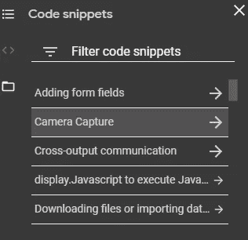

# 可共享的 Jupyter 笔记本！

> 原文：<https://towardsdatascience.com/sharable-jupyter-notebooks-bf3ec9c2e0be?source=collection_archive---------46----------------------->

## 最后，团队可以快速、轻松地共享和测试代码

好的，它叫做**，可以在 Google Drive 中找到。**

## **什么牛逼？**

*   **团队和协作者可共享的笔记本。**
*   **体面的规格**
*   **免费 GPU 访问**
*   **预装的机器学习库，如 NumPy 或 Tensorflow**
*   **导入现有笔记本**

**这是谷歌的描述:**

# **装置**

**在你的 google drive 上，只需右击文件夹中的任意位置。**

**进入'**更多** ' > ' **连接更多 app****

****

**在 G Suite Marketplace 中，您可以搜索“ **Colaboratory** ”并安装它。**

****

****搞定**！**

# **使用合作实验室**

**打开它，你会看到一个和 Jupyter 笔记本非常相似的界面。**

****

**我不会进入编码部分，因为我假设你们都熟悉 Jupyter 笔记本，但让我们看看一些功能。**

## **变暗模式**

**转到界面左上角的设置(齿轮图标)。在“网站”标签下的“主题”选择黑暗。**

****

**唷！现在我们可以开始了。**

## **目录**

**在右侧，我们可以看到 3 个选项卡。**

****

**第一个让我们看到**目录**。在我正在玩的笔记本上，你可以看到我创建了一个名为' **PDF 和 CDF** 的部分和一个名为'**卷积**的部分。**

****

**分区是整理笔记本的好方法。**

**在 Colaboratory 中，可以通过以下方式创建它们:
—单击**目录**选项卡
中的“**+部分**”按钮，或者只需添加文本并**将其格式化为标题**(例如:' # Title1 ')。**

## **代码片段**

**下一个选项卡是代码片段。合作实验室为你提供了一些非常有用的默认代码片段。有些很酷，比如相机抓拍。**

****

**您可以添加自己的代码片段。但据我所知，这有点复杂。我是这样做的。**

1.  **创建一个新笔记本，随你怎么命名。我把我的笔记本叫做**片段**。**
2.  **为每个片段创建一个标题，并添加您的片段。例如，这里我有两个带有一些随机代码的片段。**

****

**3.然后只需复制你的片段笔记本的网址，打开**设置**(左上角的齿轮图标)。
在“**站点**选项卡>下的“**自定义片段笔记本网址**”>**粘贴您的片段网址**并点击“**保存”**。**

**4.搞定了。现在，您的代码片段可以根据其标题名称在代码片段部分进行搜索。例如，如果我在我的新笔记本中搜索 **Imports** ，**

****

**我可以访问我创建的代码片段！当代码不断被重用时，这是一个非常有用的特性。**

## **文件管理器**

**这很好，因为它给你一个简单的方法来查看你所有的文件。我的原始笔记本似乎带有一些样本数据，我觉得很奇怪，但感谢谷歌。**

****

**如果你注意到皮卡丘的图像，我可以在网上抓拍一张照片，然后很容易地保存到我的文件管理器中(通过**)！wget** )。酷的是，我们可以点击这些文件，并从**合作实验室**查看它们。**

****

**您可以看到 CSV 文件和图像都是受支持和可查看的。这对于能够快速浏览文件而不必去我的本地文件目录或 GDrive 是很棒的。**

## **共享**

**如果你曾经使用过谷歌文档，你可能已经知道如何分享文档。只需点击**分享图标**，将联系人添加到您的笔记本或发送链接给他们。**

****

**您还可以通过将鼠标悬停在某个单元格上并选择共享图标来链接到特定的单元格(当您的笔记本变得疯狂时)。**

****

## **GPU 访问**

**最好的功能之一是提供的 GPU 访问。在工具栏上选择'**运行时'** > ' **更改运行时类型'**，您可以在 **GPU** 或 **TPU** 之间进行选择。**

****

**这使得一些复杂的过程明显更快。Head [这里](https://research.google.com/colaboratory/faq.html#gpu-availability)查看更多关于谷歌提供的规格的信息，因为它可能会随着时间的推移而改变。目前，你可以在启用 GPU 的情况下运行一台笔记本电脑**12 个小时，**考虑到其*，这已经相当不错了。如果你想超越这一点，他们确实提供了付费层的选择。***

***合作实验室实际上是一个很老的东西，我只是不知道。我认为它是在 2017 年发布的，但我直到最近才听说它。但是不得不说功能超级酷，非常有用。有很多很棒的功能我没有介绍，所以如果我错过了什么很棒的功能，请在评论区随意评论，我相信它会帮助每个人，感谢阅读！***

***如果你喜欢这个故事，看看我的其他作品，***

*** [## 数据可视化:动画条形图！

### Excel 和 After Effects 中的数据可视化和动画

towardsdatascience.com](/data-visualization-animate-bar-graphs-df9ca03a09f2)  [## 机器学习——处理缺失数据

### 开始使用数据前如何清理数据的指南。

towardsdatascience.com](/machine-learning-handling-missing-data-27b09ab146ba)***