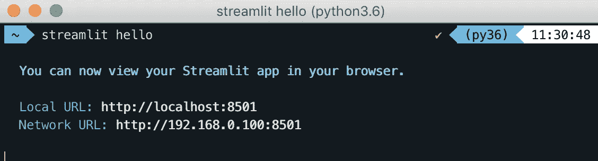
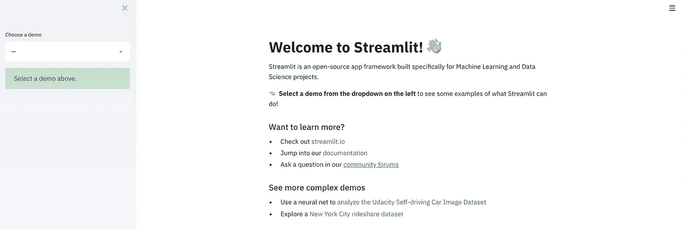
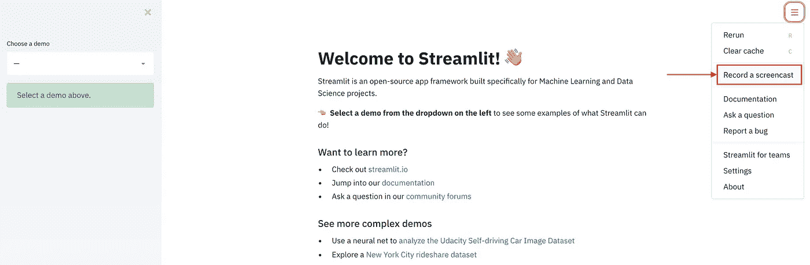
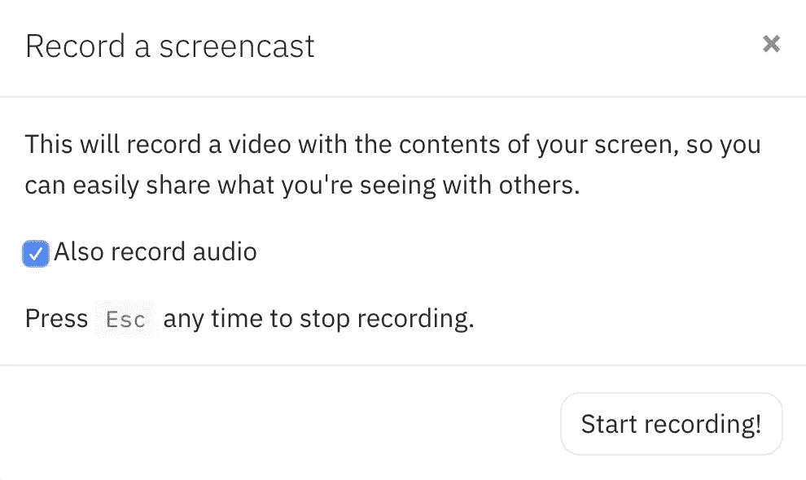
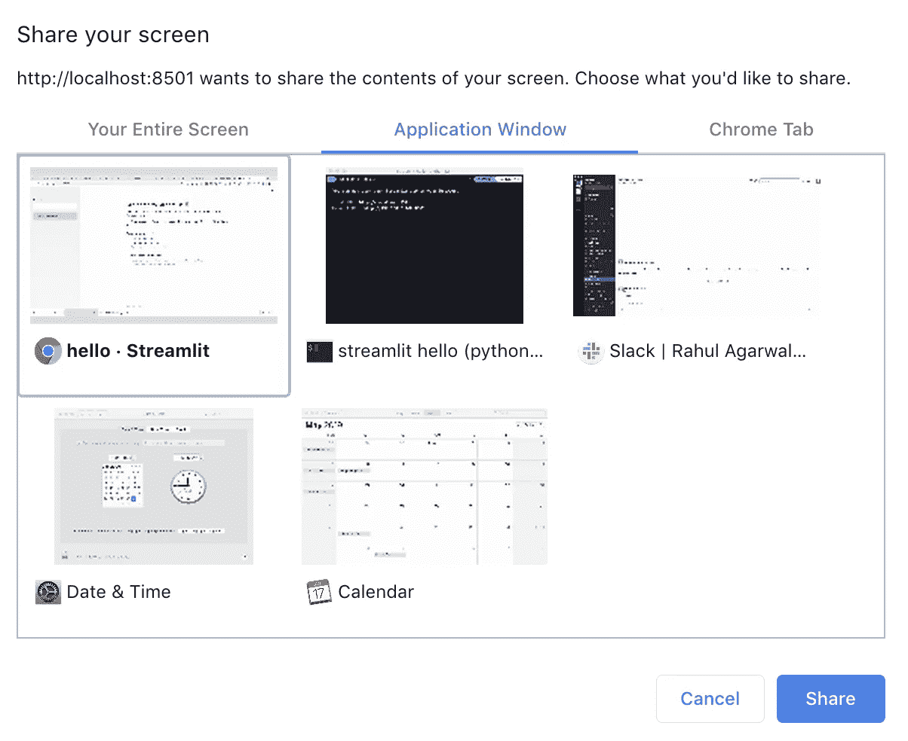
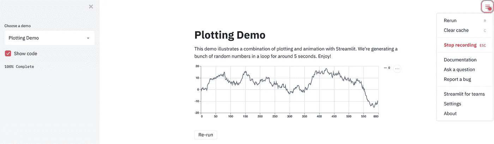
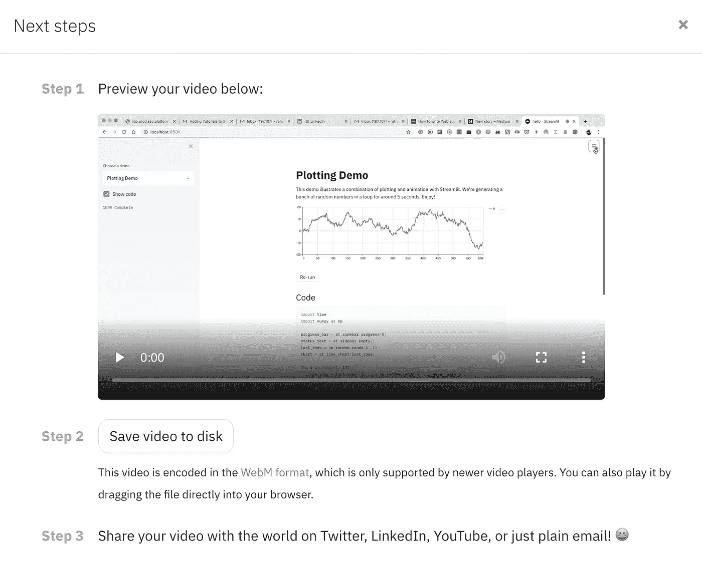

# 借助这一新的 Streamlit 功能，您可以更轻松地共享您的项目

> 原文：<https://towardsdatascience.com/share-your-projects-even-more-easily-with-this-new-streamlit-feature-a9be81a4ecfd?source=collection_archive---------24----------------------->


为数据科学家记录和分享:图片来自 [Pixabay](https://pixabay.com/?utm_source=link-attribution&utm_medium=referral&utm_campaign=image&utm_content=1927265)

## 为数据科学家记录和分享

如果我们没有一个好的方式来展示它，机器学习项目就永远不会真正完成。

在过去，一个制作精良的可视化工具或一个小 PPT 足以展示一个数据科学项目，随着 RShiny 和 Dash 等仪表板工具的出现，一名优秀的数据科学家需要具备相当多的 web 框架知识。

正如斯登冲锋枪·苏特拉在他的讽刺作品[中所说，我非常喜欢:](/how-to-fake-being-a-good-programmer-cbef2c39764c)

> 秘诀:重要的不是你知道什么，而是你表现出什么。

这就是 StreamLit 的用武之地，它提供了一种只使用 Python 创建 web 应用程序的方法。在过去的几个月里，我一直在密切关注这个优秀的产品。在我的前几篇帖子中，我谈到了[使用 Streamlit](/how-to-write-web-apps-using-simple-python-for-data-scientists-a227a1a01582) 以及如何[使用 ec2](/how-to-deploy-a-streamlit-app-using-an-amazon-free-ec2-instance-416a41f69dc3) 部署 Streamlit 应用。我也一直与 Streamlit 团队保持联系，他们一直致力于通过发布更多功能来改善用户体验。

***那么，在向利益相关者/业务合作伙伴解释应用程序的工作方式时，您是否遇到过问题？不得不与不同国家的不同利益相关方进行多次通话，并一遍又一遍地解释整个过程？***

***或者你做过一个项目，想在社交媒体上分享？LinkedIn，Youtube 之类的？***

在他们的新版本中，Streamlit 发布了一个名为“ ***录制一个截屏视频*** ”的新功能，将为您解决这个问题。

怎么会？请继续阅读。

# 安装

因此，为了检验这个新特性，它是 streamlit 版本`0.55.0`的一部分，我们需要首先安装或升级 Streamlit。使用以下命令完成此操作:

```
pip install --upgrade streamlit
```

我们还需要运行 Streamlit。这里我将使用演示应用程序。你也可以使用任何你自己的应用程序。

```
streamlit hello
```

您应该会看到类似下面的内容:



在你的浏览器中还会打开一个标签，你可以在那里尝试他们的演示。如果没有在浏览器中打开，您也可以手动转到本地 URL `[http://localhost:8501/](http://localhost:8501/)`。



# 录制截屏

现在是时候录制我们的视频与世界分享了。您可以使用 Streamlit 右上角的菜单找到录制截屏的选项。



一旦你点击它，你会得到录音的选项，你可以选择名副其实的“开始录音”按钮开始录音。



然后，您可以选择想要共享的内容，是您的 streamlit 应用程序还是您的整个桌面。 ***如果用户需要在不同的程序之间切换，例如 Excel 表格、powerpoints 和 streamlit 应用程序，他们可以选择共享整个桌面。*** 在这里，我选择只显示“Streamlit”应用程序，然后点击“分享”。



您的截屏现在已经开始，您现在可以为您的股东录制解释会议。完成录制后，您可以再次单击右上角的菜单并选择停止录制。或者方便地按 escape 来结束记录会话。



你将能够预览并**保存你录制为`.webm`文件的会议视频**，你可以将它发送给你的股东，甚至在 LinkedIn/twitter/youtube 上分享你的个人项目。



仅此而已。这个过程非常简单，不需要我们安装任何额外的软件。

# 尾注

Streamlit 使创建应用程序的整个过程民主化了。

老实说，我喜欢 Streamlit 开发产品的方式，牢记用户的所有痛点。通过这次迭代，他们解决了另一个痛点，即用户难以在社交媒体网站上以有意义的方式展示自己的工作，或者向股东多次解释应用程序的工作原理。

**最重要的是，Streamlit 是一款免费的开源软件，而不是开箱即用的专有网络应用。我不能推荐它。**

***此外，如果您想在评论区*** 请求 Streamlit 中的任何附加功能，请务必通知我。我会确保将其传达给 Streamlit 团队。

如果你想了解更多关于使用 Streamlit 创建和部署应用程序的信息，可以看看我的其他帖子:

[](/how-to-write-web-apps-using-simple-python-for-data-scientists-a227a1a01582) [## 如何为数据科学家使用简单的 Python 编写 Web 应用？

### 无需了解任何 web 框架，即可轻松将您的数据科学项目转换为酷炫的应用程序

towardsdatascience.com](/how-to-write-web-apps-using-simple-python-for-data-scientists-a227a1a01582) [](/how-to-deploy-a-streamlit-app-using-an-amazon-free-ec2-instance-416a41f69dc3) [## 如何使用 Amazon Free ec2 实例部署 Streamlit 应用程序？

### 10 分钟内将数据应用程序上传到网上

towardsdatascience.com](/how-to-deploy-a-streamlit-app-using-an-amazon-free-ec2-instance-416a41f69dc3) 

如果你想了解创建可视化的最佳策略，我想从密歇根大学调用一门关于 [**数据可视化和应用绘图**](https://www.coursera.org/specializations/data-science-python?ranMID=40328&ranEAID=lVarvwc5BD0&ranSiteID=lVarvwc5BD0-SAQTYQNKSERwaOgd07RrHg&siteID=lVarvwc5BD0-SAQTYQNKSERwaOgd07RrHg&utm_content=3&utm_medium=partners&utm_source=linkshare&utm_campaign=lVarvwc5BD0) 的优秀课程，它是一个非常好的 [**数据科学专业的一部分，本身带有 Python**](https://www.coursera.org/specializations/data-science-python?ranMID=40328&ranEAID=lVarvwc5BD0&ranSiteID=lVarvwc5BD0-SAQTYQNKSERwaOgd07RrHg&siteID=lVarvwc5BD0-SAQTYQNKSERwaOgd07RrHg&utm_content=3&utm_medium=partners&utm_source=linkshare&utm_campaign=lVarvwc5BD0) 。一定要去看看。

谢谢你的阅读。将来我也会写更多初学者友好的帖子。在 [**媒体**](https://medium.com/@rahul_agarwal) 关注我，或者订阅我的 [**博客**](http://eepurl.com/dbQnuX) 了解他们。一如既往，我欢迎反馈和建设性的批评，可以通过 Twitter [@mlwhiz](https://twitter.com/MLWhiz) 联系。

此外，一个小小的免责声明——这篇文章中可能会有一些相关资源的附属链接，因为分享知识从来都不是一个坏主意。