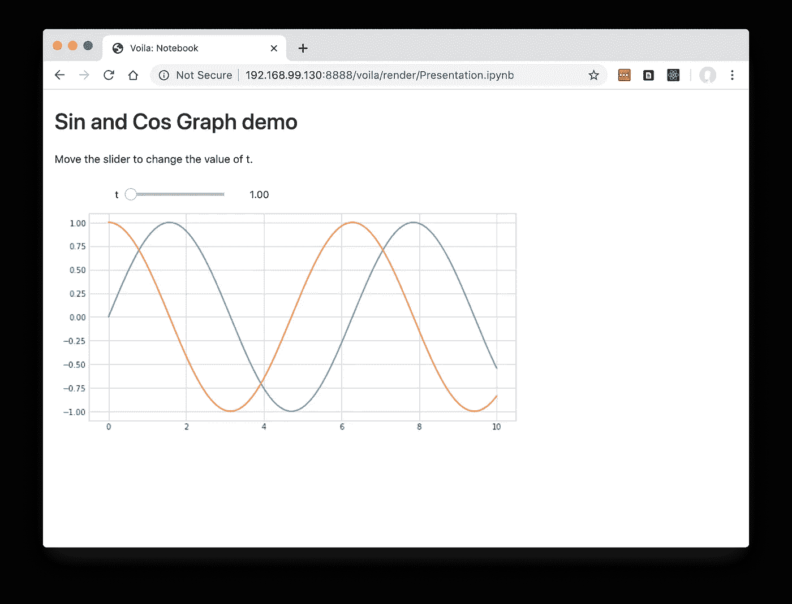
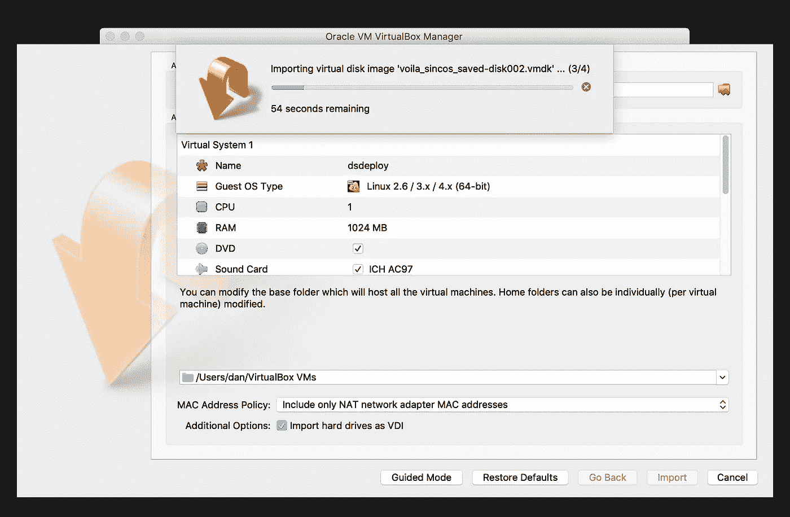
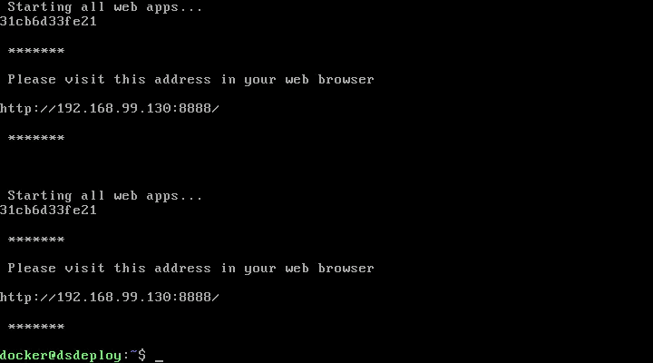

# 在 VirtualBox 中共享数据可视化，让 IT 部门满意

> 原文：<https://towardsdatascience.com/sharing-data-visualisations-in-virtualbox-to-keep-it-departments-happy-f978854ea44d?source=collection_archive---------45----------------------->

## 当您的客户端无法使用容器或云时，如何将 Jupyter 演示作为独立的 VirtualBox 映像共享

在 Jupyter 或类似的原型环境中从事概念验证模型或演示的数据科学家需要找到一种方法，以便在项目完成时与客户分享。在他们的机器上复制成功运行它的环境并不容易。

[Docker](https://www.docker.com/) 提供了再现性的解决方案——环境和工作空间文件可以打包成一个图像。

然而，确保它能够在企业环境中轻松部署到客户端并不总是那么简单。他们的 IT 部门可能没有资源在云或内部服务器上临时托管应用程序；可能不允许在用户自己的计算机上安装 Docker Desktop。


一个路障，就像你的 IT 部门……(由[杰米街](https://unsplash.com/@jamie452?utm_source=medium&utm_medium=referral)在 [Unsplash](https://unsplash.com?utm_source=medium&utm_medium=referral) 上拍摄)

[VirtualBox](https://www.virtualbox.org/) 是一个历史悠久的软件组件，被 IT 部门普遍接受，在大多数企业中只需很少的繁文缛节就可以安装。

本文描述了打包 Jupyter 笔记本环境的步骤，最初是作为 Docker 映像，但最终会作为独立文件发送给客户，可以直接导入到他们机器上的 VirtualBox 中。

这是一个我们可以在 [ContainDS](https://containds.com/) 为企业客户自动化的过程，但是下面描述的手动步骤将提供最重要的方面。



我们的 Jupyter Voila 演示样本

## 保存您的 Jupyter 体验

你的项目最重要的部分当然是首先构建可视化。我不会教你如何做到这一点…但就本文的目的而言，我们将假设它在一个本地 web 应用程序中，如 Jupyter notebook，或者如果你希望它对客户端更友好，Jupyter Voila 演示。

在这种情况下，有大量的[指南](/docker-without-the-hassle-b98447caedd8)来与 Docker 一起工作，以建立您的项目的图像，您可以与他人分享，或者如果您想完全不必了解 Docker，那么我们的桌面应用程序 [ContainDS](https://containds.com/download/) 将为您完成这一切，包括将您的基于 Jupyter 的环境转换为 Voila 演示。

对于这篇文章，我们将只使用一个简单的例子 Voila 演示，我已经将它打包成一个图像，并[上传到 Docker Hub](https://hub.docker.com/r/danlester/voila-sincos) 。

我在 Mac 上运行这些步骤，但 Windows 非常相似。

# 使用 VirtualBox

我们有机会首先在自己的计算机上设置我们的 VirtualBox 虚拟机(VM ),加载 Docker 映像并设置一些其他配置。然后，我们将其导出为单个“OVA”文件，发送给客户端。

## 创建 VirtualBox 计算机的副本

我们将从 Docker 提供的 VirtualBox 映像开始，以便在 VM 中运行 Docker。这实际上是在 Docker Desktop 没有在 Mac 或 Windows 上本地运行的时候，但它在这里很有用。

从技术上讲，在这个虚拟机中直接与 Docker 交互是可能的——不需要在我们的计算机上本地安装任何 Docker 产品——但这需要更多的工作。有一个叫做 [docker-machine](https://docs.docker.com/v17.09/machine/overview/) 的产品，我们可以用它来初始化 VirtualBox 虚拟机，使其包含 docker 守护程序，并使我们能够从主机访问其 Docker 守护程序。如果我们的机器上有 docker 命令行工具，事情也会变得更简单。

因此，你应该安装 [Docker 工具箱](https://docs.docker.com/toolbox/overview/)。安装程序包含 VirtualBox 以及 docker-machine 和 docker 命令。你可以从 [GitHub 发布页面](https://github.com/docker/toolbox/releases)下载最新的 pkg 安装程序(Mac 版)或 exe(Windows 版)。

## 创建 VirtualBox 虚拟机

使用 docker-machine 在 VirtualBox 上创建一个包含 Docker [boot2docker 映像](https://github.com/boot2docker/boot2docker)的新虚拟机。我们将该虚拟机称为“dsdeploy”。在终端窗口中运行:

```
docker-machine create --driver virtualbox dsdeploy
```

然后配置我们的终端在 VM 中访问 Docker，而不是期望与在主机上本地运行的 Docker 守护进程一起工作。

```
docker-machine env dsdeploy
```

这将显示需要在计算机上设置的环境变量的详细信息。一旦设置好了(设置这些的命令应该通过你刚才运行的‘env’命令出现在你的屏幕上)，`docker`命令现在将与 VM 中的 Docker 对话。

运行以下命令来获取我们项目的样本 Voila 演示 Docker 映像，并将其设置为作为新容器运行，所有这些都在我们的新 VM 中:

```
docker pull danlester/voila-sincos:de3b79a7docker run -p 8888:8888 danlester/voila-sincos:de3b79a7
```

这将从 Docker Hub 获取图像，然后启动一个新的容器，在端口 8888 上显示 Jupyter/Voila 服务器。

## 自动启动容器

我们可以现在就导出虚拟机，并与客户端共享。然而，我们忽略了一些能让我们的接收者更容易接受的东西。

当冷导入到他们自己的 VirtualBox 时，Docker 容器将仍然存在，但不会运行。他们必须获得一个进入虚拟机的终端，并让它再次运行。也很难知道他们在网络浏览器中访问 Voila 服务器需要什么 URL，所以我们会想办法通知他们。

在您的主机上创建一个名为`docker_start_webapps`的文本文件，包含以下内容:

```
echo -e "\n\n Starting all web apps..."docker start $(docker ps -a -q)echo -e "\n ******* \n\n Please visit this address in your web browser\n"ifconfig -a eth1 | grep 'inet addr' | awk -F '[: ]+' -v OFS='' '{print "http://",$4,":8888/"}'echo -e "\n ******* \n"
```

这个脚本将启动所有停止的容器，并输出访问 Voila 演示所需的 URL。它非常适合作为我们虚拟机引导过程结束时的启动脚本。

使用以下命令将文件复制到虚拟机:

```
docker-machine scp docker_start_webapps dsdeploy:/var/lib/boot2docker/docker_start_webapps
```

接下来，我们需要 ssh 到 VM 来完成引导过程，并确保我们的新脚本在启动时被调用。在您的终端上运行以下命令:

```
docker-machine ssh dsdeploy -t
```

现在，在虚拟机中新创建的 ssh 会话内运行以下命令:

```
sudo chmod a+x /var/lib/boot2docker/docker_start_webappssudo chmod o+w /var/lib/boot2docker/profilesudo ln -s /var/lib/boot2docker/docker_start_webapps /etc/profile.d/docker_start_webapps.shsudo chmod o-w /var/lib/boot2docker/profile
```

这里的要点是将我们的新启动脚本链接到/etc/profile.d 文件夹中，这样它将在启动时自动运行。

键入`exit`退出 ssh 会话。

每次重启时，虚拟机的很大一部分都会被擦除和重新初始化，因此我们需要一些变通方法来确保我们的启动脚本是永久的。

## 导出 VirtualBox 虚拟机

我们终于准备好将虚拟机导出为文件，与我们的客户端共享。

运行以下命令暂停虚拟机:

```
docker-machine stop dsdeploy
```

然后使用 VirtualBox 的 VBoxManage 命令将虚拟机导出为自包含文件:

```
VBoxManage export dsdeploy --iso -o voila_sincos_saved.ova
```

如果由于某种原因无法运行 VBoxManage 命令，可以使用 VirtualBox GUI 应用程序完成上述操作。(导出为 OCI 容器，确保包含 ISO 映像。)

# 与客户分享

OVA 文件 voila_sincos_saved.ova 可以使用大型安全文件的常用通道发送到您的客户端。请注意，它将超过 1 GB，所以电子邮件将不足够！

在他们的计算机上，他们应该像往常一样运行友好的 VirtualBox GUI 应用程序。在“文件”菜单中选择“导入设备…”



将 OVA 文件导入 VirtualBox

找到 OVA 文件，并使用默认设置导入它。

当虚拟机启动时，将会有一个有限的屏幕显示，但应该足以看到我们提供的最终说明:“请在您的网络浏览器中访问此地址”以及 Voila 演示文稿的 URL。



当我们的接收者导入时，虚拟机的基本显示

如果他们访问这个 URL，他们应该能够与我们的演示交互，就像我们创建它一样！

# 结论

找到一种在云中托管这个 Voila 应用程序的方法肯定会更好。但有时这是不可能的，例如，如果你没有权限在云中托管所有相关数据，或者如果你不能指望在预定观看演示的位置可靠地访问互联网。

另一种“更纯粹”的方法是以 Docker 图片的形式直接分享演示文稿。我们的[包含桌面软件](https://containds.com/download/)很容易实现这一点，正如最近的另一个教程中的[所描述的，但是这依赖于 Docker 可以安装在源机器和目的机器上。](/cut-out-the-cloud-share-interactive-jupyter-dashboards-on-a-usb-stick-c196d01df3e4)

我希望这篇文章可以帮助你，如果你有这个非常具体的需要，以确保客户可以通过 VirtualBox 访问你的作品。

在您的本地机器上使用数据科学环境是我们 ContainDS 每天都在考虑的事情，我将[非常高兴听到](https://containds.com/support/)您如何应对这些挑战，或者您是否需要任何帮助。