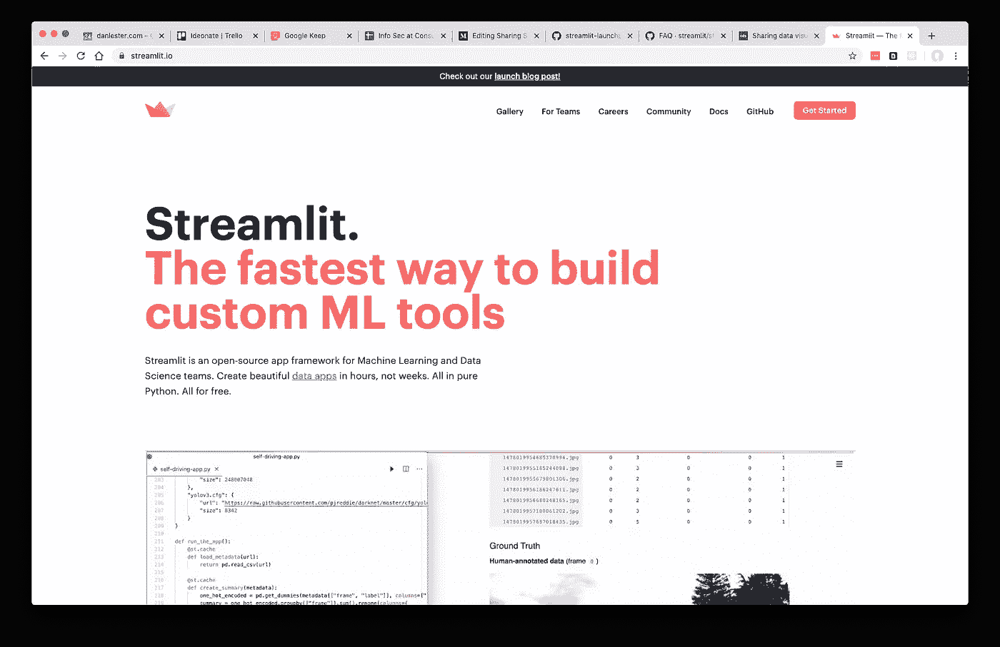
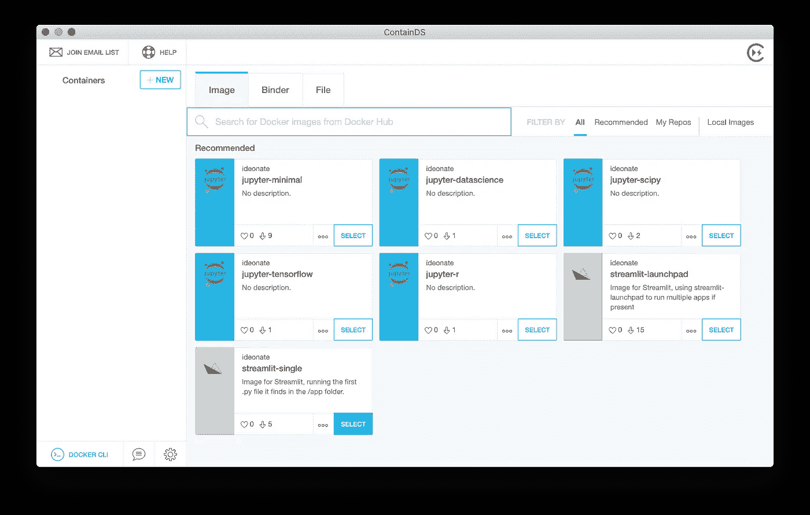
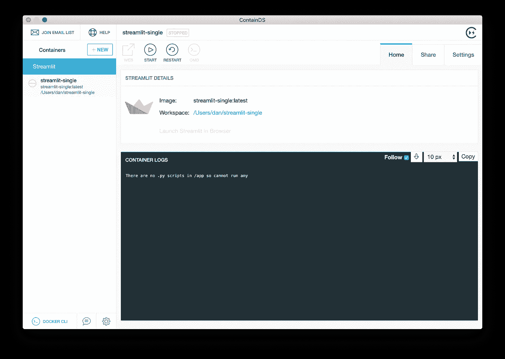
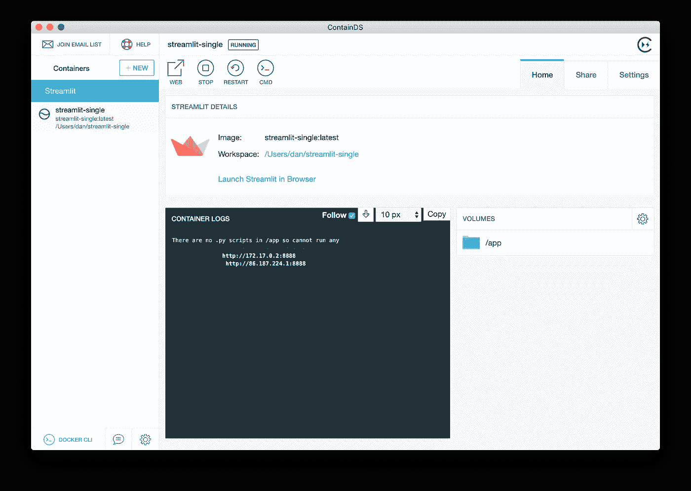
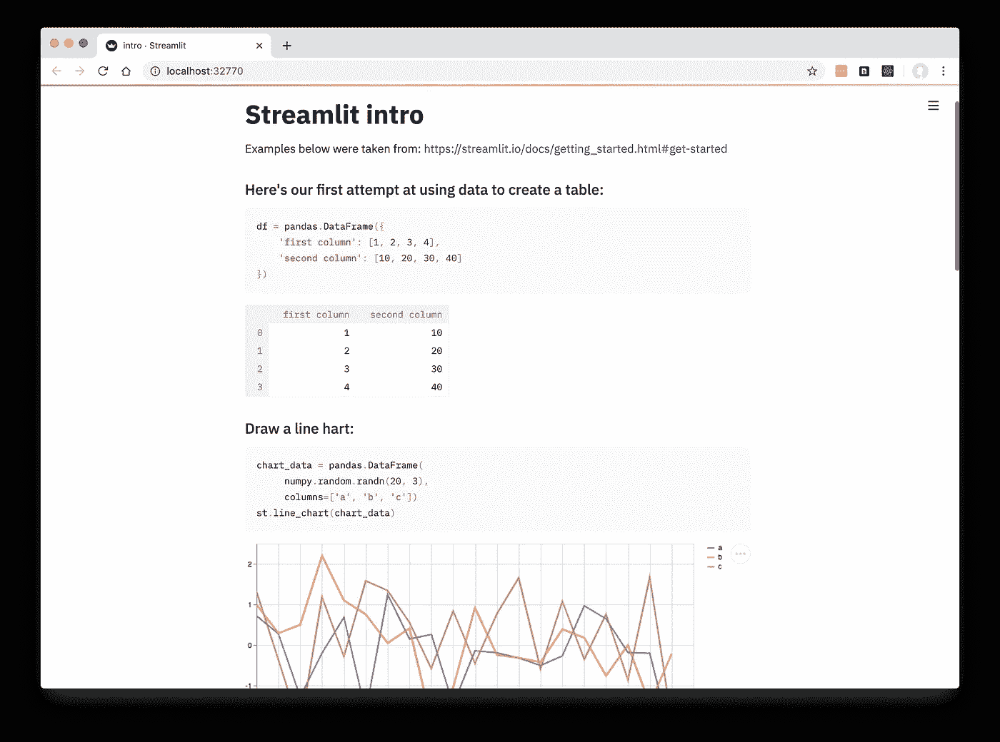
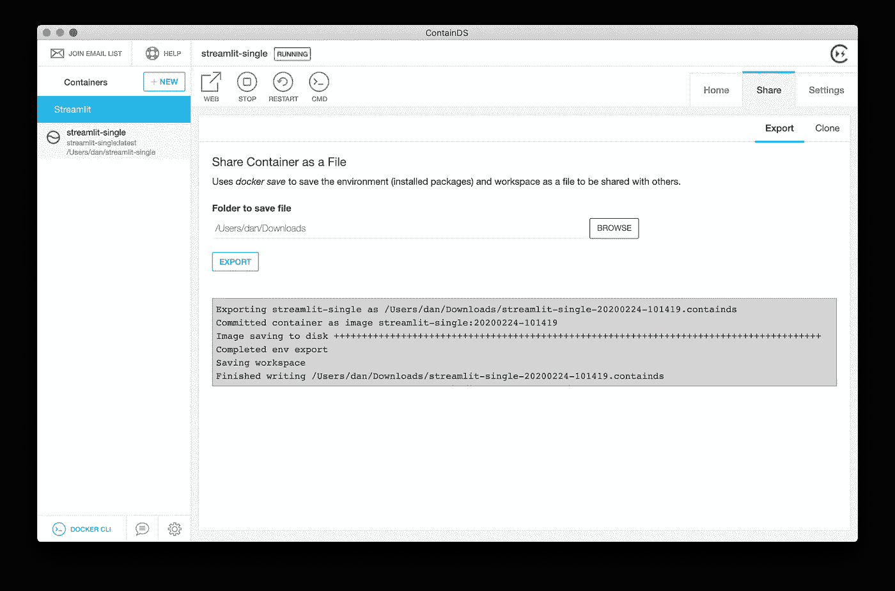
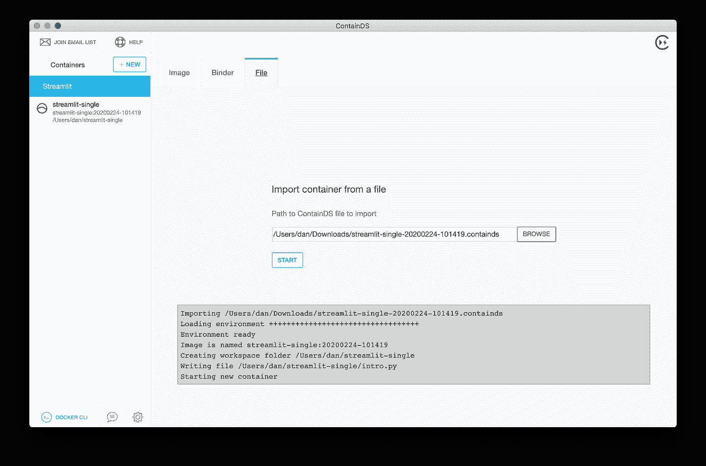

# 如何与客户安全共享 Streamlit 应用

> 原文：<https://towardsdatascience.com/sharing-streamlit-apps-securely-with-your-clients-a34bf0f9e00c?source=collection_archive---------13----------------------->

## Streamlit 的框架允许轻松开发数据科学仪表板。以下是与他人共享您完成的应用程序的一些选项。

数据科学界已经热切地接受了 [Streamlit](https://streamlit.io/) 作为一个常见问题的解决方案。您可能在 Jupyter 笔记本或 Python 脚本中构建了您的模型，并向自己演示了当您更改一些输入时它是如何运行的。也许你可以把这个展示给一位数据科学同事，他正从你的肩膀上看着你的笔记本电脑。但是，对于不愿意阅读您的代码并通过笔记本进行 shift-enter 操作的客户或同事来说，您将如何让他们相信这一切呢？

Streamlit 使用纯 Python 脚本和自己的简单 API 来推断一个现代化的交互式 UI。你可以[在他们的网站](https://streamlit.io/)上找到更多信息，如果你还没有的话！

Streamlit.io 项目网站

# 托管选项

一旦你设计了你的样本应用程序，有几种在线托管的可能性。Streamlit 开发人员有一个测试版产品 Streamlit for Teams，它允许您“毫不费力地部署、管理和协作应用程序”。

论坛和常见问题也详细说明了如何在 [Heroku、Azure 和 AWS](https://github.com/streamlit/streamlit/wiki/FAQ) 上进行托管。如果你经常使用这些云提供商，这是有用的，但没有自动认证层:除非你乐意向所有人开放应用程序，否则你需要更努力地考虑这个问题。

当然，所有的托管解决方案都可能有相关的成本，并且您的 IT 部门或信息官可能会限制在那里存储客户数据。

丹尼尔·帕斯科在 [Unsplash](https://unsplash.com?utm_source=medium&utm_medium=referral) 上的照片

# 本地复制

对于一个一次性的应用程序来说，为你的客户找到一种在他们自己的机器上运行脚本的方法是最有意义的。在企业环境中，期望您的客户端安装诸如 Python、conda 或 pip 之类的命令行工具通常是不合适的；即使你走这条路，平台和安装之间的细微差别也意味着你不能保证他们会看到和你一样的结果！

集装箱化是解决再现性问题的一个很好的方法。同样，您不希望留给您的客户端一个命令行指令列表。ContainDS 是一款用户友好的软件，通过图形用户界面运行可复制的环境。它可以主要在幕后使用 Docker 或 VirtualBox，但您和您的客户都不需要担心命令行细节。

本文的其余部分将带您完成与能够在自己的机器上安装 ContainDS 的客户端共享 Streamlit 示例应用程序所需的步骤。

# ContainDS 桌面入门

首先，[在你的 Mac 或 Windows 电脑上安装 ContainDS Desktop 及其底层需求](https://containds.com/desktop/installation-and-setup/) (Docker Desktop)。

一旦运行，ContainDS Desktop 将为您提供一系列推荐的起始“图像”,您可以在这些图像上构建您的应用程序。这个起点只是一个 Streamlit 环境(其中已经安装了 Streamlit ),我们还可以在其中安装我们可能需要的任何 pip/conda 包，并额外提供组成我们应用程序本身的 Python 脚本。

包含新容器屏幕

单击 streamlit-single 框旁边的“选择”(如果您想展示多个应用程序，请选择 streamlit-launchpad)。

一旦下载了底层 Docker 映像，ContainDS Desktop 会询问您最终的设置选项。这些只是一个容器名(您不需要更改它)，以及硬盘上新的或现有工作区文件夹的路径。默认提供的应该是一个尚未创建的空文件夹，您将在其中放置 Python 文件和任何数据文件。如果您事先在硬盘上有这些文件，您可以选择一个已经存在的工作区位置。

对于本例，只需点击“创建”。

ContainDS Desktop 将创建新的容器——这是一个虚拟环境，运行一个独立的 Linux 系统，准备好托管您需要的包。在 ContainDS Desktop 中，该容器与工作区文件夹相结合，使您的完整应用程序能够运行。

由于我们还没有准备好 Python 脚本，新容器将运行，但会立即停止，并显示消息“没有。“py 脚本”。

创建 Python 文件之前的容器详细信息屏幕

将 Streamlit 的[示例 intro.py](https://github.com/ideonate/streamlit-launchpad/blob/master/examples/intro.py) 的内容复制到工作区文件夹中名为 intro.py 的文件中。您可以通过查看 ContainDS Desktop 中的“Streamlit Details”部分来提醒自己新工作区的完整路径。

一旦 intro.py 存在，返回到 ContainDS 桌面并点击顶部的大“开始”按钮。现在，日志部分应该会显示更多的进度，容器应该会保持运行状态(左侧列出容器的绿色图标):

显示应用程序的容器详细信息屏幕

单击“WEB”按钮或“在浏览器中启动 Streamlit”。这将在您的默认网络浏览器中启动应用程序。

运行 Streamlit 应用程序

## 与客户分享

您可以将此应用程序(容器本身加上工作区文件)作为一个单独的应用程序导出。包含直接与客户端共享的文件。

在 ContainDS 桌面中，单击共享选项卡。在导出子选项卡中，您的下载文件夹应被指定为保存该文件的默认位置。点击“导出”。

容器共享/导出屏幕

创建导出文件时，将显示一些进度信息。完成后，将显示输出文件名。

你可以分享一下。通过您常用的安全渠道(SharePoint、Dropbox 等)与您的客户端保存文件。它对于电子邮件来说太大了…

## 由您的客户端导入

一旦你的客户收到，假设他们已经安装了 ContainDS Desktop，他们可以启动 ContainDS Desktop (Docker 必须运行，除非你打算使用 VirtualBox)。在新建容器屏幕上，单击文件选项卡。

找到。包含您与他们共享的文件，然后单击“开始”。文件将被导入:

新容器屏幕的文件导入选项卡

一旦准备就绪，容器将完全像为您准备的那样运行:

运行容器详细信息屏幕

正如您所做的那样，单击“在浏览器中启动 Streamlit ”,他们将看到应用程序在他们的 web 浏览器中运行。因为 Docker 总是模拟底层的 Linux 系统，所以一切都保证完全按照预期运行！

# 结论

虽然有相当简单的解决方案来长期云托管完善的 web 应用程序，但 ContainDS Desktop 提供了一种非常简单的方式来共享您的工作，以便在本地运行，这对于“一次性”原型仪表板尤其有用，在这种情况下，在互联网上托管应用程序和数据可能不值得花费时间投资，至少要以合规的方式适当保护数据。