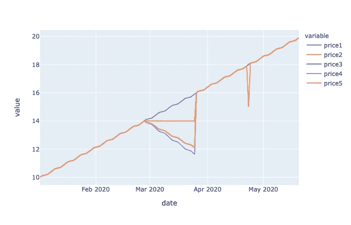
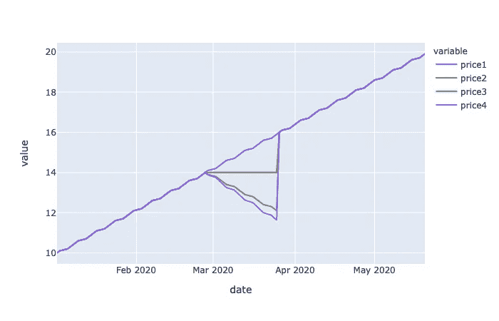
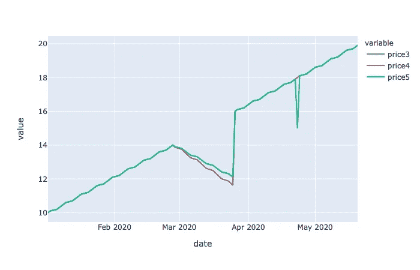

# 夏普比率、索提诺比率和卡尔马尔比率

> 原文：<https://towardsdatascience.com/sharpe-ratio-sorino-ratio-and-calmar-ratio-252b0cddc328?source=collection_archive---------29----------------------->

## 在这篇短篇小说中，我们将探讨夏普比率的不足之处，以及我们如何用索蒂诺比率和卡尔马尔比率对其进行补充，以更清楚地了解投资组合的表现。



在投资组合业绩分析中，夏普比率通常是人们首先关注的数字。然而，它并没有告诉我们整个故事(没有什么能告诉我们……)。因此，让我们花些时间来看看更多一些有时非常有用的指标。

## 夏普比率再探

夏普比率是平均回报率除以年回报率的标准差的比率。我们在之前的[故事](https://medium.com/the-innovation/portfolio-analysis-basics-volatility-sharpe-ratio-d7521d79ba0)中有过介绍。

让我们用一个测试价格时间序列再来看一下。

```
import pandas as pd
import numpy as np

from pandas.tseries.offsets import BDay

def daily_returns(prices):

    res = (prices/prices.shift(1) - 1.0)[1:]
    res.columns = ['return']

    return res

def sharpe(returns, risk_free=0):
    adj_returns = returns - risk_free
    return (np.nanmean(adj_returns) * np.sqrt(252)) \
        / np.nanstd(adj_returns, ddof=1)

def test_price1():

    start_date = pd.Timestamp(2020, 1, 1) + BDay()

    len = 100

    bdates = [start_date + BDay(i) for i in range(len)]
    price = [10.0 + i/10.0 for i in range(len)]

    return pd.DataFrame(data={'date': bdates,
                              'price1': price}).set_index('date')

def test_price2():

    start_date = pd.Timestamp(2020, 1, 1) + BDay()

    len = 100

    bdates = [start_date + BDay(i) for i in range(len)]
    price = [10.0 + i/10.0 for i in range(len)]

    price[40:60] = [price[40] for i in range(20)]

    return pd.DataFrame(data={'date': bdates,
                              'price2': price}).set_index('date')

def test_price3():

    start_date = pd.Timestamp(2020, 1, 1) + BDay()

    len = 100

    bdates = [start_date + BDay(i) for i in range(len)]
    price = [10.0 + i/10.0 for i in range(len)]

    price[40:60] = [price[40] - i/10.0 for i in range(20)]

    return pd.DataFrame(data={'date': bdates,
                              'price3': price}).set_index('date')

def test_price4():

    start_date = pd.Timestamp(2020, 1, 1) + BDay()

    len = 100

    bdates = [start_date + BDay(i) for i in range(len)]
    price = [10.0 + i/10.0 for i in range(len)]

    price[40:60] = [price[40] - i/8.0 for i in range(20)]

    return pd.DataFrame(data={'date': bdates,
                              'price4': price}).set_index('date')

price1 = test_price1()
return1 = daily_returns(price1)

price2 = test_price2()
return2 = daily_returns(price2)

price3 = test_price3()
return3 = daily_returns(price3)

price4 = test_price4()
return4 = daily_returns(price4)

print('price1')
print(f'sharpe: {sharpe(return1)}')

print('price2')
print(f'sharpe: {sharpe(return2)}')

print('price3')
print(f'sharpe: {sharpe(return3)}')

print('price4')
print(f'sharpe: {sharpe(return4)}')
```



正如你在这个例子中看到的，我有 4 个测试价格时间序列。第一个，price1，是一条简单的直线(不要介意曲线，这是由于周末被遗漏了)。第二个价格时间序列 price2 有一个平坦区域。第三个价格时间序列 price3 有一个向下倾斜的区域。最后一个时间序列 price4 的下降幅度稍大。

每种价格的夏普比率计算如下:

```
'''
price1
sharpe: 78.59900981328562
price2
sharpe: 7.9354707022912825
price3
sharpe: 3.61693599695678
price4
sharpe: 3.151996500460301'''
```

如你所见，由于几乎不存在波动性，price1 具有非常高的夏普比率。由于平坦区域的存在，Price2 的夏普比率几乎低 10 倍。由于向下倾斜，价格 3 和价格 4 比价格 2 低大约两倍，价格 4 的夏普比率略低于价格 3 的夏普比率。

看着这些数字，有一件事可能看起来有点奇怪，那就是夏普比率仅仅因为平坦区域的存在而降低了多少。毕竟总回报没变，根本不存在降额。对于投资者来说，价格 1 和价格 2 没有太大区别。

另一方面，价格 3 和价格 4 有相当大的下降，然而夏普比率下降了大约一半，而价格 1 和价格 2 之间下降了 10 倍。**这似乎是夏普比率在告诉我们价格时间序列有多可取的能力上的一个缺陷。**

# **排序比**

为了解决夏普比率不能线性反映时间序列下行的问题，Sortino 比率有时是一个很好的指标。

排序比率=平均收益/下跌风险

其中下跌风险是时间序列内的平均负收益。

```
def downside_risk(returns, risk_free=0):
    adj_returns = returns - risk_free
    sqr_downside = np.square(np.clip(adj_returns, np.NINF, 0))
    return np.sqrt(np.nanmean(sqr_downside) * 252)

def sortino(returns, risk_free=0):
    adj_returns = returns - risk_free
    drisk = downside_risk(adj_returns)

    if drisk == 0:
        return np.nan

    return (np.nanmean(adj_returns) * np.sqrt(252)) \
        / drisk
```

将 sortino 比率应用于我们的测试价格:

```
'''
price1
sortino: nan
price2
sortino: nan
price3
sortino: 2.210224924119601
price4
sortino: 1.7688718895750382
'''
```

价格 price1 和 price2 根本没有负收益，所以对它们来说不存在排序比。对于价格 3，排序比是 2.2，而对于价格 4，排序比是 1.8，这是因为根据需要，向下的斜率更大。

让我们再看一个例子:

```
def test_price5():

    start_date = pd.Timestamp(2020, 1, 1) + BDay()

    len = 100

    bdates = [start_date + BDay(i) for i in range(len)]
    price = [10.0 + i/10.0 for i in range(len)]

    price[40:60] = [price[40] - i/10.1 for i in range(20)]

    price[80] = 15

    return pd.DataFrame(data={'date': bdates,
                              'price5': price}).set_index('date')
```



在这个新的价格时间序列 price5 中，我们在 price3 的基础上增加了一个下降，你会认为这个下降会降低 sortino 比率，对吗？让我们来看看:

```
'''
price3
sharpe: 3.61693599695678
sortino: 2.210224924119601
price4
sharpe: 3.151996500460301
sortino: 1.7688718895750382
price5
sharpe: 2.945329220777157
sortino: 0.4660330265232954
'''
```

是啊！Sortino 比率确实反映了下降。但是你不觉得变化有点太大了吗？由于价格下跌，索蒂诺比从 1.8 下降到 0.5，降幅超过 3 倍。

# 卡尔马尔比率

在努力控制异常值引起的失真时，就像我们之前展示的那样，另一个比率有助于检测它们。这是卡尔马尔比率。

卡尔马尔比率=回报的几何平均值/最大下降

我们已经在之前的[故事](https://medium.com/the-innovation/portfolio-analysis-basics-returns-and-drawdowns-70c5f7a0eb3d)中解释了最大压降。

回报的几何平均值是按时间周期长度缩放的累积回报。

```
def annual_returns(returns):

    num_years = len(returns) / 252

    cum_ret_final = (returns + 1).prod().squeeze()

    return cum_ret_final ** (1 / num_years) - 1

def calmar(returns):

    max_dd = max_drawdown(cumulative_returns(returns))
    if max_dd < 0:
        return annual_returns(returns) / abs(max_dd)

    return np.nan'''
price1
sharpe: 78.59900981328562
sortino: nan
calmar: nan
price2
sharpe: 7.9354707022912825
sortino: nan
calmar: nan
price3
sharpe: 3.61693599695678
sortino: 2.210224924119601
calmar: 35.10246841328119
price4
sharpe: 3.151996500460301
sortino: 1.7688718895750382
calmar: 28.081974730625276
price5
sharpe: 2.945329220777157
sortino: 0.4660330265232954
calmar: 29.404801742258666'''
```

正如您在结果中看到的，对于 price4 和 price5，calmar 比率分别为 28 和 29。它没有受到异常值的过多影响，还因为 price5 的向下斜率实际上比 price4 小一点点(注意 price5 定义中的 10.1！)，它的 calmar 比居然增加了一点！

***来自《走向数据科学》编辑的提示:*** *虽然我们允许独立作者根据我们的* [*规则和指导方针*](/questions-96667b06af5) *发表文章，但我们不认可每个作者的贡献。你不应该在没有寻求专业建议的情况下依赖一个作者的作品。详见我们的* [*读者术语*](/readers-terms-b5d780a700a4) *。*