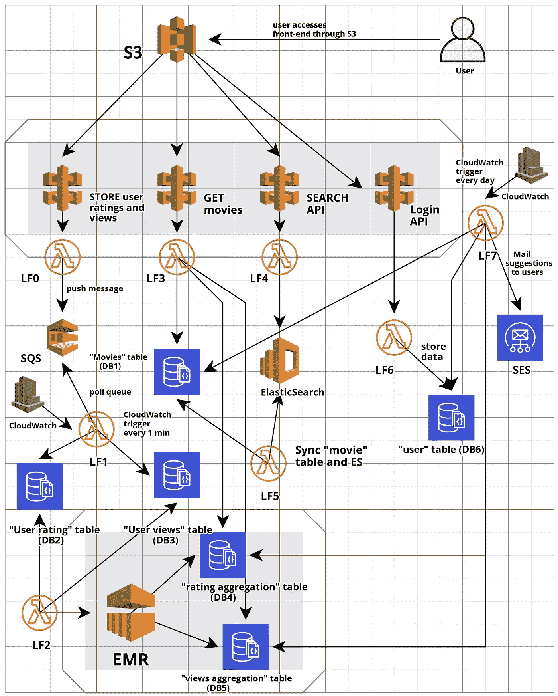
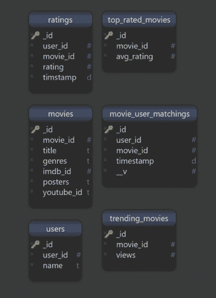

# 沙扎姆

> 原文：<https://towardsdatascience.com/shazam-699a95d640f9?source=collection_archive---------20----------------------->

## 一个 web 应用程序，使用户能够在一个地方浏览顶级电影和热门电影的预告片

据估计，目前大约有 50 万部电影。这是任何人一辈子都看不完的。而且，不是所有人都会喜欢每一部曾经拍过的电影。大多数时候，人们倾向于看一些特定类型的电影。因此，对于任何给定的用户，大多数电影变得无关紧要。

每隔一段时间，我们都试图寻找新的东西来观看。许多人向朋友、家人和同事征求建议，然后看一部电影。但这并不总是可行的。有时，我们只想查看特定类型的顶级电影或我们周围的热门电影。就在那时，我和我的朋友[尼克尔·纳尔](https://www.linkedin.com/in/nikhilnar)和[苏拉吉·盖克瓦德](https://www.linkedin.com/in/surajgaikwadg)想到开发“Shazam”并在 AWS 上托管它。

Shazam 让人们可以很容易地找到热门和顶级电影，以及它们的预告片。它还使用户能够对他们看过的电影之一进行评级，以帮助其他人做出决定。Shazam 是一个大规模分布式系统，提供热门电影和顶级电影，每天更新两次。这使得用户可以从世界各地获得最新最棒的电影预告片。

# 项目:

SS**hazam**字面上翻译过来就是——“用来介绍一个非凡的行为、故事或转变。不要把这个和 Shazam——音乐识别应用混淆了。 *Shazam* 是一款网络应用，用户可以在一个地方浏览顶级电影和热门电影的预告片。

当任何人想看电影而不知道看什么时，他们会想查看他们周围的一些热门电影的预告片或有史以来收视率最高的电影。Shazam 是一个类似于网飞的门户网站，用户可以在这里观看各种电影的预告片。用户还可以对 youtube 预告片进行评级。用户可以选择通过不同类型的过滤器观看热门视频和高收视率的电影。Shazam 部署在 AWS 上，包含各种技术，如 EC2、DynamoDB、ElasticSearch、Lambdas、SQS、Python、Node.js、PySpark。

# 实施:

这个想法是在 SQS 开发主题，用于存储各种用户对预告片的看法和对预告片的评级。每当用户观看预告片时，相应的条目被推入队列。类似地，当用户对预告片评级时，相应的条目被推入队列。轮询队列的消费者将在 mongoDB 中存储这些视图(lambda 函数)和评级。这些条目然后在 Apache Spark 中进一步聚合，并存储在 mongoDB 中。这些新条目将用于显示高收视率和热门电影预告片。一个 lambda 函数将在一天内连续运行多次，这将在 Apache Spark 中执行聚合脚本。此外，ElasticSearch 将用于索引电影预告片，并将用于网站上的搜索机制。该网站是在 Node.js 中开发的后端和 HTML，CSS 和 Javascript 的 UI。

# 技术堆栈:

服务请求的 web 服务器用 Node.js 编写，用户界面用 HTML、CSS 和 Javascript 开发。为了处理多个并发请求，SQS 被用作消息队列。MongoDB 用于电影、收视率、浏览量、用户资料的数据存储。Apache Spark 用于聚合用户视图和评级，以提供高评级和热门电影。Docker 用于运行 Shazam 的所有组件，如 SQS、MongoDB、Node.js、Apache Spark 和 AWS 无服务器应用程序。

# 工艺流程:

通过 Shazam，用户将能够观看电影预告片。用户还可以选择观看热门电影和高收视率电影的预告片。每当电影预告片发布时，数百万用户同时开始观看预告片。为了处理这百万个并发请求，Apache Kafka 被用作消息队列。在这个模型中，所有观看电影预告片的用户都将充当发布者。一个消费者组中有多个消费者订阅主题，主题进一步处理请求并将用户评级和用户视图存储在 MongoDB 中。由于电影的用户浏览量和相应评级的总数将非常巨大，在 MongoDB 上执行聚合将需要大量时间。为了解决这个问题，Apache Spark 被用来执行聚合。cron 作业用于运行 Spark 作业，该作业将从 MongoDB 获取数据，执行聚合并将聚合的数据存储回 MongoDB。然后，汇总的数据在 Shazam 上显示给用户，作为热门和高评级电影。

# AWS 服务:

*   地对空导弹
*   API 网关
*   λ函数
*   亚马逊 SQS
*   AWS EMR
*   AWS 弹性搜索
*   MongoDB
*   AWS 云观察
*   (美)工程科学学会(Society of Engineering Science)
*   S3

# 建筑:

Shazam 建筑

像阿帕奇 SQS，阿帕奇火花，弹性搜索等服务运行在引擎盖下。每当用户观看电影预告片时,( movie_id，user_id)的信息被发布到 movie_users_mapping 主题中。类似地，当用户对电影预告片进行评级时,( movie_id，user_id，rating)的信息被发布到 movie_ratings 主题中。一个消费者组中的多个消费者订阅两个主题，这两个主题获取存储在 SQS 中的信息，并将信息存储在 MongoDB 集合中。然后，Apache Spark 将聚合这些数据，并返回一个 JSON 数组，其中包含趋势主题的 schema (movie_id，views ),以及高评分电影的 schema(movie _ id，avg_rating)。这些数据存储在 MongoDB 的 trending_movies 和 top_rated_movies 集合中。Apache Sparks 使用 Mongo-Spark 连接器与 MongoDB 集成。Spark 中的数据聚合活动使用 CRON 作业在一天内执行两次。

# 数据存储模式:

MongoDB 模式

需要一个 NoSQL 数据库来方便获取和快速处理数据。Shazam 使用 MongoDB 作为 NoSQL 数据库来存储电影、用户评级、youtube 视频链接、电影海报和用户视图。图 2 显示了带有每个字段名的 MongoDB 的详细模式。从 Kafka 主题中读取数据的消费者会将用户视图存储在 movie_user_matchings 集合中，并将电影评级存储在 ratings 集合中。Apache Spark 然后将从 movie_user_matchings 集合中读取数据，以找到热门电影和评级集合，从而找到评级高的电影。

# API 设计:

1.  帖子/评级:存储用户给出的评级
2.  帖子/视图:存储用户的视图
3.  GET /movies:根据过滤器返回电影列表
4.  获取/搜索/电影:从
5.  获取/登录:获取登录令牌
6.  POST /register:注册用户

# 数据集:

对于电影和评级，我们使用的数据集来自 grouplens.org '电影镜头 20M '数据集。对于 youtube 预告片，我们将使用 grouplens.org movie lens 2000 万 Youtube 预告片数据集。我们将使用来自 Kaggle 的单独数据集来获取电影海报。

数据集的链接如下所示:

 [## MovieLens 20M 数据集

### 2000 万电影收视率。稳定的基准数据集。2000 万次评级和 465，000 个标签应用于…

grouplens.org](https://grouplens.org/datasets/movielens/20m)  [## 电影镜头 20M YouTube 预告片数据集

### GroupLens 感谢美国国家科学基金会在研究资助 IIS 05-34420 下的支持…

grouplens.org](https://grouplens.org/datasets/movielens/20m-youtube)  [## 从海报看电影类型

### 通过分析电影海报预测电影类型

www.kaggle.com](https://www.kaggle.com/neha1703/movie-genre-from-its-poster) 

# 部署说明:

## 打包和部署 SAM 模板的命令:

Sam package–template-file template . yml–S3-bucket shazam-Sam-templates–output-template-file output-template . yml Sam deploy–template-file output-template . yml–stack-name shazam–capabilities CAPABILITY _ IAM Sam delete-stack-stack-stack-name shazam

## 在 EMR 上运行 Spark 作业的命令:

spark-submit–master local[*]–conf " spark . MongoDB . input . uri = MongoDB+SRV://nikhil:nikhil @ shazamdb-ci1rz . MongoDB . net/"–conf " spark . MongoDB . output . uri = MongoDB+SRV://nikhil:nikhil @ shazamdb-ci1rz . MongoDB . net/"–packages org . MongoDB . spark:mongo-spark-connector _ 2.11:2 . 4 . 0 trending . py

# 应用:

Shazam 成功地提供了一个可扩展的、分布式的、自我更新的系统，为热门电影和顶级电影提供最新数据。在 SQS 的帮助下，用户积累的数据被存储到 mongoDB 上。然后，在运行 PySpark 和 SparkSQL 命令的 cronjob 的帮助下，每天聚合两次，并写回到 mongoDB 上。当用户刷新页面时，这提供了最新的趋势和最高评级的电影。

## 原型:

 [## shazam-v2

### 由视觉带给你

chinmay609410.invisionapp.com](https://chinmay609410.invisionapp.com/prototype/ck3uz6xaa004g6g01yvn0wr2h/play) 

## 应用演示:

## 代码:

整个应用程序的代码都保存在这个 github 存储库中:

 [## NikhilNar/Shazam

### 当任何人想看电影而不知道看什么时，他们会想看一些电影的预告片…

github.com](https://github.com/NikhilNar/Shazam) 

# 参考资料:

[1][https://grouplens.org/datasets/movielens/20m/](https://grouplens.org/datasets/movielens/20m/)

[2]https://grouplens.org/datasets/movielens/20m-youtube/

[3][https://www . ka ggle . com/neha 1703/movie-genre-from-its-poster/downloads/movie-genre-from-its-poster . zip/5](https://www.kaggle.com/neha1703/movie-genre-from-its-poster/downloads/movie-genre-from-its-poster.zip/5)

[https://nodejs.org/en/docs/](https://nodejs.org/en/docs/)

[https://docs.mongodb.com/](https://docs.mongodb.com/)

[https://spark.apache.org/docs/latest/](https://spark.apache.org/docs/latest/)

[https://docs.mongodb.com/spark-connector/master/python-api/](https://docs.mongodb.com/spark-connector/master/python-api/)