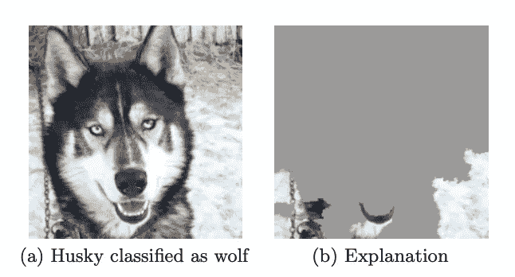
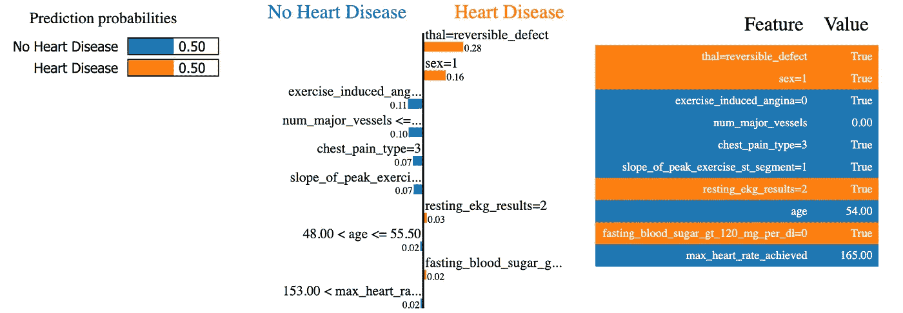
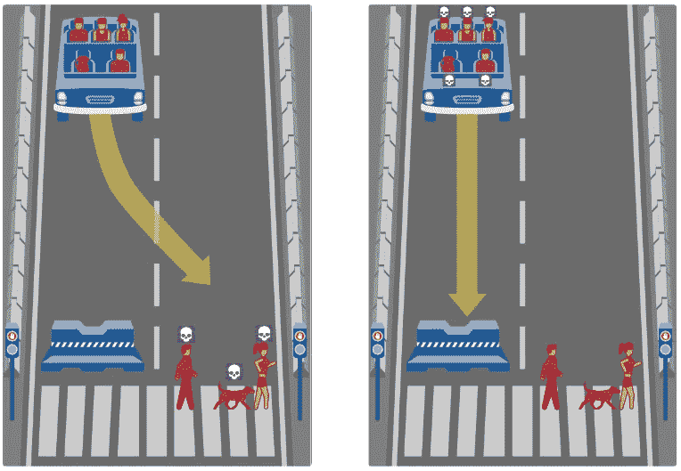

# 通过提及这些话题，在数据科学面试中大放异彩

> 原文：<https://towardsdatascience.com/shine-in-data-science-interviews-by-mentioning-these-topics-622b1726386b?source=collection_archive---------41----------------------->

## 有时候，数据科学的成功不仅仅是创建最好的模型

由[山](https://www.pexels.com/)上的[山](https://www.pexels.com/@fauxels)拍摄的照片

如果你具备数据科学家的所有技能，你就有很大的机会在面试中胜出。但是如果你想得到额外的提升，你应该展示一些关于你自己的其他事情。其中一个就是我之前文章提到的:软技能。但是今天我想说点别的。

数据科学正在快速发展。新技术正在开发，新工具正在推出，新方法正在被发现。自然，公司倾向于雇佣那些愿意跟上的人。当然，你不需要知道人工智能或数据科学领域正在发生的每一件新事物来证明你感兴趣。有些进步对所有数据科学家来说都太具体了，以至于他们不知道。但有些话题关系到人工智能领域的每个人，从数据科学家到项目经理。大家都应该了解并有看法的话题。

数据科学中的两个这样的主题是可解释性和人工智能伦理。这些主题正在获得牵引力，成为人工智能中最重要的两个课外主题。展示你对这些主题的理解可以为你的潜在客户创造奇迹。即使这意味着只是表明你给了他们一些想法。

在这篇文章中，我将向你介绍可解释性和人工智能伦理，解释它们是什么，并分享一些常用的工具来将它们应用到日常项目中。读完这篇文章后，你应该能够在工作面试中轻松地讨论这些主题，并知道如何将它们应用到你的个人或专业项目中。

在我们进入细节之前，我想指出这两个主题是相关的。随着人工智能得到更广泛的应用，人们自然希望了解人工智能系统是如何做出决策的，以及它们是如何如此成功的。不仅仅是出于好奇，还因为人工智能开始在人们的生活中产生影响。今天，在许多其他事情中，人工智能算法被用来决定解雇谁或贷款给谁。

当然，我们对机器学习算法的理论以及它们在理论上如何工作有很好的了解。但是，对于这些算法中的许多算法，不可能看到特定案例的哪个属性导致算法以这种或那种方式做出决定。至少最近没有。因此，过去不可能，而且在一定程度上仍然不可能，来证明机器学习算法做出的决定是正确的。

有一些不公平申请的例子仅仅是因为缺乏对这个问题的认识。公司意识到他们的人工智能系统偏袒某个种族或歧视某个性别。这导致公众开始讨论监管人工智能技术和一般的人工智能伦理。让我们仔细看看这些主题。

# 可解释性

机器学习算法被许多教授它的人称为“黑盒”。这是一个相当准确的描述，因为我们真的不知道那里发生了什么。下图简单地展示了它的样子。你给了一些输入，一些事情发生了，你得到了一些输出。你可以改变黑盒中发生的一些参数，使输出更好，但你不知道为什么。

相信机器学习精灵会解决你的问题可能会令人欣慰，你可能会说，“嘿，如果它在工作，它就在工作。无需窥探模型内部。”让我们看看我能否用这个例子改变你的想法:
研究人员用狼和哈士奇的图片训练了一个模型。[1]该模型的目标是将某个图像分类为哈士奇或狼。这个模型做得很好，精确度很高。当研究人员查看发生了什么以及模型使用图片上的什么信息来决定照片是狼还是哈士奇时，他们看到了这个:

解释显示所有狼的照片都有雪作为背景。因此，该模型被优化为基于背景中是否有雪来分类。当给它一张背景是雪的哈士奇的照片时，它自然不能正确地分类，因为它一开始就捕捉到了错误的图案。这里只是一个免责声明，这个算法是用人工选择的数据训练的，专门用于研究模型解释。但是这些类型的不明显的、不期望的和难以检测的数据中的相关性，具有显著影响机器学习模型的潜力，如示例中所示。

除了可解释性有助于我们通过了解算法决策的基础来减少错误之外，理解成功的模型也有很大的好处。通过使机器学习算法基于其决策的模式可见，我们可以更好地理解手头的问题。

在研究一些可解释性工具之前，最好注意一些算法比其他算法更容易解释，即使没有可解释性工具。特性重要性图表是了解某个特性在整个决策过程中有多重要的好方法。基于树的算法是可能的，例如决策树、随机森林和梯度提升树。你必须记住，特性重要性图表上显示的重要性并不是相互独立的。并且不容易比较改变特征值的效果。最近开发的可解释性工具通过显示每个特征的重要性或权重，很好地解释了每个实例。

一些解释机器学习算法的工具有 SHAP、Lime(我目前使用的)、XGBoostExplainer(专门针对 xgboost)、Skater 和 ELI5。

下面是一些工具的解释。

SHAP 通过给每个特征分配一个叫做“沙普利值”的值来解释模型的决定。该值成为该特性的重要性。Shapley 值决定了如何在要素之间分配预测。对单个数据点的解释如下:

这个具体的用例是确定患者患心脏病的可能性。该行顶部标有“输出值”的值是该患者的预测值。1 表示存在心脏病，0 表示没有心脏病。蓝色和红色箭头显示了某个特征影响预测的方式。

看起来这位患者的性别和身高值更高，他们患心脏病的可能性更大，而其他特征，如胸痛类型或主要血管堵塞的数量，则表明患心脏病的风险较低。箭头的长度显示了某个特性相对于其他特性的重要性。所以对于这个例子，thal 的值更重要，因为与患者的性别相比，它更有可能导致心脏病。

Lime 像我们一样假设模型是一个黑盒，并查看模型的输入和输出之间的关系。为了理解模型如何做出决策，它调整输入以查看输出如何变化，并使用这种技术解释各个实例。使用 LIME 解释的来自相同模型的相同实例如下所示。

左边的图表显示了实际的预测，中间的图表显示了 Lime 如何解释每个特性对这个实例的总体结果的贡献。同样，条形的长度和顺序(从上到下)显示了特征在最终决策中的重要性/权重。

关于如何预测这个人有 50%的机会患心脏病，这两个解释者似乎有相似的想法。但情况并非总是如此。因为这些解释者试图使用不同的技术来解释模型预测，并且因为这些技术不能完全复制模型预测过程，而仅仅是估计它，所以他们往往有不一致的情况。在像这样的用例中，我们可以在一定程度上使用常识，如果解释者和/或模型有意义，这似乎很容易理解。但是当我们在一个我们不熟悉或者不擅长的领域工作时，决定使用什么样的解释就变得更加棘手了。这提醒我们要对这些解释持保留态度，不要根据它们做出夸大的声明。

# 人工智能伦理

这些年来，模型缺乏可解释性和一些不幸的人工智能应用引起了人工智能社区的关注。人们意识到人工智能系统开始反映现实生活中不理想的部分。这并不奇怪，因为机器学习算法是为了学习数据中的模式而创建的。如果你给它输入世界上所有 CEO 的数据，下一次你问它某个人成为 CEO 的可能性时，它自然会给出女性比男性更低的可能性。仅仅是因为它是数据中呈现的模式。

人工智能伦理只是努力确保人工智能系统是公平和可信的。我们不希望我们训练的人工智能系统有偏见或歧视任何群体。

人工智能伦理学有几个主要问题。让我们检查一下。

首先是偏见的问题。如果你用一个有偏见的数据集训练你的模型，自然你会得到一个歧视某些群体的有偏见的数据集。你会问现实生活中是什么样子？这里有一些例子。

这里有一个非常尴尬的例子，一个护照申请系统把一个亚洲血统的人误认为是一个闭着眼睛的人。[2]

一个来自亚马逊，那里的男性求职者比女性求职者更受青睐，原因很简单，在他们的培训数据中，以前被雇佣的人都是男性。这使得该模型认为男性更适合担任这一职位。[3]

谷歌的这个是我最喜欢的之一。只是一个免责声明，这是几年前的一个例子。谷歌现在有一个解决这个问题的方法，我马上会分享给大家。而是回到有偏差的系统；几年前，当你翻译“她是医生”这句话时。他是一名护士。”翻译成一种没有性别代词的语言，然后翻译回来，你会得到一个相当性别歧视的翻译，好像谷歌翻译没有给它一个机会，医生可能是一个女人。这一次又是由训练模型的有偏差的数据集引起的。

**处理偏差的方式是:**

*   在模型训练中尽可能不包含个人信息。如果你正在开发一个贷款决策模型，你知道这个模型不知道这个人是男是女。
*   如果您绝对需要包含个人信息，请确保您的数据集是平衡的，不会偏向或针对任何特定群体。有一些工具和指标可以用来计算偏倚的水平。一个示例工具是 IBM AI 公平 360 工具包。
*   仅从数据集中排除个人信息可能还不够。您应该确保数据集中没有个人信息的隐藏代理。例如，您可能认为您没有在训练中包括种族信息，但是如果数据集来自一个高度隔离的城市，在那里来自同一种族的人往往居住在相同的街区，通过包括邮政编码信息，您将包括种族信息。
*   始终，即使您没有个人信息，也要确保您的数据集公平地代表数据集中所有可能的群体。
*   留意潜在的有偏差的应用，并调整您的系统。有许多棘手的案件。一定要采取创造性的措施。下面举个例子，Google translate 在发现这个问题后是如何适应的。[4]现在，当语言不明确时，他们会给你两种选择。

我已经向你展示了一些由有偏见的数据引起的问题的例子，但是偏见不是人工智能伦理的唯一问题。人工智能系统的滥用会导致严重的不道德行为。

这是一个学校老师的例子，她受到学生和家长的高度赞扬，却发现自己被解雇了。根据对学生成绩的统计评估，她被解雇了，这位老师对学校的整体数学成绩贡献不够。因此，由于现有的制度，她被解雇了，尽管她是一位受人爱戴的老师。[5]

另一个例子是大学做的一项关于辍学大学生的研究。根据过去几年的学生数据，训练了一个模型来评估某个学生几年后辍学的可能性。一所大学用这个模型来评估每一个申请的学生辍学的可能性，并剔除那些辍学可能性较高的学生。我相信你明白为什么这是不道德和不公平的。这让我想起了电影《少数派报告》，在那里他们根据先知的预见在犯罪之前逮捕人。

我们不应该因为这些例子而对人工智能系统的有用性失去希望。有办法将人工智能系统集成到决策过程中，并让它们支持决策，而不是推动决策。例如，回到辍学概率计算模型，另一所大学没有让它影响其招生，而是建立了一个平台，以支持辍学可能性较高的学生，确保他们留在学校。

毕竟，这些系统是我们制造的，我们也有责任道德地使用它们的成果，不让它们成为不公平的理由。

人工智能伦理学的另一个问题是人工智能的责任。人工智能的责任更多的是未来的问题。这是一个“如果一个人工智能系统伤害了人类，谁应该负责任”的问题当然，这个问题不是指机器人反叛，而是指自动驾驶汽车和自动智能系统。这个问题的一个很好的例子就是电车问题。

手推车问题是照片下面显示的伦理问题。如果一辆电车将要撞死 5 个人，而我们有足够的钱让它转向并只撞死一个人，我们会这么做吗？或者更确切地说，什么是道德的事情呢？除非我们决定转移手推车去救其他五个人，否则这一个人不会马上有危险。

人工智能责任中的这个问题是这样提出的:假设有一辆自动驾驶汽车，如果汽车直行，它会撞到墙上，车里的人会被撞死，但如果汽车突然转向，它会撞到其他人，他们也会被撞死。一个细节是过马路的人在闯红灯。我们应该教汽车做什么？如果过马路的人是老人呢？如果她们是孕妇呢？

这是一个很难回答的问题。但这是一个需要答案的问题。比方说，我们在汽车的设计过程中决定，它应该不惜一切代价保护车里的人。如果这种情况发生，过马路的人在事故中丧生，会怎么样？那是谁的错？

从我们还在琢磨的例子和问题可以看出，人工智能伦理学还有很长的路要走。不幸的是，获得符合伦理的人工智能并不像检查清单那么容易。这些年来，社区通过犯错误和意识到这些错误，已经发现了一些最佳实践，但是我们还没有一个可能出错的所有事情的详尽列表。我们能做的最好的事情就是留意可能的不道德的应用，并采取必要的预防措施来领先他们一步。

我希望这篇文章对你来说是一个好的起点。你现在应该能够描述可解释性在人工智能的上下文中意味着什么，以及人工智能伦理需要什么。我相信你的潜在雇主听到你不仅听说过这些术语，而且还做了足够多的阅读，给出了一些可能出错以及如何解决它们的例子，会留下深刻的印象。如果可以的话，你可以问问你的面试官他们在工作中是如何解决这些问题的，那就更好了。

除了在数据科学面试中成为一个很好的话题之外，一旦你开始工作，这些话题将成为你职业生活中的主要主题，这是有充分理由的。所以把它们记在心里，尽可能多的阅读。

👉*对数据科学领域以及如何开始学习感到困惑？* [*免费参加数据科学入门迷你课程*](https://www.soyouwanttobeadatascientist.com/courses/data-science-kick-starter-mini-course) *！*

**如果你有兴趣了解更多，这里有一些我偶然看到的文章:**

交代: [‍](/explainable-artificial-intelligence-part-3-hands-on-machine-learning-model-interpretation-e8ebe5afc608)

[动手机器学习模型解读](/explainable-artificial-intelligence-part-3-hands-on-machine-learning-model-interpretation-e8ebe5afc608)

人工智能伦理:

[人工智能伦理的搭便车指南](http://‍https://towardsdatascience.com/ethics-of-ai-a-comprehensive-primer-1bfd039124b0)

**参考文献:**

1.  “我为什么要相信你？”:解释任何分类器的预测
2.  新西兰护照机器人告诉亚裔申请人睁开眼睛
3.  [亚马逊废弃秘密人工智能招聘工具，该工具显示出对女性的偏见](https://www.reuters.com/article/us-amazon-com-jobs-automation-insight/amazon-scraps-secret-ai-recruiting-tool-that-showed-bias-against-women-idUSKCN1MK08G)
4.  [减少谷歌翻译中的性别偏见](https://www.blog.google/products/translate/reducing-gender-bias-google-translate/)
5.  [“创造性…激励性”并被解雇](https://www.washingtonpost.com/local/education/creative--motivating-and-fired/2012/02/04/gIQAwzZpvR_story.html)