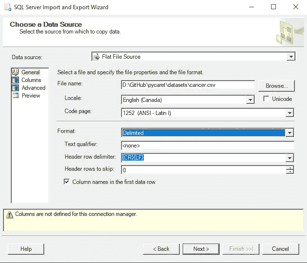
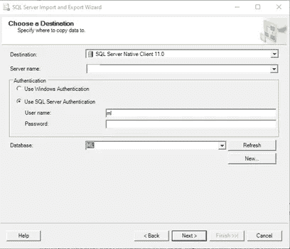
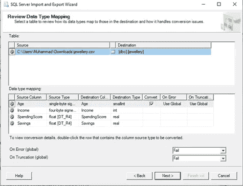
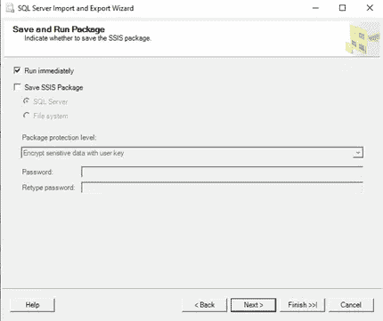
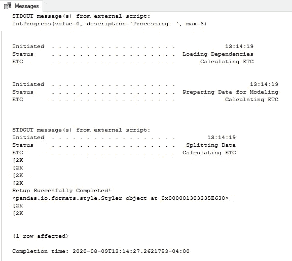
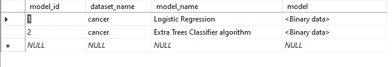
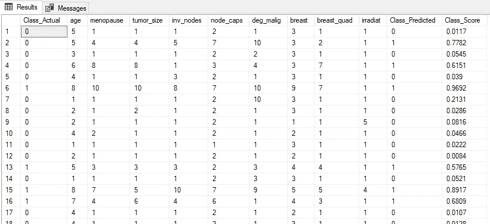

# 使用 PyCaret 将机器学习模型传送到数据—第二部分

> 原文：<https://towardsdatascience.com/ship-ml-model-to-data-using-pycaret-part-ii-6a8b3f3d04d0?source=collection_archive---------42----------------------->

## 二元分类


约书亚·索蒂诺在 [Unsplash](https://unsplash.com?utm_source=medium&utm_medium=referral) 上拍摄的照片

我之前的帖子 [**使用 PyCaret 1.0**](/machine-learning-in-sql-using-pycaret-87aff377d90c) 在 SQL 中进行机器学习提供了关于集成 [**PyCaret**](https://pycaret.org/) 与 [**SQL Server**](https://www.microsoft.com/en-ca/sql-server/sql-server-downloads) 的细节。在本文中，我将提供如何使用[**py caret 2.0**](https://pycaret.org/)**(py caret 是 Python 中的一个低代码 ML 库)**在 SQL Server 中训练和部署监督机器学习分类模型的逐步细节。****

****本文涉及的内容:****

**1.如何将数据加载到 SQL Server 表中**

**2.如何在 SQL Server 表中创建和保存模型**

**3.如何使用保存的模型进行模型预测并将结果存储在表中**

# ****一、导入/加载数据****

**现在，您必须使用 SQL Server Management Studio 将 CSV 文件导入数据库。**

**在数据库中创建一个表“**癌症****

****

**右击数据库，选择**任务** **- >** **导入数据****

****

**对于数据源，选择**平面文件源**。然后使用**浏览**按钮选择 CSV 文件。在点击**下一个**按钮之前，花一些时间配置数据导入。**

****

**对于目标，请选择正确的数据库提供程序(例如 SQL Server Native Client 11.0)。输入**服务器名**；勾选**使用 SQL Server 认证**，输入**用户名**、**密码**和**数据库**，然后点击**下一步**按钮。**

****

**在选择源表和视图窗口中，您可以在单击下一个按钮**之前编辑映射。****

****

**检查立即运行并点击**下一个**按钮**

****

**单击“完成”按钮运行包**

# ****二。创建 ML 模型&保存在数据库表****

****分类**是一种监督机器学习，用于预测离散无序的分类类别**标签**。 [**PyCaret**](https://pycaret.org/) 包中可用的模块可用于**二进制**或**多类**问题。**

**在本例中，我们将使用'**乳腺癌数据集**'。在数据库表中创建和保存模型是一个多步骤的过程。让我们一步一步来:**

**I .创建存储过程以创建训练模型，在这种情况下是额外的树分类器算法。该过程将从上一步创建的癌症表中读取数据。**

**下面是用于创建该过程的代码:**

```
*-- Stored procedure that generates a PyCaret model using the cancer data using Extra Trees Classifier Algorithm*DROP PROCEDURE IF EXISTS generate_cancer_pycaret_model;GoCREATE PROCEDURE generate_cancer_pycaret_model (@trained_model varbinary(max) OUTPUT) ASBEGINEXECUTE sp_execute_external_script@language = N'Python', @script = N'import pycaret.classification as cpimport pickletrail1 = cp.setup(data = cancer_data, target = "Class", silent = True, n_jobs=None)*# Create Model*
et = cp.create_model("et", verbose=False) *#To improve our model further, we can tune hyper-parameters using tune_model function.
#We can also optimize tuning based on an evaluation metric. As our choice of metric is F1-score, lets optimize our algorithm!*tuned_et = cp.tune_model(et, optimize = "F1", verbose=False) *#The finalize_model() function fits the model onto the complete dataset.
#The purpose of this function is to train the model on the complete dataset before it is deployed in production*final_model = cp.finalize_model(tuned_et)*# Before saving the model to the DB table, convert it to a binary object*trained_model = []
prep = cp.get_config("prep_pipe")
trained_model.append(prep)
trained_model.append(final_model)
trained_model = pickle.dumps(trained_model)', @input_data_1 = N'select "Class", "age", "menopause", "tumor_size", "inv_nodes", "node_caps", "deg_malig", "breast", "breast_quad", "irradiat" from dbo.cancer', @input_data_1_name = N'cancer_data', @params = N'@trained_model varbinary(max) OUTPUT', @trained_model = @trained_model OUTPUT;END;GO
```

**二。创建存储定型模型对象所需的表**

```
DROP TABLE IF EXISTS dbo.pycaret_models;GOCREATE TABLE dbo.pycaret_models (
model_id  INT NOT NULL PRIMARY KEY,
dataset_name VARCHAR(100) NOT NULL DEFAULT('default dataset'),
model_name  VARCHAR(100) NOT NULL DEFAULT('default model'),
model   VARBINARY(MAX) NOT NULL
);GO
```

**三。调用存储过程创建模型对象并保存到数据库表中**

```
DECLARE @model VARBINARY(MAX);
EXECUTE generate_cancer_pycaret_model @model OUTPUT;
INSERT INTO pycaret_models (model_id, dataset_name, model_name, model) VALUES(2, 'cancer', 'Extra Trees Classifier algorithm', @model);
```

**该执行的输出是:**

****

**控制台输出**

**保存模型后的表格结果视图**

****

**SQL Server 表结果**

# ****三。运行预测****

**下一步是基于保存的模型运行测试数据集的预测。这也是一个多步骤的过程。让我们把所有的步骤再重复一遍。**

**I .创建一个存储过程，该存储过程将使用测试数据集来检测测试数据点的癌症**

**下面是创建数据库过程的代码:**

```
DROP PROCEDURE IF EXISTS pycaret_predict_cancer;
GOCREATE PROCEDURE pycaret_predict_cancer (@id INT, @dataset varchar(100), @model varchar(100))
ASBEGINDECLARE @py_model varbinary(max) = (select modelfrom pycaret_modelswhere model_name = @modeland dataset_name = @datasetand model_id = @id);EXECUTE sp_execute_external_script@language = N'Python',@script = N'# Import the scikit-learn function to compute error.import pycaret.classification as cpimport picklecancer_model = pickle.loads(py_model)*# Generate the predictions for the test set.*predictions = cp.predict_model(cancer_model, data=cancer_score_data)OutputDataSet = predictionsprint(OutputDataSet)', @input_data_1 = N'select "Class", "age", "menopause", "tumor_size", "inv_nodes", "node_caps", "deg_malig", "breast", "breast_quad", "irradiat" from dbo.cancer', @input_data_1_name = N'cancer_score_data', @params = N'@py_model varbinary(max)', @py_model = @py_modelwith result sets (("Class" INT, "age" INT, "menopause" INT, "tumor_size" INT, "inv_nodes" INT,"node_caps" INT, "deg_malig" INT, "breast" INT, "breast_quad" INT,"irradiat" INT, "Class_Predict" INT, "Class_Score" float ));END;GO
```

**二。创建一个表来保存预测和数据集**

```
DROP TABLE IF EXISTS [dbo].[pycaret_cancer_predictions];GOCREATE TABLE [dbo].[pycaret_cancer_predictions]([Class_Actual] [nvarchar] (50) NULL,[age] [nvarchar] (50) NULL,[menopause] [nvarchar] (50) NULL,[tumor_size] [nvarchar] (50) NULL,[inv_nodes] [nvarchar] (50) NULL,[node_caps] [nvarchar] (50) NULL,[deg_malig] [nvarchar] (50) NULL,[breast] [nvarchar] (50) NULL,[breast_quad] [nvarchar] (50) NULL,[irradiat] [nvarchar] (50) NULL,[Class_Predicted] [nvarchar] (50) NULL,[Class_Score] [float] NULL) ON [PRIMARY]GO
```

**三。调用 pycaret_predict_cancer 过程将预测结果保存到表中**

```
*--Insert the results of the predictions for test set into a table*INSERT INTO [pycaret_cancer_predictions]EXEC pycaret_predict_cancer 2, 'cancer', 'Extra Trees Classifier algorithm';
```

**四。执行下面的 SQL 来查看预测的结果**

```
*-- Select contents of the table*SELECT * FROM [pycaret_cancer_predictions];
```

****

**预测结果**

# **四。结论**

**在这篇文章中，我们学习了如何在 SQL Server 中使用 PyCaret 构建分类模型。类似地，根据业务问题的需要，您可以构建和运行其他类型的监督和非监督 ML 模型。**

****

**托比亚斯·菲舍尔在 [Unsplash](https://unsplash.com?utm_source=medium&utm_medium=referral) 上拍摄的照片**

**您可以进一步查看 [**PyCaret**](http://pycaret.org/) 网站，了解可以在 SQL Server 中以类似方式实现的其他监督和非监督实验的文档。**

**我未来的帖子将会是在 QL 服务器中使用 Python 和 **PyCaret** 探索其他监督和非监督学习技术的教程。**

# **动词 （verb 的缩写）重要链接**

**[PyCaret](https://pycaret.org/)**

**[我的 LinkedIn 个人资料](https://www.linkedin.com/in/umarfarooque/)**