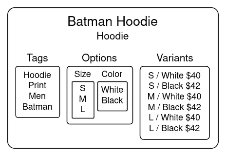
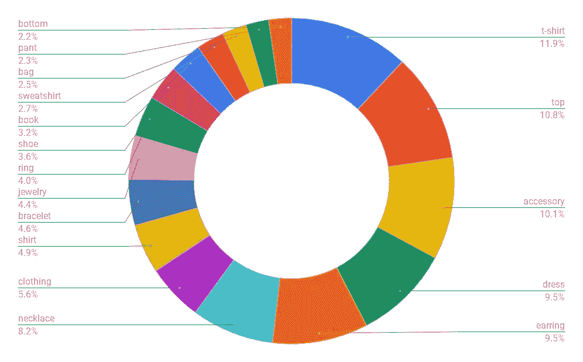
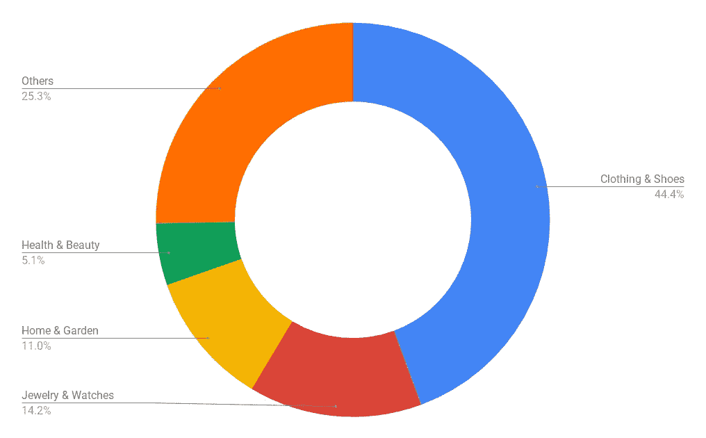
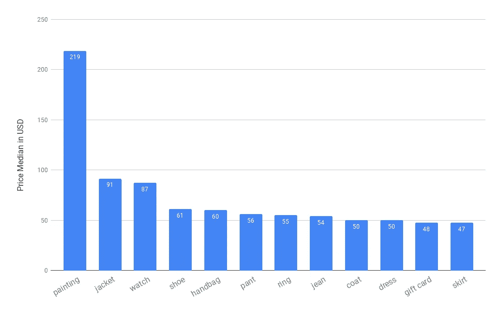
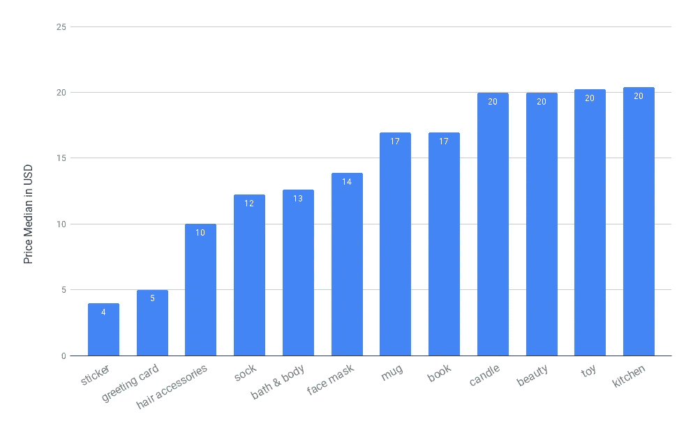
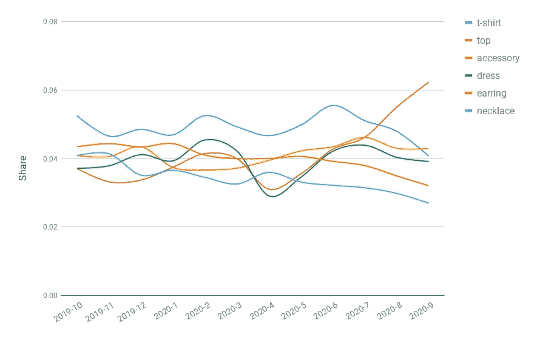
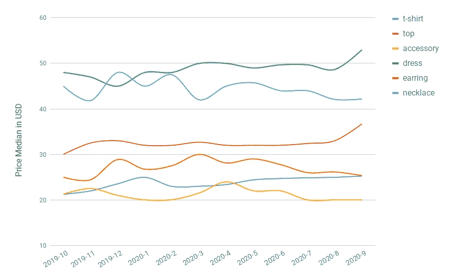

# Shopify 趋势产品 2020

> 原文：<https://towardsdatascience.com/shopify-products-eda-8c14e3e544e8?source=collection_archive---------40----------------------->

## 数据科学

## Shopgram.io [EDA 第二部分]

图片来自 [Shopgram.io](https://shopgram.io/)

机器学习正在变革许多行业，包括电子商务和在线购物，零售商可以通过时间序列预测管理供应链，并为他们的客户提供个性化和语义感知的搜索和推荐引擎。这些成就大多归功于需要大量训练数据的深度学习的进步。虽然有许多巨大的通用多媒体数据集，但大多数特定于电子商务的公共数据集并不令人惊讶。

[**shop gram . io**](https://shopgram.io)**是我们开始通过收集 [Shopify](https://www.shopify.com/) 创建的在线商店数据来分析电子商务市场的地方，这些数据是全球电子商务市场的代表性样本。在 [Shopify Stores EDA](/shopify-stores-eda-d1f949604e1c?gi=c3d8df8971d5) 中，我介绍了 Shopify 是最大的电子商务平台之一，具有许多数据科学潜力，并讨论了我们如何抓取超过 70 万家商店和 7000 万种产品以及商店 EDA 的信息。在这篇文档中，我的主要关注点是*产品*，在这里我首先解释产品数据结构，然后我谈论数据清洗，最后，我给出一些基本的 EDA，特别是关于 Shopify 商店中受欢迎的产品类型，以及它们的平均价格。**

# **数据结构**

**假设我们有商店网址，找到产品信息并不是一件难事。其实 Shopify 提供了一个开放的 API，通过 URL*{ shop-URL }/products . JSON 给出 JSON 格式的产品数据？limit=250 & page={i}。*有了所有产品，我们可以构建一个大型多模态数据集(text & image ),并在以后将其用于数据挖掘目的。**

**Shopify 数据模型中的每个产品都有一个整数 *id* ，它在所有产品中是唯一的，*标题*，在产品 URL 中使用的*句柄*，提供者名称*供应商*，由商家确定的产品类型 *product_type* ，以及下面描述的*标签、选项、变量、*和*图像*。**

****

**图一。Shopify 产品的主要特点(图片由作者提供)。**

**标签是 Shopify 的内部概念，对客户不可见。它用于改善客户搜索体验，也用于执行批量操作，如构建自动收藏。产品也可以有零到三个选项。每个选项都有一个名称和值列表。例如，一件连帽衫可能有两个选项:*尺码*和*颜色*，三个尺码值 *(S，M，L)* ，两个颜色值*(黑色，白色)*。这样，我们就有了 6 个变体。变体是通过组合选项构建的。每个变量都有一个*标题*，它是由反斜杠(例如 *S / Black* )、字符串形式的 *sku* 、 *price* (无货币)、 *compare_at_price* 、 *option1* 、 *option2* 、 *option3* (它们是期权的值)和*分隔的选项值的串联由于一个产品可能有不同的变体，它也可能有不同的图像。每个图像都有一个 *id* 、 *src* 即图像的 URL、*宽度*、*高度*和 *variant_ids* 。***

**利用这些特性可以定义许多数据科学问题。我们将互相使用文本和图像数据，并建立一个多模态深度神经网络来对电子商务产品进行分类或比较类似的产品。但在下文中，我将解释我们如何利用 *product_type* 和 *price* 功能来发现 Shopify 中最受欢迎的产品类型及其价格统计。**

# **数据清理**

**产品类型是所有特征中最有趣的特征之一，因为它可以用来标记产品。然而，它很难使用，因为不同的商家可能会对一种特定的类型使用不同的名称:*T 恤衫，T 恤衫，T 恤衫，t 恤，…* 都是指*的 t 恤*。**

**通过分析 6700 万种产品，我们发现了 160 万种独特的产品类型。使用引理化，我们可以将这个数字减少到 140 万，但仍然很大。但是好消息是，我们可以只保留 1128 种产品类型，仍然有 50%的产品(这个数字是 2515，没有术语化)。这些选定的产品类型仍然需要手动清洁(因为例如 *t 恤*和*t 恤*仍然是不同的),在这样做之后，我们有 758 个干净的产品标签，并建立一个带标签的数据集。此外，为了构建分层产品类别，我们使用了易贝类别的前三个级别，并标记了我们的数据。**

**价格特色怎么样？如上所述，价格是变量数据的特征，其中缺少货币信息使其不能直接使用。事实上，我们已经从商店的主页上找到了商店货币，连接这些数据我们就可以得到价格和货币。将所有价格标准化为美元(使用 2020 年的货币比率)并去除异常值，可以得到干净的价格数据。现在，我们可以探索 Shopify 商店中受欢迎的产品类型，并对每个类别进行价格统计。**

# **探索性数据分析**

**现在，我将展示经过清理的产品数据的基本统计数据，这些数据可能会让打算选择新产品的 Shopify 商家和想开展新业务的企业家感兴趣。让我们检查一下 Shopify 商店中受欢迎的产品类型。下图显示了 17 种最受欢迎的类型，占所有产品的 40%。这个数字分别为 60%和 80%的 58 和 170。**

****

**图二。覆盖所有产品 40%的前 17 种产品类型。(股份是有条件的，总股份可通过将这些数字乘以 0.4 得出)**

**同样考虑第一级易贝类别，所有产品的 75%来自以下四个类别:**

****

**图三。一级易贝类别。**

**对于需要比较和分析特定行业价格的商家来说，价格分析是另一个吸引人的信息。仅考虑覆盖 60%产品的前 58 种产品类型，并根据其价格中位数对其进行排序，这对于噪音更具鲁棒性，以下两个图分别显示了最昂贵和最实惠的流行产品类型。**

****

**图 4。最昂贵的流行产品类型。**

****

**图五。最实惠的流行产品类型。**

**涉及到时间作为另一个维度，我们可以通过时间来分析这些统计数据，显示了 2020 年 *top* 的受欢迎程度以及*耳环*和*项链*的小幅下跌。这种趋势也可以在图 7 中的价格中观察到。**

****

**图六。不同时期流行产品类型的份额。**

****

**图 7。流行产品类型的价格中位数。**

**除了这些统计数据之外，还可以通过产品数据提取更多信息，尤其是使用自然语言处理方法从产品文本中提取信息，这将在 [**Shopgram.io**](https://shopgram.io) 未来的帖子中进行更多调查。**