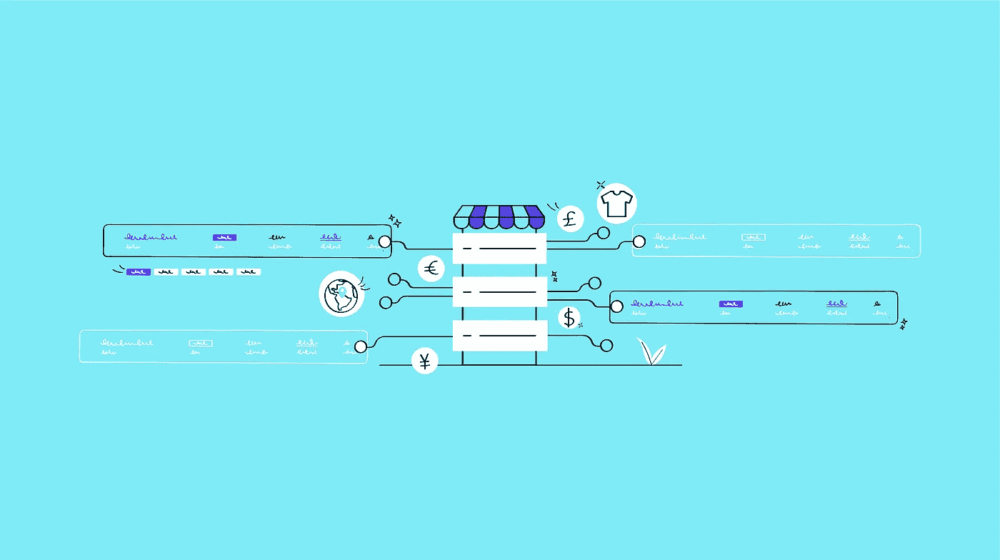
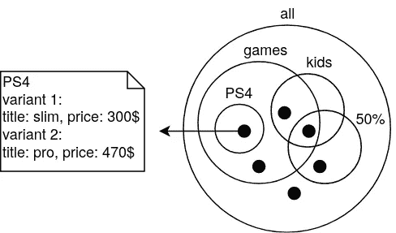
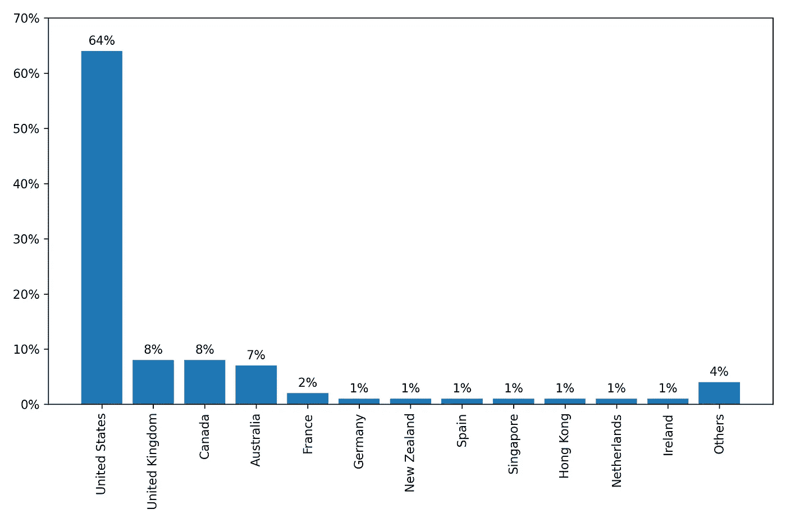
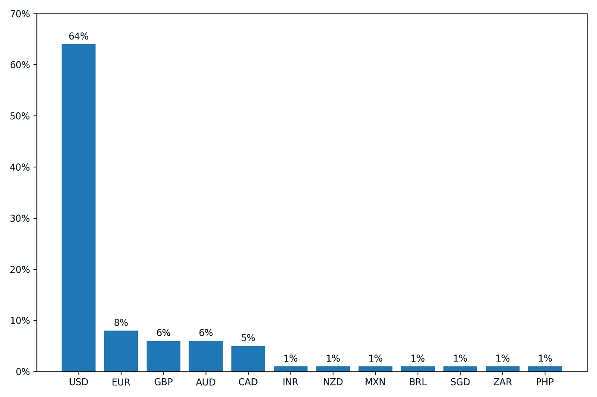
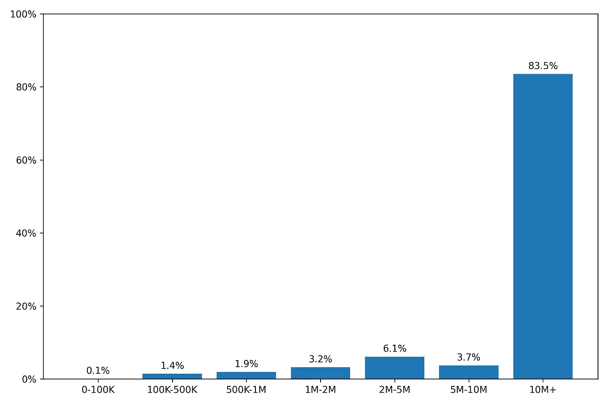
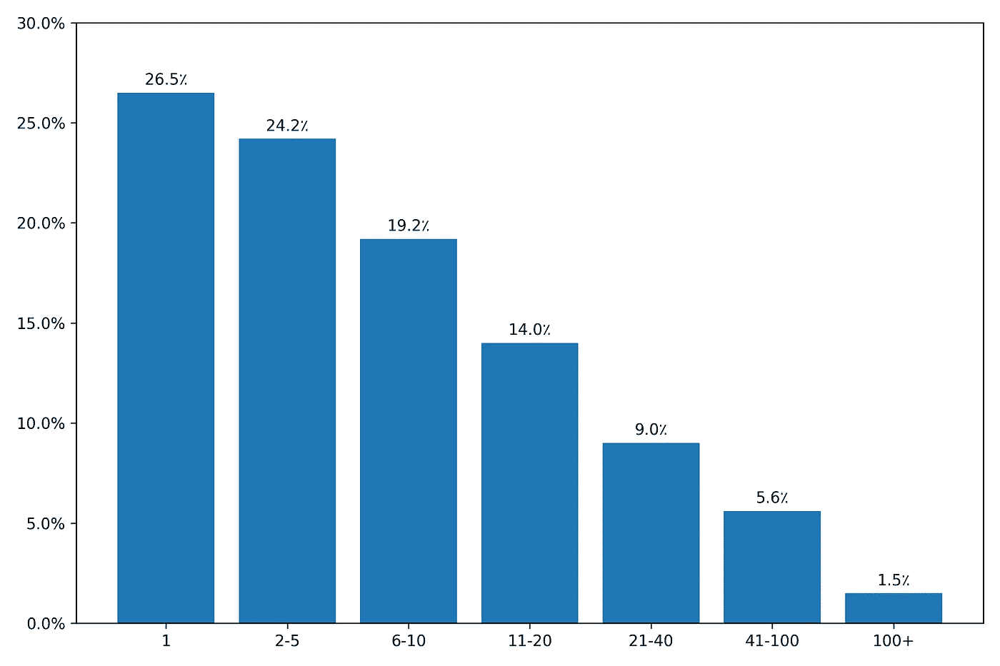
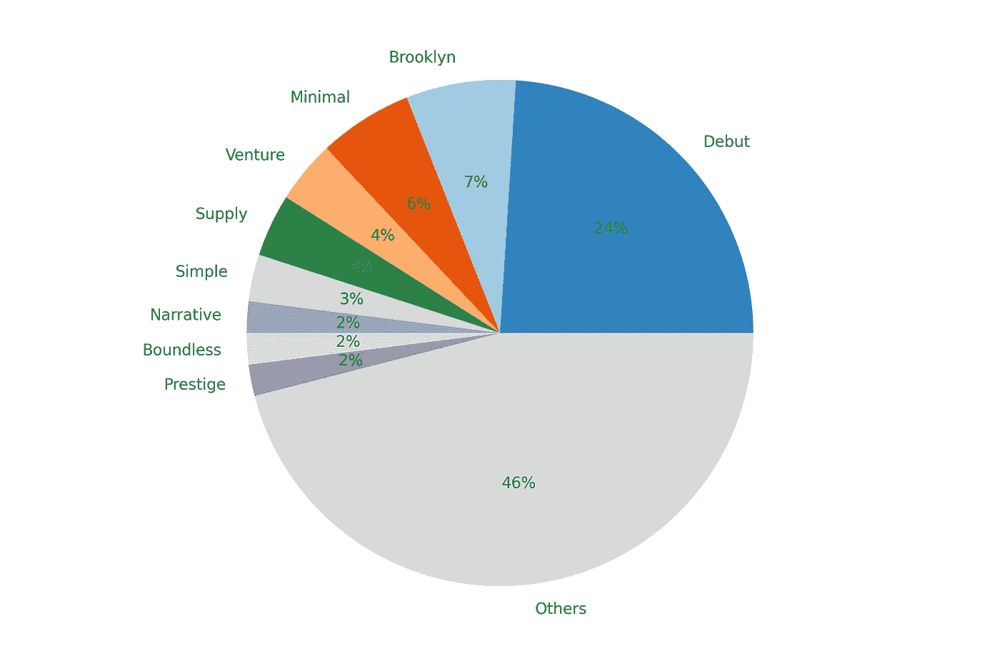
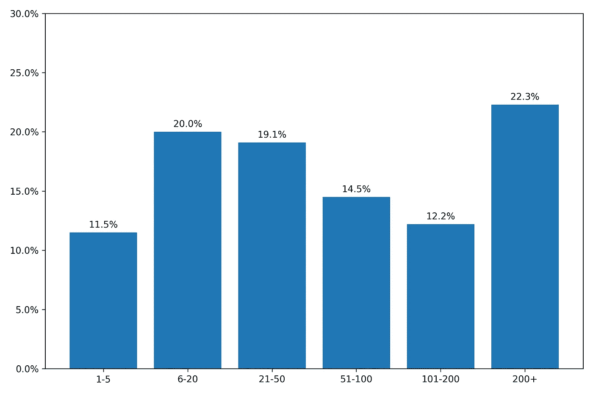

# 购物商店

> 原文：<https://towardsdatascience.com/shopify-stores-eda-d1f949604e1c?source=collection_archive---------31----------------------->

## 数据科学

## [shop gram . io](https://shopgram.io)【EDA 第一部分】

图片由 [Sanaz Bidad](https://dribbble.com/SanazBidad) 来自 [Shopgram.io](https://shopgram.io/)

hopify 是最大的在线商店电子商务平台之一，由于其统一的数据结构，对于数据科学社区来说具有许多潜力。在本文中，我首先介绍了 [Shopify](https://www.shopify.com/) 及其数据模型。然后，我讨论了我们的数据收集挑战和方法，接着是一些基本的探索性数据分析(EDA)。最后，我简要地谈谈我们的主题建模和分类，这是我们下一篇文章的主题。

[Shopgram.io](https://shopgram.io?utm_source=Towards_Data_Science&utm_medium=medium&utm_campaign=referral) 呈现我们分析的结果。它是 Shopify 商店的浏览器，根据不同的功能列出了 70 万家商店，包括类别、[Alexa](https://www.alexa.com/topsites)-排名、国家和产品数量。想要全面了解其他相关商店的 Shopify 商家可以轻松找到他们需要的数据，以获得见解。这对那些想看看是否有潜在机会创业的人来说也是有益的。

# 介绍

Shopify 是一个在线平台，在这里你可以轻松地建立自己的在线商店，无需任何特定的技术知识。订阅 Shopify 后，你有一个管理面板，你可以在那里设计你的商店和放置你的产品。根据 [Shopgram 的报告](https://shopgram.io/posts/best-shopify-shops)，不同类别的顶级网站现在都在使用 Shopify，以获得其独特的好处。根据[统计数据](https://www.statista.com/statistics/534123/e-commerce-share-of-retail-sales-worldwide/)，如今，电子商务占据了全球零售市场 16%的份额，而 Shopify 作为电子商务领域最大的参与者之一，在使用电子商务技术的网站中占据了 20%的份额。

从数据角度来看，Shopify 为所有商店的数据提供了统一的数据结构，因为它们都是由 Shopify 创建的，尽管它们可能使用不同的主题和 ui。每个商店都有一个标题和描述，可以看作是一套产品。一个特定的产品有一个标题，可能有不同的图像，标题和价格不同的变体。另一个重要的概念是集合。每个商店可能有不同的系列，每个产品可能是许多系列的成员(见图 1)。因此，数据模型在所有商店中都是相同的，它为定义数据科学项目提供了巨大的潜力。

图一。有六种产品和五个系列的商店。

网上有一些关于 Shopify 应用和商店的统计报告(例如，见 [IndieHackers](https://www.indiehackers.com/@dbrereton/18218cbcb2) 、[as soft](https://asoft.co/shopify-apps/store-analysis))，但是，它们中的大多数提供一般信息，详细信息如 [Storeleads](https://storeleads.app/reports/shopify) 可在付费订阅后获得。

# 数据收集

找到所有商店是最具挑战性的任务之一。商店网址可通过许多数据提供商访问，如 [Spyse](https://spyse.com/target/domain/myshopify.com) 、 [Nerdydata](https://www.nerdydata.com/reports/shopify/a69ebdba-03ef-423d-b8f3-2b474b98f8d2) 、 [CartInsight](https://www.cartinsight.io/) 、 [Publicwww](https://publicwww.com/websites/shopify/) 、 [Wappalyzer](https://www.wappalyzer.com/technologies/ecommerce/shopify/) 和[built with](https://trends.builtwith.com/websitelist/Shopify/Added-Recently)in premium plan，但是，我们需要自己找到它们，因为其中一些不完整，其他的有限制使用条款。由于 Shopify 商店有一个独特的子域*myshopify.com*，如果我们找到这些子域，我们就有了完整的列表。此外，Shopify 服务器有几个为商店服务的 IP 地址。因此，我们可以通过找到指向这些 IP 地址的域来找到所有的商店。

仅仅通过处理 Shopify 商店的 HTML 主页就可以提取出很多有用的信息。我们可以找到标题、描述、收藏的名称、国家、主题和货币，并将它们用于第一版的 [Shopgram.io](https://shopgram.io) ，以及它们的 Alexa-rank，可以通过 [Alexa API](https://ats.alexa.com/) 访问。我们也通过网址 *{shop-url}/products.json* 找到大部分店铺的商品，以后会用到。

# 探索性数据分析

在这一节中，我将展示一些基本的 EDA，它们可以帮助我们以后选择 ML 模型。呈现的统计数据来自我们可以通过数据收集机制获得的 70 万个商店数据，其中可能存在一些微小的偏差。

首先，我们来看看 Shopify 在不同国家的受欢迎程度。有趣的是，大多数商店(~88%)来自说英语的国家(见图 2)。图 3 中还显示了货币分布，大多数商店使用美元作为他们的货币。

图二。国家受欢迎程度直方图。

图 3。货币流行直方图。

另一个有吸引力的统计数据是 Alexa-rank 的分布(见图 4)。似乎虽然有许多 Shopify 商店，但只有 17%的商店 Alexa-rank 低于 1000 万，有足够的流量通过 Alexa 排名，只有 3.4%的商店 Alexa-rank 低于 1000 万。此外，在所有排名前 1000 万的互联网网站中，1.2%是 Shopify 商店。

图 4。Alexa-等级直方图。

商店收藏信息对我们也很重要，因为首先，它包含了关于商店类别的有用信息，因为我们在主题建模中使用了它；其次，它很容易从主页 HTML 中收集。如图 5 所示，收集的数量具有重尾分布，平均值为 13.2，中位数为 5。

图 5。集合数量直方图。

主题使用统计对于那些将要为他们的商店选择主题的人来说可能也是有趣的。首次亮相和*布鲁克林*是最受欢迎的主题，近三分之一的商店使用它们。主题分布如图 6 所示。

图 6。主题人气。

此外，产品的数量可以合理地衡量商店的规模，图 7 显示了它的分布。更多的信息可以从产品信息中提取，这将在未来的帖子中讨论。

图 7。产品数量直方图。

# 主题建模

现在，让我简单地谈谈我们的第一个 ML 项目，它是对商店进行分类并指定它们的类别，并将细节留给我们即将到来的帖子。这个项目的主要挑战是在监督任务中处理未标记的数据。第二个挑战是选择最终的类标签来将商店映射到它们。为了处理后者，首先，我们考虑利用亚马逊(Amazon)或 T2(Alibaba)的易趣(Ebay)层级作为类别标签，但后来我们决定为 Shopify 商店建立特定的标签，因为它与这两个平台的背景不同。因此，我们进行了主题建模，以便更深入地了解数据。我们将店铺名称、描述和收藏名称连接起来，并通过使用最先进的深度自然语言处理模型从中提取特征向量。然后，我们应用聚类方法，在所有商店中找到了近 800 个重要关键词。使用这些关键字，我们建立了一个带标签的数据集，训练了一个深度 NLP 模型，并将商店分类到不同的标签。完成这些任务的结果可以在 [Shopgram.io](https://shopgram.io) 中找到。