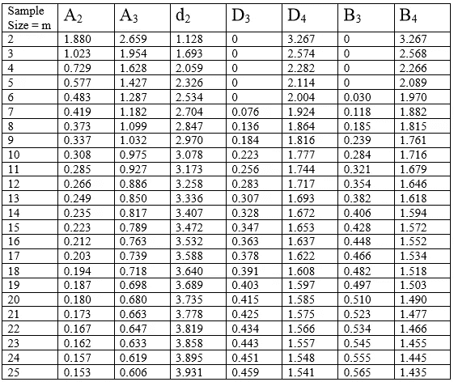
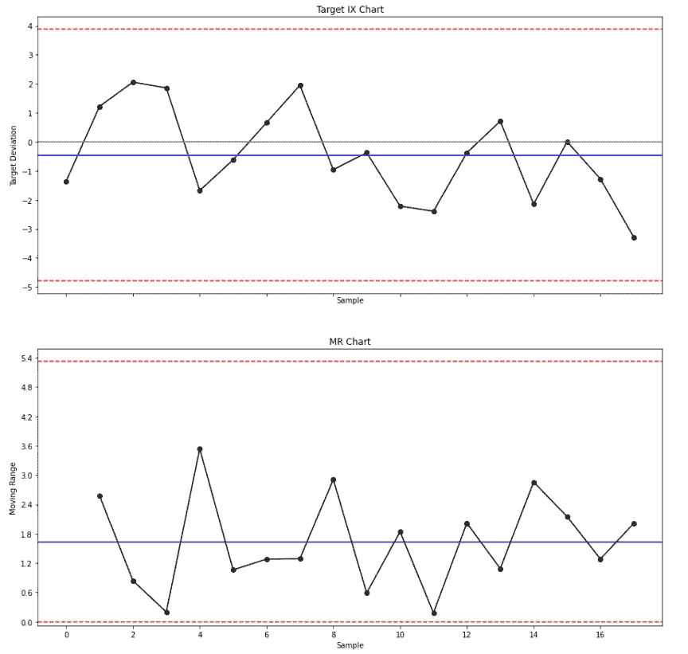
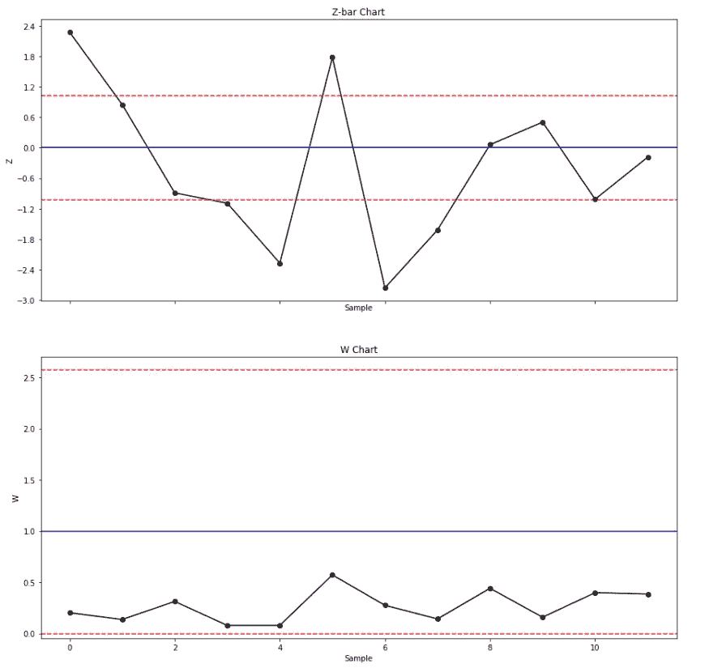
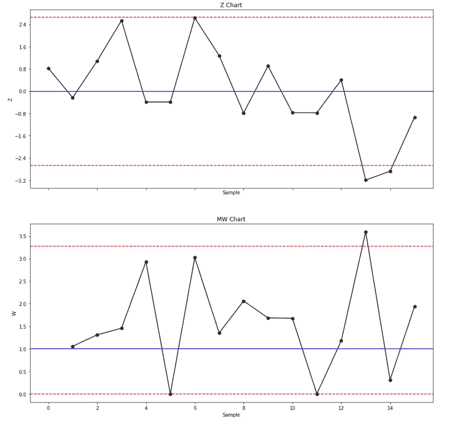

# 用 Python 短期运行控制图(变量数据)

> 原文：<https://towardsdatascience.com/short-runs-control-charts-variables-data-with-python-7feb220e6957?source=collection_archive---------41----------------------->

## 面向工业工程师的 Python

## 使用 Python 库创建质量控制图

图片由 [Steven Lelham](https://unsplash.com/@slelham) 拍摄，可在 [Unsplash](https://unsplash.com/photos/atSaEOeE8Nk) 获得

# 质量控制图

质量控制图是工程师监控一个过程是否在**统计控制下**的重要工具。它们有助于可视化变化，发现并纠正出现的问题，预测预期的结果范围，并分析特殊或常见原因导致的流程变化模式。质量控制图常用于精益六适马项目和 DMAIC 项目的控制阶段，被认为是过程改进的七个基本质量工具之一。

## 控制极限

在质量控制图中，控制极限是绘制在中心线(即平均值)上方和下方的线，其功能是作为识别信号(即超出控制极限的点)的阈值，并帮助确定过程是否处于统计控制之下。它们是由特定于每种类型控制图的公式定义的，这些公式包括常数，这些常数根据样本大小而变化。下表列出了这些常数:

控制极限常数

# 连续数据的短期控制图

小批量控制图(也称为偏离标称控制图)是一组用于高混合、小批量(即可定制产品)环境的质量控制图。短期控制图不是评估每个测量的变化，而是评估零件与其目标的变化。

对于以下示例，将使用 Python 从头开始构建连续数据的每种短期质量控制图。同样，将提供每个控制图的简要描述。让我们来看看 Python 代码。

## 目标九图和磁共振图

目标 IX 图(也称为个体 X 偏差图、差异图或名义图)和 MR 图用于监测和评估变量(测量)数据的**一致性**。目标 IX 图与常规 IX 图相似，但有一点不同:绘图点是单个数据点与其目标之间的**差**。

仅当不同目标的方差相同时，目标 IX 图和 MR 图才可以在同一个图**上组合不同的运行。为了将目标 IX 图与 MR 图一起使用，样本大小 *n* 必须等于 1，并且每个样本应该有一个唯一的目标值。**

在目标 IX 图上，*y*-轴显示与目标的偏差、目标值(即 0)、中心线和控制极限，而*x*-轴显示样本单位。在 MR 图上， *y* 轴显示移动范围、中心线和控制极限，而 *x* 轴显示样本单元。

## z 条形图和 W 图

当不同目标运行之间的差异太大而无法使用目标 IX 图和 MR 图时，使用 Z 条形图和 W 图。Z 条形图和 W 图是 X 条形图和 R 图对分组数据的一种标准化。

如果所有部分的样本大小 *n* 相等，Z 条形图和 W 图可能在同一图表**上组合不同的运行。目标 *X* bar2 和目标 *R* bar 可以从以前的控制图、历史数据、以前的经验或名义规范中获得。**

在 Z 条形图上， *y* 轴显示相对于目标、中心线(即目标值= 0)和控制限值的标准化偏差，而 *x* 轴显示样本组。在 W 图上， *y* 轴显示标准化范围、中心线(即目标值= 1)和控制限，而 *x* 轴显示样本组。

## z 图和 MW 图

当不同目标的运行之间的差异太大而不能使用目标 IX 图和 MR 图时，使用 Z 图和 W 图。Z 图和 W 图是个人 X 图和 MR 图的一种标准化。

如果所有零件的样本大小 *n* 相等，Z 图和 W 图可能在同一张图**上组合不同的运行。**

在 Z 轴图上， *y* 轴显示相对于目标、中心线(即目标值= 0)和控制限值的标准化偏差，而 *x* 轴显示样本单位。在 MW 图上， *y* 轴显示标准化的移动范围、中心线(即目标值= 1)和控制极限，而 *x* 轴显示样本单位。

# 总结想法

质量控制图是分析流程稳定性和获取重要统计信息的重要工具，可用于精益六适马和 DMAIC 项目的流程改进。质量和工业工程师必须能够准确地解释它们，以识别可能导致潜在不合格的不良趋势，从而采取预防措施而不是纠正措施，从而减少废料和浪费。

本指南涵盖了如何使用多个 Python 库从头开始构建短期质量控制图的分步教程。考虑到 Python 在专业人士和学者中的高受欢迎程度，Python 是一个很好的工具，能够为统计目的构建质量控制图表。虽然也有其他程序和软件可以构建它们(例如 Minitab、R、Microsoft Excel)，但质量和工业工程师应根据他们的编码和分析技能决定使用哪一种，同时符合组织的目标和客户的规格。

*—*

*如果你觉得这篇文章有用，欢迎在* [*GitHub*](https://github.com/rsalaza4/Python-for-Industrial-Engineering/tree/master/Quality%20Control%20Charts) *上下载我的个人代码。你也可以直接在 rsalaza4@binghamton.edu 给我发邮件，在*[*LinkedIn*](https://www.linkedin.com/in/roberto-salazar-reyna/)*上找到我。有兴趣了解工程领域的数据分析、数据科学和机器学习应用的更多信息吗？通过访问我的媒体* [*简介*](https://robertosalazarr.medium.com/) *来探索我以前的文章。感谢阅读。*

*——罗伯特*