# 关于 Word2Vec、GloVe 和 Fasttext 的简短技术信息

> 原文：<https://towardsdatascience.com/short-technical-information-about-word2vec-glove-and-fasttext-d38e4f529ca8?source=collection_archive---------19----------------------->

# 介绍

在深度学习的帮助下，自然语言处理(NLP)发展迅速。越来越多的公司愿意更快和大量地处理文本，这就是为什么 NLP 是人工智能研究中的动态领域之一。然而，这些研究主要致力于英语:到目前为止，大多数公司通过翻译处理法语，或者通过多语言算法将法语作为其他语言之一。这一点更加重要，因为深度学习可以导致更准确但更难解释的结果。

通过这篇文章，我试图给出三个最著名的嵌入之间的主要区别。

# 嵌入

单词嵌入使得单词可以被机器“理解”。它的主要目标是捕捉单词之间的一种关系。例如，这种关系可以是形态的、语义的、上下文的或句法的。将单词转换成向量的一种快速方法是将所有单词转换成整数，然后将这些整数作为它们的一键编码的索引。

让我们考虑三句话的一个热门编码:“*狗和猫玩*”、“*狗吃肉*”、“*狗和猫吃肉*”。在这里，我们可以给这些句子中出现的所有单词赋予整数，按照出现的顺序，一个热编码的长度就是单词集的长度。我们有 6 个唯一的字，独热编码的向量长度是 6。

狗(1，0，0，0，0，0)，

和(0，1，0，0，0，0)，

cat (0，0，1，0，0，0)，

播放(0，0，0，1，0，0)，

吃(0，0，0，0，1，0)，

肉类(0，0，0，0，0，1)

这种类型的单词表示是有用的，但是效率不高，因为我们不使用单词相似度。对于阅读器来说，狗和猫是完全不同的，因为它们的向量是正交的。*狗*在这里是为了*猫*，什么*狗*是为了*和*或者*吃*。然而，我们很容易发现"*" dog "*这个词与" cat "更相似，而不是与" and "或" eat "更相似。此外，独热编码导致维数为|V|的非常稀疏的向量，即词汇集的大小(|V | > 10^6)。与前面的例子一样，句子的表示如下:

“狗和猫的游戏”:(1，1，1，1，0，0)

“狗吃肉”:(1，0，0，0，1，1)

“狗和猫吃”:(1，1，1，0，1，0)

单词嵌入使得能够在低维向量中存储上下文信息。出现在相似上下文中的单词往往有相似的意思。维度降低(demb < 1000)。向量是由模型通过无监督学习来学习的，通常是在大量数据上，如维基百科、谷歌新闻或数字图书，甚至是普通爬行(网络上的大量文本样本)。相似性是可计算，两个公式是最常用的:余弦相似性和欧几里德距离。

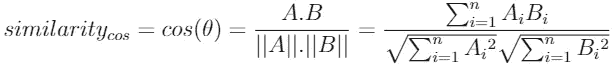

余弦相似度的范围从 1(相反)到 1(共线且意义相同)。相似度高的两个向量通过一个模型容易导致相同的结果。借助 GloVe、FastText 和 Word2Vec 等算法，我们可以获得单词嵌入，帮助模型更好地理解我们的语言，并比使用一次性编码单词的模型给出更准确的结果。然而，这些模型有一个真正的瓶颈，因为它们只考虑了每个单词的一个意思。法语中的“piquer”有很多含义，但是对于这些模型只有一个向量。自 2018 年以来，新的模型已经出现，如著名的埃尔莫，伯特和 XLM。这些模型能够考虑单词的上下文来创建嵌入。不同上下文中的同一个单词不会有相同的相关向量。

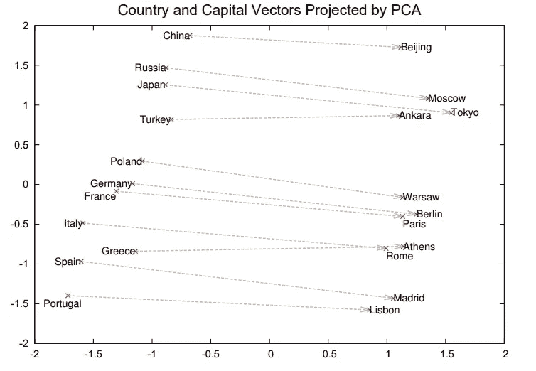

单词嵌入的投影。在这里，巴黎之于法国，犹如柏林之于德国。这叫做“类比”。(【https://arxiv.org/abs/1310.4546】T2

作为这第一部分的结论，这里是带回家的:

对词汇表进行一次性编码可能有效，但会导致稀疏矩阵(昂贵的训练)和正交向量(所有单词都是等价的，没有语义捕获)

单词嵌入旨在捕捉低维向量上的语义和语法

单词之间的相似度通常通过余弦相似度来衡量

# Word2Vec 之前

在 Word2Vec 之前，单词是通过统计进行编码的。SVD(奇异值分解)是对共生矩阵的降维。SVD 然后被用于处理 LSI(潜在语义索引)。LSI 允许术语间相似性、文档间相似性和术语间相似性。

但由于是基于矩阵分解，所以字典变化时矩阵的维数也变化，我们加一个词就要重新计算整个分解。它对词频不平衡也非常敏感，因此我们经常需要对文档进行预处理，以删除停用词并使所有其他词正常化(通过词条化或词干化)。

最后，它非常昂贵，不适合大型词典或语料库。即使它是 2013 年 NLP 的里程碑，Word2Vec 也不是第一个神经语言模型。其中一些自 2000 年就存在了，正如 Bengio 等人概述的那样。一开始，语言模型的目标是在给定一些前面的单词的情况下，预测“下一个”单词。

Bengio 等人[4]首先提出了遵循前馈架构的模型，Mikolov 等人[27]提出了递归神经网络模型来完成这项任务。前馈神经网络语言模型(NNLM)和递归神经网络语言模型(RNNLM)都具有过高的训练复杂度。实际上，Word2Vec 模型的简单性是主要的创新。

# Word2Vec

Mikolov 等人[2] [3]在 2013 年带来了一个高效的单词嵌入实现的创新:Word2Vec。他们首先证明了更浅和更有效的模型 2 允许在更大量的数据上进行训练(速度提高了 1000！).这种效率是通过移除先前架构中存在的隐藏层来实现的。提出了 Word2Vec 的两个版本:连续词包(CBOW)和 SkipGram (SG)。第一种方法基于周围的单词窗口来预测中心单词，第二种方法正好相反:它基于中心单词来预测上下文。这些架构只包含一个隐藏层，这导致了更有效的训练。

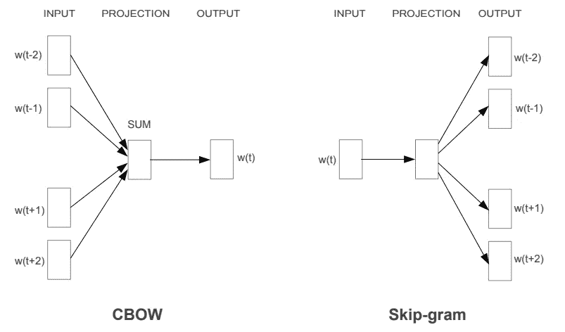

Word2Vec 最著名的人物之一，Mikolov([https://arxiv.org/abs/1301.3781](https://arxiv.org/abs/1301.3781)–2013)的 Skip-Gram 和 CBOW 模型架构

这是连续单词袋的目标函数:

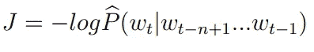

这里，跳跃图的目标函数是:

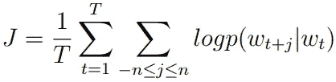

随着这些体系结构的变化，一些技术被开发出来，如频繁词的二次抽样和负抽样，以减少模型中要改变的权重的数量。

论文展示了该模型在相似性任务方面的改进。他们还表明，他们获得了比以前发现的更好的结果，在类比任务上使用神经网络语言模型。许多论文讨论了这些模型如何捕捉线性关系[4] [7]。然而，根据经验，Word2Vec 的嵌入改进了 NLP 中的大多数任务，这足以开创一种新趋势。Mikolov 等人(2013)的 Word2Vec 论文被引用超过 28000 次，这表明了研究人员的浓厚兴趣。然而，Word2Vec 并不完美，期望和现实之间的差距相当大。

实际上，Word2Vec 是一个基于窗口的模型，因此它不能从整个文档中的信息中受益，也不能捕获子词信息，这可能是有趣的，因为从名词或动词派生的形容词拥有共同的信息。此外，Word2Vec 不能处理词汇表以外的单词(OOV)，因为在训练期间没有看到的单词不能被矢量化。模型的输出是一个格式为“/”的文件。最后，Word2Vec 没有解决的另一个问题是解歧。一个词可以有多个意思，这取决于上下文。前三个问题由 GloVe 和 FastText 解决，而最后一个问题由 Elmo 解决。

# 处理子字信息的快速文本

快速文本(Bojanowski 等人[1])是由脸书开发的。它是一种学习单词表示的方法，依赖于 Word2Vec 的 skipgram 模型，并提高其效率和性能，如以下几点所述:

1.训练起来更快更简单。在相似性评估上，FastText 在较小的训练集上给出了比 Word2Vec 更好的结果。

2.它受益于子字信息。如果给出一个单词，比如“part out ”, fast text 会使用这个单词的所有 n 元语法来计算这个单词的分数。例如，对于单词“lapin ”,三个字母的单词是“”

3.由于 n 元语法，它可以从词汇表之外的单词中生成嵌入。OOV 单词向量可以用其 n 元文法的平均向量表示来构建。

实际上，使用 SkipGram，给出单词 t 的上下文的概率通过得分函数 s 由单词向量来参数化:

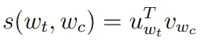

其中 u 和 v 分别取自输入和输出嵌入矩阵。使用 FastText，评分功能变为:

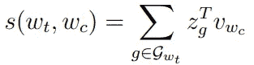

其中 G_wt 是单词 w_t 中 n 元语法的集合，z_g 是第 G 个 n 元语法的向量。v_wc 是上下文单词 wc 的向量。

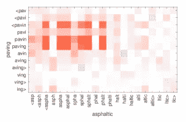

词汇外单词中字符 n-grams 之间相似性的图解。([https://arxiv.org/abs/1607.04606](https://arxiv.org/abs/1607.04606)

x 轴上的单词是 OOV。红色表示正余弦，蓝色表示负余弦。

即使自然语言处理的字符级特征已经是一个研究领域，这篇文章也是第一篇考虑这些特征来构建语言模型的文章。同样，该模型基于预测，而不是基于语料库的统计。此外，它不会根据上下文为每个单词生成多个向量。

# 处理语料库统计的手套

GloVe (Pennington 等人[5])由斯坦福开发，代表单词表示的全局向量。它的目的是调和单词预测模型和整个语料库的单词统计数据。它们提供了一种模型，该模型考虑了语料库的共现统计以及基于预测的方法的效率。

给定单词 i = ice 和 j = steam，我们想要研究与某个探测单词 k = solid 的共现概率的比率。我们可以预期单词 I 和单词 k (Pik)之间的共现在 Pjk 上更大。那里，比率 Pik Pjk 应该很大。

我们用下面的公式来描述这个比率:

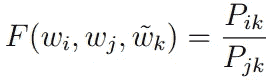

如论文所示，可以简化为:

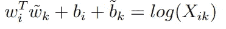

哪个决议与 LSA 和老方法密切相关。

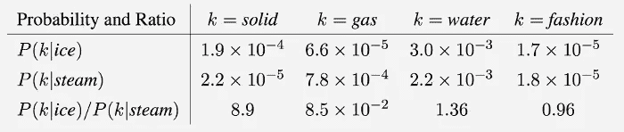

冰和蒸汽在固体、气体、水和时尚中的共现概率和比率。由于冰与固体的关系比蒸汽更密切，所以同现率很高。考虑到探测字 steam，这是相反的。它们都同样与水(高度)和时尚(模糊)相关，所以共现率大约等于 1。(【https://www.aclweb.org/anthology/D14-1162/】T2

其目标是优化以下函数，这是一个最小二乘问题:

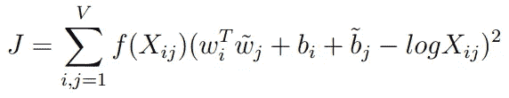

随着

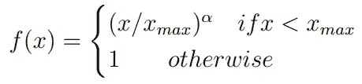

其中 x 是共生矩阵，f 是加权函数，b 是偏差项，wi 是单词向量，w 是上下文向量。

即使 GloVe 在相似性和评估任务上显示出比 Word2Vec 更好的结果，但根据作者的经验，它还没有被证明，使用其中一个或另一个可以导致更好的结果:两者都值得尝试。

# 结论

最后，所有这些模型仍然有用，甚至是前者。只是看你的用途和需求。Word2Vec 在基本模型上仍然非常相关，可以通过取句子中单词向量的平均值(甚至通过它们的 tf-idf [6]分数加权)来用于嵌入句子或文档。找出答案的一个好方法是尝试所有方法，并保留模型在最终任务中获得最佳分数的方法。

# 文献学

[1] Piotr Bojanowski、Edouard Grave、Armand Joulin 和 Tomas Mikolov。用子词信息丰富词向量。计算语言学协会汇刊，5:135–146，2016。

[2]托马斯·米科洛夫、G.s .科拉多、程凯和杰弗里·迪恩。向量空间中单词表示的有效估计。第 1–12 页，2013 年 1 月。

[3]托马斯·米科洛夫、伊利亚·苏茨基弗、程凯、格雷戈·科拉多和杰弗里·迪安。词和短语的分布式表示及其组合性。更正，澳大利亚统计局/1310.4546，2013。

[4]大卫·明诺和劳雷·汤普森。负抽样跳跃图的奇异几何。《2017 年自然语言处理经验方法会议论文集》，2873-2878 页，丹麦哥本哈根，2017 年 9 月。计算语言学协会。

[5]杰弗里·潘宁顿、理查德·索切尔和克里斯托弗·曼宁。Glove:单词表示的全局向量。《自然语言处理中的经验方法》(EMNLP)，第 1532–1543 页，2014 年。

[6]斯蒂芬·罗伯逊。理解逆文献频率:关于 idf 的理论争论。文献期刊，60:503–520，2004 年。

[7] Laura Wendlandt、Jonathan K. Kummerfeld 和 Rada Mihalcea。影响单词嵌入惊人不稳定性的因素。CoRR，abs/1804.09692，2018。