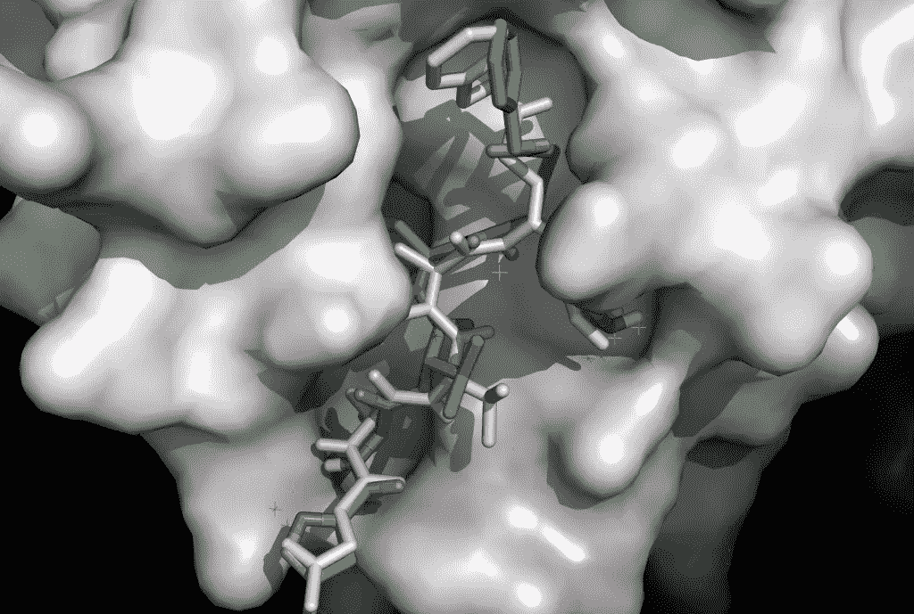
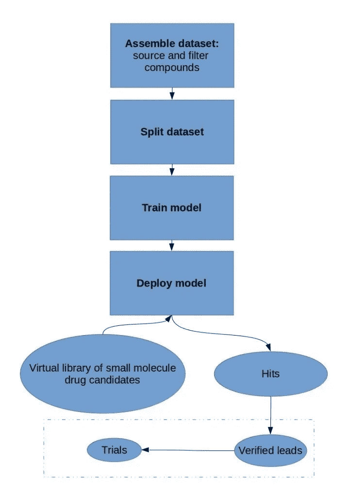
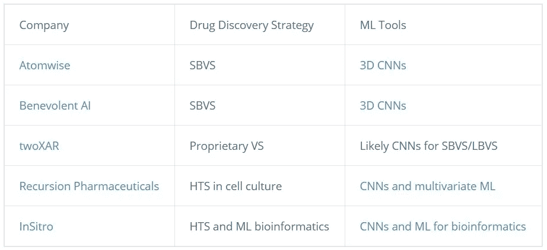

# 模拟的捷径:深度学习如何加速药物发现的虚拟筛选

> 原文：<https://towardsdatascience.com/shortcuts-to-simulation-how-deep-learning-accelerates-virtual-screening-for-drug-discovery-f6d4d3bdb721?source=collection_archive---------62----------------------->

[来源](https://unsplash.com/)

# 药物研发的问题是

众所周知，开发药物是一个艰难的过程。开发一种新药并将其推向市场的成本在[13 亿美元](https://jamanetwork.com/journals/jama/article-abstract/2762311)到近[29 亿美元](https://www.semanticscholar.org/paper/Innovation-in-the-pharmaceutical-industry%3A-New-of-Dimasi-Grabowski/3275f31c072ac11c6ca7a5260bd535720f07df41)之间，这取决于你问谁。许多唾手可得的果实已经被摘下来了，而现代社会不断变化的健康状况加剧了这一挑战。我们的老龄化社会现在比我们的祖先更容易受到心脏病、痴呆症和癌症的影响。

*抑制性配体 N3 与新冠肺炎冠状病毒蛋白酶 Mpro 的模拟对接。颜色为绿色的配体是实际结构(出自* [*金*等 *2020*](https://www.biorxiv.org/content/10.1101/2020.02.26.964882v3)) *)，淡粉色的配体代表对接模拟(使用开源软件*[*Smina*](https://github.com/mwojcikowski/smina)*， [*的一个叉自动对接 Vina*](http://vina.scripps.edu/manual.html) *)。体积卷积神经网络为生物分子的昂贵物理模拟提供了有效的替代方案，* [*深度学习*](https://blog.exxactcorp.com/category/deep-learning/) *药物发现初创公司正在充分利用 CNN 架构。**

多亏了疫苗和抗生素，在过去的 100 年里，传染病导致的死亡率已经大幅下降。即便如此，正如新冠肺炎疫情提醒我们的那样，现代社会的连通性在新病原体传播的速度和普遍性方面产生了明显的挑战。药物研发者也有一个[越来越强的安慰剂效应](https://qz.com/525995/why-the-placebo-effect-is-getting-stronger/)要处理；如果今天进入双盲临床试验，今天使用的许多抗抑郁药和止痛药可能达不到疗效阈值，甚至有创性心脏干预也可能被安慰剂效应混淆[。](https://www.theatlantic.com/health/archive/2017/11/placebo-effect-of-the-heart/545012/)

[深度学习](https://blog.exxactcorp.com/category/deep-learning/)基于动物中枢神经系统连通性的多层人工神经网络的使用，由于深度网络逼近和识别复杂模式的能力，已经取得了越来越大的成功。随着深度学习模型的不断改进，它们经常可以比人类更快地提供结果，并且具有更高(或至少相等)的准确性。因此，在决定如何将神经网络应用于给定问题时，有很多选择。

在药物发现中，用于显微镜的计算机视觉是深度学习可以用来为研究疾病的细胞模型创造巨大代表性空间的一个领域。但其他药物发现初创公司则更进一步，完全避开细胞，甚至跳过生化分析，专注于虚拟药物筛选。

生物化学尺度的物理学，即小分子与生物分子的相互作用，与我们日常经验的世界完全不同。热运动，静电排斥和吸引，是的，大量的量子效应都有助于一个违反直觉的环境，至少对习惯于宏观世界的人类来说是如此。

更不用说生物分子机械的复杂程度超过了人类最复杂的工程项目。仅仅是根据蛋白质的序列蓝图来预测蛋白质的折叠、静态结构，就对生物学来说是一个巨大的挑战([也被深度学习](https://blog.exxactcorp.com/deepminds-protein-folding-upset/)打乱)，在我们宇宙的预计寿命内，很难用蛮力解决。

在他的讲座[“用计算机模拟物理”](https://www.semanticscholar.org/paper/Simulating-physics-with-computers-Feynman/529595f0bbf7d8d38354436f5ce7a3293e66bd05)中，费曼对模拟物理的计算需求的指数爆炸的解决方案之一是使用量子计算机。但是实际上，我们[仍在等待量子优势](https://www.ibm.com/blogs/research/2019/10/on-quantum-supremacy/)，量子计算机可以证明计算非量子计算机不能计算的东西的极限。深度学习同样是一种具有自身组合爆炸的技术，我们已经看到深度神经网络被应用于近似经典物理问题，具有大规模加速和不同程度的成功。正如我们将在这篇文章中探索的，如果处理得当，深度学习是一个很好的选择，可以近似分子生物活动的指数级复杂物理学。

# 虚拟筛选词汇表

**VS/LBVS/SBVS:** 虚拟筛选/基于配体的虚拟筛选/基于结构的虚拟筛选:基于分子特征或结构的候选药物的计算筛选。

**HTS:** 高通量筛选:在细胞培养或生化分析中，使用自动化进行高度平行的实验室筛选实验。

**生物分子:**本帖中，生物分子是指生物大分子，包括脂类(脂肪)、蛋白质、碳水化合物、核酸聚合物等。对于我们的讨论，典型的生物分子药物靶标是蛋白质，它可以在细胞中充当酶、机械致动器和运输或信号分子。

**小分子:**与生物大分子不同，小分子是一种低分子量的有机化合物，如配体，由几十到几百个原子组成。这与单克隆抗体和融合蛋白等蛋白质药物不同，后者大得多，有数百个残基，每个残基由几十个原子组成。

**配体**:一种能与特定生物分子结合的小分子，有可能改变其活性或阻断其功能

**QSAR:** 定量构效关系:生物分子和小分子候选药物的结构与其活性之间的关系，*例如*小分子结合并阻断病毒蛋白酶正常活性的倾向。

# 在药物发现中使用深度学习的方法

药物发现通常是从大量化学库中筛选针对特定靶分子或表型的活性。现代方法与生物勘探中偶然发现药物的时代明显不同，在那个时代，改变世界的发现是保持一个有点凌乱的实验室的事情。

寻找有前途的候选药物的传统方法是通过高通量筛选(HTS)，我们已经谈到自动化和深度学习数据科学如何被用来革新这种方法。为了进一步加快速度，甚至超过实验室实验自动化所能实现的速度，虚拟筛选(VS)提供了一种寻找候选药物的计算方法。

*虚拟药物筛选的工作流程包括熟悉的培训、评估和部署步骤。过滤后的数据集被分割、训练、评估，并用于使用监督学习来训练模型。然后将训练好的模型部署为感兴趣的数据集上的屏幕，取代实验室中物理筛选化合物的艰苦过程。在筛查中发现的阳性结果将由实验室进行验证，如果成功，将进行临床试验。*

在其他实际应用中，数据科学家和深度学习实践者将熟悉虚拟筛选工作流程，无处不在的“数据管理”或数据清洗步骤将被过滤小分子库所取代，以排除可能的假阳性和不切实际的候选药物(*例如*分子太大，无法实际放入生物分子靶标的结合口袋)。

过滤后，在部署到未知的虚拟小分子库之前，使用熟悉的训练、测试和验证分割来训练和评估模型。然后，在进入临床试验之前，可以通过化学、细胞和/或模型生物测定来验证在机器学习屏幕中发现的命中。用于虚拟筛选的数据集可以由对给定靶标具有已知活性的小分子的化学和分子性质的库组成，或者在更一般的情况下，由靶标和候选药物的结构信息组成。

# 虚拟筛选的两大策略

虚拟筛选的两种主要策略分别称为基于配体和基于结构，或 LBVS 和 SBVS。基于配体的 VS 将小分子的分子和化学性质作为输入，并基于与该靶标的已知活性化合物的相似性，预测该化合物是否对该靶标有活性。基于结构的虚拟筛选依赖于药物靶标和小分子的结构信息，将两者放在一起进行模拟，并预测它们是否会结合。

虽然虚拟筛选的两种方法都比实验室分析的高通量筛选少得多，但 LBVS 通常是一个更容易解决的问题，并且计算速度更快。另一方面，LBVS 需要包含已知活性化合物的训练数据集。这可能看起来违反直觉，因为这意味着对已经具有已知活性化合物的目标进行药物筛选，但这可能是可取的，例如，为了找到副作用减少的替代疗法。

基于结构的筛选更普遍，SBVS 通常是在位于蛋白质靶结合口袋中的小分子的物理模拟中完成的。拟合优度是根据原子之间的距离及其静电相互作用等特征来评估的。就深度学习实践者可能更熟悉的术语而言，LBVS 类似于对输入特征向量的训练，并基于[虹膜数据集](https://en.wikipedia.org/wiki/Iris_flower_data_set)的花瓣宽度和长度提出了分类问题的放大版本。

SBVS 与原始像素作为输入的图像分类任务更密切相关，例如 [MNIST 手写数字数据集](https://en.wikipedia.org/wiki/MNIST_database)。因此，SBVS 非常适合能够以端到端的方式学习显著特征的机器学习模型，毫不奇怪，深度人工神经网络非常适合这项任务。虽然深度学习模型可以用来拟合 LBVS 数据集，[过度拟合是一个主要问题](https://www.ncbi.nlm.nih.gov/pubmed/32161539)，而更浅层和更传统的机器学习技术，如支持向量机往往擅长 LBVS。

基于从原始像素到计算机视觉的类比，我们可以期望 SBVS 受益于卷积神经网络中共享权重的空间不变性和局部性特征。事实上，使用 3D 卷积核来匹配生物分子结构数据的维度，卷积神经网络，如来自 [Atomwise](https://www.atomwise.com/) 的 [AtomNet](https://arxiv.org/abs/1510.02855) 和来自 Benevolent AI 的[deeply through](https://benevolent.ai/deeply-tough)可以通过评估小分子来筛选数百万至数十亿的潜在候选药物，因为它们适合蛋白质药物靶标的结合口袋。

与更常见的将输入数据乘以滑动方形窗口的 2D 卷积网络一样，3D 卷积网络通过将输入数据和隐藏层乘以滑动立方体窗口来构建隐藏的要素层。

# 监督学习是目前虚拟筛选药物发现的主要方法

*用于结构数据的卷积，其中 2D 像素式卷积核由体素式 3D 核代替。*

监督学习是工业 ML 中的主导方法，它是与虚拟筛选药物发现最相关的范式。在实践中，如果你没有足够大小和质量的数据集，开发一个出色的神经网络架构是不够的。为了克服过度拟合的重大障碍，即模型的拟合能力与训练数据集的规模和复杂性不匹配，VS 初创公司已经转向与老牌制药公司合作。像 [ZINC](https://zinc.docking.org/) 和 [Pubchem](https://pubchem.ncbi.nlm.nih.gov/) 这样的公共数据集可以用于 VS，但制药公司往往有自己的大规模专有数据集，放大了传统制药公司和机器学习初创公司之间合作的价值主张。

例如，Atomwise 培养了众多的制药合作伙伴，包括查尔斯河实验室，礼来公司和拜耳。同样，[两家合作伙伴包括 SK 生物制药公司和小野制药公司，而](https://www.twoxar.com/) [Beneveolent AI](https://benevolent.ai/) 与诺华制药公司和阿斯利康公司有协议。学术合作也很重要，Atomwise 的学术合作伙伴包括斯坦福大学王新南教授实验室的一个头条项目，这一努力在 2019 年取得了重大进展，显示了领先的网络[预测候选药物缓解了帕金森病的症状](https://med.stanford.edu/news/all-news/2019/09/scientists-find-potential-diagnostic-tool-treatment.html)并改善了果蝇模型中的生物标志物。

# 人工智能/深度学习在药物发现中的未来是什么？

现代机器学习的灵活性，也就是深度学习，意味着有许多不同的领域可以应用深度 conv 网络。从应用于结构化数据的 3D 卷积网络，到在 LBVS 数据集上训练的多层感知器，甚至是利用生成对抗训练和强化学习的模型，基于机器学习的药物发现并不缺乏不同的方法。

对于大多数这些应用，深度神经网络采取了一种预测捷径，否则将需要昂贵的实验室分析或复杂的多线程物理模拟。在计算资源方面，神经网络不仅可以加快预测速度，还可以将计算要求转移到更依赖于神经网络原语已优化的高性能 GPU。

这种转变使药物发现和开发能够利用 PyTorch 和 Tensorflow 等基于张量的深度学习库的成熟发展。就像将分子装配在一起的指数级复杂问题一样，设计一个人工智能支持的工作流程需要从过多的选项中进行选择。