# 使用深度学习的最短路径距离近似:Node2Vec

> 原文：<https://towardsdatascience.com/shortest-path-distance-with-deep-learning-311e19d97569?source=collection_archive---------20----------------------->

## 实施研究论文“使用深度学习技术的最短路径距离近似”

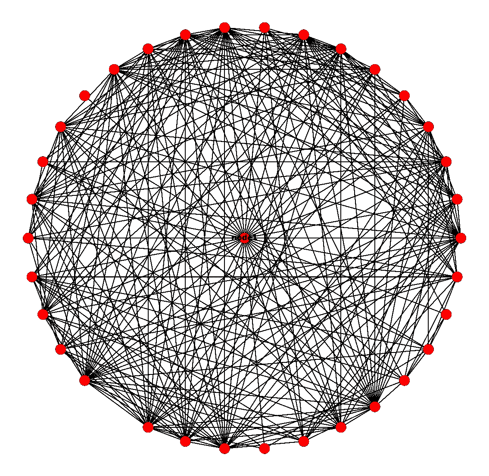

此处使用的图形数据集的子图

本文是一篇名为“[使用深度学习技术的最短路径距离近似法](https://arxiv.org/abs/2002.05257)”的研究论文的实现，作者在文中解释了一种新的方法来近似一个图的节点之间的最短路径距离。我将解释这篇论文和我的实现。你可以在我的 GitHub 账户[这里](https://github.com/nayash/shortest-distance-approx-deep-learning)找到这个项目。首先，我将概述本文中提出的方法，然后我们将讨论本文中用来解决问题的一些概念，最后是实现。

## 1.报纸上说什么了？

**1.1 动机:**当我们有传统的精确方法如 Dijkstra's 和 A*算法时，为什么我们需要使用深度学习来*近似节点间的*距离？这些传统算法的问题是，它们在非常大的图上运行缓慢，并且会消耗大量内存来存储预先计算的距离。因为对于大多数应用来说，实际距离的近似值已经足够好了，所以它鼓励人们探索各种方法来近似距离。还有，神经网络一旦训练完毕，推理时间(寻找节点距离)是常数( *O(1)* )。

**1.2 算法:**既然知道了'*为什么'*，那就来看看'*如何'。*本文使用了另一篇优秀论文 [node2vec:网络的可扩展特征学习](https://arxiv.org/abs/1607.00653)中提出的思想。事实上，我要说的是，本文中使用的一些思想在 Node2Vec 论文中已经提出了(例如，在 Node2Vec 论文中提出了使用二元操作符来表示使用相应节点嵌入的边，在本文中扩展为表示路径。我们将在后面讨论嵌入)。本文更多的是 Node2Vec 的一个应用。Node2Vec 本身就是 [Word2Vec](https://en.wikipedia.org/wiki/Word2vec) 的扩展。Word2Vec 是一种用向量空间中的嵌入(数字向量)来表示单词的算法，使得语义相似的单词彼此更靠近。这本身就是一个迷人的话题。

以下是建议方法的总结:

1.  收集您的图表数据。
2.  使用 Node2Vec 算法为每个节点寻找节点嵌入。我们不需要从头开始写这个算法。作者提供了一个[实现](https://github.com/aditya-grover/node2vec)。
3.  使用图中一定数量的节点作为他们所谓的“地标”，并计算它们与所有其他节点的距离。现在你有了形式的样本((landmark_i，node_x)，distance)。
4.  对于上面找到的每个样本，获取界标和节点的相应节点嵌入，并且将它们与任何合适的二元运算符(平均、逐元素乘法等)组合。).所以现在你应该有形式的样本(嵌入，距离)。
5.  现在你有了输入输出对，所以你做你最擅长的。找一个好的神经网络配置，训练出模型的地狱。但我们稍后会看到，就像一般的人工智能一样，这并不容易。

## 2.履行

该项目包含以下文件夹:

数据—包含程序使用的所有数据，包括下载的和处理的数据。

输出—保存所有输出，包括文本日志、tensorboard 日志、模型备份等。

src —源代码放在这里。

测试——任何相关的测试用例

**注意:**请注意，对于这个项目，我主要是在笔记本上工作，因为它涉及到许多探索和各种方法的实验。因此，工作并不完美，因为我还在探索更好的方法。我已经尽我所能解释了这些细胞。如果有不清楚的地方，请随时联系我。

**2.1 数据**

我在这里使用了[的脸书数据集](http://networkrepository.com)。下载的图形数据为“ [mtx](http://networkrepository.com/mtx-matrix-market-format.html) 格式。这只是共享矩阵数据的另一种格式。看起来是这样的:

```
%%MatrixMarket matrix coordinate pattern symmetric
6386 6386 217662
195 1
414 1
458 1
474 1
510 1
.
.
.
```

第一行称为“header”并定义了一些属性，这些属性用于决定如何解析文件以形成矩阵。它下面的线(大小线)定义了数据的大小。标题总是以“%%MatrixMarket”开头，其后的四个字段是对象、格式、字段和对称性。对象字段可以是“矩阵”或“向量”(在我们的例子中是矩阵)，格式可以是“坐标”或“数组”。“坐标”格式在 mtx 文件中仅存储非零值，因此“大小线”保持矩阵中的行数、列数和非零条目数。如果格式为“数组”，则“尺寸线”的格式为[行数和列数]。下一部分是“数据行”，它保存实际的数据。如果格式是“坐标”,则有“非零条目数”数据行数，否则在“数组”的情况下，您应该期望{行数*列数}数据行数，其中每一行表示两个节点之间的一条边。对于加权图，数据线可以具有第三列“边权重”。其余的细节可以在上面的“mtx”链接中找到。我分享这些信息是为了让您对它有一点了解，这样如果您面临解析错误，您可以编写自己的实现。大多数时候我们可能不需要，因为 Scipy 支持读/写 mtx 格式。但是这里我们需要首先将 mtx 转换成 edgelist 格式，因为 [Networkx](https://networkx.github.io/) (我用来处理图形数据的包)和 Node2Vec 脚本都使用这种格式。

Edgelist 只是去掉标题、注释和大小行后的数据行，就像这样:

**2.2 构建节点嵌入**

为了计算图中的节点嵌入，我们将使用 Node2Vec 作者提供的脚本。但是让我先简单介绍一下这个算法，因为它很有趣，也因为它是我们在这里所做的事情的一个重要部分。即使我们不必实现算法，也不应该阻止我们学习它。但是您可以选择跳到下一部分。

**2.2.1 节点 2Vec**

其思想是对图中每个节点的邻域进行采样，也称为“行走”(这是一种有趣的说法:收集附近的节点)，将访问过的节点的列表转换为字符串(这样现在您就有了形式的样本([附近节点的列表，作为包含源节点的字符串]))，然后将所有这样的列表传递给 Word2Vec 模型来训练和学习嵌入，就像我们对句子列表进行训练一样。但是 Node2Vec 最好的部分是它如何对邻居进行采样。作者认为，像 BFS 和 DFS 这样的经典方法位于光谱的两个相反的末端。BFS 倾向于对更靠近源节点的节点进行采样，这使得所学习的嵌入更好地捕捉节点的结构相似性(例如，节点是否在其邻域中充当中枢/中心)。但它只对图表的一小部分进行了采样。另一方面，DFS 倾向于对远离源的节点进行采样，因此从这种“行走”中学习会导致嵌入，这种嵌入更好地捕捉图形的宏观视图(连通性和“同质性”,如本文中所述),但不能捕捉更精细的细节，因为行走是有限长度的，并且它们有许多要覆盖的基础。

因此，他们提出了一种新的采样节点邻域的方法，称为“二阶随机游走”。为了更清楚，我们做这些只是为了以可控的方式对节点邻域进行采样，以便遍历包括 BFS 和 DFS 的质量。让我们考虑固定长度的步行'*c '*'*l*'，并假设您已经从节点' *u'* 开始步行。假设您已经从节点 *t* 行进到 *v* 。他们使用以下概率分布，而不是随机或基于权重边缘选择下一个节点:

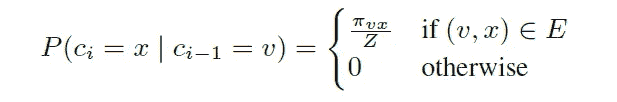

下一个节点的 PD，来自 node2vec 纸张

这意味着如果遍历中的前一个节点是 *v* ，那么下一个节点是 *x* 的概率由 pi_{vx}/z 给出(不能使用内联 latex，因为每次编辑内容时 Medium 都会搞砸它)，如果节点 *v* 和 *x* 通过边连接，则为 0。pi_{vx}是未规格化的转移概率， *z* 是规格化常数(可以是来自节点 *v* 的所有边的概率的总和)。他们将 pi_{vx}定义为:

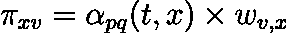

非规格化概率修正:应该是 pi_{vx}

其中 w_{vx}是节点 *v* 和 *x* 之间的边的权重，并且$\alpha_{pq}(t，x)$是:

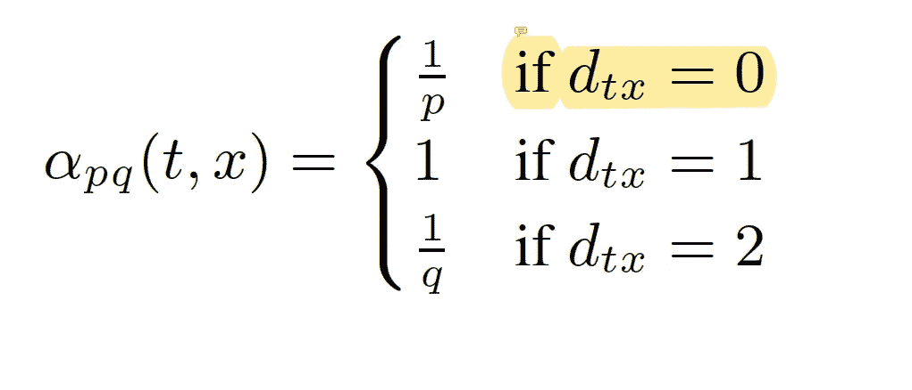

阿尔法的定义

其中 d_{tx}是 *t* 和 *x* 之间的最短路径距离。让我们来理解一下 *p* 和 *q* 的作用，因为这是控制随机游走(BFS 或 DFS)性质的两个参数，因此有术语“二阶随机游走”。

如果我们稍微回顾一下，我们从节点 *t* 到达节点 *v* ，现在我们需要从 *v* 决定下一个要访问的节点。如果您将 *p* 设置为一个较低的值，那么行走会更喜欢重新访问先前的节点。你会问，怎么会？假设你已经从 *t* 到达 *v* ，现在你有以下选项——去 v 的其他邻居(x1，x2…xn)或者回到 *t* (别忘了‘t’也是邻居)，在这种情况下 d_{tx}为零，因为这里的 x 是 *t* 本身(对应于上式中的第一个选项 1/p)。因此，如果 *p* 是一个非常低的值，那么 1/p 将会非常大，随机漫步将会返回到先前的节点，从而模拟 BFS 的行为。请参考下面的(丑陋的)图片来形象化这一点:

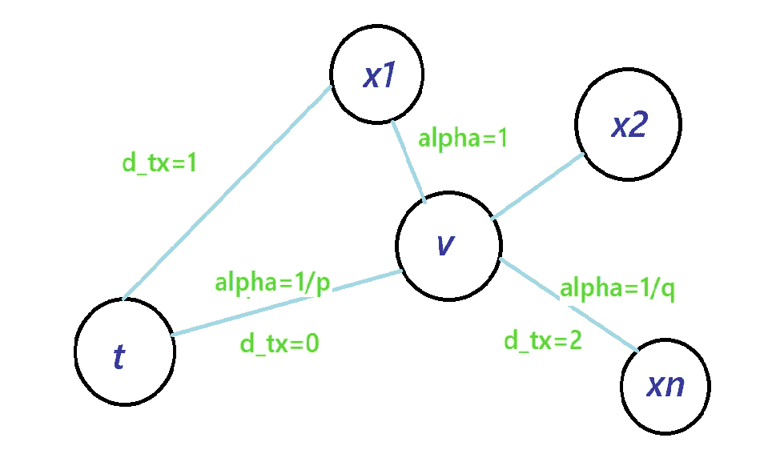

随机漫步:“v”处的下一个节点决策

这张纸有一个相似的图像，但没有距离值。类似地，如果我们为 *q* 选择一个较低的值，那么我们通过将较高的概率分配给定义α的等式中的第三个选项，鼓励算法冒险远离 *t* 。对遍历中的每个节点都进行这种决策。这样走了几次。

如果你理解了上面的解释，你就知道 node2vec 随机漫步是如何工作的了。你也可以在作者的 GitHub 库上查看它的实现(但是是 python 2 格式的)。在我的项目中，我也包含了作者的脚本，但是转换成了 Python3 格式。

2.2.2 运行 node2vec 脚本

运行脚本非常简单。您可以选择使用其参数的所有默认值运行，或者根据您的需要进行更改。我用默认值运行:

```
python node2vec/main3.py --input ../data/socfb-American75.edgelist --output ../data/emb/socfb-American75.emd
```

只需修改输入和输出路径。

**2.3 构建数据集**

在上一步中，我们有一个包含节点及其嵌入的文件，格式如下:

```
6386 128224 0.3206627 -0.0963422 -0.039677385 -0.03290484 0.4414181 ....4046 -0.036134206 -0.082308784 0.49080133 -0.36878866 0.13950641 ...
.
.
.
```

前两个数分别代表节点数和嵌入维数。我们的下一步是在图中选择一定数量的节点作为界标，并计算它们与所有其余节点的距离。这将给我们(界标数*(节点数-1))个样本。我们选择地标是因为寻找所有节点的距离需要更多的计算。

查找每个节点与所选标志点节点的距离

“distance_map”字典保存每个节点到给定地标的距离(作为关键字)。现在我们需要为每个节点/界标对获取相应的 node2vec 嵌入，并将它们组合起来形成一个单独的嵌入。

组合节点和标志嵌入

这里的 *emd_map* 是一个字典，它将每个节点作为键，并将它的嵌入作为值。

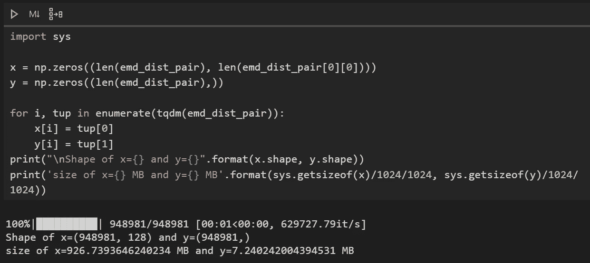

从嵌入距离字典形成数组

接下来，我们需要从嵌入距离字典中形成 numpy ndarrays，如上所示。请注意上面单元输出中的两件事—样本数不等于界标数*(节点数-1)。这是因为我忽略了具有 *inf* 距离的节点对，即没有路径连接它们。其次，训练数组的大小很大，大约为 927MB，因为它是“float64”类型的数组。为了节省空间，我把它们改成了 float32。

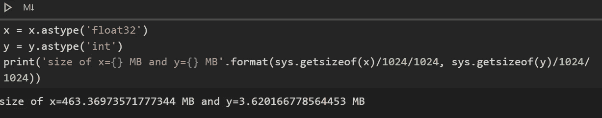

转换为 float32

如您所见，我们可以节省大约 50%的空间。如果您担心这种转换会导致精度损失，可以验证数据损失:

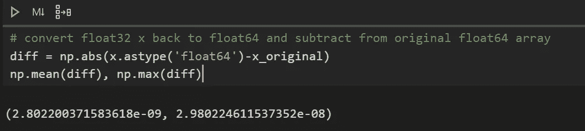

测量精度损失

这似乎无关紧要。接下来，让我们看看目标变量的分布。

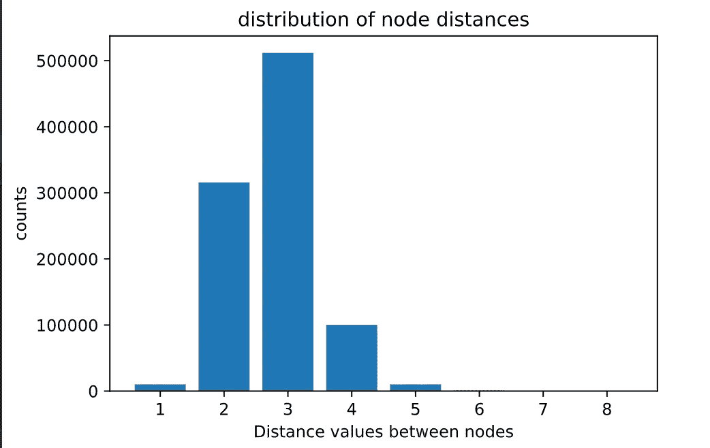

距离值的分布

如您所见，距离值 2 和 3 实际上主导了数据。在图表上，6、7、8 看不到，但它们出现在数据中，只有距离为 8 的样本被我丢弃了。还要注意，在论文中，他们忽略了距离值为 1 的样本，但我已经将它们包括在训练中。

由于数据严重不平衡，我对培训/测试进行了分层:

…然后将其规范化:

我已经保存了分割数据，这样预处理就可以只进行一次。咻！！数据集的形成是这个项目的一大部分，最后我解释了主要步骤。我可能漏掉了一些，更多细节你可以查看项目库中的 [data_prep.ipynb](https://github.com/nayash/shortest-distance-approx-deep-learning/blob/master/src/data_prep.ipynb) 。

**2.4 训练神经网络**

现在是激动人心的部分。训练的代码在 [train.ipynb](https://github.com/nayash/shortest-distance-approx-deep-learning/blob/master/src/train.ipynb) 文件中。你会注意到一些单元格看起来没有完成/自记。我特意留下这些，让感兴趣的读者从我失败的尝试和每次失败后采取的步骤中获得经验。我甚至已经将 [tensorboard 日志](https://github.com/nayash/shortest-distance-approx-deep-learning/tree/master/outputs/logs/runs)(包括所做的更改、结果、注释等)上传到 GitHub repo 中，以便我和其他人以后可以使用所有的历史记录。如果您对日志不感兴趣，可以毫无问题地删除文件夹。

由于数据是倾斜的，我必须对少数目标值进行过采样(我在这里没有使用术语“类”，因为我已经训练了一个回归模型)。

我首先对多数值进行欠采样，然后对少数值进行过采样。直觉上是对少数距离值进行过采样，使其与多数值的样本数量相当，同时保持总体数据尽可能小。分数值“0.7”实际上不是从任何地方计算/得出的，只是通过查看每个距离值的频率看起来是合理的。是的……不要忘记在过采样/欠采样后重排数据。这似乎是一件微不足道的事情，你可以忽略，但事实证明，许多批次的距离值相同(如全是 1 或 2 等)，这使得训练无法进行！

现在，让我们定义一个基线，一个简单的模型及其结果，我们可以与它进行比较，看看我们做得有多好:

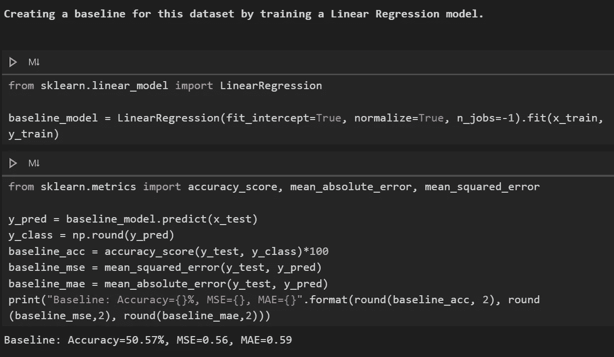

使用线性回归设置基线

线性回归做得出奇的好！考虑到这种情况下的概率预测值约为 14% (1/7)，50%是一个比较好的基线。

**PyTroch 型号**

对于我以前的所有项目，我都使用 Keras，但最近我改用 PyTorch，从那以后我就没有后悔过。我在做另一个项目，涉及到编写一个定制的损失函数，需要对模型中间层的输出和其他定制的东西进行一些计算。如果你曾经尝试过 Keras 的这些东西，你就会知道这并不简单。即使有急切的执行，我也不能让它工作。更糟糕的是，在一个晴朗的日子，Keras 开始抛出 CUDA 兼容性错误，无论我用所需的驱动程序构建了多少次新环境，它都不会消失。这是我的转折点。使用 PyTorch，您可能需要为训练循环编写一点额外的代码，但这是值得的。现在，我不是说这些问题不能通过更多的努力来解决，但是，在一个有 PyTorch 的世界里，为什么打破你的头呢？所以，我对我为什么转而使用 PyTorch 的咆哮到此结束。

但是对于不熟悉 PyTorch 的读者来说，不要灰心。几乎所有使用的组件都可以在 Keras 中获得(除了可能是循环 LR 调度器，但是有它的实现可以使用)。解释 PyTorch 超出了本文的范围。

给出最佳结果的模型具有以下配置(具有循环 LR 调度器、RMSProp 优化器和泊松损失):

```
**{'batch_size': 1000, 'input_size': 128, 'hidden_units_1': 200, 'hidden_units_2': 100, 'hidden_units_3': 50, 'do_1': 0.2, 'do_2': 0.1, 'do_3': 0.05, 'output_size': 1, 'lr': 0.001, 'min_lr': 1e-05, 'max_lr': 0.001, 'epochs': 500, 'lr_sched': 'clr', 'lr_sched_mode': 'triangular', 'gamma': 0.95}**
```

这是一个有辍学的 5 层(3 个隐藏层)模型，用循环学习率训练。

如果我在此之后尝试了其他配置，你可能在 GitHub 代码中找不到这个型号，因此参数可能会改变。但是你可以在 [**run47 文件夹**](https://github.com/nayash/shortest-distance-approx-deep-learning/tree/master/outputs/logs/runs/run47_smallerNN_noDO) 中找到相应的型号和参数。请注意，这种配置不同于他们在论文中提到的配置。正如我读过的几乎所有其他论文一样，他们跳过了神经网络的低级细节。

以下是如何为训练/验证/测试数据初始化数据加载器:

现在我们已经准备好训练模型了:

还只做过 Keras/Fastai 的人，不要害怕。训练 PyTorch 模型的代码并不总是这么大。我正在做很多其他的事情，比如提前停止，保存检查点等等。肯定比 Keras 复杂，但没什么一两天学不会的。但正如我之前提到的，所有这些组件都已经在 Keras 中存在(包括泊松损失)，因此您可以轻松地在您选择的框架上进行尝试。

我训练了大约 110 个时期的模型。

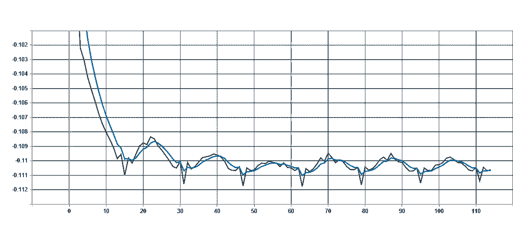

结果如下:

**泊松损失= -0.11
MAE 损失= 0.32
MSE 损失= 0.17
准确度= 76.40%
vs
基线:
MAE 损失= 0.59
MSE 损失= 0.56
准确度= 50.57%**

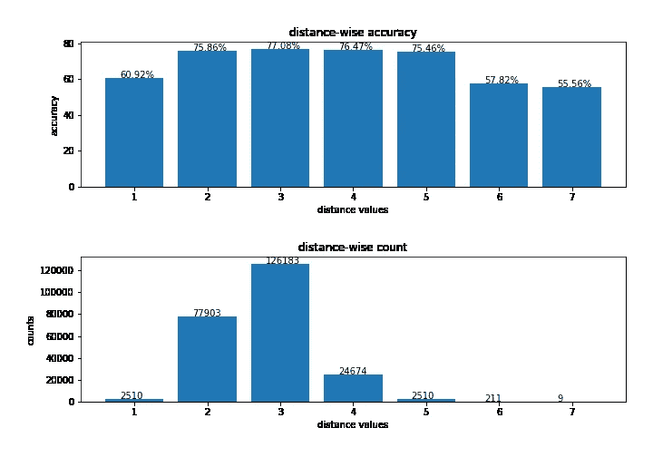

虽然这是一个回归问题，但我仍然记录了准确性，因为我发现它更直观(它不是一个指标，只是我用来比较模型的东西)。这不是一个值得夸耀的结果，但也不坏。此外，我认为还有很大的改进余地，我将在后面提到这一点。

如果你想知道为什么路径距离越长准确性越差，作者也做了类似的观察。他们是这样说的:

> 观察到利用 node2vec 嵌入的较长路径导致的较大误差。一方面，在训练集中，我们没有足够的样本用于更长的距离。另一方面，node2vec 无法学习远处节点的结构特征。

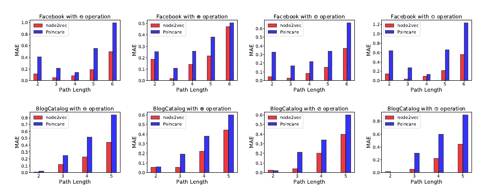

论文的结果。请注意，路径距离越长，误差值越大。

注意:这个模型有一点让我很困扰。尽管使用 exp_range 作为 CLR 模式，学习率在整个训练中没有变化(至少按照图)。伽玛值为 0.95 时总是会发生这种情况。需要调查一下。或者你之前也面临过这种情况，有什么解决办法，欢迎在这里分享。

回想起来，以下是提高模型性能的一些因素:

1.  泊松损失:我之前尝试过 MSE 和 MAE(论文中使用的)，但是两者都不行。
2.  批量正常化:批量正常化之前训练损失改善真的很慢。在 batch norm 之前，我在达到这些数字之前至少训练了 1000 个纪元。
3.  欠采样/过采样
4.  循环 LR 调度程序
5.  StandardScaler 代替 MinMaxScaler
6.  将优化器从 SGD 更改为 RMSProp(本文中使用的是 SGD)

**3。进一步改进**

有很多事情可以探索，因此需要很大的耐心。以下是一个不完整的列表:

1.  更好的超参数:尤其是学习率范围和不同的网络架构。
2.  尝试对这些数据使用卷积神经网络。我很肯定这会改善结果。
3.  不同的 node2vec 嵌入维度(我们用的是 128)。
4.  您可能还记得，我们使用“平均”运算符来组合两个节点的嵌入。我们可以试试其他运营商。在论文中，作者观察到—

> “二元运算符在不同的数据集和不同的维度大小上没有一致的行为。例如，在脸书图中，平均算子优于其他算子，而串联在 Youtube 数据集上效果更好”

5.特性选择:我们可以通过只选择重要的特性来减少特性的数量。(文中未使用)

6.更好的采样技术:如 KMeansSMOTE、SMOTE、聚类质心等。我试着使用这些技术，但是它们花了太长时间来完成。

7.训练损失和 val 损失差距较大，建议减少过拟合以获得更好的结果。也许可以试试小一点的模型，看看它是否有学习能力。

**4。结论**

嗯，这已经是一篇长文了，所以我就不啰嗦了。这是一个有趣的项目，有很多很酷的概念需要学习。我不能在这里容纳他们中的许多人，但我已经记录了并将记录更多关于这个问题的有趣事实，当我发现它们时，在项目的 [fun.ipynb](https://github.com/nayash/shortest-distance-approx-deep-learning/blob/master/src/fun.ipynb) 文件中。谢谢你坚持到最后。编码快乐！