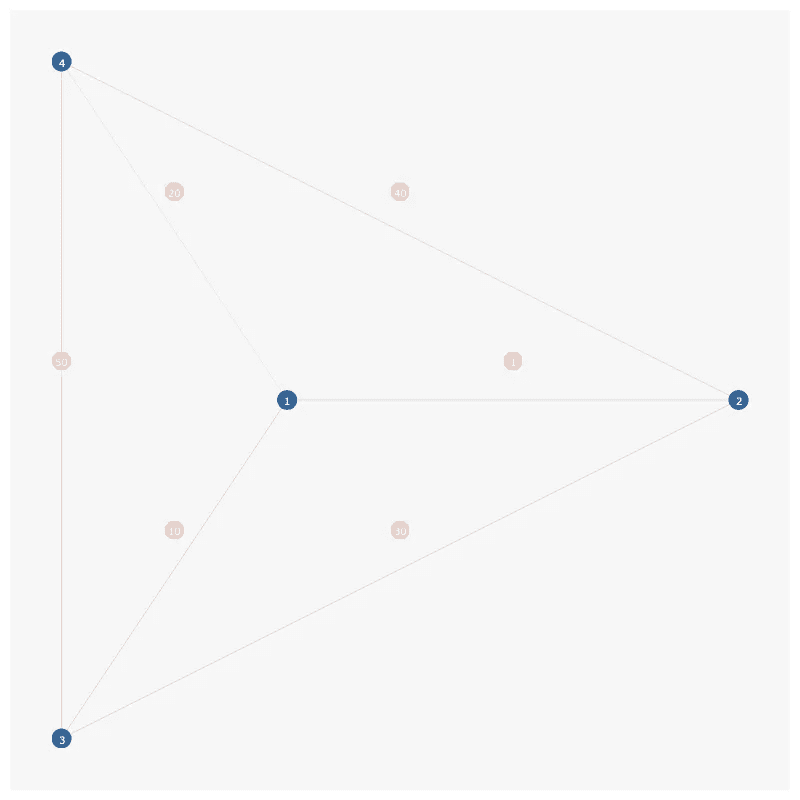
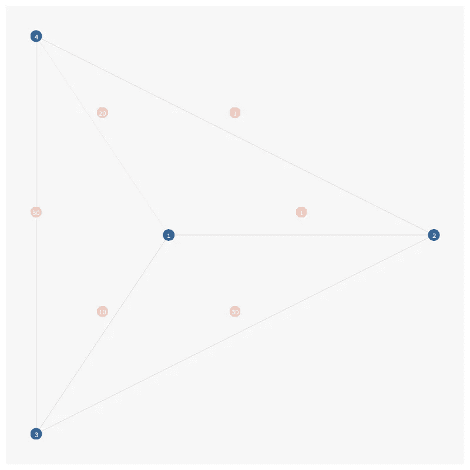
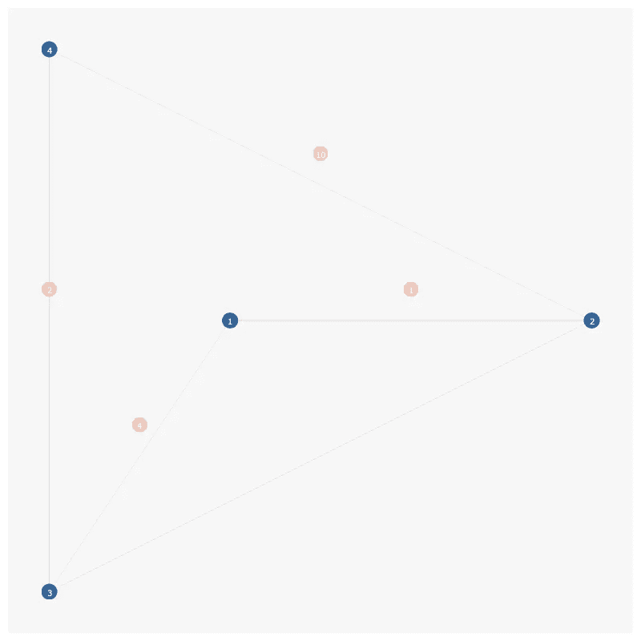

# 最短路径和 Dijkstra 算法

> 原文：<https://towardsdatascience.com/shortest-paths-and-dijkstras-algorithm-68c9ec30eff0?source=collection_archive---------24----------------------->

## 地球上最经典的图形算法，解释。



这个问题的经典表述是:

如果给我一个节点图，每个节点都与其他几个节点相连，并且连接的距离不同，那么从图中的一个节点开始，到图中每个节点的最短路径是什么？

# 深度优先

为了实现 Dijkstra 算法，我们首先需要定义一个节点和一条边:

```
class Node:
    def __init__(self, value):

        self.value = value
        self.edges = set()

        self.distance = -1

    @staticmethod
    def add_edge(a, b, dist):
        a.edges.add((b, dist))
        b.edges.add((a, dist))
```

在本例中，我定义了一个节点，它包含一个值(基本上是一个 id)，一个初始化为-1(无穷大)的距离。此外，该节点包含一个边列表，每个边都是该边连接到的目标节点(自自身)和到目标节点的距离的元组。

那么，我该如何填充从一个起始节点到图中每个节点的最短距离呢？

实际上很简单。在起始节点，我将其距离更新为 0，并且对于该节点具有的每条边，如果目标节点未被访问(距离= -1)或者目标节点的当前距离大于新距离，我递归地将目标节点的距离更新为当前节点的距离加上边距离:

```
def update_distance(self, dist):

    if self.distance < 0 or dist < self.distance:

        self.distance = dist
        for e in self.edges:
            e[0].update_distance(dist + e[1])
```

将所有这些与一个示例图放在一起:


节点= [1，2，3，4]
边= [(1，2，1)，(1，3，10)，(1，4，20)，(2，3，30)，(2，4，40)，(3，4，50)]

```
class Node:
    def __init__(self, value):

        self.value = value
        self.edges = set()

        self.distance = -1

    @staticmethod
    def add_edge(a, b, dist):
        a.edges.add((b, dist))
        b.edges.add((a, dist))

    def update_distance(self, dist):

        if self.distance < 0 or dist < self.distance:

            self.distance = dist
            for e in self.edges:
                e[0].update_distance(dist + e[1])

def create_graph1():

    node1 = Node(1)
    node2 = Node(2)
    node3 = Node(3)
    node4 = Node(4)

    Node.add_edge(node1, node2, 1)
    Node.add_edge(node1, node3, 10)
    Node.add_edge(node1, node4, 20)
    Node.add_edge(node2, node3, 30)
    Node.add_edge(node2, node4, 40)
    Node.add_edge(node3, node4, 50)

    return [node1, node2, node3, node4]

def print_nodes(nodes):

    print('print nodes --')
    for node in nodes:
        print(f'value: {node.value}, distance: {node.distance}')

nodes = create_graph1()
nodes[0].update_distance(0) # set start node distance 0
print_nodes(nodes)'''
print nodes --
value: 1, distance: 0
value: 2, distance: 1
value: 3, distance: 10
value: 4, distance: 20
'''
```

现在，如果我将从节点 2 到节点 4 的距离更新为 1，那么节点 4 的最短距离应该是 2，因为现在我可以从节点 1 到 2，然后从 2 到 4，距离为 2。我们来看看是不是这样:



节点= [1，2，3，4]
边= [(1，2，1)，(1，3，10)，(1，4，20)，(2，3，30)，(2，4，1)，(3，4，50)]

```
def create_graph2():

    node1 = Node(1)
    node2 = Node(2)
    node3 = Node(3)
    node4 = Node(4)

    Node.add_edge(node1, node2, 1)
    Node.add_edge(node1, node3, 10)
    Node.add_edge(node1, node4, 20)
    Node.add_edge(node2, node3, 30)
    Node.add_edge(node2, node4, 1)
    Node.add_edge(node3, node4, 50)

    return [node1, node2, node3, node4]nodes = create_graph2()
print_nodes(nodes)
nodes[0].update_distance(0)
print_nodes(nodes)'''
print nodes --
value: 1, distance: 0
value: 2, distance: 1
value: 3, distance: 10
value: 4, distance: 2
'''
```

看起来有用！

# 性能分析，深度优先

那还不算太糟，是吗？

但是让我们暂停一下，想想这个过程需要多长时间。

从起始节点开始，如果起始节点连接到所有其他节点，那么 update_distance 中的第一个循环是 O(n-1)，其中 n 是图中的节点数。在 update_distance 内部，我们在连接的目标节点上递归调用 update_distance，在最坏的情况下，目标节点也可能连接到所有其他节点，并且只有一条边保证不会被遍历(与当前节点的边)，因此第二次递归 update_distance 是 O(n-2)。

至此，不难认识到整体算法的复杂度为 O((n-1) * (n-2) * … * 2 * 1) = O(n！)在最坏的情况下。不太好。

# 最小堆

看起来我们有一些改进要做，这就是 Dijkstra 算法要做的。

从一个很巧妙的观察就能理解算法。在上面的图 2 中，节点 1 直接连接到节点 2、3、4。其中最小的距离是到节点 2 的距离，为 1。现在你知道到节点 2 的最短距离最多是 1，还能再短一点吗？答案是否定的，因为从节点 1 到节点 2 的任何间接路径都必须经过节点 3 或节点 4，这两个节点的距离都大于 1。

这是一个非常重要的见解，因为这意味着在处理完节点 2 之后，我不必再查看节点 2，因为知道到节点 2 的最短距离是 1。这避免了检查从节点 1 到节点 3 到节点 2 的距离的冗余，因为我们肯定知道该距离将大于节点 2 的现有距离。

为了实现这一点，我们采用了最小堆数据结构。它的实现可以有很大的不同，但是操作很简单，我可以把任何对象放到它上面，当我请求堆返回一个对象时，它总是返回带有最小关联键的对象。

以下是 Dijkstra 算法的最小堆实现:

```
import heapq as hq

class Node:
    def __init__(self, value):

        self.value = value
        self.edges = set()

        self.distance = -1
        self.visited = False

    @staticmethod
    def add_edge(a, b, dist):
        a.edges.add((b, dist))
        b.edges.add((a, dist))

def calc_distance(start):

    h = []

    start.distance = 0

    hq.heappush(h, (start.distance, start))

    while len(h) > 0:

        cur = hq.heappop(h)

        # check if the nodes has been updated
        if cur[0] != cur[1].distance:
            continue

        for e in cur[1].edges:
            new_distance = cur[1].distance + e[1]

            if e[0].distance < 0 or new_distance < e[0].distance:
                e[0].distance = new_distance
                hq.heappush(h, (new_distance, e[0]))

def create_graph1():

    node1 = Node(1)
    node2 = Node(2)
    node3 = Node(3)
    node4 = Node(4)

    Node.add_edge(node1, node2, 1)
    Node.add_edge(node1, node3, 10)
    Node.add_edge(node1, node4, 20)
    Node.add_edge(node2, node3, 30)
    Node.add_edge(node2, node4, 1)
    Node.add_edge(node3, node4, 50)

    return [node1, node2, node3, node4]

def print_nodes(nodes):

    print('print nodes --')
    for node in nodes:
        print(f'value: {node.value}, distance: {node.distance}')

nodes = create_graph1()
print_nodes(nodes)
calc_distance(nodes[0])
print_nodes(nodes)'''print nodes --
value: 1, distance: 0
value: 2, distance: 1
value: 3, distance: 10
value: 4, distance: 2
'''
```

有用！

# 性能分析，最小堆

让我们稍微讨论一下新算法的性能。

从第一个节点开始，我们将其距离设置为零，并将其添加到 min 堆中，将其当前距离作为排序关键字。然后，只要 min 堆不为空，就不断地弹出具有最小键的节点，循环遍历其所有连接的节点，并更新它们的最短距离，如果新距离更短，则将它们推送到 min 堆上。

需要注意的一件重要事情是循环中的以下几行:

```
# check if the nodes has been updated
if cur[0] != cur[1].distance:
    continue
```

这将检查堆上对象的键是否与节点的当前最短距离相同。考虑以下情况:



节点= [1，2，3，4]
边= [(1，2，1)，(1，3，4)，(2，4，10)，(3，4，2)]

如果我有 4 个节点的图:1，2，3，4

节点 1 —节点 2，距离 1

节点 1 —节点 3，距离 4

节点 2 —节点 4，距离 10

节点 3 —节点 4，距离 2

Start:将开始节点推到堆上，距离为 0

[(0，node1_dist0)]

迭代 1:在第一次迭代中，最小堆包含键为 0 的 node1，然后弹出它，并将它的邻居添加到堆中。

[(1，节点 2_dist1)，(4，节点 3_dist4)]

迭代 2:去掉 node2 并添加它的邻居。

[(4，节点 3 _ 分布 4)，(11，节点 4 _ 分布 11)]

迭代 3:删除节点 3 并添加其邻居。

但是等等！节点 3 的邻居节点 4 已经在队列中，唯一的区别是它的最短距离现在更新为 6:

[(6，节点 4_dist6)，(11，节点 4_dist6)]

您可以看到，堆中实际上有两个节点 4 的条目，一个具有键 6，一个具有键 11，只有一个条目的键等于当前节点 4 的距离值。

在下一次迭代中，具有键 6 的条目被弹出，因为它是最小的键，并且它的邻居被处理，但是因为它的邻居都已经具有最短的距离，所以它们不会进入队列。只剩下一个条目:

[(11，node4_dist6)]

在这种情况下，您显然想忽略它，因为 node4 已经被处理了，并且您可以知道的方式是键和 node4 的最短距离彼此不相等。

对于当前已知的最小堆实现，弹出函数是 O(log(n))运算。因为如果有边，你将把一个节点推到堆上，所以算法的复杂度是 O(e * log(n))，其中 e 是边的数量。

实际上，还有更多。你能拥有的最大边数是多少？如果每个节点都与其他节点相连，图中有 n 个节点，那么边的总数是 n * (n + 1) / 2。所以 e 实际上是 O(n**2)的量级，算法实际上是 O((n ** 2) * log(n))的量级

但是从上面的例子中可以看出，由于 node4 有两条边，所以它在堆中出现了两次，如果我们可以将现有的边 11 更新为 6，我们实际上就不必添加它两次。恰好有一种特殊类型的堆允许您这样做。它叫做 [**斐波那契堆**](https://en.wikipedia.org/wiki/Fibonacci_heap) 。在这种情况下，您可以将键从 11 个减少到 6 个，并且在堆中只让 node4 出现一次，不管有多少条边连接到它。

斐波那契堆中的 decrease 关键函数是 O(1)，常数运算，所以你的整体复杂度归结为 O(n*log(n) + e)。你加 e 的原因是你必须减少 e 倍的 key。

最后，如果我们认为原始的最小堆算法具有运行时间为 O(log(n))(基本上是用键 11 弹出节点 4 条目所花费的时间)的减少键功能，那么原始算法的复杂度可以更精确地定义为 O((n + e) * log(n))。