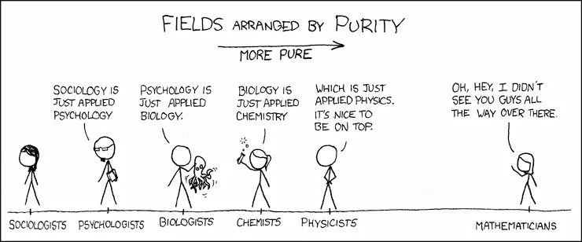

# 分析应向首席技术官、首席采购官或首席财务官报告

> 原文：<https://towardsdatascience.com/should-analytics-report-to-cto-or-cpo-or-cfo-cddbdc39f962?source=collection_archive---------27----------------------->

## 苹果为何未能建立 Instagram 的答案给了我们一个线索

解释为什么苹果可以进入芯片制造领域，但不能在应用程序(照片共享、地图)上竞争的框架可以教给我们很多关于大中型公司数据团队的最佳组织结构。

组织结构至关重要，因为同样的人以不同的方式组织会产生“不同的”组织。在改变一个组织的两种方式之间，“改变谁在其中”和“改变互动拓扑”，第二种更便宜，破坏性更小。

首先，我们将讨论解释大公司为何无法占领新市场的[堆栈谬误](https://techcrunch.com/2016/01/18/why-big-companies-keep-failing-the-stack-fallacy/)。当他们进入堆栈时，他们失败了，因为他们错误地认为构建上面的层是微不足道的，只是失败得很壮观。随后，我们将把这些概念应用于技术组织中的数据团队结构，在这些组织中，公司因为缺乏对堆栈谬误的理解而犯错误。产品向技术部门报告的错误很少发生，所以我们不会深究。

## 堆栈谬误和为什么大公司不断失败

堆栈谬误借鉴和建立在下面的漫画。

漫画致谢: [XKCD](https://xkcd.com/435/)

[安舒·夏尔马](https://medium.com/u/e66bbf5810c7?source=post_page-----cddbdc39f962--------------------------------)认为，在商业战略的世界里，我们有一种幻觉，就像连环漫画中的数学家一样。这位数学家认为数学是一切的核心。他是自己领域的主人。因此，他是一切的主人。例如，数据库公司认为 SaaS 应用程序“只是一个数据库应用程序”，这给了他们可以轻松构建、竞争并获胜的错误信心。该框架解释了为什么 Salesforce 在 CRM SaaS 击败了 Oracle。

堆栈谬误是人性使然；我们过分看重我们所知道的。然而，成功的瓶颈往往不是对工具的了解，而是缺乏对客户需求的理解。令人惊讶的是，向下创新远比向上容易，因为我们是较低层的自然客户。越往上走，越容易忽视史蒂夫·乔布斯的建议——从客户需求开始，而不是从技术开始。

现在，让我们深入分析报告结构。

## 堆叠谬误与报告结构

组织通常有正确的报告结构；领导一群技术人员的商业人士。然而，对于“数据”团队来说，他们忘记了在堆栈谬误的环境中看到它，因此，犯了错误。对空间缺乏了解是因素之一。

概括地说，数据团队中有两个单元。第一个 pod 负责以可用的格式检测、收集、转换和呈现数据。第二个 pod 从数据中获得产品战略和执行的见解。第一个单元称为数据工程/技术，第二个单元称为分析和数据科学。在以下段落中，我们将把分析进一步分成三个部分，讨论它们在组织层级中的位置。

对于分析领导力和报告结构，您将在下面找到领导者犯下的错误列表，以及相应的见解和修复方法。

## 分析领导力

1.  选择一位数据技术(DT)专家来领导一个分析团队是一个严重的错误。花费大量时间磨练核心技能和攀登职业阶梯的 DT 领导者在转变和管理高层角色方面表现不佳。他们挣扎是因为 a. DT 角色无助于加强用于分析的神经元 b .他们高估了自己核心技能的相关性 c .正式领导让他们看不到来自他们报告的反馈。
2.  更明智的做法是，让精通数据的产品负责人或之前已经过渡到产品的分析负责人来领导团队。苹果成功制造芯片的方式是，产品人员可以在让分析成为洞察机器方面做得很好。
3.  很少有 DT 人员在管理分析方面做得很好，但他们是例外，而不是常态。

## 报告结构

1.  向技术部门提交分析报告会导致灾难。DT 应该向技术汇报，但分析必须更贴近业务。他们可以向产品部或首席运营官汇报——如果有的话。
2.  数据科学可以是技术团队的一部分，但他们必须与业务(产品和分析)密切合作。数据科学有助于构建业务逻辑，它比构建经验更具迭代性。在这里，产品、分析和数据科学之间的紧密合作对于项目的成功至关重要。
3.  分析有三个功能:a .为产品策略生成洞察 b .为优化执行和运营生成洞察 c .产品性能报告。理想情况下，第一批分析人员应该是产品团队的一部分。为了管理利益冲突，第二个和第三个分析单元可以是首席运营官或首席财务官的一部分。许多组织在这里犯了一个错误，因为他们认为这是一种“集中-分散”的权衡，而不是将分析区分为三个单元。
4.  不常见，但是一些组织确实犯了向技术部门报告产品的错误，通常会导致混乱。尽管一个大的技术组织可能有一群技术产品经理，但是一个技术组织中的消费者产品经理是一个灾难的处方。

*感谢，* [*瑞奇 Q*](https://medium.com/u/ff3ed16f9ae1?source=post_page-----cddbdc39f962--------------------------------) *进行校对和编辑。*