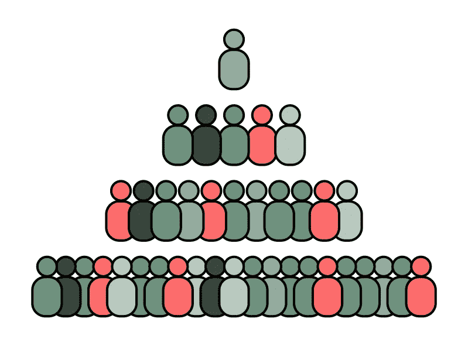
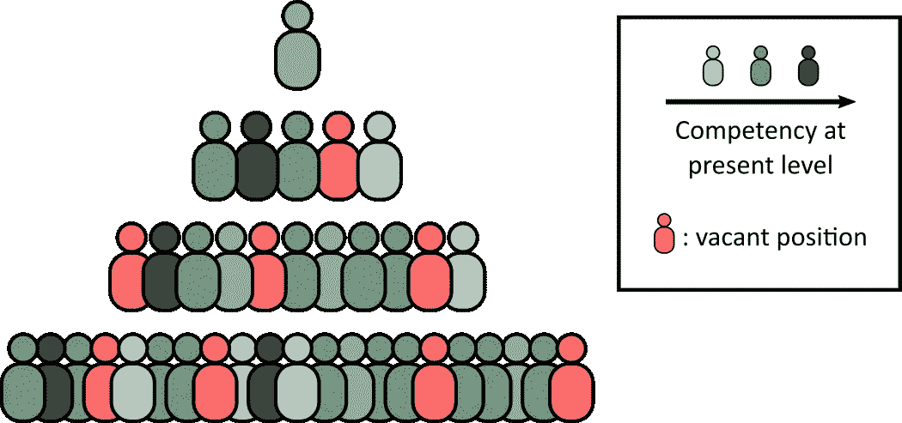
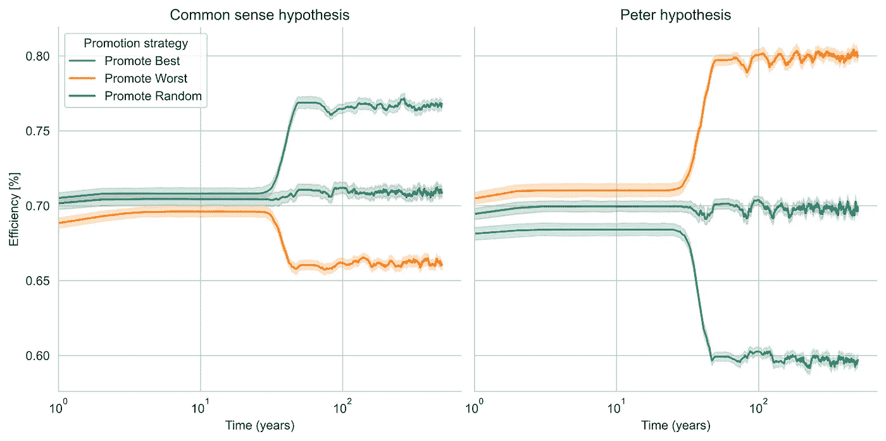
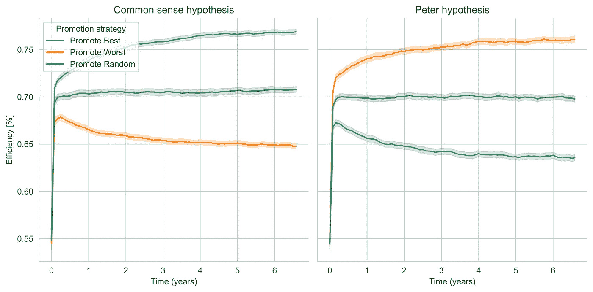

# 员工是否应该随意晋升？

> 原文：<https://towardsdatascience.com/should-employees-be-promoted-at-random-data-says-idk-maybe-bb327b6bd96a?source=collection_archive---------31----------------------->

## [实践教程](https://towardsdatascience.com/tagged/hands-on-tutorials)

## 数据说:“IDK，也许？”

对一个组织的非常概略的描述。(图片由作者提供)

> *“在一个层级结构中，每个员工都倾向于提升到他的无能水平”*
> 
> *—劳伦斯·J·彼得博士*

上面有争议的引文来自一本半讽刺性的书，作者是彼得博士和雷蒙德·赫尔，该书自发布以来引发了不少关于这个话题的研究。其背后的想法是，由于晋升通常是根据某人在当前职位上的表现来分配的，人们在层级组织中的排名会上升，直到他们达到相对不胜任的职位，并且不再被考虑晋升。

当某个角色的表现不能很好地预测更高角色的表现时，这种逆向选择效应可以直观地预期:一个优秀的程序员不一定是一个好的经理。或者，正如普特定律所说:

> 技术由两类人主导，一类人了解他们不管理的东西，另一类人管理他们不了解的东西
> 
> *—阿奇博尔德推杆*

我最初遇到彼得原理是因为我是搞笑诺贝尔奖的超级粉丝，2010 年，三名意大利人 Pluchino、Rapisarda 和 Garofalo 因在管理科学领域的计算研究而获得搞笑诺贝尔奖。我总是发现他们的结果非常发人深省，因为我想尝试使用 [Mesa 库](https://mesa.readthedocs.io/en/master/)进行基于代理的模拟，所以我想不出比这更好的论文来尝试复制了！:-)

# Pluchino-Rapisarda-Garofalo 模型

我们现在来回顾一下[“彼得原理回顾:计算研究”](https://arxiv.org/pdf/0907.0455.pdf)中介绍的模型。让我们考虑一个层级组织，职位分布在一定数量的固定大小的层级上；每个职位可以是空缺的，也可以由员工占据，员工的特征是两个数字:他们的年龄和代表他们在当前职位上能力的分数。为了明确起见，我们假设分数是从 1 到 10 的实数。

一个分层公司的示意图，其中有空缺职位和各种能力的员工。(图片由作者提供)

公司的整体效率被定义为每个员工的能力得分之和，由一个依赖于级别的“责任因素”加权，该因素说明了这样一种观点，即与发生在较低级别的不称职或未履行的角色相比，发生在最高级别的不称职或未履行的角色对整个公司更有害。如果每个员工的能力得分都是 10 分，那么效率就可以用公司得到的分数来标准化。

员工只能晋升到其当前职位的上一级(前提是其中有空缺职位)，并且只能从最底层进入公司。当员工被提升到一个更高的级别时，我们将如何表现他们的能力？该模型的作者提出了两种可能的机制:

*   **常识假设**:当一名员工被提升时，他们在新职位上的能力与他们在之前职位上的能力大致相同，只有一些小的随机变化(比如说，在-1 和 1 之间均匀分布)。
*   **彼得假设**:当一名员工被提升时，他们在新职位上的能力与他们在之前职位上的能力完全无关。并非完全不现实，如果我们想象有人从一个需要高度技术技能的角色转换到一个更具管理性的角色。

此外，人们可以想象出大量的策略，通过这些策略我们可以选择一个员工提升到下一个级别；在最初的模型中，作者研究了其中的三个:

*   *最佳*策略:对于任何空缺的职位，从下一级提拔最有能力的员工。这是最常识性的策略，也是“理论上”人们在现实世界中使用的策略。
*   最差的策略:不要从下面的级别中挑选最好的候选人，而是挑选最差的。直觉上… WTF？
*   *随机*策略:每当有空缺职位时，写下所有可以升职的员工的名字来填补，放入一个鱼缸，随机抽取一个名字:那个家伙升职了！很想知道是否有人在现实世界中使用它。

最后，员工只有在达到退休年龄或能力得分低于某个阈值时才会离开公司。

记住这些规则，让我们实现一个基于代理的模拟，看看一个在开始时具有随机初始年龄和员工能力的公司如何随着时间的推移而演变。如果您对实现的细节不感兴趣，可以随意跳到原始结果部分的[讨论。](https://www.angioi.com/should-employees-be-promoted-randomly/#discussion-of-the-original-results)

# 用 Python 实现 PRG 模型

由于这是一个非常简单的基于代理的模拟，我认为其实现的自然选择是 [Mesa 库](https://mesa.readthedocs.io/en/master/)，因为它允许我们不为我们的模拟编写大量样板代码，同时对于一些更复杂的库(例如 [SimPy](https://simpy.readthedocs.io/en/latest/) )来说更容易使用。这一部分的目标只是勾画出这样一个模拟的实现是什么样子的；要了解更多细节，请随意查看这篇文章的[完整回购](https://github.com/xalelax/pyter-pynciple)和[台面文档](https://mesa.readthedocs.io/en/master/)。

我们可以从编写一个相当无趣的`Employee`类开始，如下所示:

`Employee.step()`方法描述了代理在模拟的每个时间步做什么；在这个模型中，很简单:他们只是变老，接近退休年龄。

描述公司动态的模型稍微复杂一些；在这里，我只报告对这个模型最重要的方法:

如您所见，我们上面描述的提升员工和重新计算能力的策略本质上是一行程序。

梅萨模型有一个非常有用的属性，`data_collector`，它可以在我们的模拟过程中跟踪我们想要的任何可观察的东西，并给我们一个方便的`pandas.DataFrame`。我们可以利用这一点，通过以下方式模拟公司的动态:

也就是说，我们只需要反复调用`model.step()`方法，所有剩下的工作或多或少都是自动完成的。对于运行批量模拟，也可以使用 Mesa 的 [BatchRunner 类](https://github.com/projectmesa/mesa/blob/master/mesa/batchrunner.py)。

事不宜迟，让我们看看我的 Pluchino-Rapisarda-Garofalo 模型实现的输出。

# 对原始结果的讨论

通过模拟一批公司在一段时间内的效率，在常识假设或彼得假设的假设下，并假设他们总是提拔最好的、*最差的*或*随机的*员工，我们得到以下图表:

促销策略和能力转移机制不同组合的平均效率随时间的演变。再现[原始论文图 2 所示的结果。](https://arxiv.org/pdf/0907.0455.pdf)(图片作者提供)

这里，每条线显示 50 次模拟运行的平均值。这些公司都是一样的:最初有 160 名员工，分布在 1、5、11、21、41 和 81 这 6 个级别。每个级别对公司绩效的权重分别为 1、0.9、0.8、0.6、0.4 和 0.2。每个员工的年龄从以 25 岁为中心的正态分布中随机初始化，标准偏差为 5 年，截断为 18 至 60 岁，而能力得分从以 7 岁为中心的正态分布中随机抽样，标准偏差为 2，截断为 1 至 10。退休年龄定为 65 岁。

可以想象，当常识假设成立时，即当员工在新职位上的能力与他们在旧职位上的能力非常相似时，在我们上面介绍的策略中，更好的策略是通过提升最好的员工来填补空缺，而总是提升平均最差的员工会导致效率下降，随机提升介于这两种策略之间。

根据彼得的假设，这些趋势完全相反:总是提升最优秀的员工会导致效率的**下降**。直观地说，我们可以这样解释这种现象:通过提升最优秀的员工来填补一个职位，我们正在摆脱一个级别中表现最好的员工；同时，由于新的能力得分完全是随机的，员工在新职位上的能力(将产生更大的影响)很可能会大大降低。我们正在处理一个教科书上的逆向选择案例！通过提升一个级别中表现最差的员工，我们都用另一个可能具有更高能力的员工来代替他们，并且我们也有机会在新的级别(也可能比以前更高)上为他们的技能重新掷骰子。

现在一个问题应该是很自然的:在一个真实的组织中，对于一个给定的晋升，哪种能力转移机制在起作用？在常识假设和彼得假设的可能性相等的情况下，Pluchino、Rapisarda 和 Garofalo 在他们的论文中表明，相对有效的策略是随机提拔空缺职位的最佳或最差候选人！

# 模型的扩展

我们的结果中另一个值得注意的奇怪现象是，这种动态与人们的预期大相径庭:在大约 25 年的时间里没有发生什么变化，然后在几十年的时间里，我们达到了平衡。这与这样一个事实有关，即职位最初是完全填满的，因为对于所选的年龄分布，99.85%的员工在模拟开始时不到 40 岁，所以我们需要等待几十年才能看到有人退休。

通过假设在开始时一些位置是空的，可以容易地修复这种假象；这可以通过强加最初在每个级别的代理数量不是由级别大小给出的，而是由二项式分布给出的(在我的实现中，参见[这条线](https://github.com/xalelax/pyter-pynciple/blob/c2d3bb5f319618a08ad13df1e8346d81b0f5128c/src/model.py#L110))，使得总是有一个位置空缺的随机机会。我决定对每个等级使用相同的空缺概率，但是决定每个等级至少有一个人(见[这里](https://github.com/xalelax/pyter-pynciple/blob/c2d3bb5f319618a08ad13df1e8346d81b0f5128c/src/model.py#L111))。为了明确起见，我们取 0.2 作为每个位置最初空缺的概率。

另外，[我引入了](https://github.com/xalelax/pyter-pynciple/blob/c2d3bb5f319618a08ad13df1e8346d81b0f5128c/src/model.py#L36)一些随机机会，人们在退休前的任何给定时间离开公司(也许他们从一家不提供晋升抽奖的公司得到了更好的提议:-P)。让我们给每个员工每个月分配 4%的机会离开公司，这样平均每个员工在离开他们的角色之前会呆两年左右。

由于我最感兴趣的企业类型是早期初创企业，我也决定考虑相对于原始论文来说层次较少、规模较小的公司。因此，让我们考虑一个公司，有一个首席执行官，一个仅在她下面的五个人的董事会，十个某种类型的“经理”，以及他们下面的三十个人。我非常随意地将每个级别的权重因子设置为 1.0、0.8、0.5 和 0.2。

最后，让我们使用一个月而不是一年的模拟步骤，并为 256 家公司的每一组促销策略和能力转移机制运行这个新的模拟。结果如下所示:

“扩展”模型中促销策略和能力转移机制的不同组合的平均效率随时间的演变。(图片由作者提供)

我们可以看到，现在的动态更加渐进，发生在更有意义的时间尺度上(几年而不是几十年/几个世纪)。除此之外，与最初的模型相比，似乎没有什么太大的变化；在这种情况下，战略之间的差距似乎较小，但我认为这是由于我使用的不同公司结构，而不是模型中的任何差异。主要观点仍然存在:与常识相反，根据彼得假说，提升最优秀的员工会导致效率下降。

# 留给读者作为练习的问题

我上面提出的对原始模型的修改只是一些小的修正，如果我们放松一些假设，看看结果会如何变化会很有趣。例如，我对前进道路的建议是:

1.  员工只能进入层级的最底层；在模型中包括一个公司从公司外部雇佣有经验的人的可能性怎么样？
2.  根据彼得假设，能力得分分布对所有级别都是一样的。根据级别来区分有意义吗？
3.  员工在这个模型中是非常一维的(他们对公司的作用只用一个数字来表征)。我们能不能让它们不像真实的人类那样复杂，至少稍微有趣一点？
4.  还有其他有趣的能力转移机制可以考虑吗？例如，一些新晋升的个人可能不如他们的同事有效，但他们可以由同一级别的(一些)人指导，所以我们至少有一些回归到平均水平。
5.  在这里，我只研究了平均数量；发行版呢？与每个场景相关的风险是否具有可比性？
6.  我们能否通过给每个代理人提供“性别”、“种族”或类似的属性来模拟歧视的影响？

# 结论

依我拙见，目前为止我们所看到的模型中有多少是真正模拟一个公司的，仍然是非常值得怀疑的。例如，一家公司在决定雇佣或提升某人时，能力是唯一(甚至是最重要的)考虑因素，这是极不可能的；通常证明这种决策合理的看似客观的指标通常只是偏见和歧视的一个表象。通常，度量越多，透明度越低。矛盾的是，我们能通过随机雇用和提升员工来改善工作场所的歧视问题吗？当然，我不是说这可能是最好的解决方案，但它会改善目前的现状吗？

我认为我们仍然很少了解什么是真正激励人们的，以及等级制度是如何运作的；尽管如此，基于代理的方法通常可以成为进一步研究的好灵感。此外，它们相对容易编码(特别是通过为它们使用一些专用库)，因为人们只需要提供管理代理行为的简单规则。我可以全心全意地推荐 [Mesa 入门教程](https://mesa.readthedocs.io/en/master/tutorials/intro_tutorial.html)，其中他们实现了另一个有趣的模型(玻尔兹曼财富模型)，以获得更多关于这个主题的信息。

如果你做到了这一步，感谢你的阅读！