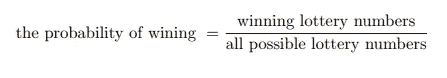
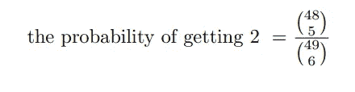
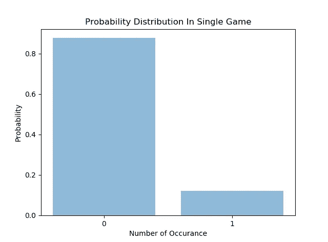

# 该不该买彩票？

> 原文：<https://towardsdatascience.com/should-i-buy-a-lottery-ticket-6d3fece5a6bd?source=collection_archive---------23----------------------->

## 彩票分析

## 我分析了过去的彩票数据，利用统计学和概率来决定购买彩票。


迪伦·诺尔特在 [Unsplash](https://unsplash.com/s/photos/lottery?utm_source=unsplash&utm_medium=referral&utm_content=creditCopyText) 上的照片

我经常发现自己在决定是否购买彩票，尤其是新年前夕的强力球抽奖。我在那些时刻感到犹豫的原因是我对所选数字的随机性缺乏信任。当你搜索彩票结果的操纵时，有许多资源解释这个系统是如何被欺骗和操纵的。你也可以遇到彩票前雇员如何操纵结果的过去事件。

看到关于过去彩票结果被操纵和造假的新闻，我对彩票结果的信任变得更加不适。有了数据科学的经验和背景，今年我决定用统计学来证明我和其他人一样有平等的机会赢得彩票。在这篇文章中，我将讲述我如何利用统计数据来分析彩票结果，并做出购买/不购买彩票的决定。

**彩票机制**

我要分析的彩票名为“Sayı sal Lotto”，是土耳其国家彩票的一种。游戏内部工作如下:从范围[1，49]中抽取 6 个数字，奖金按递减顺序分配给猜中 6，5，4，3 的人。在不涉及太多细节的情况下，让我们深入数学，从统计学的角度来分析这场比赛。

**决定购买彩票**

从这一节开始，我将解释我使用的方法并分享代码片段。然而，为了让你更好地理解所使用的方法，我将定义和使用一些术语，如随机变量和概率。各部分的概要如下:

1.  *什么是随机变量？在这里，我解释什么是随机变量和不同类型的随机变量使用。我还给出了统计学中事件的定义。*
2.  *中乐透的概率。在这一步中，我计算了赢得乐透不同事件的各种概率。*
3.  *概率的分布。随机变量相对于不同值变化的概率。我感兴趣的是找出在抽奖中答对一个特定数字的概率分布。*
4.  *运行 chi2 拟合优度测试。该测试可用于比较理论分布与观察分布的吻合程度。我收集了彩票样本中每个号码的频率统计数据。我将使用 chi2 检验将每个数字的预期数字频率与这些统计数据进行比较。*

**第一步:什么是随机变量？**

随机变量是其分布函数为实验的不同结果赋值的变量。随机变量通常用字母来表示。它们分为离散型和连续型，离散型具有有限或无限范围内的特定值，连续型可以取实数线上某个区间内的任何值。在抽奖的情况下，从 49 个数字中抽取一个数字只能是[1，49]范围内的整数。因此，我在彩票环境中处理一个离散的随机变量。

另一方面，一个事件是一个结果，它有一个概率值。我相信你可以在网上找到更正式的定义。但是为了我们的目的，让我们多谈谈数学。

**第二步:中彩票的概率**

一个事件的概率告诉你在所有可能的后果下，这个事件发生的可能性有多大。例如，“A 队有 1/3 的机会获胜”意味着考虑到所有可能的结果，A 队获胜的概率是 *1* / *3 = 0.33* 。如果事件的概率接近于 1，则很可能发生随机事件。

在彩票中，中奖概率等于中奖号码占所有可能彩票号码总数的分数。换句话说，你试图从一包 49 个数字中找出所有 6 个数字的组合。



为了找到中奖的概率，我需要算出所有可能的彩票结果。这是我使用密码的地方。我从一组 n 个物品中挑选 r 个物品，不管挑选的顺序如何，其中 r 是 6，n 是 49。那么彩票中奖的概率就变成了*1*/*13983816。*



你可能会说“*好吧，那已经是不玩的理由了，因为赢的几率很低*”。但是，请记住，我是在可能的操纵后得出的数字。所以我不打算谈论玩游戏是否理性。如果我要计算从 49 个数字中得到 2(不是任意 2 个随机数，而是实际的数字 2)的概率，那么我会将所有可能的 6 个位置中的 1 个位置设置为 2，并对其余的 5 个位置进行相同的计算，≊ *0.12*

**第三步:概率分布**

我现在有可能得到一个数字(一个特定的数字，比如 2，3，30 等等。)中了彩票。概率的分布如下:



分析了最近的 1000 张彩票后，我得到了每张彩票的总号码频率，也就是说，我知道 2 在最近的 1000 张彩票中是否出现了 150 次。这是观察到的所画数字的数字频率分布。

为了找到特定号码在最近 1000 次彩票中出现频率的期望值(样本量=1000)，我将范围 *[0，1000]* 中的每个 *k* 乘以在彩票中挑选该号码的相应概率(如果 k 为 100，则该特定号码在 1000 次彩票中出现 100 次)。公式是 *E(x) = x*P(x)。*

```
expectedValue = 0
for every k in [0,1000]:
  expectedValue+=k*P(k)where P(k)=(0.12**k)*(0.88**(i-k))*C(i,k)
C(i,k)=i choose k
i=1000
```

我最终得到了 122，作为一个样本为 1000 的特定数字的数字频率的期望值。

**步骤 4:运行 chi2 拟合优度测试**

卡方拟合优度检验用于确定样本数据分布是否与预期分布一致。我建立了卡方拟合优度检验的假设，随后计算了各自自由度的卡方统计量:

A.零假设:观察值和期望值之间没有显著差异。

B.**替代假设:**观察值与期望值之间存在显著差异。

运行上面的代码片段后，我得到了 35.596 的 chi2 统计值。检查了 chi2 表中的 p 值后，我得出结论，观察值和期望值之间没有显著差异。因此，我可以向自己保证，数据没有被操纵，可以购买彩票。

**结束语**

在这篇文章中，我分享了我是如何统计分析过去的彩票数据来决定购买彩票的。虽然我在统计上没有发现任何操纵行为，但我并不宣称这就是最终结论。您可以使用不同的方法分析相同的数据，并得出不同的结果。如果您也想尝试一下，非结构化代码([链接](https://github.com/bkoseoglu/lottery_analysis))可能会有所帮助。

*如果你对帖子有任何疑问，或者对数据科学有任何疑问，你可以在*[***Linkedin***](http://www.linkedin.com/in/koseoglubaran)***上找到我。***

享受阅读，祝你新年快乐！