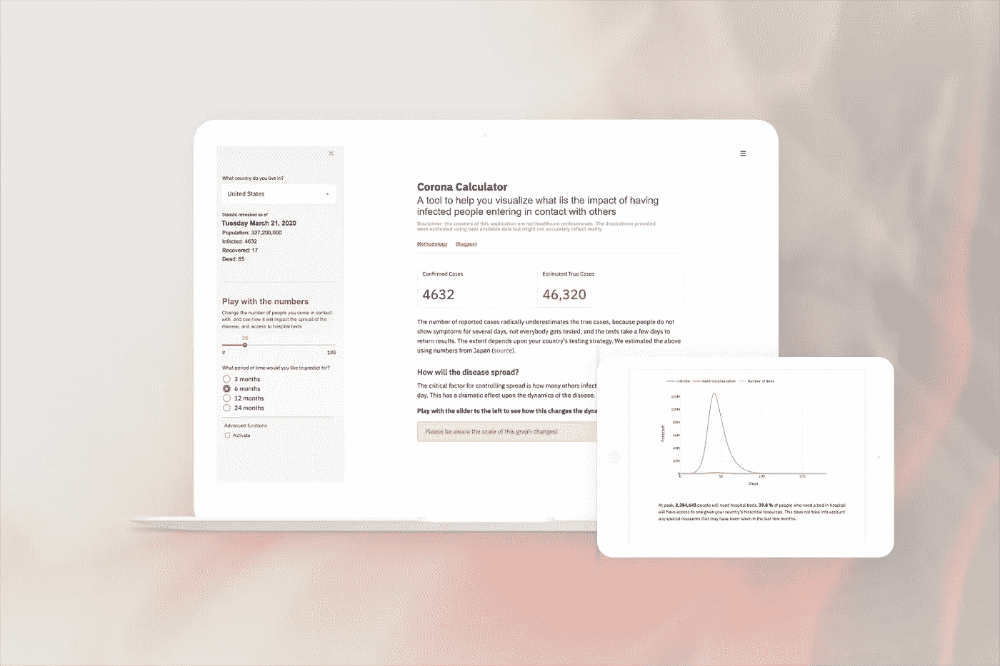
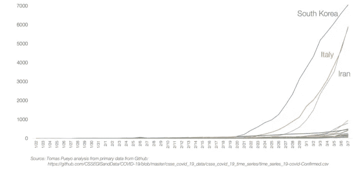
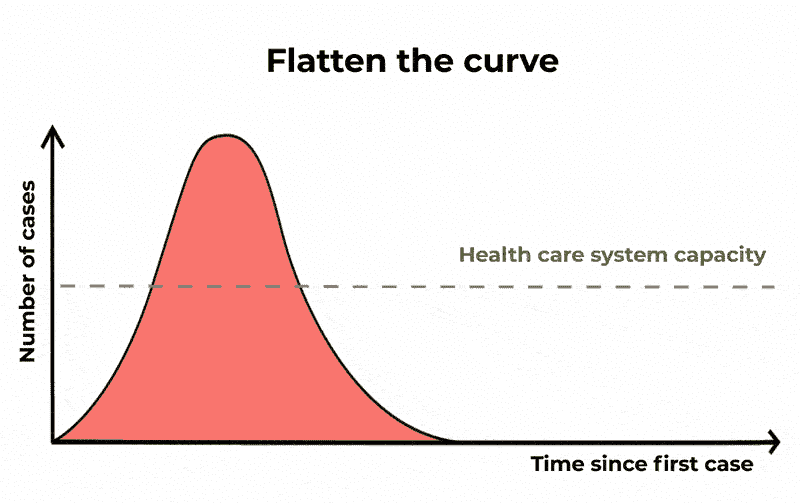
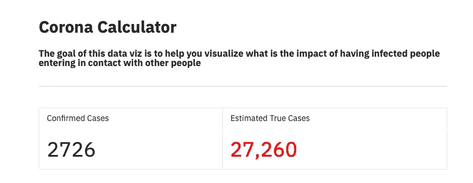
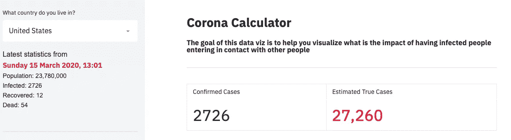
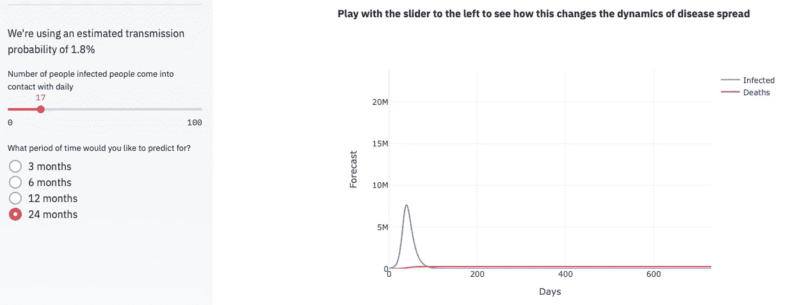
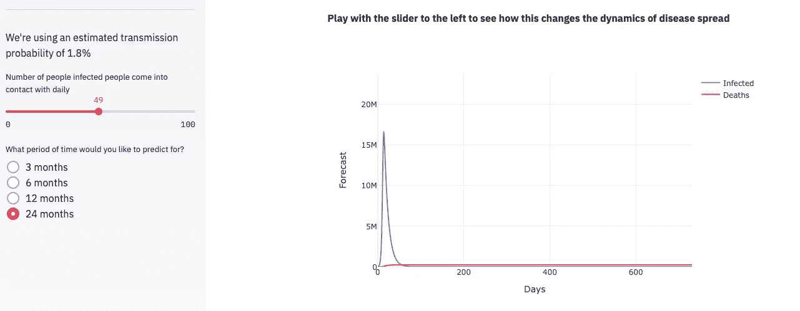
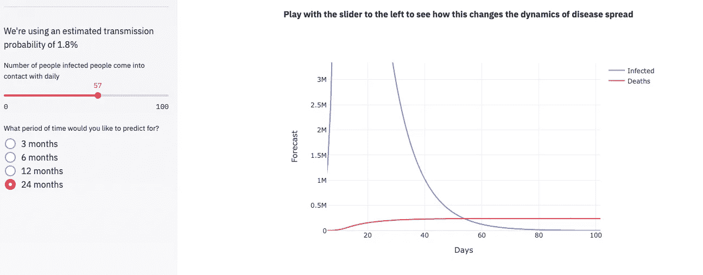
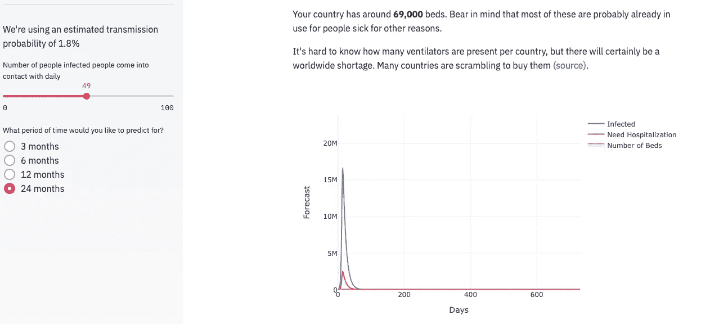
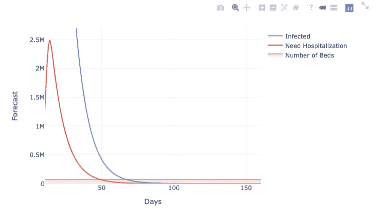

# 我应该去吃早午餐吗？一个交互式的新冠肺炎曲线展平工具

> 原文：<https://towardsdatascience.com/should-i-go-to-brunch-an-interactive-tool-for-covid-19-curve-flattening-6ab6a914af0?source=collection_archive---------5----------------------->

## 一个帮助你了解你的行为如何影响冠状病毒在你的社区传播的工具

与[萨尔曼·默罕默德](https://www.notion.so/coronahack/About-Us-01a6ae6d91bc4262aa9babe5e976ea67#6cfbcf91ddf142a09f9ba6d094b3ef22)、[克劳德·雷奥](https://www.notion.so/coronahack/About-Us-01a6ae6d91bc4262aa9babe5e976ea67#5d77468aaa5b4017aedfbaf14763725a)和[帕特里克·斯蒂维斯](https://www.notion.so/coronahack/About-Us-01a6ae6d91bc4262aa9babe5e976ea67#025da05df59441ac9ad1a02ff555180a)

**2010 年 3 月 19 日更新:感谢大量精彩的反馈，我们现在已经发布了该工具的 V2，它带来了贵国每天的历史病例数据，更好的图表，以及按年龄分列的预测死亡率！现在还在**[**https://corona-calculator.herokuapp.com**](https://corona-calculator.herokuapp.com)**✌️**

最近的发展说服了许多人，我们确实应该非常认真地对待冠状病毒。像[这种](https://medium.com/@tomaspueyo/coronavirus-act-today-or-people-will-die-f4d3d9cd99ca)的帖子强调了隔离作为一种控制冠状病毒传播的策略有多么重要。你可能见过受感染人数的可怕曲线:

[来源](https://medium.com/@tomaspueyo/coronavirus-act-today-or-people-will-die-f4d3d9cd99ca)

辅以“拉平曲线”的理念，以限制医疗保健系统的负荷:

[来源](https://www.sciencealert.com/dragging-out-the-coronavirus-epidemic-is-important-in-saving-lives)

# 我能对这些曲线产生什么影响？

人们(包括我们)发现很难对疾病的可能发展进行推理，因为有许多不熟悉的概念(如指数增长)和潜在的重要变量(如人们多快得到诊断以及疾病在多长时间内保持传播)。

所有这些都让非专业人士很难思考他们应该如何改变自己的行为，以及这可能会给我们关心的事情带来什么样的影响:死亡、破坏。

因此，我们开发了一种工具来帮助我们了解这种疾病是如何根据感染者的社会接触次数而发展的。它被称为 Corona Calculator，旨在帮助你了解限制你的社交活动会如何影响冠状病毒的传播以及你所居住的医疗保健系统的负荷。

# 在 https://corona-calculator.herokuapp.com 找到它

## 在 https://github.com/archydeberker/corona-calculator[为代码做贡献](https://github.com/archydeberker/corona-calculator)

## 在我们的[公众观点页面](https://www.notion.so/coronahack/Public-842dd2b1f6ea4123b53318ed39f6c73d)阅读我们的方法和数据来源。

## 发现错误或想要请求功能？[通过谷歌表格](https://docs.google.com/forms/d/e/1FAIpQLSdby7GpZc9vBi5XRn_f_YbWW20NgiO6ZIufoZHnU14rn5r9uA/viewform?usp=sf_link)告诉我们。

# 为什么现在要建这个？

3 月 13 日星期五，我们的办公室关门了，我们开始远程工作。当时，加拿大有 24 名感染者，850 人正在接受调查。当我们开始讨论我们新的远程生活仪式和组织时，很明显不是每个人都对“隔离”有相同的理解。在咖啡店里重新组合成小团队可以吗？我们星期六还应该去参加那个聚会吗？我们的团体保龄球比赛怎么样？

我们开始查看这些数字，并计算出我们可以建造什么。已经有一些惊人的应用程序可以用来跟踪疾病的发展，从约翰霍普金大学到足够多的传播动力学背景让我们相当担心。与我们的家人和朋友讨论英国的“群体免疫”策略时强调，人们在考虑合理的公共卫生应对措施时，使用了非常不同的心理模型。

我们的专长是人工智能和创建使用直观的复杂系统。我们不是公共卫生专业人员，尽管我们中的一些人以前研究过传染病的数学模型。我们开始创造一种工具来帮助个人理解他们的选择可能产生的影响。

# 如何使用该工具

## 你所在的地区有多少病例？

从设置您的**位置**开始。我们每小时都会检查来自约翰·霍普金斯医院的数字[，并使用这些数字为您提供贵国当前确诊病例的数量:](https://github.com/CSSEGISandData/COVID-19)

遏制冠状病毒的一个棘手问题是，我们**知道**我们**并不真正知道**任何时候有多少病例。我们使用日本论文中的数字来估计任何时候的真实病例数大约是确诊病例数的 10 倍。然而，这高度依赖于测试策略；[在全球范围内，测试的普及程度存在巨大差异。](https://www.worldometers.info/coronavirus/covid-19-testing/)

## 我的行为如何影响传播？

作为一个个体，你能控制的主要事情是你选择自我隔离的程度。这反映在应用程序中的**感染者每天与之互动的人数。**

这是一个非常重要的数字，因为它决定了疾病传播的速度:在流行病学中被称为基本繁殖率。记住，冠状病毒在几天内不会出现症状，所以很难知道你是否已经被感染。

用格雷汉姆·梅德利教授的话说，我们最好的选择是“想象你确实感染了病毒”..改变你的行为，这样你就不会传播了”。

TK:[https://Twitter . com/BeardedGenius/status/1238475687830355970](https://twitter.com/BeardedGenius/status/1238475687830355970)

你会发现，改变这一点会对感染人数和冠状病毒导致的死亡人数产生巨大影响:

我们所有的图表都是交互式的(谢谢， [Plotly](https://plot.ly) )，所以你可以放大来看发生了什么:

你可以在我们的[概念页面](https://www.notion.so/coronahack/Public-842dd2b1f6ea4123b53318ed39f6c73d)中找到我们如何模拟疾病传播以及如何计算死亡率的细节。

## 为什么感染率很重要？

在感染冠状病毒后，有些人需要住院治疗，症状从呼吸窘迫到器官衰竭不等(我们根据[本文](https://www.notion.so/coronahack/Modelling-d650e1351bf34ceeb97c82bd24ae04cc#842db9e7269c43709e7eadb1985dd4cf)计算约为 15%)。

这意味着很多人将需要医院护理，这将是一个问题。问题的严重程度取决于任何时候有多少人生病:

同样，你可以玩左边的滑块，放大来了解一个感染者与多少人**互动是医疗系统负荷的一个关键决定因素。**

对我们来说，这是冠状病毒疫情最可怕的部分:它将给我们的医疗保健系统带来潜在的巨大压力，可能导致死亡率相应增加——以及它给医疗保健专业人员带来的[痛苦选择。](https://www.theatlantic.com/ideas/archive/2020/03/who-gets-hospital-bed/607807/)

请注意，我们没有关于死亡率将如何随着医疗系统变得不堪重负而变化的良好数据，因此**我们今天不能将其纳入我们的模型**。似乎可以有把握地说，从(最终)得到良好控制的武汉疫情估算的死亡率，低估了处于崩溃边缘的医疗体系的死亡率。

## 你能确定这是对的吗？

不要！

我们可能会在几个方面出错:

1.  我们使用的模型可能过于简单。

然而，[它已经存在了很长一段时间，并得到了很好的尊重](https://mathworld.wolfram.com/Kermack-McKendrickModel.html)，所以我们认为这不太可能是一个大的误差源。

2.我们使用的数字可能不准确。

关于冠状病毒及其动态的关键数据，现在有很多不确定性。我们非常依赖来自约翰霍普金斯大学和迈达斯网络的数据，但是现在有很多我们不知道的，而且来自不同国家的数据可能完全不同！这可能是一个很大的误差来源。

**3。我们可能把事情搞砸了**

我们是技术专家，而不是流行病学家，我们匆忙地完成了这项工作(关于冠状病毒的一切都发生得很快……)。[我们希望得到一些关于我们在周末编写的代码的反馈](https://github.com/archydeberker/corona-calculator)！

## 如果你觉得这个有趣或有用，请让我们知道[的概念](http://Notion)或在评论中，并在你的网络中分享！

*感谢*[*Satsuko VanAntwerp*](https://medium.com/@sats_ko)*和*[*Stephanie Willis*](https://medium.com/@stephaniewillis808)*对本文的编辑*