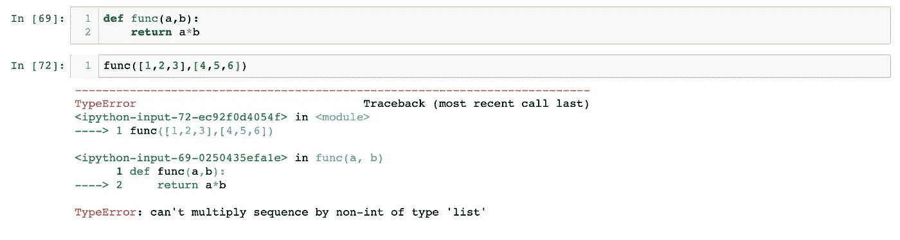
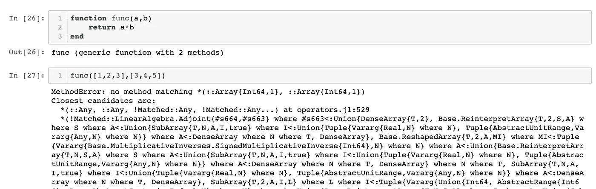

# 该不该学朱莉娅？

> 原文：<https://towardsdatascience.com/should-i-learn-julia-986696ca031d?source=collection_archive---------22----------------------->

## 意见

## Python 和 MATLAB 的高性能 lovechild 到底好不好？


由 [pixabay](https://pixabay.com) 上的 [Free-photo](https://pixabay.com/users/free-photos-242387/) 拍摄

朱莉娅是目前最新的“it”语言，所以我想我应该试一试。问题是，它值得加入数据科学家的武器库吗？

## 装置

关于 Julia，首先要知道的是它很容易下载和使用(无论如何，在 Mac 上，祝 Windows 用户好运)。安装内核让它在 Jupyter 笔记本上运行也是轻而易举的事情。

## 句法

Julia 不像 Python 那样是面向对象的语言，所以要写作，我们需要放弃一些(但不是全部)整洁的“Python 式”做事方式。

在 Julia 中没有类，所以我们必须像处理 MATLAB 一样处理结构。同样，像 MATLAB 一样，Julia 采用了语言中内置的优秀的线性代数语法。这取代了对像 NumPy 这样的模块的需要，有利于更直观的语法，如用于乘法、复共轭和逐点除法的`A*x`、`x'`和`./`。

用户应该警惕的另一件事是用关键字`end`结束函数和循环，并且必须习惯使用 Julia。然而，你会很高兴地听到这样做的原因是因为 Julia 不是一种对空格敏感的语言，所以你再也不会看到“缩进中制表符和空格使用不一致”的错误了！

## 打字

从技术上讲，Julia 仍然是一种动态类型语言，这意味着你不需要*告诉它哪个变量具有哪个类型——类似于 Python 的工作方式。*

然而，与 Python 不同，Julia 支持将变量强制为特定类型的类型化。这非常方便，原因有二:

1.  它允许 Julia 代码比完全动态的语言运行得更快，如果一个变量被键入，那么它不需要在执行计算之前检查它是什么类型。
2.  在处理类型化变量时，调试更容易，因为在没有显式执行的情况下，变量不会被意外地赋给不同的类型。为了在 Python 中获得同样的效果，你必须花很多时间在每个函数输入上实现`assert`语句，即使这样，事情仍然可能出错！

## Unicode 支持！

这是朱莉娅最有特色的地方之一…

在 MATLAB 或 Python 中实现数学表达式时，我们经常会遇到像`x_hat`或`sigma`这样的变量。然而，在 Julia 中，我们可以使用 Unicode 字符作为变量，而不是给我们`x̂`和`σ`！

“我怎么能记住`x̂`和`σ`的键盘组合呢？我不会每次想用的时候都去谷歌一下！”

这是一个合理的担忧，但不必担心，因为 Julia 的核心开发人员比我们领先一步。对于`x̂`，只需写`x\hat ⇥`，对于`σ`，写`\sigma ⇥`，类似于你在 LaTex 中的做法。

虽然愤世嫉俗者可能认为这是一个噱头，但我认为它允许更多的可读代码，正如 Python 的[禅](https://www.python.org/dev/peps/pep-0020/)所说，“可读性很重要”。

## 实际写作是什么感觉？

在我的[上一篇文章](/understand-and-build-logistic-regression-from-scratch-4ca4a7a40a4)中，我们从头实现了一个逻辑回归模型，但是在 Julia 中它看起来像什么呢？

```
function σ(x::Array{Float64,2})
    return 1.0 ./ (1.0 .+ exp.(-x))
endfunction fit(
        X::Array{Float64,2},
        y::Array{Float64,1},
        epochs::Int64=100,
        μ::Float64=0.0001
    )
    ε::Float64 = 0.00001
    loss = []

    X = vcat(X, ones(1,size(X)[end]))
    dims, n_data_points = size(X)

    w = randn(1,dims) for i in 1:epochs
        X̂ = w*X
        ŷ = σ(X̂) cost = -sum(y'.*log.(ŷ .+ ε) .+ (1 .- y').*log.(1 .- ŷ .+ ε))

        dc_dw = -sum((y' .- ŷ).*X,dims=2)'        
        w = w .- dc_dw * μ
        append!(loss,cost)
    end
    return w,loss
endfunction predict(X::Array{Float64,2},w::Array{Float64,1})
    X = vcat(X, ones(1,size(X)[end]))
    X̂ = w*X
    ŷ = σ(X̂)
    return ŷ
end
```

在这个实现中，我们可以看到 Julia 的 Unicode 字符如何使代码更具可读性的完美例子。本地线性代数支持进一步简化了代码，每次我们想要执行乘法或求和时，都删除了`np.`。我们还输入了函数输入，以确保输入的类型和维度都有效。

## 速度！

Julia 基于 C 的血统和类型使得它的速度比缓慢的 Python 有了很大的提高。这些都可以在不对代码效率进行任何重大改进的情况下完成。

让我们用这个简单的 Python 函数来计算前 10，000 个素数:

```
def n_primes(n:int)->list:
    primes = []
    i = 2
    while len(primes) < n:
        prime_bool = True
        for j in range(2,i//2+1):
            if i%j == 0:
                prime_bool = False
        if prime_bool == True:
              primes.append(i)
        i += 1
    return primes
```

耗时 2 分 42 秒。当我们使用打字时，让我们将它与 Julia 进行比较:

```
function n_primes(n::Int64)
    primes = Int64[]
    i::Int64 = 2
    while size(primes)[1] < n
        prime_bool::Bool = true
        for j = 2:i÷2
            if i%j == 0
                prime_bool = false
            end
        end
        if prime_bool == true
              append!(primes,i)
        end
        i += 1
    end
    return primes
end
>> @time n_primes(10000)
```

这只花了 7.55 秒！

## Julia 编译成二进制…这很酷

对于那些想在野外部署代码的无畏者来说，编译成二进制文件是一个有用的工具。

Python 开发人员对定义依赖关系并与`pip`搏斗以确保所有包保持互操作性的问题并不陌生。Julia 对此的巧妙解决方案是编译成一个二进制文件。这不仅意味着部署可以像将二进制文件放入 Docker 容器并启动您的服务一样简单，而且还意味着这带来了与使用 Go 等语言相同的安全性改进。

## 但是我真的很喜欢 Python…

那么不要让 Julia 阻止你，有一个 Python 解释器直接内置在 Julia 中，所以使用 Python 就像使用 [Pycall](https://github.com/JuliaPy/PyCall.jl) 一样简单。

```
using Pycall
packagename = pyimport(“packagename”)
```

真的就这么简单！Pycall 允许使用所有内置的 Python 名称空间函数和特性(甚至使用上下文管理器)。

## 这听起来很不错，有什么问题吗？

调试不像在 Python 中那么容易；这可能是因为我只是熟悉 Python 的回溯错误，或者 Python 只是用一种更具描述性的方式告诉你错误在哪里。

这里有一个简单的例子，可以尝试用 Python 来说明:



Python 将两个列表相乘

…在朱莉娅身上:



Julia 将两个数组相乘

我认为其中一个比另一个要清楚得多…

Julia 的另一个问题是缺乏对机器学习库的支持。这可能是其相对年轻的产物，但它仍然是一个令人沮丧的特征。Julia 有熊猫、TensorFlow 和 Sklearn 的包装器，但如果我们想获得预训练的 ResNet 50 或 Bert 模型，这并不能帮助我们，因为它们很可能是用 Python 编写的。

话虽如此，Julia 社区正在成长，更多的本地库几乎每天都在建立，像[车床](https://github.com/emmettgb/Lathe.jl)和 [MLJ](https://alan-turing-institute.github.io/MLJ.jl/v0.1/) ，所以我们还有希望！

Julia 缺少基于类的对象，这也使得在 Python 之外使用这些库有些笨拙。例如熊猫的`df.loc[]` 变成了`loc!(df, )`。

最后，Julia 的基础命名空间中有太多的函数。在某些方面，这是方便的，并允许类似 MATLAB 级别的可用性和编写代码的简易性。然而，这使得 Julia 代码的可读性更差，通常很难判断一个函数是默认存在的，还是用户自定义的，或者是从另一个模块导入的。

## 所以，该不该学朱莉娅？

我同意！这有什么坏处呢？鉴于缺乏可用的受支持库，在 Julia 中编写生产代码目前会很困难。但是，Julia 确实提供了易于学习的语法、极快的代码执行、内置的 Python 解释器以及对数据科学家工作流程的许多其他潜在改进。鉴于它越来越受欢迎，可能有理由在未来转换，或者，也许你的下一个项目有一些非常严格的性能约束？朱莉娅可能就是答案。