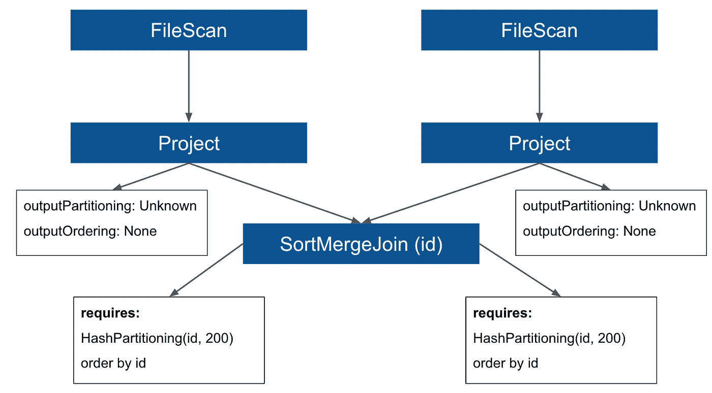
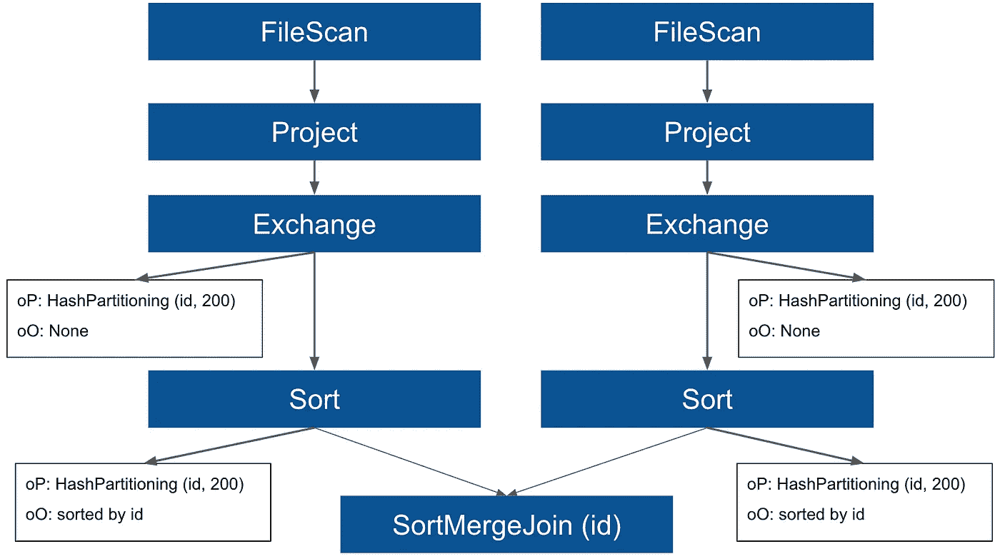
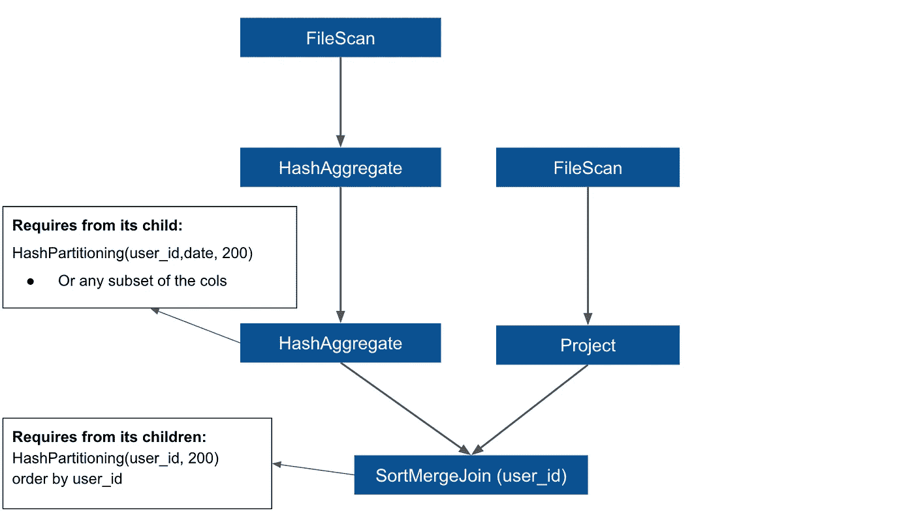
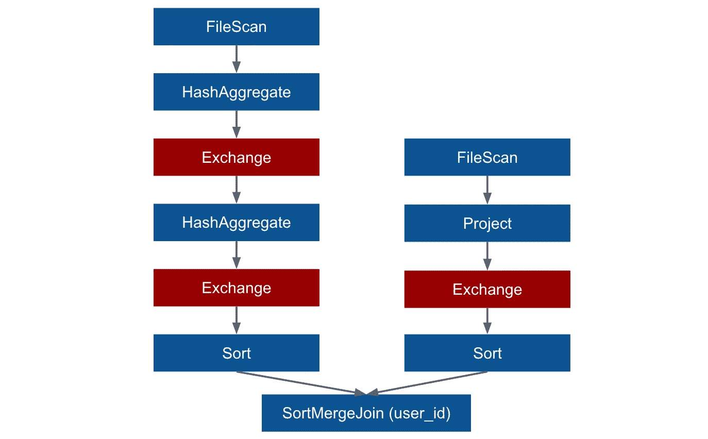
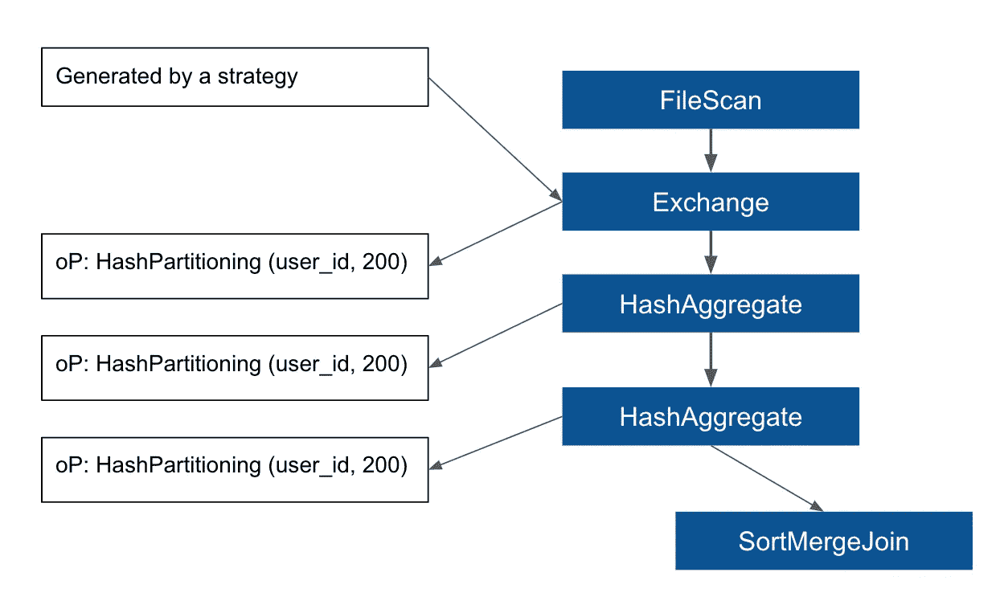
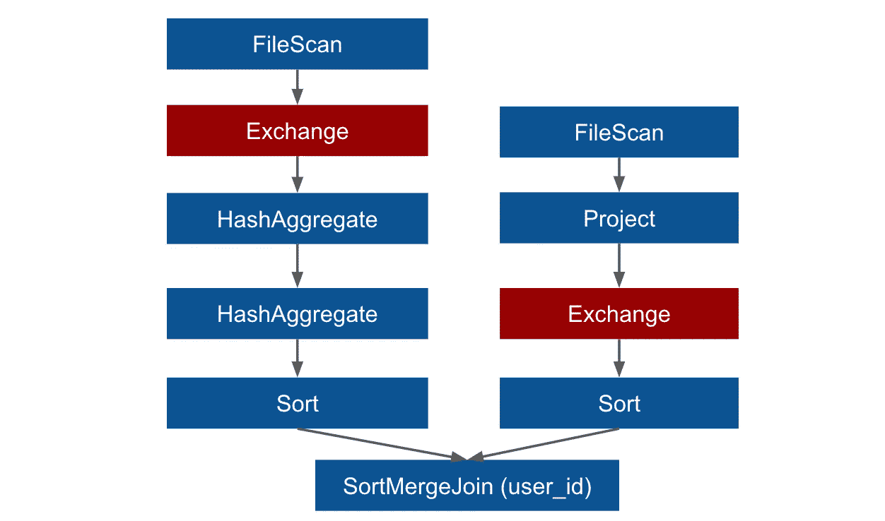
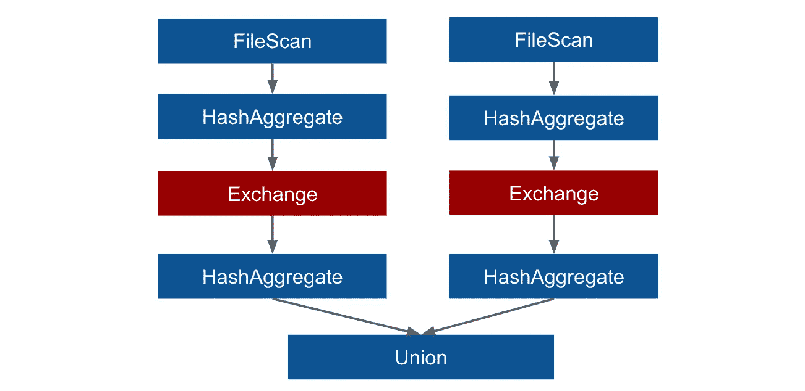
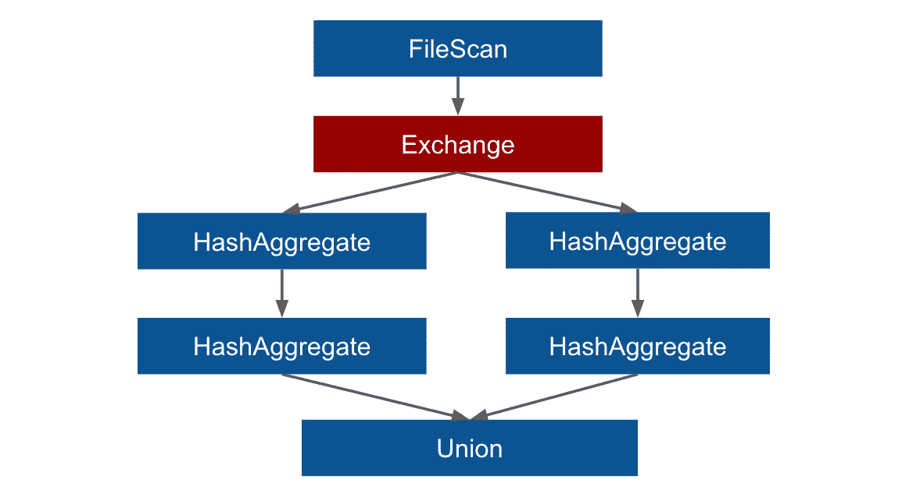

# 我应该重新分配吗？

> 原文：<https://towardsdatascience.com/should-i-repartition-836f7842298c?source=collection_archive---------1----------------------->

## 关于 Spark SQL 中的数据分布。

在分布式环境中，拥有适当的数据分布成为提升性能的关键工具。在 Spark SQL 的 DataFrame API 中，有一个函数 *repartition()* 允许控制 Spark 集群上的数据分布。然而，该函数的有效使用并不简单，因为改变分布与集群节点上物理数据移动的成本有关(所谓的混洗)。

一般的经验法则是，使用*重新分配*的成本很高，因为它会导致洗牌。在本文中，我们将更进一步，了解在某些情况下，在正确的位置添加一次洗牌将会删除另外两次洗牌，从而提高整体执行效率。我们将首先介绍一些理论，以理解 Spark SQL 如何在内部利用关于数据分布的信息，然后我们将查看一些使用*重新分区*变得有用的实际例子。

本文中描述的理论基于 Spark 源代码，该版本是当前的 snapshot 3.1(编写于 2020 年 6 月)，其中大部分内容在以前的版本 2.x 中也是有效的。此外，该理论和内部行为是与语言无关的，因此我们是将它与 Scala、Java 还是 Python API 一起使用并不重要。

## 查询规划

Spark SQL 中的 DataFrame API 允许用户编写高级转换。这些转换是懒惰的，这意味着它们不会被急切地执行，而是在幕后被转换成一个查询计划。当用户调用一个动作时，查询计划将被具体化，这个动作是一个我们要求一些输出的函数，例如当我们将转换的结果保存到某个存储系统时。查询计划本身有两种主要类型:逻辑计划和物理计划。并且查询计划处理的步骤可以相应地称为逻辑计划和物理计划。

## 逻辑计划

逻辑计划的阶段负责与逻辑计划相关的多个步骤，其中逻辑计划本身只是查询的抽象表示，它具有树的形式，其中树中的每个节点都是关系运算符。逻辑计划本身不包含任何有关执行或用于计算转换(如连接或聚合)的算法的特定信息。它只是以一种便于优化的方式表示来自查询的信息。

在逻辑规划期间，查询计划由 Spark 优化器进行优化，Spark 优化器应用一组转换计划的规则。这些规则大多基于启发式，例如，最好先过滤数据，然后再进行其他处理，等等。

## 物理计划

一旦逻辑规划得到优化，物理规划就开始了。这个阶段的目的是将逻辑计划转化为可以执行的物理计划。与非常抽象的逻辑计划不同，物理计划在关于执行的细节方面更加具体，因为它包含了在执行期间将使用的算法的具体选择。

物理规划也由两个步骤组成，因为物理规划有两个版本:*星火计划*和*执行计划*。使用所谓的*策略*创建*火花计划*，其中逻辑计划中的每个节点被转换为*火花计划*中的一个或多个操作符。策略的一个例子是 *JoinSelection* ，其中 Spark 决定使用什么算法来连接数据。可以使用 Scala API 显示*火花计划*的字符串表示:

```
df.queryExecution.sparkPlan // in Scala
```

在 *spark 计划*生成后，有一组附加规则应用于该计划，以创建物理计划的最终版本，即*执行计划*。该*执行计划*将被执行，生成 *RDD* 代码。要查看这个*执行的计划*，我们可以简单地调用数据帧上的*解释*，因为它实际上是物理计划的最终版本。或者，我们可以到 Spark UI 查看它的图形表示。

## 确保要求(ER 规则)

这些用于将 *spark 计划*转换为*执行计划*的附加规则之一被称为*确保需求*(接下来我们将称之为 *ER 规则*)，该规则将确保数据按照某些转换(例如连接和聚合)的要求正确分布。物理计划中的每个操作符都有两个重要的属性 *outputPartitioning* 和 *outputOrdering* (接下来我们将分别称它们为 *oP* 和 *oO* )，它们携带有关数据分布的信息，即在给定时刻数据是如何被分区和排序的。除此之外，每个操作符还有另外两个属性*required child distribution*和 *requiredChildOrdering* ，通过它们对其子节点的 *oP* 和 *oO* 的值提出要求。有些运营商没有任何要求，但有些却有。让我们在一个简单的例子中看到这一点，这个例子使用了 *SortMergeJoin* ，这是一个对其子节点有很高要求的操作符，它要求数据必须按照连接键进行分区和排序，这样才能正确合并。让我们考虑这个简单的查询，其中我们连接了两个表(它们都基于一个文件数据源，比如 parquet):

```
# Using Python API:spark.table("tableA") \
.join(spark.table("tableB"), "id") \
.write
...
```

这个查询的 *spark 计划*将会是这样的(我还在那里添加了关于 *oP* 、 *oO* 和 *SortMergeJoin* 的需求的信息):



从*星火计划*中我们可以看到 *SortMergeJoin* 的子节点(两个*项目*操作员)没有 *oP* 或 *oO* (他们是 *Unknown* 和 *None* )，这是一种数据没有提前重新划分，表没有分桶的一般情况。当 *ER 规则*应用于计划时，它可以看到 *SortMergeJoin* 的要求不被满足，因此它会将*交换*和*排序*操作符填充到计划中以满足要求。*交换*操作符将负责重新划分数据以满足*要求的子分配*要求，而*排序*将对数据进行排序以满足*要求的子排序*，因此最终的*执行计划*将如下所示(这也是您可以在 SQL 选项卡的 SparkUI 中找到的内容，您不会在那里找到 *spark 计划【T6*



## 桶装

如果两个表都由连接键存储，情况就不同了。分桶是一种以预混洗和可能的预排序状态存储数据的技术，其中关于分桶的信息存储在 metastore 中。在这种情况下， *FileScan* 操作符将根据来自 metastore 的信息设置 *oP* ，如果每个存储桶正好有一个文件，那么 *oO* 也将被设置，并且它将全部被传递到下游的*项目*。如果两个表都被连接键存储到相同数量的存储桶，那么将满足 *oP* 的要求，并且 *ER 规则*将不会向计划添加*交换*。这里，连接两端的分区数量相同是至关重要的，如果这些数量不同，*交换*仍然必须用于分区数量不同于*spark . SQL . shuffle . partitions*配置设置(默认值为 200)的每个分支。因此，有了正确的存储桶，连接可以是无洗牌的。

需要理解的重要一点是，Spark 需要知道要使用它的分布，所以即使你的数据已经用 bucketing 进行了预混洗，除非你将数据作为一个表来读取，以便从 metastore 中选择信息，否则 Spark 不会知道它，因此它不会在*文件扫描*上设置 *oP* 。

## 再分

如开头所述，有一个函数 *repartition* 可用于改变数据在火花簇上的分布。该函数将数据应该按其分布的列作为参数(可选地，第一个参数可以是应该创建的分区的数量)。幕后发生的事情是，它将一个*RepartitionByExpression*节点添加到逻辑计划中，然后使用一个策略将该逻辑计划转换为 *spark 计划*中的 *Exchange* ，并且它将 *oP* 设置为 *HashPartitioning* ，键是用作参数的列名。

*repartition* 函数的另一个用法是，调用它时只有一个参数，即应该创建的分区数量( *repartition(n))* )，这将随机分配数据。然而，本文没有讨论这种随机分布的用例。

现在让我们来看一些实际的例子，在这些例子中，使用*重新分配*按特定字段调整分配会带来一些好处。

## 示例 1:单向无洗牌连接

让我们看看，如果上述连接中的一个表被分桶，而另一个没有，会发生什么情况。在这种情况下，要求不被满足，因为 *oP* 在两侧是不同的(一侧是由铲斗定义的，另一侧是未知的*)。在这种情况下， *ER* *规则*会将*交换*添加到 join 的两个分支，因此 join 的每一端都必须进行洗牌！Spark 将简单地忽略一方已经被预先洗牌，并将浪费这个避免洗牌的机会。这里我们可以简单地在 join 的另一侧使用*重新分区*来确保 *oP* 在 *ER* *规则*检查它并添加*交换*之前被设置:*

```
*# Using Python API:
# tableA is not bucketed 
# tableB is bucketed by *id* into 50 bucketsspark.table("tableA") \
**.repartition(50, "id") \**
.join(spark.table("tableB"), "id") \
.write \
...*
```

*调用*重新分配*将向计划的左分支添加一个*交换*，但是右分支将保持自由洗牌，因为需求现在将被满足，并且 *ER 规则*将不再添加*交换*。所以在最终方案中，我们将只有一次洗牌，而不是两次。或者，我们可以改变混洗分区的数量，以匹配*表 B* 中的桶的数量，在这种情况下，不需要*重新分区*(它不会带来额外的好处)，因为 *ER 规则*将使右分支免于混洗，并且它将只调整左分支(以与*重新分区*相同的方式):*

```
*# match number of buckets in the right branch of the join with the number of shuffle partitions:spark.conf.set("spark.sql.shuffle.partitions", 50)*
```

## *示例 II:聚合后连接*

**重新分区*变得有用的另一个例子与查询相关，其中我们通过两个键聚集一个表，然后通过这两个键中的一个连接另一个表(在这种情况下，这两个表都不存储)。让我们看一个基于此类事务数据的简单示例:*

```
*{"id": 1, "user_id": 100, "price": 50, "date": "2020-06-01"}
{"id": 2, "user_id": 100, "price": 200, "date": "2020-06-02"}
{"id": 3, "user_id": 101, "price": 120, "date": "2020-06-01"}*
```

*每个用户在数据集中可以有许多行，因为他/她可能进行了许多交易。这些交易存储在*表 a 中。*另一方面， *tableB* 将包含每个用户的信息(姓名、地址等等)。*表 B* 没有重复，每条记录属于不同的用户。在我们的查询中，我们希望统计每个用户和日期的事务数量，然后加入用户信息:*

```
*# Using Python API:dfA = spark.table("tableA") # transactions (not bucketed)
dfB = spark.table("tableB") # user information (not bucketed)dfA \
.groupBy("user_id", "date") \
.agg(count("*")) \
.join(dfB, "user_id")*
```

*该查询的 *spark 计划*如下所示*

**

*在 *spark 计划中，*你可以看到一对 *HashAggregate* 操作符，第一个(在顶部)负责部分聚合，第二个负责最终合并。 *SortMergeJoin* 的要求与之前相同。这个例子中有趣的部分是*散列集合*。第一个没有来自其子项的要求，但是，第二个要求 *oP* 是由 *user_id* 和 *date* 或这些列的任何子集构成的 *HashPartitioning* ，这是我们稍后将利用的。在一般情况下，不满足这些要求，因此 *ER 规则*将添加*交换*(以及*排序*)。这将导致执行以下计划:*

**

*正如你所看到的，我们最终得到了一个有三个*交换*操作符的计划，所以在执行过程中会发生三次洗牌。现在让我们看看如何使用*重新分配*来改变这种情况:*

```
*dfA = spark.table("tableA").repartition("user_id")
dfB = spark.table("tableB")dfA \
.groupBy("user_id", "date") \
.agg(count("*")) \
.join(dfB, "user_id")*
```

**spark 计划*现在看起来会有所不同，它将包含由从逻辑计划转换*RepartitionByExpression*节点的策略生成的*交换*。此*交换*将是第一个 *HashAggregate* 操作符的子操作，它将把 *oP* 设置为*hash partitioning(user _ id)*，该操作将被传递到下游:*

**

*左分支中所有操作符的 *oP* 的要求现在都满足了，所以 *ER 规则*不会增加额外的*交换*(它仍然会增加 *Sort 到*来满足 *oO* )。本例中的基本概念是，我们按两列进行分组，并且 *HashAggregate* 运算符的要求更加灵活，因此，如果数据将按这两个字段中的任何一个进行分布，则要求将得到满足。最终执行的计划在左分支只有一个*交换*(右分支也有一个),因此使用*重新分配*,我们将洗牌次数减少了一次:*

**

## *讨论*

*的确，使用*重新分配*，我们现在在左分支中只有一次洗牌，而不是两次，但是重要的是要明白这些洗牌不是同一种类的！在最初的计划中，两个*交换*都发生在负责部分聚合的*哈希聚合*之后，因此数据在洗牌之前被减少(在每个节点上本地聚合)。在新计划中，*交换*出现在*散列*之前，因此完整的数据将被打乱。*

*那么什么更好呢？一次全洗牌还是两次减洗牌？这最终取决于数据的属性。如果每个 *user_id* 和 *date* 只有几条记录，这意味着聚合不会减少太多数据，因此总洗牌将与减少的洗牌相当，并且只有一次洗牌会更好。另一方面，如果每个 *user_id* 和 *date* 有很多记录，那么聚合将使数据变得更小，因此采用原始计划可能更好，因为这两次小洗牌可能比一次大洗牌更快。这也可以用这两个字段 *user_id* 和 *date* 的所有不同组合的基数来表示。如果这个基数与总行数相当，这意味着 *groupBy* 转换不会减少太多数据。*

## *示例三:两个聚合的联合*

*让我们再考虑一个例子，其中*重新分区*将优化我们的查询。该问题基于与前一个示例相同的数据。现在，在我们的查询中，我们希望对两个不同的聚合进行联合，在第一个中，我们将对每个用户的行数进行计数，在第二个中，我们将对 *price* 列进行求和:*

```
*# Using Python API:countDF = df.groupBy("user_id") \
.agg(count("*").alias("metricValue")) \
.withColumn("metricName", lit("count"))sumDF = df.groupBy("user_id") \
.agg(sum("price").alias("metricValue")) \
.withColumn("metricName", lit("sum"))countDF.union(sumDF)*
```

*以下是该查询的最终执行计划:*

**

*这是一个典型的类似 union 的查询计划，union*union*中的每个数据帧都有一个分支。我们可以看到有两次洗牌，一次用于一个聚合。除此之外，根据计划，数据集将被扫描两次。这里的*再分配*功能和一个小技巧可以帮助我们改变计划的形状*

```
*df = spark.read.parquet(...)**.repartition("user_id")**countDF = df.groupBy("user_id") \
.agg(count("**price**").alias("metricValue")) \
.withColumn("metricName", lit("count"))sumDF = df.groupBy("user_id") \
.agg(sum("price").alias("metricValue")) \
.withColumn("metricName", lit("sum"))countDF.union(sumDF)*
```

**

**重新分区*功能将在*聚集*之前移动*交换*操作符，并使*交换*子分支完全相同，因此它将被另一个名为 *ReuseExchange* 的规则重用。在 *count* 函数中，将星号更改为 *price* 列在这里变得很重要，因为这将确保投影在两个数据帧中是相同的(我们需要将 *price* 列也投影在左分支中，使其与第二个分支相同)。然而，只有在*价格*列中没有*空值*时，它才会产生与原始查询相同的结果。要理解这条规则背后的逻辑，请参见我的另一篇[文章](/be-in-charge-of-query-execution-in-spark-sql-c83d1e16b9b8)，在那里我用一个类似的例子更详细地解释了 *ReuseExchange* 规则。*

*与之前类似，我们在这里将洗牌的次数减少了一次，但是我们现在又有了一次总洗牌，而不是原始查询中减少的洗牌。这里的额外好处是，在优化之后，由于重用的计算，数据集将只被扫描一次。*

## *分布信息损失*

*正如我们已经提到的，不仅以最佳方式分发数据很重要，而且让 Spark 知道这一点也很重要。关于 *oP* 的信息通过计划从一个节点传播到它的父节点，但是，即使实际分布没有改变，也有一些操作符会停止传播信息。其中一个操作符是*BatchEvalPython*——一个表示 Python API 中用户定义函数的操作符。因此，如果您对数据进行重新分区，然后调用 Python UDF，然后进行连接(或一些聚合)，那么 *ER 规则*将添加一个新的*交换*，因为 *BatchEvalPython* 不会向下游传递 *oP* 信息。我们可以简单地说，在调用一个 Python UDF 后，Spark 会忘记数据是如何分布的。*

## *控制生成文件的数量*

*让我简单介绍一下*重新分区*功能的另一个使用案例，该功能用于在将数据分区和/或存储到存储系统时控制生成文件的数量。如果您正在将数据分区到一个文件系统，如下所示:*

```
*df \
.write \
.partitionBy(key) \
.save(path)*
```

*如果数据在 Spark 作业的最后阶段随机分布，它会产生很多小文件。最后阶段的每个任务都可能包含所有键的值，因此它将在每个存储分区中创建一个文件，从而生成许多小文件。在*写入*之前调用自定义*重新分区*允许我们模拟文件系统所需的分配，从而控制生成的文件数量。在以后的文章中，我们将更详细地描述这是如何工作的，以及如何有效地用于存储。*

## *结论*

**重新分配*功能允许我们改变数据在火花簇上的分布。这种分布变化会在底层诱发洗牌(物理数据移动)，这是一种相当昂贵的操作。在本文中，我们已经看到了一些例子，在这些例子中，这种额外的混洗可以同时删除一些其他的混洗，从而使整体执行更加高效。我们还看到，区分两种混洗非常重要，即完全混洗(移动所有数据)和简化混洗(在部分聚合后移动数据)。有时，要决定什么最终更有效，需要理解实际数据的属性。*