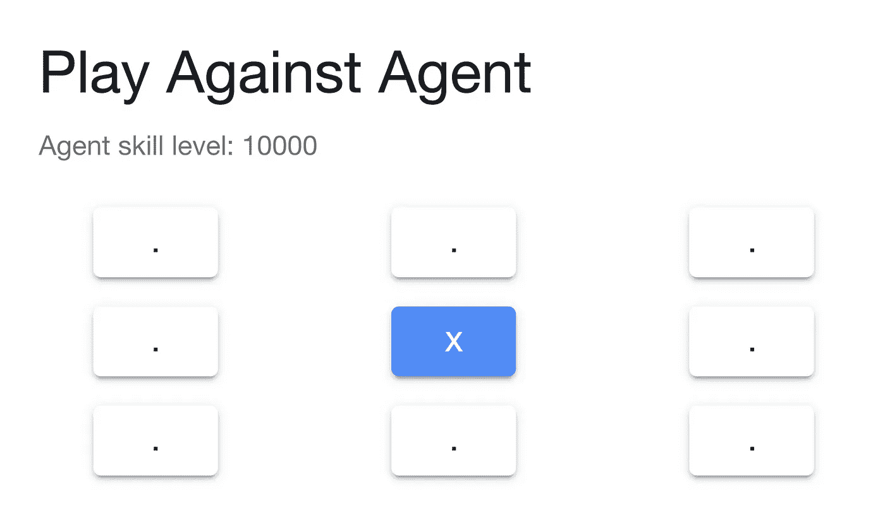
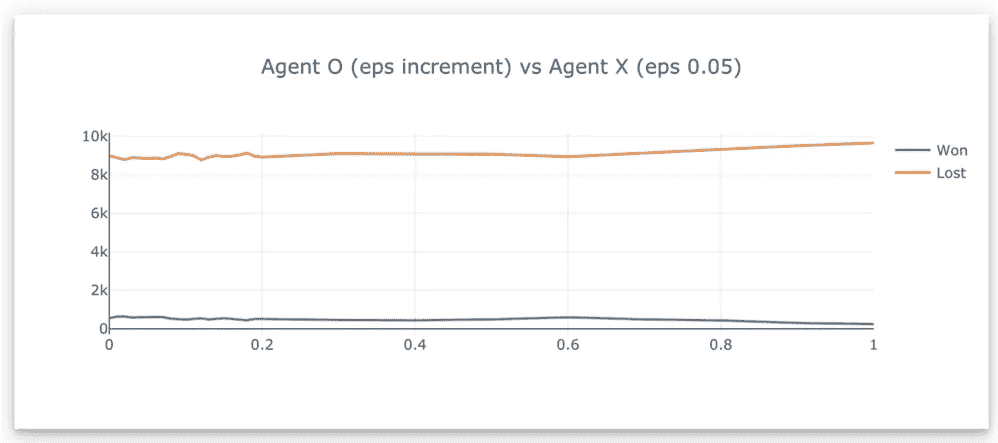

# 我应该留下还是离开

> 原文：<https://towardsdatascience.com/should-i-stay-or-should-i-go-463c6a976db3?source=collection_archive---------37----------------------->

## 困境是一个强化学习代理，米克·琼斯，甚至蜘蛛侠的斗争。

图片由 [DanaTentis](https://pixabay.com/users/DanaTentis-2743349/?utm_source=link-attribution&utm_medium=referral&utm_campaign=image&utm_content=2003647) 来自 [Pixabay](https://pixabay.com/?utm_source=link-attribution&utm_medium=referral&utm_campaign=image&utm_content=2003647)

> 我应该留下还是现在就走？
> 如果我走了，会有麻烦
> ，如果我留下，会有双倍的麻烦
> ，所以你必须让我知道
> 我应该留下还是离开？——[冲突](https://www.youtube.com/watch?v=BN1WwnEDWAM)

我们不都有这种感觉吗？对目前的工作不满意，但新工作薪水更低。不确定是投资股市还是理财平台？甚至蜘蛛侠也不得不在拯救玛丽·简和拯救缆车上的人之间做出选择。

困境是一种发生在头脑中的斗争。它是关于必须在两个或更多的选择中做出选择，在这些选择中，结果都是有利的或不利的。做出正确的选择可能会带来积极的结果，而做出错误的决定会让你付出代价。

在强化学习中，[机器学习代理](/reinforcement-learning-value-function-57b04e911152?source=friends_link&sk=fe8b20f046c2c67a1941bb896e1a3658)也面临两难，在探索和利用之间选择。在培训过程中，代理必须:

*   选择一些熟悉的东西，最大化获得奖励的机会
*   选择一些新的可能(也可能不会)导致未来做出更好决定的东西

# 在探索和开发之间取得平衡

找到探索(未知领域)和利用(现有知识)之间的平衡是训练一个成功的强化学习代理的关键。未知需要被发现来扩展现有的知识。已知的需要被开发，以产生回报。

这意味着，有时你不得不故意决定不选择你认为对获取新信息最有益的行动。尽管有时这意味着在探索的过程中最终会做出一些糟糕的决定。但与此同时，你想通过*利用*你所知道的最有效的方法来最大化你的回报。

那么，我们如何在充分探索未知和利用最佳行动之间取得平衡呢？

*   充分的初步探索，以便确定最佳方案
*   利用最佳选择使总回报最大化
*   继续留出一个小概率来试验次优和未开发的选项，以防它们在未来提供更好的回报
*   如果这些实验选项表现良好，算法必须更新并开始选择这个选项

有时候探索会让我们付出代价。红迪网

# ε贪婪

在强化学习中，我们可以决定一个智能体要花多少时间去探索。这是通过调整ε-greedy 参数来实现的，其范围从 0 到 1。

如果我们设置 0.1ε-greedy，该算法将在 10%的时间内探索，在 90%的时间内利用最佳选项。在大多数情况下，ε-贪婪参数值通常设置在 5%到 10%之间。

## 使用井字游戏代理评估不同的 greedy

我开发了一个[井字游戏](https://jinglescode.github.io/reinforcement-learning-tic-tac-toe/)，代理可以通过互相对战来学习游戏。首先，让我向你介绍我们的代理人，他们是代理人 X 和代理人 o。代理人 X 总是先走，这意味着代理人 X 有优势。

[你可以和我的井字游戏代理](https://jinglescode.github.io/reinforcement-learning-tic-tac-toe/)对战

**实验一。为了找出这个游戏中每个代理最合适的ε贪婪值，我将测试不同的ε贪婪值。我会初始化代理 X 探索 1% (eps 0.01)的时间，双方代理对战 10000 场，我会记录代理 X 获胜的次数。然后我会增加到探索，重复测试，直到 X 特工 100%的时间探索(eps 1.0)。**

代理 X 的结果(从 1%到 100%的探索)。vs 特工 O (eps 0.05)。蓝线代表代理 X 在不同探索率下赢得的游戏数。

代理 X 在不同的ε贪婪值上赢得的游戏数(10，000 个中的一个)

这说明探索率越高，X 特工胜率下降。当 X 特工探索 5%的时间时，它达到了赢得 9268 场比赛的顶峰。代理人 O 也开始赢得更多的游戏，因为代理人 X 探索超过 50%的时间。

> 5%的探索率是赢得大多数游戏的最佳选择

**实验二。让我们看看如果我们用一个最优的 5%ε贪婪初始化代理 X，代理 O 会怎么样。蓝线代表 O 探员赢的游戏数。**

代理 O 在不同ε-贪婪值下赢得的游戏数

好吧，特工 O 任何勘探率都没有胜算；它在学会游戏之前就已经输了大部分游戏。

**实验三。**让我们将代理 X 的 greedy 调整为 100%，这意味着代理 X 将一直玩随机动作。蓝线代表代理人 O 赢了随机代理人 x 的游戏次数。

代理 O 在不同ε-贪婪值上赢得的游戏数，其中代理 X 随机参与

代理人 O 在 30%勘探率后开始损失更多。

# 尝试演示

[探索在线演示](https://jinglescode.github.io/reinforcement-learning-tic-tac-toe/)，在井字游戏中挑战我们的强化代理。您可以调整参数来训练不同的代理。

了解井字游戏代理如何学习:

 [## 强化学习价值函数

### 代理使用价值函数学习井字游戏的强化学习算法——带网络演示

towardsdatascience.com](/reinforcement-learning-value-function-57b04e911152) 

如果您喜欢在线演示，您可能也会喜欢这个:

 [## 使用 TensorFlow.js 进行时间序列预测

### 从在线 API 中提取股票价格，并使用 RNN 和 LSTM 以及 TensorFlow.js 进行预测(包括演示和代码)

towardsdatascience.com](/time-series-forecasting-with-tensorflow-js-1efd48ff2201) 