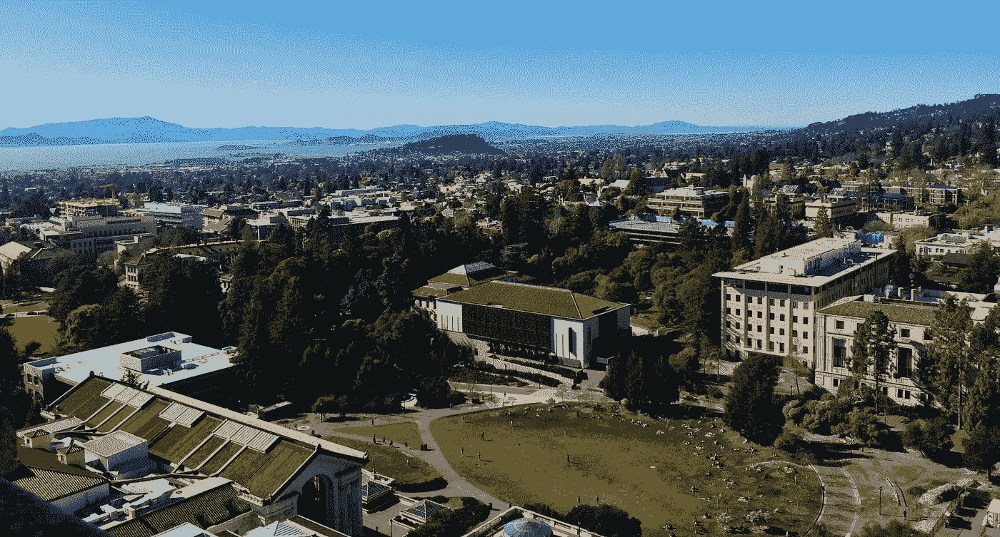
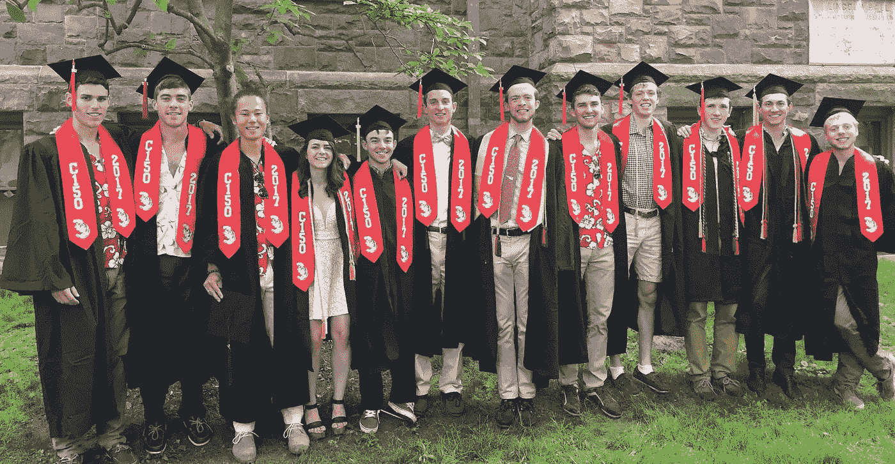

# 为什么顶尖计算机学院仍然是一项合理的投资

> 原文：<https://towardsdatascience.com/should-i-still-go-to-a-top-cs-school-now-182b624a3c7f?source=collection_archive---------60----------------------->

## 意见

## 让我们来谈谈麻省理工学院、史坦福大学、柏克莱大学和 CMU 大学的教育巨擘能带给虚拟桌面的好处。

每个人都知道大学的价值主张在过去的几个月里急转直下，所以我在这里谈谈为什么你仍然应该**考虑**去。我不打算关注文凭主义或从高中毕业、进入好大学、找到好工作的一系列好处。我在这里讲的是这些大学如何在团队中制造网络和能够创造价值的人。

我第一次来到伯克利校园。

# 人才集中

多年来，最好的学生一直在最好的学校上学。这条管道仍将继续。那些不是一年级的学生已经开始享受这项福利，我认为他们应该坚持下去。培育网络。

## 聚合、网络和友情

对于决定间隔年或不上学的高中生，我会说要小心行事。我看过的在线课程给你提供了一个单一的教育途径。高等教育最有价值的部分是你遇到的人和团队合作的能力。我称之为 **CS 网络效应—** 没有一个位置的最佳路径是单独建造。

软件工程职位都是关于分享代码片段，共同构建，并从数字工作的边际规模中获利。单独教育不会教你必须调整你的编码风格，以适应更大的协作。

如果你有兴趣了解更多，这里有很多关于高等教育对社会资本的益处的文章。我在这里肯定有偏见，但是我的朋友们改变了我的生活。(来源 [1](https://www.capturehighered.com/higher-ed/value-college-degree-may-come-social-capital/) 、 [2](https://www.stradaeducation.org/report/changing-the-value-equation-for-higher-education/) 、 [3](https://go.stradaeducation.org/from-college-to-life) 、 [4](https://www.theguardian.com/education/2020/mar/05/the-true-value-of-higher-education) )。

## 找工作

大公司从大学校招人。实习项目是未来员工的试用期。疯狂的支付率类似于未来服务的定金。在冠状病毒时代，这条管道仍在移动，并隐含着进入顶级 CS 学校的决定的一部分。

学位可以让你在招聘人员面前有所表现。多年来，脸书一半以上的新员工来自排名前十的学校([来源](https://www.timeshighereducation.com/student/news/which-colleges-do-facebook-google-and-other-top-employers-recruit))。这是一个数据点，但它并不孤单。

随着劳动力变得**遥远**，教育变得**分散**，个人变得**多样化**，在你的应用程序中拥有一个稳定的价值可能是一个巨大的胜利。利用网上学习专业化，让自己变得有价值，让公司无法忽视。我认为会有很多人决定不完成学业并为此后悔。

## 财务稳定性和能力

捐赠是一个强有力的工具(也是永久关闭的安全网)。学校有办法容纳学生，并发展他们的课程。(捐赠基金的)投资将继续赚钱。没有柏克莱，麻省理工，史丹福，CMU 等等。面临着不存在的风险，他们将缓慢而谨慎地改善他们的教育系统。他们将继续努力向学生传递价值。我预计秋季将继续创新。这一部分主要是猜测，但虚拟教育在一段持续的时间内对大学是一个存在的威胁，这推动了变化。

例如，我看到加州大学伯克利分校人工智能导论的课程工作人员制作了一个带有随机化和多种反作弊措施的在线测试工具。这是在不到一周的时间里。变化的累积压力(最终)会带来好的东西。

大多数好处听起来像是来自社会惯性的剩余好处——也就是说，人们习惯于去这些学校，因此去这些学校有隐含的好处。这些机构将继续利用这些主题。在过去，高等教育也有过其他的中断。

虽然一所新学校现在很难运转起来，但我认为有必要记住是什么让这些大学走到今天，以及价值主张的哪些部分仍然存在。幸运的是，在这个时代，计算机科学学位仍然是一项有价值的投资。一些幸运的少数人已经退出了他们的项目，但是做出这样的决定是非常短视的，他们是成功的少数。

# 限制

我需要知道这些成本是如何融入这幅画面的。我已经付完学费了，所以我说起来很容易。

## 直接成本

官僚主义，成本，实践的惯性，成本，成本。在每学期支付 30k 美元后，去一所大的大学将会给你带来很多小的可交付成果，规划年数和完成各种学位要求，处理过时的做法，等等。我认为这些不必要的后勤负担将成为学校成败的压力点。在线教育可以顺畅很多。付费做物流好像落后了。

> 当一家技术公司可以即时提供个性化的教育内容时，为什么有人要每天花几个小时处理大学官僚主义？

人民。从大学团体学习环境到个人赛道的代价是巨大的隔离。你仍然可以获得技能，但是很难把它放在更大的范围内。看看这些来源中的一些 [1](https://www.capturehighered.com/higher-ed/value-college-degree-may-come-social-capital/) 、 [2](https://www.stradaeducation.org/report/changing-the-value-equation-for-higher-education/) 、 [3](https://go.stradaeducation.org/from-college-to-life) 、 [4](https://www.theguardian.com/education/2020/mar/05/the-true-value-of-higher-education) 。

## 间接成本

这些改变政策的间接成本是代表名额不足的成员将被更多的学校过滤掉。当学生回家时，他们并不都有机会进入学习空间，无论是身体上还是精神上。我希望看到学校带来他们的捐赠来帮助学生体验正常化。为远程学习学生支付部分房租。像科技公司给新员工一样，送他们一台笔记本电脑。学院为学生提供全面的远程医疗。

> 在加州大学伯克利分校，获得治疗师的等待时间是几周，他们的带宽只够学生一学期检查 4 次(我在试图通过大学获得帮助时了解到这一点)。对于竞争激烈的大学和不稳定的世界来说，这还不够。

蓬勃发展的学校将会采取激烈的行动来确保这种新的教育形式是公平的。我们这些有空间的人需要对这个话题发表意见。另一篇关于这个话题的文章，还有一些[更多](https://www.edsurge.com/news/2018-07-17-does-online-education-help-low-income-students-succeed) [来源](https://www.nytimes.com/2020/04/09/business/online-learning-virus.html):

 [## 大学需要上网，但必须认识到学生之间的差异(观点)

### 对于许多未被充分代表的学生来说，在线学习是一条至关重要的途径，应该扩大。但是如果大学不明白如何…

www.insidehighered.com](https://www.insidehighered.com/digital-learning/views/2019/04/10/colleges-need-go-online-must-recognize-how-different-students-are) 

这就是我家交学费的目的。这些朋友将改变世界。

我没有提到的主要缺点是成本。我没有一个好的方法来平衡我讨论的优势和明显的经济负担，但这正是个人的切入点。如果你负债累累，也许不值得。

 [## 自动化大众化

### 一个关于机器人和人工智能的博客，让它们对每个人都有益，以及即将到来的自动化浪潮…

robotic.substack.com](https://robotic.substack.com/)