# 书评的顺序应该个性化吗？

> 原文：<https://towardsdatascience.com/should-the-order-of-book-reviews-be-personalised-9d62ebf9ba33?source=collection_archive---------45----------------------->

照片由[阿尔方斯·莫拉莱斯](https://unsplash.com/@alfonsmc10?utm_source=medium&utm_medium=referral)在 [Unsplash](https://unsplash.com?utm_source=medium&utm_medium=referral) 拍摄

我总是在购买一本书之前阅读书评，我经常发现自己不知道我应该给它们多少权重。就他们通常阅读的体裁以及他们如何评价这些体裁而言，评论者与我有多相似，因此他们的经历在多大程度上反映了我的经历？

*注意:如果你只想看到推荐系统的结果，并想跳过过程的细节，请跳到最后的结果部分。所有的代码都在* [*GitHub*](https://github.com/sangeethaveluru3/book-review-recommender) *上。*

# 项目目标

目前，评论是根据喜欢/有用投票的数量或评论者排名来排序的，在推荐系统的时代，观察个性化评论排序的效果也将是有趣的。

所以这个项目的目的是建立一个书评推荐系统— *这个系统不仅向用户推荐书籍，而且按照与该用户最相似的书评家的顺序对每个书籍推荐的现有书评进行重新排序*。

虽然这个项目将只考虑书籍，但这可以扩展到其他产品，尤其是体验比产品功能更重要的产品。

# 获取数据

我使用了 USCD 大学 Julian McAuley 和他的团队提供的亚马逊书评数据集，特别是 2014 年 5 核书评数据集和相应的图书元数据，包含 14 年的评论。我花了项目的大部分时间来研究存储、清理和重新设计数据集的方法，但我意识到我的数据清理困境的细节并不令人兴奋，所以我将在[我的 GitHub](https://github.com/sangeethaveluru3/book-review-recommender) 上为那些感兴趣的人保存细节。

在清理和压缩数据集之后，我有了大约 270，000 行评论，其中只包含那些写了至少 50 条评论的用户。每个审查都包含以下信息:

*   **审核人 ID**
*   **阿辛(图书 ID)**
*   **评级** — *整数刻度，1 至 5*
*   **复习总结**——*为了节省记忆把剩下的都落下了*
*   **总投票数** — *衡量点评的受欢迎程度，这决定了个性化应用前点评的顺序。这最初是作为有用投票与总投票的比率提供的，但是由于一些评论没有有用投票，并且有用投票和总投票的分布是相似的，所以我决定只使用总投票作为衡量标准。*

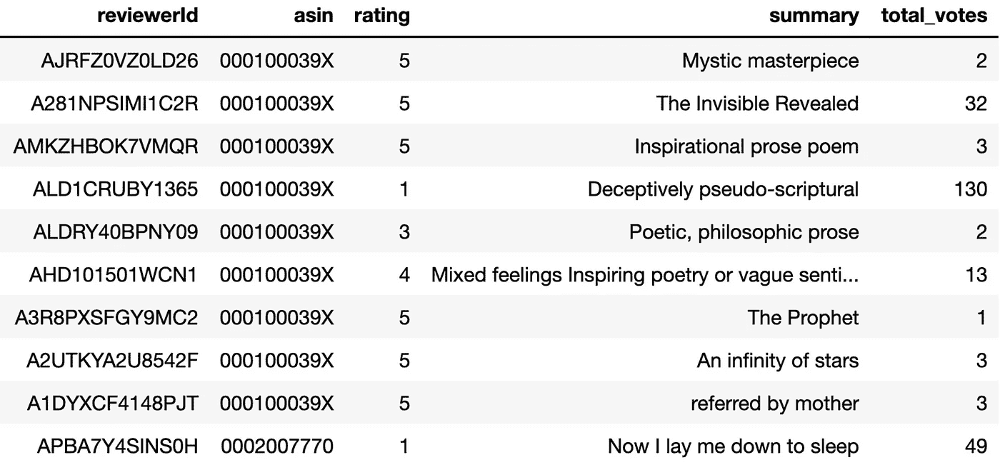

书评数据集的快照

图书元数据数据集包含描述、类别等，不一致且混乱，因为并非所有的图书都有元数据信息，而对于有元数据信息的图书，由于它们最初在亚马逊上的列出方式，一些信息是模糊或不正确的。

例如，一些书只有“文学与小说”的标签，这是一个流行的分类标签，这使得很难区分书籍。这使得判断推荐系统的结果更加困难，我们将在后面看到。

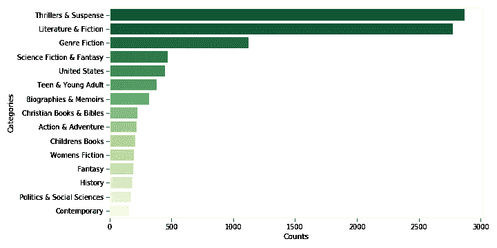

前 15 类书籍

# 探索数据—随着时间的推移，人们变得越来越刻薄…

一般来说，人们似乎给书很好的评价，因为数据非常倾向于更高的评价(4 或 5 星)。一个不利之处是，这将使区分用户偏好和计算相关用户相似性变得更加困难。

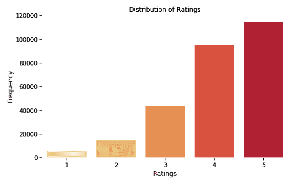

负面评论似乎也获得了更多的关注，因为每个评级类别的平均总票数(喜欢)在 1 星和 2 星评论中最高。这可能会不公平地将负面评论推到首位。

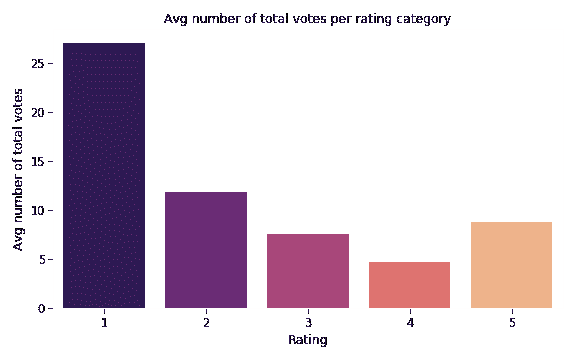

从 2000 年到 2014 年，评论者对他们的评论变得更加苛刻，平均评分从大约 4.25 下降到大约 3.9。有趣的是，2007/2008 年的平均收视率大幅下降，这与金融危机相吻合…

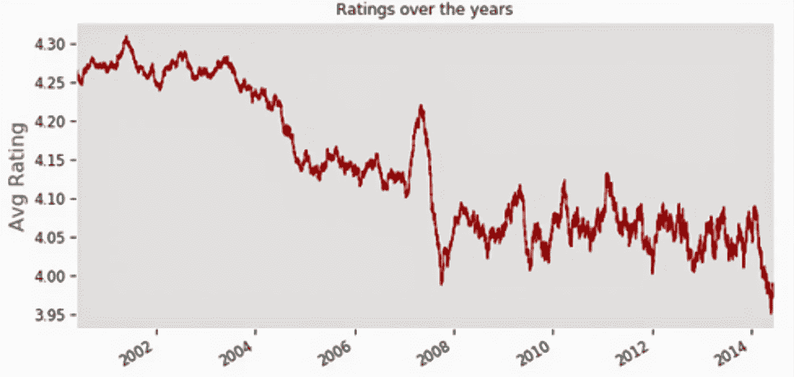

# 推荐系统的类型

有 3 种主要类型的推荐系统:

*   **基于内容的方法:**基于内容的方法使用关于用户或项目特征的信息来推荐项目，基于用户先前喜欢的类似项目或在类似用户中受欢迎的项目。
*   **协同过滤(使用显式或隐式数据的基于记忆和模型的方法):**协同过滤方法使用先前的用户-项目交互，例如评级，来寻找相似的用户或项目(基于记忆)或预测未知的评级(基于模型)以生成推荐。
*   **混合模式:**两种方法的混合

对于那些对不同类型的推荐系统有兴趣的人来说，这里有一篇很棒的文章。

这两种类型的主要区别在于它们处理的数据。在这种情况下，我们有过去的用户-项目交互、评级(显式数据)、vs 项目和用户特征(本质上是元数据)，因此我们可以使用协作过滤方法——基于内存和模型的方法——使用[惊喜库](http://surpriselib.com/)，它提供了一系列算法来构建推荐系统。

# 推荐系统的基础

为了更好地了解推荐系统是如何工作的，在使用来自 Surprise 的更高级的方法之前，我首先从头构建了一个基本的系统— *在另一篇文章*中，我将一步一步地介绍用 Python 构建基本推荐系统的过程。

使用协同过滤(基于模型)的推荐系统背后的基本思想是使用所有已知的评级(用户已经评级的书籍)并通过计算信息来预测未知的评级(用户还没有评级的书籍)，这些信息例如是他们过去如何对书籍进行评级、用户通常如何对该书进行评级以及根据算法使用来自相似用户或项目的评级。

一旦我们有了这些预测评分和完整的用户项目偏好矩阵，我们就可以对每个用户的预测评分列表进行排序，以获得评分最高的书籍，这将形成对该用户的推荐。

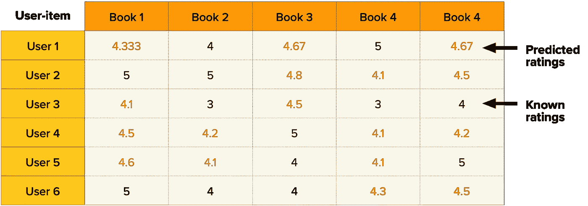

一个完整的用户项目矩阵，其中模型使用已知评级来计算未知评级

对于每一本书的推荐，**我们可以通过计算评论者和用户之间的用户相似度来重新排序该书的现有评论。我们可以通过计算每个评论者和用户之间的余弦相似度来做到这一点。然后，我们可以根据最相似的评论者对评论进行重新排序，这样，出现在顶部的评论是由与用户最相似的评论者撰写的。**

为了形象化余弦相似性是如何工作的，如果我们想象上表中的每个用户行是图书评级的向量，我们可以通过计算所有向量(用户行)之间的余弦距离(角度)来计算出哪些向量彼此“最接近”，如下图所示。余弦相似度就是 1-余弦距离。

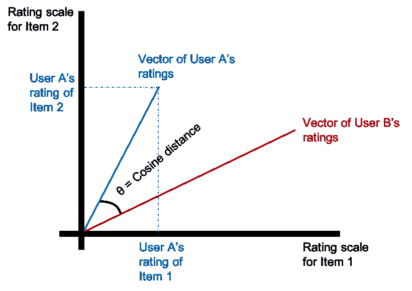

余弦相似性如何指示用户相似性的可视化表示。书籍评级的向量越相似，角度就越小，因此用户被计算得越相似。

# 利用惊奇发现最佳模型

[惊喜](http://surpriselib.com/)是一个简单易用的 Python [scikit](https://www.scipy.org/scikits.html) 用于推荐系统。在从零开始构建一个基本的推荐系统后，我测试了 Surprise 提供的所有更高级的算法，并根据 RMSE 评分选择了最好的 3 个模型，通过超参数调整进一步优化。

如下图所示，在彻底搜索前 3 个模型以找到最佳超参数后，BaselineOnly、SVD(由于拟合时间而选择 SVDpp)和 KNNBaseline，**baseline only 模型以 0.85279** 的 RMSE 分数名列第一，这里的 RMSE 分数告诉我们，平均而言，该模型的平均误差约为 0.85 个评级点。欲了解这些不同型号的更多信息，请查看[惊喜文档](https://surprise.readthedocs.io/en/stable/)。

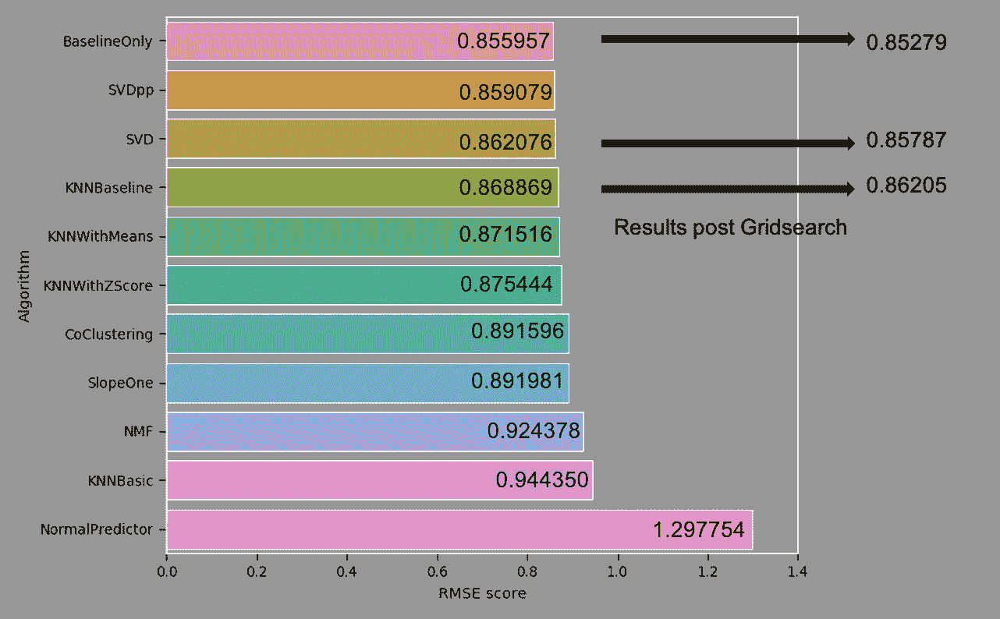

条形图显示每个算法的 RMSE，以及调整后前 3 名算法的最佳 RMSE

# 推荐前 10 本书并测量精度@k 和召回@k

在运行获胜的 BaselineOnly 模型并生成完整的用户项目矩阵后，我们可以为每个用户挑选该用户尚未阅读的前 10 本书(由无评级表示),方法是对预测评级列表进行排序，找到前 10 个评级。

为了防止推荐系统只推荐最受欢迎的书籍，我首先为每个用户挑选了排名前 15 位的书籍，从中我随机选择了 10 本书。**这将覆盖率(所有用户推荐的前 10 本图书/图书总数)从 6%提高到了 10%。**

除了 RMSE 评分之外，我们还可以通过测量每个用户的 Precision@k 和 Recall@k 来衡量我们的推荐系统有多好，其中 k 是您正在进行的推荐的数量(在我们的例子中是 10)。它们被定义为:

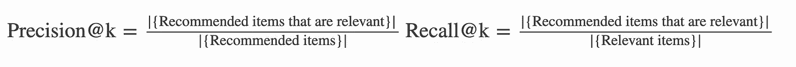

摘自[惊喜文档](https://surprise.readthedocs.io/en/stable/index.html)

如果一个项目的真实评级大于给定的阈值，则该项目被认为是相关的，因此这只能通过已知评级来实现，因为我们不知道未知评级的真实评级是什么。

**在这种情况下，我将相关性的阈值设置为 4 星，这使我的精确度为 0.9 @ 10，召回率为 0.3 @ 10。** 0.9 Precision@10 是一个高分，表明推荐引擎通常推荐真实评分为 4 或更高的合适书籍，但这也可以很容易地用评分分布偏向 4 或 5 星的事实来解释。

然而，0.3 的回忆@k 分数表明只有大约三分之一的相关书籍(4 星或更高)被推荐。我们已经从排名前 15 的书中随机抽取了 10 本书来提高覆盖率——这也将提高 Recall @ k——但我们可以测试更复杂的方法来提高这些分数，并带来更多种类的推荐。

# 计算用户相似度并衡量影响

现在我们有了书籍推荐，对于每一个推荐，我们可以获取该书的现有评论，并计算这些评论者和推荐所针对的用户之间的余弦相似性。一旦我们有了余弦相似性，我们就可以根据最相似的评论者对评论重新排序，这样出现在顶部的评论是由与用户最相似的评论者撰写的。

因为通过一个例子更容易解释，所以让我们以用户 A3UDYY6L2NH3JS 为例，为了方便起见，简称为 Alex，并以他们推荐的书籍之一 asin: 0575081384 或以其他方式称为风的名称:王者杀手编年史为例。

如果 Alex 在 Amazon 上查找这本书，我们可以通过按总票数排序来估计当前的评论顺序，如下图所示-实际上，还会考虑书评人的排名。然后，我们可以计算所有审阅者与 Alex 之间的余弦相似性，并根据与 Alex 最相似的审阅者进行重新排序，以观察审阅顺序如何变化——结果显示在最后的结果部分。

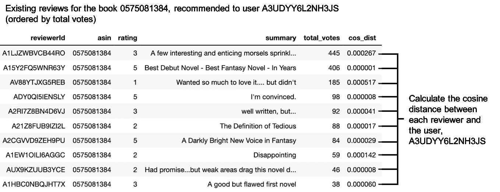

现有的书评、风的名称以及它们出现的当前顺序

**对于每个用户的每本书推荐，这是重复的。**为了衡量推荐系统在推荐书籍方面的表现，我们使用了 RMSE 评分。然而，衡量基于用户相似性重新排序评论是否对用户个人有帮助要困难得多，因为我们需要用户告诉我们。因此，我决定为自己定义一些指标，尝试从数字上判断重新排序的影响:

1.  **评分差异:**重新订购前后前 10 条评论总和的差异，因为大多数顾客从未阅读过前 10 条评论。*计算所有图书推荐及其现有图书的这一指标表明，对评论进行重新排序将意味着前 10 篇评论平均增加 1.34 颗星，这可能对卖家有利。*
2.  **等级差异:**重新排序前后评分与评审等级乘积之和的差异。*很难从这一指标中推断出太多东西(结果是 11.6)，但事实证明，这在寻找书评在重新排序中变动最大的书籍时非常有用。*
3.  **前后评论排名的皮尔逊相关性**(本质上是前后评分的斯皮尔曼相关性)。*0.48 的平均相关系数表明，重新排序将评论移动到足够低的相关性，这提出了一个问题，即最受欢迎的评论是否一定与每个人相关。*

这些衡量标准并不完美，但帮助我评估了评审中是否有任何变动以及变动的程度。

# 可视化结果

虽然我们有很多方法可以使用 RMSE、覆盖率、Precision@k、Recall@k 和我上面定义的其他指标来从数字上衡量推荐系统的有效性，但我们也可以通过查看示例来感觉检查推荐引擎——总是更有趣！

我们还是坚持用户 A3UDYY6L2NH3JS，简称 Alex。下图左侧和右侧显示了 Alex 过去评价过的书籍，即推荐系统推荐的书籍。

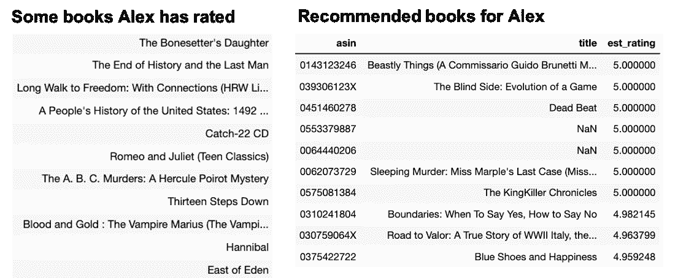

Alex 过去评价过(因此读过)的书的子集与模型推荐的书的子集

**通过翻看亚历克斯过去评价过的一些书，我们可以看出亚历克斯喜欢惊悚、科幻和历史文学。这一点在已推荐的书籍中也有所体现** — *由于书籍元数据不完整，推荐中遗漏了部分书名信息。*

从流派分类来看，没有明显的相似流派被推荐。这主要是由于图书元数据不完整和混乱，没有为每本书正确标记流派，一些书只有宽泛的标签，如“文学和小说”。

*请注意，元数据不完整或不一致不会影响模型推荐书籍的能力，因为模型只需要过去的用户交互数据就可以工作，从中可以推断出要推荐的类似书籍。元数据不完整只会给可视化结果带来不便。但是不管怎样，通过分析书名，你可以看到这个模型推荐的书与 Alex 过去读过的书风格相似。*

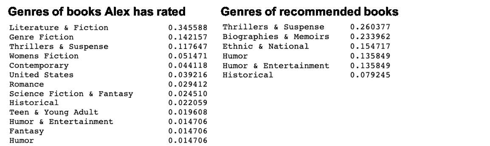

Alex 过去读过的书籍的流派分类与推荐系统推荐的书籍流派

现在，让我们从推荐列表中选择一本书,《风之名:弑君者编年史》( asin: 0575081384 ),并查看该书的现有评论以及如果 Alex 在亚马逊上查找该书，它们当前出现的顺序。

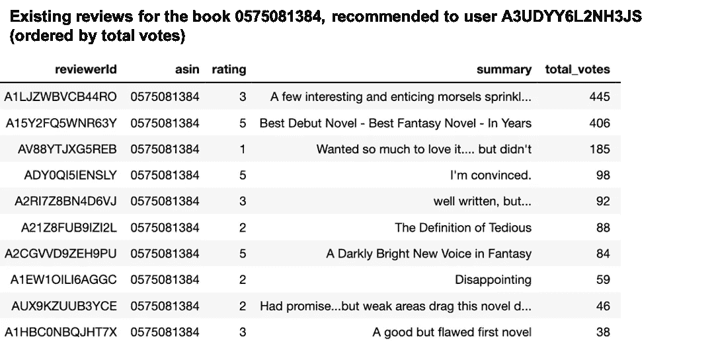

注意:此处仅显示前 10 条评论

看看前 10 名的评论(就投票而言)，这似乎是一个大杂烩，可能会让亚历克斯对购买这本书持观望态度。但是如果我们现在重新排列评论，按照与 Alex 最相似的评论者的顺序，它显示了一个非常不同的故事…

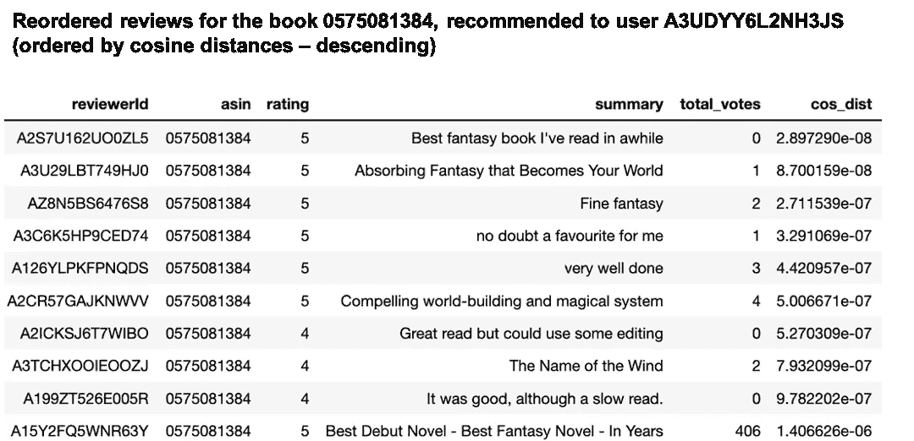

注意:此处仅显示前 10 条评论

与 Alex 最相似的前 10 位评论家给这本书打了 4/5 星，而在重新排序之前，这本书的评论褒贬不一。如果亚历克斯先看到这些评论，他们可能会更有兴趣购买这本书。

查看评论者之前阅读的书籍类别，与 Alex 最相似的评论者在重新排序前阅读了更高比例的科幻和奇幻小说。但是考虑到不一致的元数据，很难从类型分类中得出更多的结论。

# 最后的想法

总而言之，这个项目是了解更多关于推荐系统的好方法。虽然我认为个性化评论的顺序很有趣，但我仍然认为这应该只是对评论排序计算的一部分，因为评论者的排名和喜欢/投票的数量对于保持出现在顶部的评论的质量也很重要。我的项目只是旨在观察增加个性化以增强用户体验的效果。

这个项目只是这种想法的第一步，我有几个想法想进一步完善这个模型:

*   使用更广泛的书评和元数据数据集(如【GoodReads 数据集)和 AWS 来改进推荐引擎，并更准确地评估重新排序的影响
*   使用[本文](https://www.ncbi.nlm.nih.gov/pmc/articles/PMC4735905/)中详述的评论文本上下文分析，以包括评论本身的细节，并可能改进评级预测
*   定义更好的指标来衡量个性化评论的影响

***感谢您的阅读，我一如既往地欢迎任何反馈/想法——请通过***[***LinkedIn***](https://www.linkedin.com/in/sangeetha-veluru/)***联系我！***