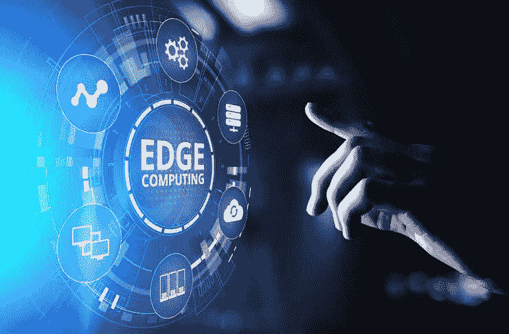
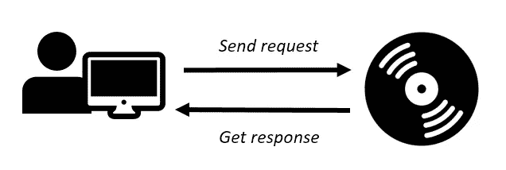
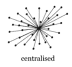
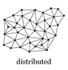
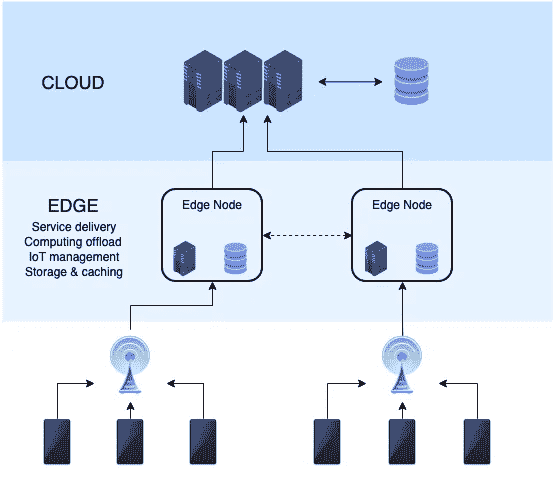

# 是否应该抛弃云计算，拥抱边缘计算？

> 原文：<https://towardsdatascience.com/should-we-abandon-cloud-computing-and-embrace-edge-computing-971228e3dae4?source=collection_archive---------50----------------------->

## 边缘计算正在呈指数增长，但它是什么，如何使用，在哪里使用，它会取代云吗？

[赖特工作室](https://www.shutterstock.com/g/Kirill+Wright)拍摄于 [Shutterstock](https://image.shutterstock.com/image-photo/edge-computing-modern-technology-on-600w-1282709413.jpg)

# 介绍

这篇文章有望向您介绍边缘计算。我们将把它与云计算进行比较，讨论它的主要优缺点和一些使用案例。顶端的樱桃:文章最后对边缘计算的预测，以及云计算是否会被边缘计算淘汰。

云计算现在已经深入我们的日常生活。不管你是否意识到，你现在可能正在使用它。从显而易见的在线云存储(想到 Dropbox 和 OneDrive)、通信服务(电子邮件&消息)、数字助理(Siri、Alexa、谷歌助手)，到娱乐内容提供商(Spotify、网飞……)。

这些服务是集中的。无论您何时发送请求，它都会被发送到云提供商，经过处理后返回给您。简单地说:

作者创作—Raul Almu 在 [Shutterstock](https://www.shutterstock.com/image-vector/cloude-flat-icon-single-high-quality-741196795) 上创作的右侧图像

非物质化的程度在过去几十年中有所提高。这与以前使用物理存储的模式不同，想象一下访问 CD/DVD:

作者创作 PNG 创作的右侧图像([来源](https://www.pngrepo.com/png/149623/180/music-disc-with-white-details.png))

在这两个极端之间，现在出现了另一种范式:边缘计算。

## 什么是边缘计算？

边缘计算可以定义为“集中式云计算的本地分布式扩展”。

## 它在图中的什么位置？

要了解边缘计算的地位，我们先来对比一下云计算。

**云计算是集中式的:**

*   所有者/管理者:大部分云计算由四家公司管理——亚马逊、微软、谷歌和 IBM，
*   区域:数据存储在数据中心，
*   数据处理:处理/计算在数据中心进行。

罗伯特·怀特在 Focus-works.com 拍摄的图片

**边缘计算是分布式的:**

*   所有者:一家公司可以拥有一台边缘服务器，并将其安装在本地，
*   区域:数据存储更靠近用户位置(在‘网络边缘’)，在需要的地方，
*   数据处理:大部分数据处理发生在分布式设备节点(IoT 设备——物联网)，或者本地。数据中心因此变得可有可无。

此外，它还通过物联网设备*与物理世界互动，例如*传感器和摄像头(稍后将详细介绍)。

罗伯特·怀特在[Focus-works.com](https://images.squarespace-cdn.com/content/v1/576be1a246c3c4053af75666/1528294508702-8159DYHKQALU0OMWGBHY/ke17ZwdGBToddI8pDm48kC62HzMIZnpcVnuifibbYHpZw-zPPgdn4jUwVcJE1ZvWQUxwkmyExglNqGp0IvTJZUJFbgE-7XRK3dMEBRBhUpxDUAIHW_6m2qdjxEcF4NMVCXi2v1gGAlPkBH1xvKzKHwLUJuT4XxA2_CMtR2zfhHE/Centralized+vs+Distributed+network.JPG?format=1000w)拍摄的图片

**云和边缘计算如何互动？**

由 NoMore201 创建— CC BY-SA 4.0，在[维基百科](https://commons.wikimedia.org/w/index.php?curid=82034067)

*   从底部的三分之一开始，我们看到物联网传感器交互并从物理世界收集数据。
*   在中间，数据在本地边缘服务器上处理。这些数据可以在其他边缘服务器之间存储和交换。请注意，在某些情况下，数据的处理可能已经发生在物联网设备层面。
*   云层在这里是可选的，它在任何繁重的处理过程中充当支持，或者用于存储历史数据。

现在，让我们回顾一些边缘计算的使用案例，以了解它在未来可能会颠覆哪些行业。

## 边缘计算的应用和使用案例

制造、零售和智能城市是边缘计算实施的三个主要潜在领域。

*   **制造:**在整个生产周期中，放置在不同机器上的大量传感器用于测量速度、温度、化学品或溶液的浓度水平。传感器收集的数据可用于预测性维护、预测任何刹车以及进行库存管理。
*   **零售:**库存跟踪&管理，优化库存、物流和跟踪。
*   **智慧城市:**可以通过物联网摄像头分析行人流量，使用传感器管理停车场，使用物联网摄像头优化交通灯，以及联网车辆。

现在让我们来看看边缘计算的优势和劣势。

## 优势

*   **金融**

照片由[米歇尔·亨德森](https://unsplash.com/@micheile?utm_source=medium&utm_medium=referral)在 [Unsplash](https://unsplash.com?utm_source=medium&utm_medium=referral) 上拍摄

金钱几乎是一切事物的核心。对于边缘计算为什么会成为使用云计算的环境的有趣替代或补充，这并不令人惊讶。使用 edge 的一些好处可以减少:

1.  云和存储成本
2.  带宽使用

此外，通过在本地处理信息，可以提高反应速度和决策能力。根据一些估计，与云解决方案相比，成本可以降低三分之一。

*   **网络安全**

丹·尼尔森在 [Unsplash](https://unsplash.com?utm_source=medium&utm_medium=referral) 上拍摄的照片

用户和组织越来越关注安全性和隐私。边缘计算在这个问题上也有自己的观点:

1.  本地分析—分析现在在本地进行，即物联网设备(传感器/摄像机)和本地边缘服务器之间的数据流。
2.  有限的传输——当使用常规云解决方案时，整个数据流必须加密并发送到数据中心，进行解密和处理，然后将结果返回给机器或用户。使用边缘计算，计算在本地发生，在物联网设备或边缘服务器的级别，唯一的传输将是返回的结果。

*   **主权** **&合规**

马库斯·斯皮斯克在 [Unsplash](https://unsplash.com?utm_source=medium&utm_medium=referral) 拍摄的照片

随着时间的推移，这两个因素变得越来越重要。在竞争激烈的世界中，数据是一项关键资产。领导者希望保留对这一关键组件的监管，同时遵守现有的法规。

1.  对个人数据的主权可以通过边缘计算等本地解决方案来实现。尽管通过使用云解决方案，用户确实保留了其数据的所有权，但这可能会让领导者放心，因为他们的数据“触手可及”，而不是远在数据中心。
2.  边缘计算还通过将数据存储和处理等事项保持在本地，使其更容易遵守数据法规(GDPR 和其他法规)。

*   **更快的部署**

除了成本，解决方案的部署速度也是公司尽快获得收益的一个重要因素。

工业领域的部署预计只需 6 个月，而其他解决方案则需要 24 个月。更快的部署还意味着更低的成本和可以更快利用的新工具，以便做出更好、更快的决策。

*   **高反应性**

使用边缘服务器进行本地数据处理意味着快速处理，远离对远程数据中心的依赖。有限的数据批次上的反应性差异可能不明显，但是在要传输的批次很大的情况下，本地边缘服务器会有所不同。

当涉及到关键决策的高反应性时，如自动驾驶汽车，边缘计算也将具有…优势。双关语。无人驾驶汽车正在从无数传感器收集数据，远程数据中心没有时间审查信息并返回警告以踩刹车。

*   **交通**

杰克·吉文斯在 Unsplash 上的照片

想象一个由相互连接的监控摄像头组成的网络。他们不断地向数据中心传输信息，在数据中心对信息进行分析，看是否有入侵行为。如果每个摄像机都以 6 MB/s 的速率传输，这又会增加房屋带宽使用的负担，并会降低企业的正常运营速度。数据流到达数据中心进行处理，如果怀疑有入侵行为，就会向用户发回警报信息。

借助边缘计算，记录的分析将在配有机器视觉功能的单个物联网摄像机内进行。在任何可疑入侵的情况下，摄像机将简单地发送一个警报消息，这只是几个字节对 6 Mb/s 的流。

## 不足之处

这是一个很好的优势列表，但人们应该保持批判的头脑，不要把这些优势视为理所当然。对能源成本、安全性、部署速度的宣称可以经受考验，时间会证明它们是否站得住脚。人们应该提出以下几个问题:

*   降低能源成本的说法是真的吗？他们能撑得住吗？

近年来，冷却数据中心的能效有了重大改善，例如“ [*”谷歌刚刚将数据中心冷却的控制权交给了人工智能*“](https://www.technologyreview.com/2018/08/17/140987/google-just-gave-control-over-data-center-cooling-to-an-ai/)”。

*   **迁移到边缘计算会不会让组织变得更加脆弱？**

随着物联网设备网络的实施，向边缘计算的转移意味着用于监控、修补和更新以防止网络攻击和降低风险的资产网络正在扩大。此外，物联网安全是物联网对象的已知风险和顾虑 **⁴** 。

我在这篇文章中讨论了这个问题:

 [## 物联网时代的网络安全:保持安全的一些简单步骤

### 物联网正迅速进入我们生活的各个领域。你的新收音机，你的真空机器人，你的新…

medium.com](https://medium.com/@godfroidmaxime/cyber-security-in-the-time-of-iot-some-simple-steps-to-stay-safe-17a73b10bc0b) 

*   **部署速度的说法会被验证吗？**

人们应该记住，当前对快速部署的宣称是由提供商提出的。这被用作一个强有力的卖点。边缘计算领域尚未成熟，时间将提供支持或拒绝这些说法的证据。

## 预测和趋势

*   今天，互联网和云计算主要由美国和中国公司主导。你可能已经猜到了哪些是美国公司。

Photo 黑客在 IphoneHacks.com[拍摄的照片](https://www.iphonehacks.com/wp-content/uploads/2017/05/tech-giants.jpg)

从中国方面来看，精通技术的读者肯定也会认出这些巨头:

彼得·菲斯克在[基因工程](https://www.thegeniusworks.com/wp-content/uploads/2015/12/Baidu-Alibaba-Tencent.jpg)上拍摄的照片

他们已经成长为巨人，而欧洲正在落后，看不到主要冠军。

*   明天，在汽车制造和其他制造领域、医疗保健和能源行业巨头的帮助下，欧洲可能会在边缘计算领域处于领先地位。这可能比我们想象的要快。

照片由 [Christian Lue](https://unsplash.com/@christianlue?utm_source=medium&utm_medium=referral) 在 [Unsplash](https://unsplash.com?utm_source=medium&utm_medium=referral) 上拍摄

Gartner⁵的一项研究估计:

> 大约 10%的企业生成数据是在传统的集中式数据中心或云之外(作者注，即通过 edge)创建和处理的。Gartner 预测，到 2025 年，这一数字将达到 75%。

## 云计算的终结？

考虑到上述数字，人们可能会想云计算是否会简单地消失，被边缘计算淘汰。

虽然边缘计算预计到 2025 年将处理 75%的企业生成数据这一事实是一个令人印象深刻的变化，但应该在整体背景下看待这一变化:

*   每天产生的数据量是惊人的。在 year⁶.，它每年都在上升这意味着馅饼的大小在增加，尽管其预期的%份额相对下降，云计算将继续处理越来越多的数据。
*   如前所述，云计算和边缘计算的使用是不同的，它们在一定程度上重叠，但也有其特殊性。

人们不会看到边缘取代云，而是会根据需要，两者都被采用:

> “Edge 将需要与云中、企业数据中心或其他设备上的其他工作负载进行通信和交互。”

*   云计算将进一步支持大数据应用，处理海量数据集，基于机器学习算法训练模型。本质上，大数据太大，无法在本地考虑，要以适当的规模运行，应该在云中运行。

## 总结或 TL；博士；医生

*   边缘计算是集中式云计算的本地分布式扩展，
*   边缘与本地环境相互作用。机器或联网车辆上的物联网摄像头或传感器是这个生态系统的一部分。它们在网络边缘本地捕获、处理和分析交互(因此称为“边缘计算”)，而不是将数据发送到云以获得这些见解。
*   Edge 的应用有望颠覆制造业、零售业和智能城市领域，
*   边缘计算的优势是财务、网络安全、高反应性、部署速度、主权和数据合规、带宽流量少。这些声称的优势能否经受住时间的考验还有待观察。
*   Edge 处理 10%的企业生成数据，预计到 2025 年将达到 75%。在制造业、健康和能源领域的领军企业的帮助下，欧洲有望成为边缘计算的领导者。
*   随着边缘计算的兴起，云计算处理的数据份额预计将相形见绌。但是云不会消失，根据具体情况的需要，这两种模式有望并存。

感谢阅读！[加入 Medium](https://medium.com/@maximegodfroid/membership) 完全访问我的所有故事。

# 参考

[1]保罗·米勒，*什么是边缘计算？* (2018)、*[https://www . the verge . com/circuit breaker/2018/5/7/17327584/edge-computing-cloud-Google-微软-苹果-亚马逊](https://www.theverge.com/circuitbreaker/2018/5/7/17327584/edge-computing-cloud-google-microsoft-apple-amazon)*

*[2][3]塞利娅·加西亚-蒙特罗， *L'edge computing，un outil in contourable dans L ' industrie 4.0*(2019)[https://www . journal dunet . com/e business/internet-mobile/1420755-L-edge-computing-un-outil-in contourable-dans-L-industrie-4-0/](https://www.journaldunet.com/ebusiness/internet-mobile/1420755-l-edge-computing-un-outil-incontournable-dans-l-industrie-4-0/)*

*[4] EY，EY 网络安全与物联网(2015)， [EY 网络安全与物联网](https://www.ey.com/Publication/vwLUAssets/EY-cybersecurity-and-the-internet-of-things/%24FILE/EY-cybersecurity-and-the-internet-of-things.pdf)*

*[5] Rob van der Meulen，*边缘计算对基础设施和运营领导者意味着什么* (2018)，[https://www . Gartner . com/smarterwithgartner/What-Edge-Computing-Means-for-infra structure-and-Operations-Leaders/](https://www.gartner.com/smarterwithgartner/what-edge-computing-means-for-infrastructure-and-operations-leaders/)*

*[6]大卫。F. Carr，*边缘计算与云计算:有什么区别？* (2020)，[https://enterprisers project . com/article/2020/4/edge-computing-vs-cloud-what-is-difference](https://enterprisersproject.com/article/2020/4/edge-computing-vs-cloud-what-is-difference)*