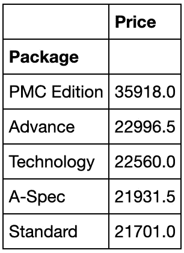
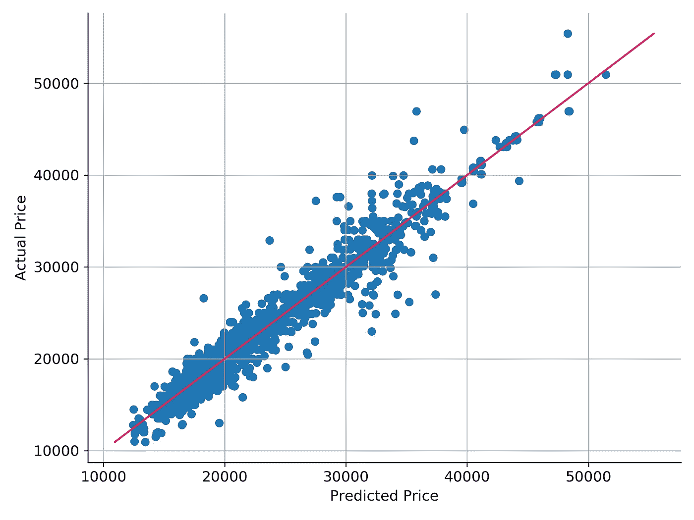

# 你应该买还是租下一辆车？端到端项目

> 原文：<https://towardsdatascience.com/should-you-buy-or-lease-your-next-car-end-to-end-data-science-project-a26617f11fcb?source=collection_archive---------43----------------------->

## 探索这个项目，从收集数据到创建强回归的集合，再到回答你是否应该购买或租赁下一辆车


# 概观

在本帖中，我们将从头到尾浏览一个完整的数据科学项目，并给出问题的结论——你应该购买还是租赁下一辆车？

该项目将包括以下部分(请随意跳到您最感兴趣的部分):

*   把问题框起来，看大局
*   获取数据
*   探索数据
*   准备数据
*   选择和训练模型
*   微调系统
*   分析最佳模型的误差
*   结论

要在 Github 上查看该项目，请点击以下链接[此处](https://github.com/lukenew2/automobile-depreciation/tree/master/leases)！

# 把问题框起来，看大局

这个项目的目标是通过比较汽车租赁的总费用和汽车的折旧成本来确定汽车租赁是否划算。如果租赁费用更高，我们可以得出结论，购买新车并转卖会更符合 T2 的成本效益。然而，如果租赁比我们认为的便宜，你应该租赁而不是购买。

通过使用机器学习，我们预测汽车的价格，并使用它来计算折旧成本，并与租赁成本进行比较。

我们使用的指标是均方根误差(RMSE ),因为它给出了系统在预测中通常会产生多大误差的概念，误差越大，权重越高。

所以现在我们需要数据。我们没有收集数百辆不同汽车的数据，而是只收集了一辆最好的出租汽车——讴歌 TLX 的数据。这有助于我们简化问题，如果我们得出结论，你应该购买而不是租赁这辆车，我们可以得出同样的结论较低的汽车。

# 获取数据

在这个项目中，我们使用 BeautifulSoup 的图书馆收集数据。我们在网上搜索 Truecar.com 的讴歌 TLX 汽车列表。笔记本完整的代码用于网页抓取可以在[这里](https://github.com/lukenew2/car-leases/blob/master/collect_data_webscraping.ipynb)找到。

该项目的其余部分的代码可以在这里查看。

让我们加载通过网络搜集收集的数据，并对其进行初步研究。

```
CARS_PATH = os.path.join(PROJECT_ROOT_DIR, "datasets")

**def** load_car_data(cars_path=CARS_PATH):
    csv_path = os.path.join(cars_path, "cars.csv")
    **return** pd.read_csv(csv_path)cars = load_car_data()
```

让我们看看我们的数据集有多完整。通过查看每一列的 null 值的百分比，我们可以很好地了解我们正在处理的缺失值的数量。

```
cars.isnull().sum() / len(cars)
```


每列的百分比 Null

我们看到在我们的 6 列中有缺失值。具体在我们的目标变量**价格**和属性**驱动、发动机、内饰、外观颜色、**和**内饰颜色。由于价格是我们的目标变量，我们将不得不放弃这些实例。由于 Drive、Engine 和 Trim 的缺失值百分比非常低，因此也可以删除与这些实例相关的实例。由于外部和内部颜色超过 10%为空，可能对价格没有太大的预测能力，我们将继续从数据集中删除这些列。**

```
cars = cars.drop(columns=["Exterior_color", "Interior_color"])
cars = cars.dropna(axis=0)
cars.reset_index(inplace=**True**)
```

## 创建测试集

我们在这里使用*分层分割*来确保我们的测试集代表整个数据集中的各种比率。由于我们相信某些特征(如汽车年份)将是非常重要的价格预测因素，因此我们确保它们在训练集和测试集之间均匀分布。通过使用分层分割，我们避免了抽样偏差，即测试不能代表整个数据集。

下面的代码使用 pd.cut()函数创建一个包含 6 个类别的 year category 属性(标记为 0 到 5，对应于数据集中的每一年):

```
cars["Year_cat"] = pd.cut(cars["Year"],                            bins=[2014.5, 2015.5, 2016.5, 2017.5, 2018.5, 2019.5, 2020.5],                          labels=[0, 1, 2, 3, 4, 5]
```

现在我们准备根据 year 属性进行分层抽样。为此，我们可以使用 Scikit-Learn 的 StratifiedShuffleSplit()类:

```
**from** sklearn.model_selection **import** StratifiedShuffleSplit

split = StratifiedShuffleSplit(n_splits=1, test_size=0.2)
**for** train_index, test_index **in** split.split(cars, cars["Year_cat"]):
    train_set = cars.loc[train_index]
    test_set = cars.loc[test_index]
```

现在，我们删除 Year_cat 属性，使数据恢复到原始状态:

```
**for** set_ **in** (test_set, train_set):
    set_.drop("Year_cat", axis=1, inplace=**True**)
```

# 探索数据

现在，让我们发现并可视化这些数据，感受一下它的样子并获得一些见解。我们创建了一个训练集的副本，这样我们就可以在不破坏原始训练集的情况下使用它:

```
cars = train_set.copy()
```

下面是一个表，其中包含列、数据类型和详细描述它们包含哪些信息的简短描述。


我们将首先查看数字数据类型，并使用 corr()方法计算每对属性之间的标准相关系数:

```
corr_matrix = cars.corr()
```

现在让我们看看每个属性与价格的关联程度:

```
corr_matrix["Price"].sort_values(ascending=**False**)
```


检查属性之间相关性的另一种方法是使用 pandas scatter_matrix()函数，该函数将每个数值属性与其他数值属性相对照。

```
**from** pandas.plotting **import** scatter_matrix

attributes = ["Price", "Year", "Mileage", "Accidents"]
scatter_matrix(cars[attributes], figsize=(12,8))
save_fig("scatter_matrix_plot")
```


上图向我们展示了一些东西。事实上，年份和里程属性将是价格的强预测因素，并显示一些交互作用，我们可以通过创建一个新的功能，每年的里程来捕捉这些交互作用。此外，三起事故并不多见。将发生 2 次或 3 次事故的汽车归入一个 2 或更多的值可能是有益的。

要创建每年英里数属性，我们需要知道汽车的使用年限，而不是年份。我们通过从汽车年份中减去当前年份的绝对值来实现这一点。但是，我们无法将 2020 款讴歌 TLXs 除以 0，因此我们将 0 替换为 1(在这种情况下，属性 miles_per_year 将与 miles 相同)。

```
cars["Years_old"] = abs(cars["Year"] - 2020)
cars["Miles_per_year"] = cars["Mileage"] / 
                                     cars["Years_old"].replace(0, 1) 
```

现在让我们看看我们的目标价格与新属性的相关性:

```
corr_matrix = cars.corr()
corr_matrix["Price"].sort_values(ascending=**False**)
```


太好了！我们发现它也与价格密切相关！

我想看的最后一个有趣的专栏是 Trim。该列包含许多信息，包括汽车上的性能套件类型。提取包并把它作为一个属性使用可能是有益的。让我们观察不同的 trims 和中间价格之间的相关性。

```
cars[["Price","Trim"]].groupby("Trim").median()
```


现在让我们提取包，看看包之间是否有明显的相关性。

```
**def** extract_package(trims):

    packages = ["PMC Edition", "A-Spec", "Advance", "Technology"]

    pat = '|'.join(r"\b**{}**\b".format(x) **for** x **in** packages)
    packages = pd.Series(trims).str.extract("(" + pat + ")")
    packages.fillna("Standard", inplace=**True**)

    **return** packagescars["Package"] = extract_package(cars["Trim"].values)cars[["Price", "Package"]].groupby("Package").median()
```



解压软件包似乎没有太大的帮助。不同包装之间的相关性很弱，不符合我们预期的任何趋势。

## 摘要

现在我们对哪些特性是最有价值的有了一个很好的想法，并且探索了它们之间的关系。一些重要的发现是:

*   创建新列`miles_per_year`增加了额外的预测能力。
*   发生 2 起以上事故的汽车在我们的数据集中非常稀少，最好与发生 2 起事故的汽车归为一组。我们通过这种方式保持了更强的相关性。
*   年份更适合用作序数特征。我们将减去该列的当前年份，以创建一个名为“years old”的列。
*   从 trim 中提取性能包可能有用，也可能没用。与价格没有明显的相关性，因此我们可以在数据准备阶段将它作为一个选项添加进来。

# 准备数据

是时候为机器学习算法准备数据了。我们没有手动这样做，而是为此编写函数，这有几个原因:

*   这将允许我们在任何数据集上重现这些转换(例如，下次您获得新的数据集时)。
*   我们将逐步建立一个转换函数库，可以在未来的项目中重用。
*   这将使我们能够轻松地尝试各种转换，并查看哪种转换组合效果最好。

我们需要一个数字属性和分类属性的准备管道。先说数值属性吧！

由于我们使用的是 Scikit-Learn，所以我们希望我们的转换器能够与 Scikit-Learn 功能(比如管道)无缝协作，但幸运的是，我们只需要创建一个类并实现三个方法:fit()(返回 self)、transform()和 fit_transform()。我们只需添加 *TransformerMixin* 作为基类，就可以免费获得最后一个。

> 我们还添加了 *BaseEstimator* 作为基类，为我们提供了两个额外的方法(get_params()和 set_params())，这对自动超参数调优很有用。

例如，这里有一个 transformer 类，它添加了前面讨论过的数字属性，并在我们将训练集传递给它时添加了它的输出。

```
**from** sklearn.base **import** BaseEstimator, TransformerMixin

**class** **NumericalAttributesAdder**(BaseEstimator, TransformerMixin):
    **def** __init__(self, add_miles_per_year = **True**):
        self.add_miles_per_year = add_miles_per_year
    **def** fit(self, X, y=**None**):
        **return** self
    **def** transform(self, X):
        years_old = abs(X["Year"] - 2020)
        accidents_adjusted = X["Accidents"].replace(3, 2)
        **if** self.add_miles_per_year:
            miles_per_year = X["Mileage"] / years_old.replace(0, 1)
            **return** pd.concat([X, years_old.rename("Years_old"),  
                         accidents_adjusted.rename("Accidents_adj"),                        
                         miles_per_year.rename("Miles_per_year")],   
                         axis=1) **else**:
            **return** pd.concat([X, years_old.rename("Years_old"),
                        accidents_adjusted.rename("Accidents_adj")],         
                        axis=1)

num_attr_adder = NumericalAttributesAdder(add_miles_per_year = **True**)
num_attr_adder.transform(X_train)
```


现在，在我们添加新的属性之后，我们想要选择在我们的机器学习算法中使用哪些属性。我们使用与上面相同的方法来创建一个选择属性的自定义转换器。

```
**class** **DataFrameSelector**(BaseEstimator, TransformerMixin):
    **def** __init__(self, attribute_indices):
        self.attribute_indices = attribute_indices
    **def** fit(self, X, y=**None**):
        **return** self
    **def** transform(self, X):
        **return** X[self.attribute_indices]
```

如您所见，有许多数据转换步骤需要按正确的顺序执行。幸运的是，Scikit-Learn 提供了 Pipeline 类来帮助处理转换序列。下面是数字属性的管道:

```
**from** sklearn.pipeline **import** Pipeline
**from** sklearn.preprocessing **import** StandardScalerattribs = ["Mileage", "Years_old", "Accidents_adj","Miles_per_year"]num_pipeline = Pipeline([
        ('num_attribs_adder', NumericalAttributesAdder()),
        ('select_numeric', DataFrameSelector(attribs)),
        ('std_scaler', StandardScaler())
    ])
```

我们使用上面的两个自定义转换器，然后使用 Scikit-Learn 的 StandardScaler()转换器来标准化所有数字属性。

现在下一步是为我们的分类属性创建一个管道。由于这些属性是字符串，我们需要使用 OneHotEncoder 将它们转换成数值。但是首先我们创建一个定制的转换器，它将从我们前面讨论的 Trim 属性中提取汽车的包。我们初始化 *add_trim_features=True* ,让我们选择是否添加新的包属性。

```
**class** **CategoricalAttributesAdder**(BaseEstimator, TransformerMixin):
    **def** __init__(self, add_trim_features = **True**):
        self.add_trim_features = add_trim_features  
    **def** fit(self, X, y=**None**):                          
        **return** self    
    **def** transform(self, X):        
        **if** self.add_trim_features:
            package = extract_package(X["Trim"]) 
            **return** pd.concat([X, package.rename("Package")], axis=1)                                
        **else**:            
            **return** X cat_attr_adder = CategoricalAttributesAdder(add_trim_features =**True**)cat_attr_adder.transform(X_train)
```


现在，我们分类属性的完整管道已经准备好了。我们使用 CategoricalAttributesAdder、DataFrameSelector 和 OneHotEncoder 将我们的分类属性完全转换为适合机器学习的格式。管道如下所示:

```
attribs = ["Drive", "Engine", "Trim"]cat_pipeline = Pipeline([
        ("cat_attribs_adder", CategoricalAttributesAdder()),
        ("select_categoric", DataFrameSelector(attribs)),
        ("one_hot", OneHotEncoder())
    ])
```

到目前为止，我们已经分别处理了分类列和数字列。如果有一个能够处理所有列的转换器，对每一列应用适当的转换，那将会更方便。幸运的是，Scikit-Learn 为此引入了 *ColumnTransformer* ，好消息是它对熊猫数据帧非常有效。让我们使用它将所有转换应用到训练集:

```
**from** sklearn.compose **import** ColumnTransformernum_attribs = ["Year", "Mileage", "Accidents"]
cat_attribs = ["Drive", "Engine", "Trim"]full_pipeline = ColumnTransformer([
        ("num", num_pipeline, num_attribs),
        ("cat", cat_pipeline, cat_attribs)
    ])

cars_prepared = full_pipeline.fit_transform(X_train)
```

在这个管道中，我们指定数字列应该使用我们之前定义的 *num_pipeline* 进行转换，而分类列应该使用我们之前定义的 *cat_pipeline* 进行转换。最后，我们将这个 *ColumnTransformer* 应用于训练集:它将每个转换器应用于适当的列，并沿着第二个轴连接输出(转换器必须返回相同数量的行)。

就是这样！我们有一个预处理管道，它接受完整的训练集，并对每一列应用适当的转换。

# 选择和训练模型

终于来了！我们构建了问题，获得了数据并对其进行了探索，对一个训练集和一个测试集进行了采样，我们编写了转换管道来自动清理和准备我们的数据以用于机器学习算法。我们现在准备选择和训练机器学习模型。

我们的第一个基本模型是一个线性回归，我们将尝试改进它。使用 Scikit-Learn 的 cross_val_score()允许我们将训练集随机分成 10 个不同的折叠，然后训练和评估我们的模型 10 次，每次选择不同的折叠进行评估，并在其他 9 个折叠上进行训练。结果是一个包含 10 个评估分数的数组:

```
**from** sklearn.linear_model **import** LinearRegression 
**from** sklearn.model_selection **import** cross_val_score lin_reg = LinearRegression()
lin_reg_scores = np.sqrt(-cross_val_score(lin_reg, cars_prepared,   
                  y_train, cv=10, scoring="neg_mean_squared_error"))
```

让我们来看看结果:

```
**def** display_scores(scores):
    print("Scores:", scores)    
    print("Mean:", scores.mean())
    print("Standard deviation:", scores.std()) display_scores(lin_reg_scores)
```


对我们的基本模型来说还不错！但是，我们不是像这样显示每个模型的分数，而是将每个模型的分数绘制在一个方框图中，显示平均值、四分位间距和最大/最小分数。请记住，我们的衡量标准是 RMSE，分数越低越好。以下是我们尝试的模型列表:

*   线性回归
*   多项式回归
*   岭正则化多项式回归
*   随机森林回归量
*   支持向量机回归机
*   梯度推进回归器


我们看到多项式回归比简单的线性回归稍好。此外，随机森林回归和梯度推进回归表现明显较好，而 SVM 回归表现明显较差。请记住，我们只是试图了解哪些机器学习算法执行得最好，因此所有这些算法都是用默认设置训练的。

# 微调你的系统

现在我们有了一份有前途的模特候选名单。我们现在需要对它们进行微调。由于我们使用默认超参数来训练我们的模型，我们将尝试看看哪个超参数最适合我们的最佳模型，随机森林回归器和梯度推进回归器。

我们没有手动这样做，而是让 Scikit-Learn 的 *GridSearchCV* 来搜索我们。我们需要做的只是告诉它我们希望它试验哪些超参数，试验哪些值，它将使用交叉验证来评估超参数值的所有可能组合。

## 随机森林回归量

```
**from** **sklearn.model_selection** **import** GridSearchCV

forest_param_grid = [{'bootstrap': [**True**],
     'max_depth': [12, 14, **None**],
     'max_features': ['auto', 'sqrt'],
     'min_samples_leaf': [1, 2],
     'min_samples_split': [ 2, 3],
     'n_estimators': [100, 200, 300, 400]}
    ]

forest_reg = RandomForestRegressor()

forest_grid_search = GridSearchCV(forest_reg, forest_param_grid, 
                                  cv=5,      
                                  scoring="neg_mean_squared_error",
                                  return_train_score=**True**,
                                  verbose=**True**,
                                  n_jobs=-1)

forest_grid_search.fit(cars_prepared, y_train)
```

我们可以直接得到最佳估计量:

```
forest_grid_search.best_estimator_
```


## 梯度推进回归器

```
gb_param_grid = [{'loss': ['ls'],
         'learning_rate': [0.05, 0.1, 0.15],
         'n_estimators': [200, 220, 240, 260],
         'subsample': [0.8, 0.9],
         'min_samples_split': [2, 3],
         'min_samples_leaf': [2, 3, 4],
         'max_depth': [4, 5, 6, 7],
         'max_features': ['sqrt'],
        }]

gb_reg = GradientBoostingRegressor()

gb_grid_search = GridSearchCV(gb_reg, gb_param_grid, cv=5,
                                  scoring="neg_mean_squared_error",
                                  return_train_score=**True**,
                                  verbose=**True**,
                                  n_jobs=-1)

gb_grid_search.fit(cars_prepared, y_train)
```

让我们看看最佳估计值:

```
gb_grid_search.best_estimator_
```


## 集合:随机森林回归和梯度推进回归

另一种微调系统的方法是尝试并组合性能最佳的模型。群体(或“整体”)通常会比最佳个体模型表现得更好。现在，我们已经调整了两个最佳模型的超参数，让我们尝试将它们结合起来，以进一步提高我们的最佳得分。

使用 Scikit-Learn 的 VotingRegressor()类可以相对容易地做到这一点，该类允许我们对随机森林回归变量和梯度推进回归变量进行平均预测。

```
**from** sklearn.ensemble **import** VotingRegressor

forest_reg =RandomForestRegressor(**forest_grid_search.best_params_)
gb_reg = GradientBoostingRegressor(**gb_grid_search.best_params_)

forest_gb_reg = VotingRegressor([("forest_reg", forest_reg), 
                                 ("gb_reg", gb_reg)])forest_gb_reg_scores = np.sqrt(-cross_val_score(forest_gb_reg, 
                               cars_prepared, y_train, cv=10,
                               scoring="neg_mean_squared_error"))display_scores(forest_gb_reg_scores)
```


看，成功了！我们的平均 RMSE 低于 1600！现在我们有了最好的模型，是时候分析它的错误了。但首先让我们做最后一个方框图，比较四个最好的模型。


让我们保存最好的模型，以便我们可以很容易地回到他们当中的任何一个！

```
**import** **joblib**

MODELS_PATH = os.path.join(PROJECT_ROOT_DIR, "models/")
os.makedirs(MODELS_PATH, exist_ok=**True**)models = [gb_grid_search.best_estimator_,
          forest_grid_search.best_estimator_,
          forest_gb_reg]
names = ["gradient_boosting_reg", "forest_reg","ensemble_(RF_&_GB)"]**for** model, name **in** zip(models, names):
    joblib.dump(model, MODELS_PATH + name)
```

# 分析最佳模型的误差

我们将使用 cross_val_predict 对我们的训练集中的每个实例进行干净的预测(“干净”意味着预测是由在训练期间从未看到数据的模型进行的)。

```
**from** sklearn.model_selection **import** cross_val_predict

preds = cross_val_predict(forest_gb_reg,cars_prepared,y_train,cv=10) 
```

让我们把我们的预测价格和实际价格对比一下。如果我们所有的点都在对角线上，这意味着我们的模型是完美的，误差为 0。



这看起来很好，我们的误差正态分布，而不是一个区域漏低，另一个区域漏高。剩下的工作就是对测试集进行评估，并得到最终的性能检查。谢天谢地，使用我们之前创建的管道，测试集很容易准备！

```
X_test = test_set.drop("Price", axis=1)
y_test = test_set["Price"].copy()
X_test = X_test[cols]
X_test_prepared = full_pipeline.fit_transform(X_test)**from** sklearn.metrics **import** mean_squared_error

final_predictions = forest_gb_reg.predict(X_test_prepared)
final_mse = mean_squared_error(y_test, final_predictions)
final_rmse = np.sqrt(final_mse)
final_rmse
```

最终 RMSE: 2207.82

看起来我们的训练装备可能有点过量了。回过头来尝试在测试集上表现得更好可能很有诱惑力，但是这样我们就冒着过度适应测试集的风险。我们会让它保持原样，因为它仍然在我们在训练集中得到的分数范围内。

# 结论

现在回到最初的问题。你应该买还是租下一辆车？

现在，我们已经有了最终的模型和测试集的性能分数，我们可以用它来预测讴歌 TLXs 的价格，其功能对应于各种租赁。我们用来对比的租约来自讴歌的网站。让我们看看多个不同的租赁条款，看看我们会发现什么！

我们预测的汽车具有以下特征和租赁:


这里是三种不同调整的预计折旧成本和租赁比较。红线代表预计折旧成本，而蓝线代表租赁成本。阴影区域代表我们预测折旧的 95%置信区间。我们看到，在所有三种情况下，租赁都要贵得多。


如果你选择购买新车，你可以节省高达 10，000 美元。即使是最好的汽车之一，租赁也要贵得多。

# 未来的工作

项目结束后，我脑海中突然冒出了一些我认为会很有趣的想法:

*   我们可以模拟不同的汽车，这些汽车也有很高的租赁费率，看看你能为一辆新车提供多少资金，让它仍然值得购买和转售。
*   从交叉验证来看，集成似乎是有益的，但在测试集上的表现仍然很差。探索原因可能会很有趣。我想知道是否所有其他模型在测试集上表现更差，或者我们的最终模型实际上不是最佳选择，尽管在交叉验证的所有折叠中表现最好。
*   进一步考虑这个问题，尝试建立多个汽车品牌和模型的模型，这些模型仍然可以准确预测汽车的价值。

一如既往地感谢你的阅读，我希望你喜欢它，并学到一些新的和有见地的东西！

[](https://github.com/lukenew2/car-leases) [## 路金 2/汽车租赁

### 在这个项目中，我的目标是通过比较汽车的折旧成本来确定汽车租赁是否划算

github.com](https://github.com/lukenew2/car-leases)