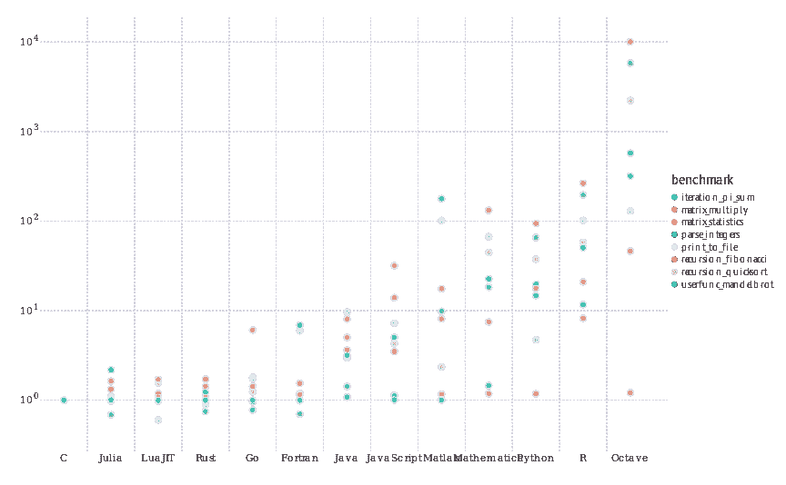
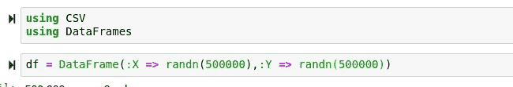
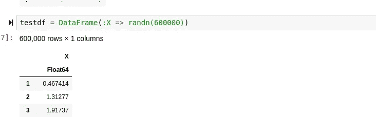
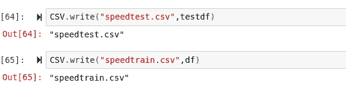
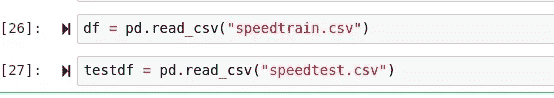
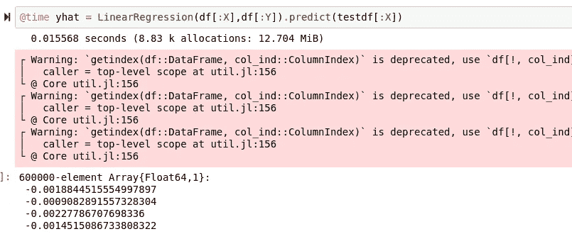
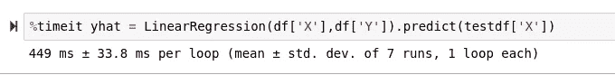
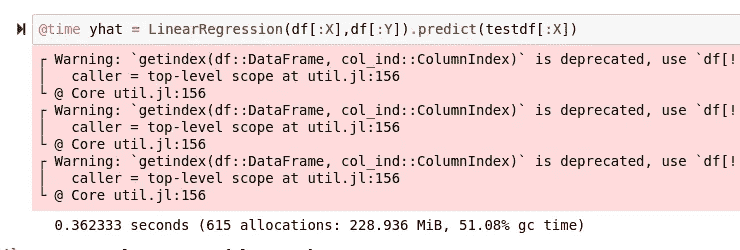
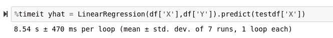

# 该不该跳 Python 的船，搬去茱莉亚？

> 原文：<https://towardsdatascience.com/should-you-jump-pythons-ship-and-move-to-julia-ccd32e7d25d9?source=collection_archive---------3----------------------->

## 意见

## 是应该为了朱丽亚的表现而抛弃 Python，还是朱丽亚的速度只是精心炒作？


(python 徽标由[http://python.org/](http://python.org/)提供，julia 徽标由[http://julialang.org](http://julialang.org)提供，北海巨妖 src = http://cleanpng.com)

在过去的几年里，Python，一种用 C 语言编写的解释语言，越来越受欢迎。虽然 Python 肯定是一种有用的语言，从一开始就相当受欢迎，但这种受欢迎程度的飙升通常要归功于 Python 在机器学习和统计分析方面的出色能力。然而，随着时间的推移，新的语言应运而生，试图取代 Python，为机器学习创造普遍更快的体验。属于这一类的最有前途和最受欢迎的语言之一是 Julia。

Julia 是一种多范式、静态类型的通用语言，它是基于机器学习和统计学而构建的。大多数 Julia 用法背后的主要动机往往是 Julia 的速度，但我认为重要的是要记住仅速度一项就有多少变量。这甚至还没有触及到该语言的其他能力或缺陷。

> [Python 笔记本](https://github.com/emmettgb/Emmetts-DS-NoteBooks/blob/master/Python3/pythonspeedtest.ipynb)
> 
> [朱丽亚笔记本](https://github.com/emmettgb/Emmetts-DS-NoteBooks/blob/master/Julia/jlspeedtest.ipynb)

# 概述

虽然速度当然很重要，甚至在机器学习的环境中更重要，但我认为在讨论性能的同时讨论其他障碍和优势也很重要。在跳 Python 船之前应该问的一个大问题是

> 朱莉娅有什么问题？

如果权衡超过了表现这一单一的好处，那么学习一门新语言是没有意义的。Julia 确实有一些问题，对于某些开发人员来说，这些问题可能不一定使切换成为最佳选择。

Python 和 Julia 之间的转换中丢失的第一个，也是最大的一个东西是

> 包裹。

虽然 Julia 确实有一些很棒的包值得一试，也有一个很棒的包管理器来帮助它们，但是这些包的范围远不如 Python 成熟。许多 Julia 包严重缺乏文档，有依赖问题，或者错综复杂，分割得太多，以至于你必须添加 50 个包才能完成一件事。虽然这肯定是一个很大的缺点，但应该注意的是，Julia 没有 Python 所拥有的模块王朝，因为 Python 作为一种语言要成熟得多。随着时间的推移，这个问题几乎肯定会得到解决，随着伟大的开发人员致力于这种语言，再加上 Julia 周围的奇妙和快速发展的社区，这可能不会是一个很长时间的大问题。我理解为什么一些朱利安可能会指出“PyCall.jl”是一个潜在的解决方案，但我不同意这种立场，因为对所有东西都使用 PyCall 比对所有东西都使用 Python 要慢，所以为什么不在这一点上使用 Python 呢？

Julia 的另一个显著“缺点”是它的范式。虽然 Julia 确实是一种支持许多泛型的多范式编程语言，但 Julia 的语法本质上是静态的，这意味着在大多数情况下，Julia 代码将属于函数范式。虽然我敢肯定 Lisp、R 和 Haskell 的粉丝们会高兴得跳起来，但是看看最流行的编程语言列表，就会明白为什么转换到这种范式会令人难以置信地不舒服，即使对于有经验的程序员来说也是如此。因此，虽然这对我或其他人来说可能不是一个缺点，但肯定会让那些对这种语言没有太大兴趣的人望而却步。

很可能我们都熟悉 Python，所以我不打算花太多时间来解释为什么您可能想从 Python 切换到 Julia。然而，我认为 Python 有一些缺点，应该客观地提出来，以便确定潜在的转换编程语言的利弊。

首先，我确信我们都听说过，Python 是一种解释型语言。虽然肯定有解决方案来解决这个问题，使用各种工具来获得编译后的可执行文件，以及更快的速度，但这些都不是使软件包更快或分发软件的万无一失的方法。虽然我并不特别热衷于“Python == 'slow '”这一潮流，但不可否认 Python 的速度不够快。幸运的是，Python 通过 C 语言的解释确实把它放在了一个独特的位置，因为它可以用来从高级接口操纵和调用 C 代码。

虽然这对 Python 来说是一个很大的优势，但并不是所有的数据科学工作都是在已经用 C 编写的模块中完成的，有时 Python.h 头文件的附加层也会降低计算速度，破坏 C 的出色性能。

# “由你决定”

虽然速度绝对重要，但我想重申，它绝对不是一切。同时使用 Python 和 Julia 有很多显著的优势，其中一些甚至是主观的。例如，我对 Python 中的缩进语法恨之入骨，所以在 Julia 中使用以分隔符结尾的函数是我主观的偏好。

```
def func:
    print("function body")
function func
println("I can put syntax here")
    println("Here")
        println("Or here, without any errors.")end
```

我想指出的另一件事是 Julia 的多态调度和 Python 的更简单的语法。所有这些都是为了说明，虽然性能很重要，但在选择使用哪种语言时，一种语言中的许多特性可能是更重要的因素。不仅如此，您还可以挑选在您当前的场景中使用哪种语言，因为自然有一些事情一种语言会比另一种语言更好。

另一个有趣的事情是，我以前在 Julia 中提到过，使用 Python 作为 Julia 的接口，而不是与 c 接口。这样做的好处是能够更快地编写快速代码，同时仍然保持类似的性能。幸运的是，我甚至创建了一个包来这样做，这样您就可以通过 PyPi 进行安装。

```
sudo pip3 install TopLoader
```

[](https://github.com/emmettgb/TopLoader) [## emmettgb/TopLoader

### 你好，装载愉快！您可以使用以下命令安装 TopLoader:sudo pip 3 立即从 TopLoader 安装 TopLoader 您可以…

github.com](https://github.com/emmettgb/TopLoader) 

你选择的语言不一定是二进制的。Julia 的一个优点是，考虑到 Julia 的大数据能力和浮点精度，您可以保留对 Python 的使用，并像使用 Scala 一样使用 Julia。Julia 甚至有 BigInt 和 BigFloat 类型来处理比一般熊大的数字。

# 速度测试



(src =茱莉亚计算[https://julialang.org/benchmarks/](https://julialang.org/benchmarks/)

实际速度方面，我已经把朱莉娅的基准放在上面了。正如我们从这个基本基准中看到的，Julia 倾向于徘徊在 Go 的性能附近，同时保持一点点的一致性。有趣的是，在极少数情况下，Julia 甚至可以超越 C 和 Rust。虽然这肯定是一个伟大的壮举，但这里的目标不是比较 Julia 和 C，而是比较 Julia 和 Python。

## 测试设置

为了保持两种比较之间的一致性，我将使用 Julia 的[语法表达式](/syntactical-expressions-are-awesome-dc9ba5f25911?source=---------4------------------)来强制语言的类型更像 Python。如果你想进一步了解如何做到这一点，以及更熟悉 Julia 的调度，我有一篇我很自豪的文章，它会告诉你你需要知道的一切:

[](/turn-julia-into-python-and-duck-type-in-a-statically-typed-language-119f708936ff) [## 用静态类型语言将 Julia 转换成 Python 和 Duck-Type

### 通过结合 Julia 富有表现力的语法和令人敬畏的调度，将 Julia 变成 Python。

towardsdatascience.com](/turn-julia-into-python-and-duck-type-in-a-statically-typed-language-119f708936ff) 

对于我的迭代测试，我在 Julia 中创建了这个函数:

```
function LinearRegression(x,y)
    # a = ((∑y)(∑x^2)-(∑x)(∑xy)) / (n(∑x^2) - (∑x)^2)
    # b = (x(∑xy) - (∑x)(∑y)) / n(∑x^2) - (∑x)^2
    if length(x) != length(y)
        throw(ArgumentError("The array shape does not match!"))
    end
    # Get our Summations:
    Σx = sum(x)
    Σy = sum(y)
    # dot x and y
    xy = x .* y
    # ∑dot x and y
    Σxy = sum(xy)
    # dotsquare x
    x2 = x .^ 2
    # ∑ dotsquare x
    Σx2 = sum(x2)
    # n = sample size
    n = length(x)
    # Calculate a
    a = (((Σy) * (Σx2)) - ((Σx * (Σxy)))) / ((n * (Σx2))-(Σx^2))
    # Calculate b
    b = ((n*(Σxy)) - (Σx * Σy)) / ((n * (Σx2)) - (Σx ^ 2))
    # The part that is super struct:
    predict(xt) = (xt = [i = a + (b * i) for i in xt])
    (test)->(a;b;predict)
end
```

同样，我用 Python 创建了这个类来实现同样的目标:

```
class LinearRegression:
    def __init__(self,x,y):
        # a = ((∑y)(∑x^2)-(∑x)(∑xy)) / (n(∑x^2) - (∑x)^2)
        # b = (x(∑xy) - (∑x)(∑y)) / n(∑x^2) - (∑x)^2
        if len(x) != len(y):
            pass
        # Get our Summations:
        Σx = sum(x)
        Σy = sum(y)
        # dot x and y
        xy = dot(x,y)
        # ∑dot x and y
        Σxy = sum(xy)
        # dotsquare x
        x2 = sq(x)
        # ∑ dotsquare x
        Σx2 = sum(x2)
        # n = sample size
        n = len(x)
        # Calculate a
        self.a = (((Σy) * (Σx2)) - ((Σx * (Σxy)))) / ((n * (Σx2))-(Σx**2))
        # Calculate b
        self.b = ((n*(Σxy)) - (Σx * Σy)) / ((n * (Σx2)) - (Σx ** 2))
        # The part that is super struct:
    def predict(self,xt):
        xt = [self.a + (self.b * i) for i in xt]
        return(xt)
```

你可能会注意到我用 dot()和 sq()来代替。*对于逐元素乘法，和。元素式平方的^。这些功能如下:

```
def dot(x,y):
    lst = []
    for i,w in zip(x,y):
        lst.append(i * w)
    return(lst)
def sq(x):
    x = [c ** 2 for c in x]
    return(x)
```

# 数据

对于我的数据，我在 Julia 中生成了一个 500，000 的模糊数据帧，如下所示:



我还做了一个有 60 万个暗点的测试数据框架:



为了保持一致性，我保存了数据帧，并使用 Pandas 将它们读入 Python:



# 最终时机

当然，为了计时 Python 结果，我将使用 IPython %timeit magic 命令。至于 Julia 的结果，正如你所料，我将使用@time 宏。结果如下:

## 朱莉娅



## 计算机编程语言



虽然这是一个很好的比较，而且 Julia 在计算上确实节省了大约 30%的时间，但是我想

> “向上反”

我们试试 10，000，000 个 dims。

## 朱莉娅



## 计算机编程语言



> R.I.P. Python

# 结论

虽然 Python 能够如此出色地击败 Julia 令人印象深刻，但对于这个 Julia 胜过 Python 的真实机器学习示例，肯定有一些东西值得一提。我认为这也很好地说明了我之前所说的，Julia 在处理大数据方面非常有用。我想如果这个测试教会了我什么的话，那就是 Julia 在机器学习的世界里绝对有一席之地。即使 Julia 不能取代 Python，它也肯定能取代 Scala 和许多其他类似的语言。

尽管这种语言有其独特之处，并且在不断发展，但性能肯定是存在的。尽管现在可能还不是开始 Python 编程的时候

> (尚未)

(我是开玩笑的)，或者可能永远也不会为了机器学习而放弃 Python，同时我也找不到不学习 Julia 的好理由。幸运的是，如果您已经熟悉 Python，那么学习 Julia 应该相对简单，因为语法非常相似。谁知道呢——也许你也会在朱莉娅身上找到一些你喜欢的东西！总的来说，Julia 在机器学习领域的未来非常令人兴奋。我认为，任何希望拓宽自己视野的数据科学家都应该去看看，甚至为 Julia 语言这个日益壮大的庞然大物做出贡献。