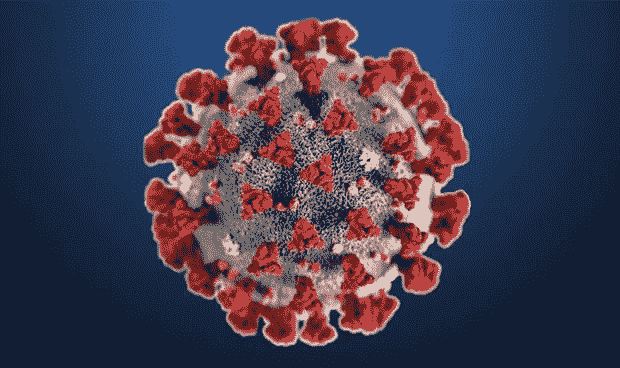
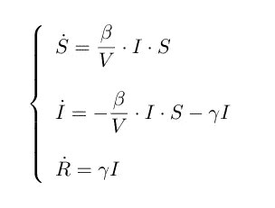
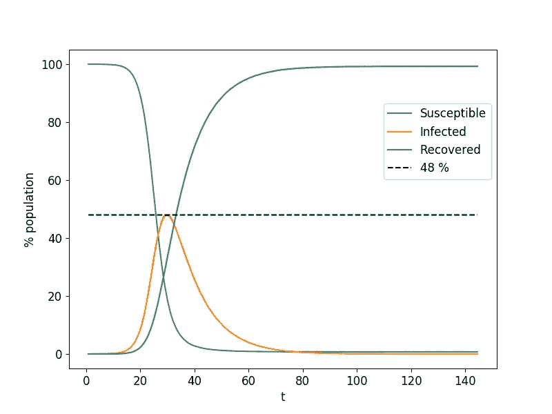
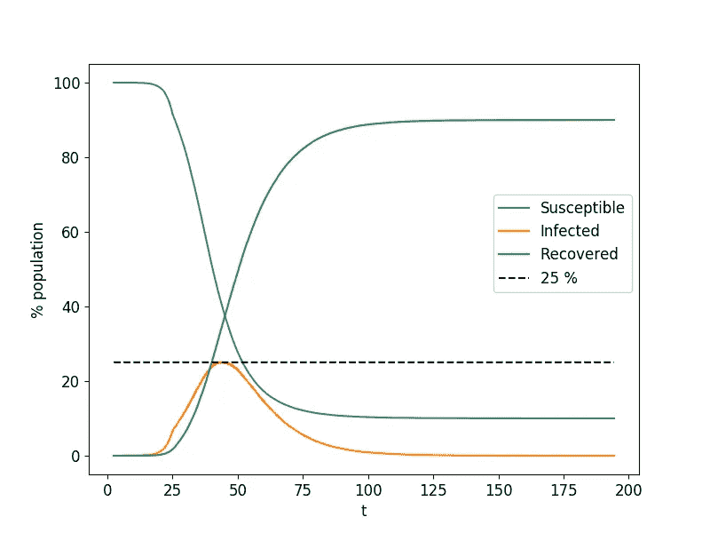
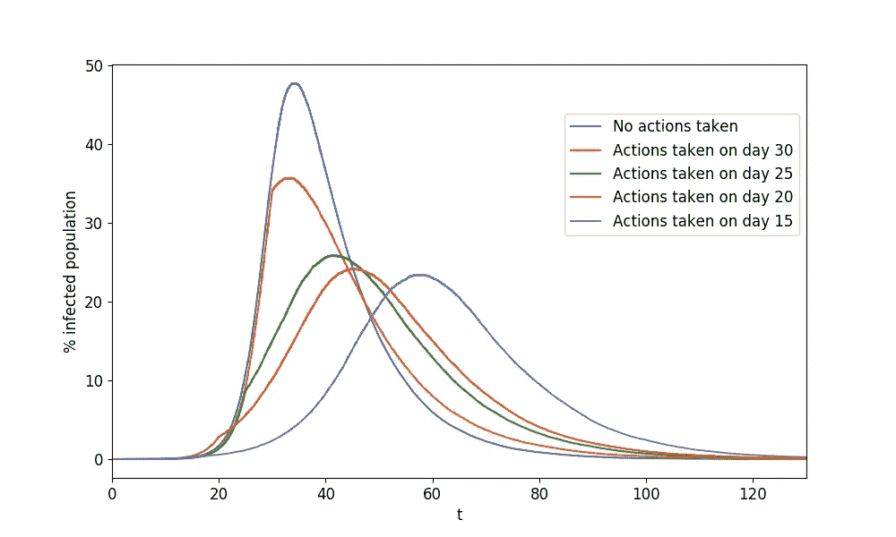
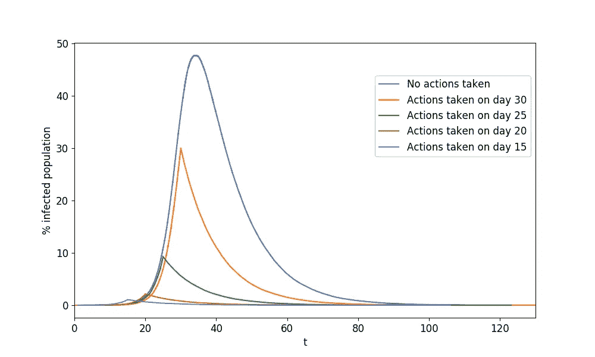
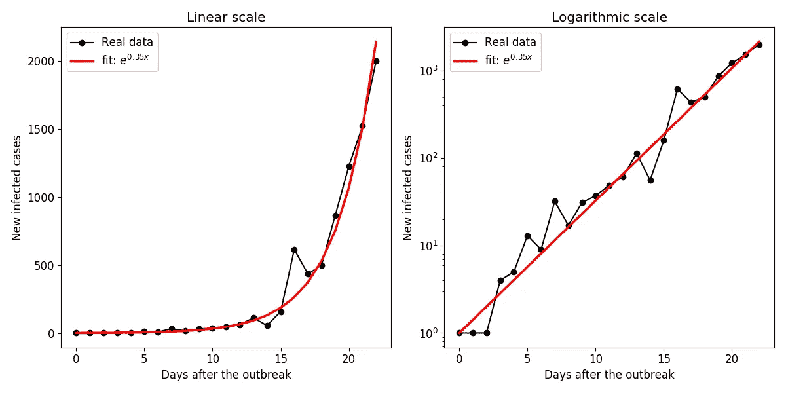
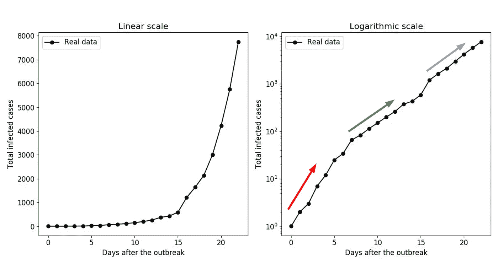

# 你应该呆在家里过新冠肺炎吗？

> 原文：<https://towardsdatascience.com/should-you-stay-at-home-for-the-covid-19-a281156c9597?source=collection_archive---------27----------------------->

## 用简单的理论模型分析限制措施的效果。

新冠肺炎疫情及其社会影响是目前推特上的热门话题。没有人没听说过这件事。在这种社会距离和限制的情况下，一些人只是想着自己，而忽视了政府的建议甚至限制。如果你正在读这篇文章，你可能不是这些人中的一员，但是，你应该警告那些你认识的符合前面描述的人吗？让我试着说服你。

## SIR 模型

流行病学最简单和最著名的模型之一是 [SIR](http://Compartmental_models_in_epidemiology) (易感-感染-康复)模型，这是一组描述这三种状态在人群中演变的微分方程。

新冠肺炎代表([来源](https://toronto.ctvnews.ca/here-s-what-we-know-about-ontario-s-258-cases-of-covid-19-1.4834821)

> (不要害怕下面的方程，它们只是为了介绍模型，你不需要深入理解这些方程就能理解整篇文章)

SIR 微分方程系统

在上面写的微分方程中， **S** 是易感人群的存量， **I** 是感染人群的存量， **R** 是康复人群的存量。显然，系统的动力学与易受感染的病原体被感染以及被感染的病原体被治愈的概率有关。因此，在微分方程中， **β** 代表感染率， **γ** 代表恢复率。最后， **V** 表示个体分布的体积。这是一个更技术性的细节，但很容易理解，这个体积越大，个体之间的接触就越少，因此发生的感染就越少，从而导致动力学更慢。

总而言之，这些是模型的参数

*   **S:** 易感人群存量
*   **一:**感染人群存量
*   **R:** 恢复人口存量
*   **β:** 感染率(单位时间内个体被感染的概率)
*   **γ:** 恢复率(单位时间内个体恢复的概率)
*   **V:** 系统的体积(与两个个体接触的概率有关)

尽管该模型可以解析求解，但我们可以基于 [Gillespie 算法](https://en.wikipedia.org/wiki/Gillespie_algorithm)使用数值方法求解。我们开始吧！

## SIR 模型的结果

考虑分布在体积为 **V=10** 且 **β=0.5 / 100** 和 **γ=10 / 100** 的 **N=10⁵** 个体群体，我们得到以下结果:

用 Gillespie 算法实现 SIR 模型。

正如我们所看到的，考虑到这些参数，该疾病将会爆发，并且在大约 30 天内，感染高峰将达到近 50 %的人口。在这个模型中，我们没有考虑疾病的死亡率，但应该强调的是，卫生系统肯定会崩溃**，因为我们连续几天看到如此大量的感染者。为了避免这种情况，那肯定会是灾难性的，政府采取措施来**‘使曲线变平’，**这是一个近来广为人知的概念。基本上，我们的目标是降低感染人数的峰值，这样卫生系统就不会崩溃。正如我们接下来将看到的，感染人数峰值的下降与疫情结束的延迟有关。出于这两个原因(降低峰值和延迟疫情结束)，这被称为“平坦曲线”。**

[来源](https://tenor.com/es/ver/covid19-flatten-the-curve-corona-coronavirus-dont-panic-gif-16574384)

## 用 SIR 模型模拟限制措施的效果

现在，我们可以将政府采取的限制措施建模为在某个时间点有效降低感染率β。考虑到在 **t=25** 时，即疫情达到上一次模拟得到的峰值前 5 天，采取限制性措施，有效降低一半感染率，得到以下结果， **β'=β/2。**

t=25 后感染率β'=β/2 变化的 SIR 模型

以这种方式模拟的限制措施的效果是明显的。通过将感染率降低到其原始值的一半，感染的峰值达到了人口的 25%,这也对应于在没有限制措施的情况下获得的值的一半。

## 快速应用这些措施有多重要？

为了解决这个问题，我们可以运行不同的模拟，并在不同的时间应用约束措施。例如，我已经考虑在 t=30、25、20 和 15 时应用这些措施，它们的效果与以前一样，将感染率降低到其原始值的一半。现在我们把重点放在受感染人群的进化上，所以没有必要画出易感人群和康复人群的比例。

分析应用措施的反应时间

从上图可以看出，实施禁闭措施的时间越长，效果越差。然而，尽管这些措施采取得相当晚(橙色线)，但这些措施的效果是显著的，将峰值从近 50%降低到 35%左右。另一方面，如果及早采取措施，疫情的高峰期可以大大减少并及时转移。然而，也可以看到，这些措施除了降低感染高峰之外，还推迟了疫情的结束。这是一种不可避免的情况，但我们必须记住，我们的优先事项是使曲线变平，以免卫生系统饱和。然而，这种延迟似乎是因为恢复速度保持不变，但通过降低峰值和不使卫生系统饱和，我们可以希望这一速度增加(疾病治疗的新进展，卫生工作人员的更多经验等)。

作为一个更技术性的细节，可以观察到，如果在相当早的时候应用这些措施，这种流行病将发展成为一种新的流行病，具有新的感染率(紫线)。

## 实际遵守措施有多重要？

我们认为，通过应用这些隔离措施，流行病的有效感染率将下降到其原始值的一半，这可能或多或少是现实的。本文的目的不是提出一个现实的模型来预测模型的演变，而是说明限制措施的重要性。

在这个例子中，进一步考虑到，通过非常认真地采取措施，很少有人会走出家门，因此有效感染率将趋于零。因此，我们可以通过在将措施设置为 **β'=0 后运行有效感染率的模拟来研究更认真地采取措施的影响。**

当采取措施后传染率完全消失时流行病的演化

结果显示，采取措施后，感染人数迅速下降。如前所述，观察到越早采取措施，受感染人口的峰值就越小。而且我们可以看到疫情的结束是提前了而不是推迟了，之前的情况就是这样。然而，这种在应用这些措施后没有新感染的极端情况在现实生活中是不可能实现的，因为这需要对整个社会进行完全和完美的限制。

## 西班牙的现状

除了通过媒体和社交网络传播的信息，欧盟开放数据门户中也有可用的数据集。通过对这些数据进行适当的处理，可以估计每日新增病例和总病例的变化。在这里，我将展示西班牙的进展，西班牙是世界上感染病例总数第四多的国家。

新的感染从爆发演变而来。

正如我们所看到的，西班牙新发现的病例正以恒定的比率呈指数增长，具体为 0.35。事实上，对数标度帮助我们形象化这种趋势，因为它是一条直线。这种趋势正是我们想要避免的，因为如果这种情况持续几天，卫生系统就会崩溃。

我们还可以看看总病例的演变，它最终会像一条[s 形](https://en.wikipedia.org/wiki/Sigmoid_function)曲线一样饱和。

总感染数从爆发开始演变。

很明显，我们已经远离了饱和点。在这种情况下，无法进行适当的指数拟合，因为在对数标度中可以清楚地看到，存在具有不同生长率的区域。这方面的好消息是，当前的增长率小于最初的增长率。

## 结论是什么？

首先，请记住，本文的目的不是提出一个新冠肺炎疫情的现实模型或预测其演变的工具。这篇文章的目的是展示一个研究流行病的最简单的模型，并用它来说明世界各地正在采取的隔离措施的重要性。

话虽如此，作为第一个结论，我们已经看到，考虑到适当的流行病(这意味着在给定的感染率和恢复率下，爆发存在)，感染人口的比例呈指数增长。然后，如果不采取措施，这种指数增长将继续下去，直到大部分人口受到感染。在实际情况下，这将使卫生系统崩溃，导致高死亡率事件。

然后，我们将禁闭措施纳入模型，以研究其效果以及它们如何依赖于两个特征:实施措施的时间和措施的力度(可以理解为措施的限制性或接受措施的人数)。第一种情况的结果表明，对于早期应用的措施，获得的感染峰值显著降低，尽管流行病的结束被延迟。在第二种情况下，我们看到，更强有力的措施除了降低感染高峰之外，还促进了疫情的结束。

因此，最后的结论是，最好的选择是尽早采取最强有力的措施。

## 想想看

我想以一个想法结束我的发言:实施措施的时间关系到科学家和政治家的工作，但措施的力度部分取决于整个社会。也许限制措施采取得有点晚，但我们有能力使它们更有效。