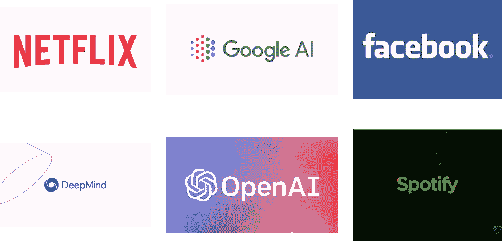

# 该不该考机器学习的博士？

> 原文：<https://towardsdatascience.com/should-you-take-a-phd-in-machine-learning-79530e1cb01c?source=collection_archive---------6----------------------->

## 探索攻读机器学习相关主题的博士学位的好处

科尔·凯斯特在 [Unsplash](https://unsplash.com/s/photos/graduation?utm_source=unsplash&utm_medium=referral&utm_content=creditCopyText) 上的照片

你点击这篇文章可能有几个原因；也许你正在辩论是否要进一步提高你的学术资格，或者你可能对机器学习中的高级研究的思想着迷。

不管是什么原因，你现在在这里。

现在，这里是写这篇文章的目的。围绕机器学习已经有了大量的炒作，大量的个人正涌向学术机构以获得 ML 内部的学位，包括我自己。对于你想追求什么样的高级资格，做出正确决定的重要性怎么强调都不为过。

为了让决策变得简单一点，并提供一些清晰度，我将提出一个攻读机器学习博士学位的案例，并以我个人的观点作为结论。

为了给这篇文章一个结构，我将使用下面列出的三个标准作为指导信标来讨论攻读博士学位的好处。

**里士满·阿拉克的引导信标**

> 声明:我目前的最高学历是计算机视觉和机器学习理学硕士。请注意，我将试图从一个公正的角度来看待这篇文章/研究。如果你觉得我在公正的分析上有所失误，请在评论中指出。

# 介绍

右图:[布拉登·科拉姆](https://unsplash.com/@bradencollum?utm_source=unsplash&utm_medium=referral&utm_content=creditCopyText)在 [Unsplash](https://unsplash.com/s/photos/reading?utm_source=unsplash&utm_medium=referral&utm_content=creditCopyText) 上的照片。左:照片由[阿尔方斯·莫拉莱斯](https://unsplash.com/@alfonsmc10?utm_source=unsplash&utm_medium=referral&utm_content=creditCopyText)在 [Unsplash](https://unsplash.com/s/photos/reading?utm_source=unsplash&utm_medium=referral&utm_content=creditCopyText) 上拍摄

如果把学术界比作体育，那么博士学位可以类似于奥林匹克，因为它们都在各自的领域产生精英。在每届奥运会之间，运动员有四年的训练期；相比之下，对于博士生来说，这种考验在英国通常持续四年，在美国则长达六年。

机器学习博士学位需要在机器学习的许多子领域中探索和推进特定的主题。在人工智能行业——也包括其他行业——博士学位被视为一项有声望的成就。

让我们使用我们的引导信标来进一步分析一个攻读机器学习博士学位的案例。

## 收入和职业潜力

与理学硕士同行相比，拥有博士学位的机器学习从业者有可能获得更高的薪水。

莎伦·麦卡琴在 [Unsplash](https://unsplash.com/s/photos/earning?utm_source=unsplash&utm_medium=referral&utm_content=creditCopyText) 上的照片

对于机器学习研究员/科学家的角色，**英国****90%的** [**ML 研究员角色要求申请者至少拥有博士学位**；有些职位要求申请者在顶级会议上发表过论文，如](https://www.linkedin.com/jobs/search/?currentJobId=1732571824&geoId=101165590&keywords=machine%20learning%20researcher&location=United%20Kingdom) [NAACL](http://naacl.org/) 或 [NeurIPS](https://nips.cc/) 。

拥有博士学位无疑会为更多的职位打开更多的大门。我找到的招聘职位的平均工资是 8 万英镑(99607 美元)。要成为一名 ML 研究员，你必须持有证明你有能力进行研究的资格证书。

*申请机器学习工程类角色怎么样？*

ML 工程职位并不完全要求高级资格，如博士学位。也就是说，当一名 ML 工程师拥有博士学位，再加上几年的机器学习工作经验，那么申请人肯定会受到高度重视。

在浏览了几个角色之后，可以肯定地说，拥有博士学位和一些工作经验的申请人可以申请大量广告中的机器学习角色。

在过去的十年里，对 ML 从业者的需求[急剧增加](https://artificialintelligence-news.com/2019/03/15/machine-learning-jobs-high-paying-demand/)，ML 工程师的职位发布数量在 2015 年至 2018 年间增长了 300%以上，而且似乎不会很快放缓。需求的增加意味着公司和组织(甚至政府)正在寻找高技能的个人。幸运的是，拥有博士学位可以把你放在一个被认为是高质量的个人或特定领域专家的小组中。

雇佣机器学习领域顶尖人才的公司

人工智能领域的顶级公司，如 [DeepMind](https://deepmind.com/) 、 [OpenAI](https://openai.com/) 、 [Google](https://research.google/) 、脸书等对机器学习研究人员的需求很高。这些公司本质上是人工智能行业的先驱。例如， [Deepmind](https://deepmind.com/) (负责 [AlphaGo](https://artificialintelligence-news.com/2019/03/15/machine-learning-jobs-high-paying-demand/) 的公司)，有几个研究科学家的职位，最低要求的资格是博士。

在结束收入部分之前，我将提到最后一件关于博士学位获得者收入潜力的事情。大多数招聘职位的工资都有一个范围，例如，一个 ML 工程师的招聘职位的工资范围是 70，000 到 90，000。对高端职位申请的考虑是由经验、文化契合度、工作要求契合度以及资格等因素决定的。众所周知，PgD 患者的收入比 MSc 患者高 50%;这是几个行业的真实情况，不仅仅是人工智能。

## 影响

Clark Tibbs 在 [Unsplash](https://unsplash.com/s/photos/motivation?utm_source=unsplash&utm_medium=referral&utm_content=creditCopyText) 上拍摄的照片

攻读博士学位的机会也提供了创造技术和社会影响的可能性。机器学习博士学位将你置于学术研究的前沿，促进特定领域的发展，这些领域有可能将人类进一步推向所有人的美好未来。

博士学位持有者在博士期间或之后发表的研究成果已经影响了全球的各个行业。物体检测的进步使得自主车辆中的视觉系统更好。自然语言处理的进步已经支持了高效和准确的语言到语言的翻译(想想谷歌翻译)。

我们提几个名字怎么样？

左:约瑟夫·切特·雷德蒙，中:安德烈·卡帕西，右:伊恩·古德菲勒

我相信你一定听说过这个名字[伊恩·古德菲勒](https://www.linkedin.com/in/ian-goodfellow-b7187213)，如果你没有听说过，他是负责[生成性敌对网络](https://papers.nips.cc/paper/5423-generative-adversarial-nets.pdf)的个人之一。伊恩目前是苹果公司的机器学习总监。他拥有博士学位，曾在谷歌和 OpenAI 等公司工作过。

另一个熟悉的名字是 Andrej Karpathy，他目前是特斯拉的人工智能总监，之前曾在 DeepMind 和谷歌实习。我读过他的几篇博客文章，这里有一篇[文章](http://karpathy.github.io/2016/09/07/phd/)，可能与即将攻读博士学位的人有关。

《YOLO》的创作者约瑟夫·切特·雷德蒙也在华盛顿大学获得了博士学位。

毫无疑问，博士从事的工作可以彻底改变整个行业以及人工智能作为一个领域的发展方向。还有成吨的名字我没有提到，但我也不想把这篇文章写得有几万字那么长。

我的观点是，很多人都有可能基于他们在研究期间完成的工作或他们从研究中获得的技能，对技术、学术和社会产生影响。

## 知识

攻读机器学习博士学位可以获得丰富的知识。理论知识是在博士期间积累的，因为研究人员必须理解开发的技术和提出的算法中潜在的直觉、概念和逻辑。

深入的理论知识需要时间和奉献精神，只有基于博士的教育或研究形式才能允许。

帕特里克·托马索在 [Unsplash](https://unsplash.com/s/photos/knowledge?utm_source=unsplash&utm_medium=referral&utm_content=creditCopyText) 上的照片

撰写论文的研究人员必须参考和评估数十篇其他研究论文，才能得出他们当前论文的结果。仅仅从撰写研究论文中获得的知识量就足以让一个人成为各自领域的专家。

从攻读博士学位中获得的另一种形式的知识是编程、数学和技术。机器学习是一个高度专业化的领域，该领域要求的高技术要求意味着研究人员通常不仅仅是精通一套编程语言的数学高级主题，而是能够帮助实现神经网络。

在我的研究过程中，我偶然发现了一份由来自英国[和美国](http://mlg.eng.cam.ac.uk/pub/topics/#mhearing)顶尖大学的研究人员撰写的论文清单。简单浏览一下主题，并随意钻研这些丰富的知识。

## 不足之处

aaron Blanco Tejedor 在 [Unsplash](https://unsplash.com/s/photos/stress?utm_source=unsplash&utm_medium=referral&utm_content=creditCopyText) 上拍摄的照片

我在这篇文章中提到了攻读机器学习博士学位的许多好处，但我很可能错过了一些关键优势。

也就是说，至少简要强调一下攻读博士学位的一些缺点是不公平的。

我不会对缺点做过多的阐述，但是我会为好奇的个人提供足够的信息，让他们对提到的缺点进行个人研究。

*   博士学位通常需要独立的学习和工作。当然，一个学生配有一两个导师，但对许多人来说，4 到 6 年的紧张学习考验会对心理健康造成损害。
*   尽管博士生的学术发展势头强劲，但商业经验也是一种不言而喻的权衡。在攻读博士学位的 4-6 年里，与机器学习相关的行业进展如此之快，以至于几乎不可能跟上该行业的工作经验需求。
*   博士论文非常专注于机器学习中的特定子部分或主题。这意味着，尽管博士生可能是某个特定主题的专家，但他们可能缺乏更广泛的 ML 商业领域的知识。

## 最后的想法

让我以我个人对攻读机器学习博士学位的看法来结束这篇文章。

追求高级资格是一个个人决定，需要考虑几个因素，如家庭、资金、时间和承诺。不是很多人都有机会留下或回到广泛的学术生涯。

攻读博士学位需要特定的个性和心态；已经从事个人研究并超越机器学习主题中常规知识的个人可能更适合攻读博士。

相比之下，一些人不关心神经网络架构或对象检测算法背后的内部工作和理论推理，但他们关心技术的直接可用性和实用性。这种类型的人可能不适合博士学位带来的学术生活和责任。

Alex bljan 在 [Unsplash](https://unsplash.com/s/photos/old-woman-reading?utm_source=unsplash&utm_medium=referral&utm_content=creditCopyText) 上拍摄的照片

我不认为我会很快攻读博士学位。尽管这可能会在未来 15-20 年内改变。

这让我想到另一点，学习不需要停止。

20 多岁、30 多岁、60 多岁都可以读博。

我希望你能从这篇相当长的文章中获得一些有用的见解。对于那些在未来几个月或几年要做出关键决定的人，我建议进行深入研究，看看你的博士生生活会是什么样子。

感谢阅读。

## 请随意查看一篇文章，在这篇文章中，我提出了获得机器学习硕士学位的理由。

 [## 你应该读机器学习硕士吗？

### 包含来自理学硕士毕业生的想法和意见

towardsdatascience.com](/should-you-take-a-masters-msc-in-machine-learning-c01336120466) 

# 希望这篇文章对你有用。

要联系我或找到更多类似本文的内容，请执行以下操作:

1.  订阅我的 [**YouTube 频道**](https://www.youtube.com/channel/UCNNYpuGCrihz_YsEpZjo8TA) 即将上线的视频内容 [**这里**](https://www.youtube.com/channel/UCNNYpuGCrihz_YsEpZjo8TA)
2.  跟我上 [**中**](https://medium.com/@richmond.alake)
3.  通过 [**LinkedIn**](https://www.linkedin.com/in/richmondalake/) 联系我