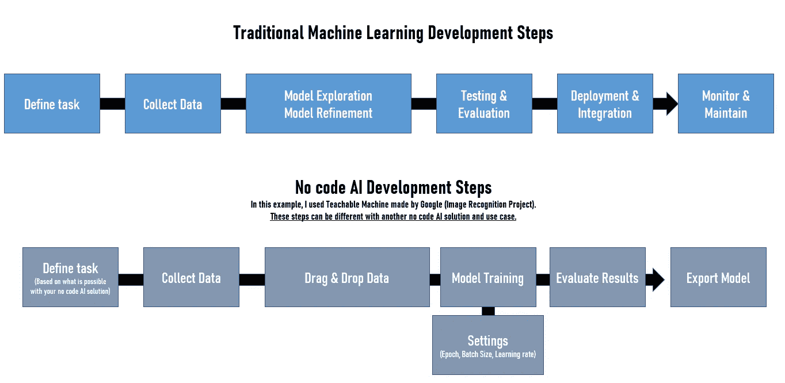
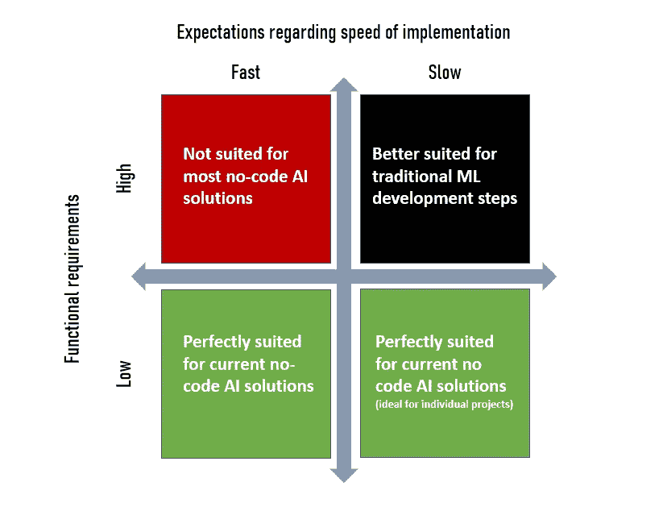

# 该不该用无代码 AI 平台？限制和机遇

> 原文：<https://towardsdatascience.com/should-you-use-a-no-code-ai-platform-limits-and-opportunities-4f39a92234f0?source=collection_archive---------28----------------------->

## 实施无代码人工智能解决方案后的经验教训

由[工作室共和国](https://unsplash.com/@studiorepublic?utm_source=unsplash&utm_medium=referral&utm_content=creditCopyText)在 [Unsplash](https://unsplash.com/s/photos/developer?utm_source=unsplash&utm_medium=referral&utm_content=creditCopyText) 拍摄的照片

虽然大多数人工智能项目仍然没有进入生产，但对无代码人工智能平台的兴趣一直在上升。事实上，越来越多的初创公司和大型科技公司现在提出“易于使用”的 ML 平台。

能够在不是数据科学家的情况下构建和使用基于机器学习的解决方案，这一想法对小型和大型公司来说都是非常有趣的事情，这些公司可以赋予员工权力，同时将更多资源用于复杂的 ML 项目。

在这篇文章中，我将分享我在实现了这些无代码 AI 解决方案之一并分析了与该行业相关的几家初创公司后所学到的东西。作为一名人工智能顾问，我的目标是确定这些解决方案是否可以帮助我们增加更多项目从概念证明(PoCs)过渡到可扩展、相关和高效部署的人工智能解决方案的机会。

# 为什么使用无代码人工智能平台

从运营的角度来看，我们在一年中为几个部门开发了几个人工智能项目。由于缺乏数据、投资、领导力，或者仅仅是由于机器学习目前的成熟度，他们中的大多数人只是停留在概念证明阶段。

当涉及到项目时，复杂程度是不一样的。事实上，一些项目与“最近的”算法有关，而其他项目只是使用众所周知的算法，如线性回归、K-means、朴素贝叶斯等。我们的无代码人工智能平台的目标是确定这些解决方案是否可以帮助我们将一些合作者转变为公民开发者，并将更多的数据科学家分派到“复杂”的用例中。

> ***公民开发者:*** 构建应用程序供他人使用的非专业*开发者*。虽然他们不直接向 IT 部门汇报，但他们使用 IT 部门认可的工具，如低代码平台。

**请务必理解，产品经理等内部公民开发人员的晋升并不意味着对数据科学家的需求正在消失。**这个想法是为了减轻数据科学家积压工作的负担，以便他们能够专注于更大、更复杂的项目。

显然，对于传统的 ML 工作流程来说，做“更少”的工作并加速特定用例的开发是很有吸引力的。有没有可能设想一个未来，经理们可以提出一个想法，构建它，并通过使用一个无代码的人工智能平台来运行项目？

# 传统 ML 与无代码 ML 流程

今天，大多数人工智能项目都遵循或多或少相同的步骤。事实上，你从识别一个用例开始，收集数据，建立模型，训练它，改进它，等等。为了确定无代码人工智能是否真的有帮助，我们应该首先了解“经典”ML 和无代码 ML 之间的差异。

[可教机器](https://teachablemachine.withgoogle.com/train/image)

如你所见,“传统”人工智能项目的一些步骤可以自动化，或者使用拖放工具变得简单。**从这个角度来看，我认为无代码人工智能平台是加速原型和演示开发的一种省时的方式。**

我相信无代码人工智能平台非常适合特定的项目。例如，我们希望预测客户流失、客户终身价值、动态定价等指标，或者分析几份合同的数据以帮助我们更好地进行谈判的用例。我们也相信这些工具在一些内部流程的自动化中是有用的。

**新技能**
可以肯定的是，无代码人工智能平台的兴起也将创造新的技能预期。在不久的将来，如果一个产品经理必须熟悉至少一个无代码人工智能工具，并且了解数据集管理，我不会感到惊讶。**我希望看到越来越多与这些工具相关的在线培训。**

# 特定的市场

无代码 AI 仍然是一个不断增长的市场。大多数玩家似乎首先把自己定位在技术的类型上(NLP，计算机视觉，等等。)或特定用例(CRM 管理等)。

> 在不久的将来，我希望看到完整的工具，使覆盖几乎所有用途成为可能，从而避免投资于多种工具和利用知识的需要。

这个行业由初创公司和开发自己工具的大型科技公司组成。出于显而易见的原因，初创公司似乎专注于特定的用例，而不是提供几种选择。

# 锁定战略和商业模式

这个行业最有趣的方面是大型科技公司如何试图吸引新客户，以增加他们的用户范围，同时使用锁定策略。

> **锁定策略:**一种策略，在这种策略中，客户非常依赖一家供应商的产品和服务，如果没有实际的和/或感知的巨大转换成本，客户就无法转向另一家供应商。

我经常想，如果不专业化，无代码人工智能初创公司能否长期生存。事实上，大型科技公司的优势在于能够为客户提供一种无需动脑的方法来保持在该供应商的平台和路线图上。

理想情况下，大型科技公司(谷歌和微软)希望公司能够使用他们的软件开发工具和与数据管理相关的更广泛的服务生态系统。

虽然其中一些解决方案是免费的或基于订阅模式，但它们可能需要顾问和开发人员的干预来培训用户和执行云后端连接工程。

# 实施无代码人工智能解决方案后的我的看法

几个月来，我们决定测试一个无代码人工智能平台的有效性。在我看来，无代码人工智能的效率和实用性并不是神话。

对我们来说，最大的好处是，由于使用无代码工具创建了快速 PoC，数据科学家可以通过评估他们不完整的想法来帮助我们的营销部门。事实上，他/她可以建议他们进行无代码 PoC，并在需求稳定后再回来进行。

然而，必须做出一些让步。事实上，如果你想快速生产而没有发展，**你必须能够降低你的期望。**

通过无代码解决方案基于机器学习的项目的成功将在很大程度上取决于您的功能需求，当需求非常具体时，就有必要在实现速度和与功能相关的期望之间找到正确的平衡。

**每个解决方案都有一个工具设计固有的边界**。事实上，这些工具是基于模型的，要么编辑选择提出简单的模型，这些模型将易于理解和使用，但反过来将缺乏灵活性，因为人们只能在模型的框架内开发。

相反，其他平台选择了更精细的模型，这些模型提供了与通过编码开发应用程序相当的灵活性。**另一方面，学习曲线和所需技能会高很多。**

我强烈建议**根据易用性和灵活性之间的平衡来选择工具**。在某些情况下，重要的是要记住，一旦你在一个平台上开发了一个应用程序，只要这个应用程序还在运行，你就和这个平台联系在一起了。在 PoC 的上下文中，这不是问题，但是在预期持续的应用程序的上下文中，情况可能会不同。

事实上，你必须确保你的项目所需的可扩展性可以通过使用无代码人工智能平台来实现。**我认为，对于“复杂”的用例，使用无代码人工智能平台是不可能有可扩展的解决方案的。**

此外，**契约关系** ( **数据所有权**)必须在成本和可逆性方面仔细检查。

另一个关键因素是**可维护性**。我建议你从一开始就确定你的目标是仅仅测试一个想法的相关性还是构建一个持久的应用程序。在第一种情况下，如果可能，最好使用无代码 AI 解决方案快速创建一次性 PoC。否则，我建议您使用传统的 ML 方法，构建稳定且可维护的版本。

如果你的无代码 AI 供应商可以保证你的可扩展性(在某些用例中是可能的)，我会建议你按比例评估许可的总成本，以确保长期的可维护性。

**可能发生的最糟糕的事情是，使用“快速而肮脏”的方法创建概念证明，然后投入生产，尝试扩展相同的概念证明。**

# 限制

在我看来，目前大多数(不是全部)无代码 AI 平台的极限是:

**个性化程度** 不管大多数人可能会怎么想，构建机器学习模型的困难不是编码，而是你可以支配的数据、特征工程、架构和测试。**在一些无代码解决方案中，您缺乏微调和调整不同参数的能力。**

另一个缺点与数据有关。事实上，你可能对数据**偏差**很熟悉。根据不同的用例，每个人都可以构建和导出这些模型。因此，增加了**生成有偏差算法的危险。**

**显然，机器学习工程师也可以创建有偏见的解决方案……**

如前所述，无代码人工智能工具可能是积极的，但它们需要特定的治理。事实上，如果你不能以一种治理和控制的方式集成它们，你只会引入更多的影子 IT 和更多的问题。

> **影子** **IT:** 这个术语指的是在企业的 IT 部门不知情的情况下被管理和利用的信息技术(IT)应用程序和基础设施。

数据科学家可能最终会花尽可能多的时间来修改同事的工作，而不是完成自己的任务。

**依赖性** 我对无代码 AI 工具开发的另一个担忧是与依赖性有关的。事实上，您的解决方案可能不需要数据科学家，但将来可能需要一些顾问来帮助您更好地理解 ML 或使您的解决方案可伸缩。因此，对精通技术的专家的依赖不会消失。

**对数据的需求** 所有的机器学习项目都需要同样的东西:数据
一个 ML 项目的成功高度依赖于你收集、管理和维护数据集的能力。然而，这通常是数据科学家的工作，我不确定“公民开发者”是否能完成这些任务。

**可伸缩性** 我最后关心的是可伸缩性。事实上，许多成功的概念验证在生产中失败了，因为我们无法构建一个能够以可扩展的方式服务于 ML 模型的系统。在使用大量敏感数据的行业，如医疗保健或银行业，这就更难了。

我本可以提到其他潜在的问题，比如部署、安全、与遗留系统的集成等。然而，我仍然相信无代码人工智能平台的有用性。使用无代码人工智能的项目的成功将在很大程度上取决于您的用例以及数据管理的成熟度。

我们仅仅处于这一趋势的开端，我很有信心越来越多的公司(尤其是中小企业)将会尝试利用这些工具。