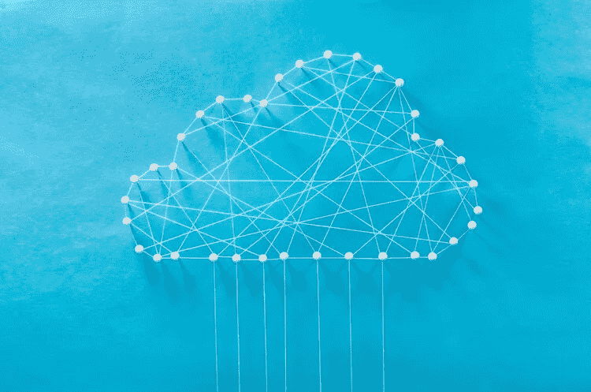

# 您是否应该使用云提供商提供的 ML 监控解决方案？

> 原文：<https://towardsdatascience.com/should-you-use-the-ml-monitoring-solution-offered-by-your-cloud-provider-60989653132c?source=collection_archive---------42----------------------->

## Azure 和 AWS 与 AI 系统性能监控最佳解决方案的比较

资料来源:莫纳实验室公司。

随着人工智能系统在许多行业变得越来越普遍，监控这些系统的需求也在增加。与传统软件相比，人工智能系统对数据输入的变化非常敏感。因此，[一类新的监控解决方案](https://www.monalabs.io/mona-blog/observability)已经在数据和功能级别(而不是应用程序级别的基础设施)出现。这些解决方案旨在检测人工智能系统中常见的独特问题，即概念漂移、偏见等。

人工智能供应商领域现在挤满了兜售监控能力的公司。这些公司包括一流的/独立的解决方案，以及集成的人工智能生命周期管理套件。后者提供更基本的监控功能，作为次要重点。

为了进一步宣传，一些主要的云提供商开始宣传他们也为部署在他们云平台上的机器学习模型提供监控功能。按市场份额计算，AWS 和 Azure 是第一大和第二大提供商，它们分别宣布了各自 ML 平台下的具体功能——[SageMaker 模型监视器](https://aws.amazon.com/about-aws/whats-new/2019/12/introducing-amazon-sagemaker-model-monitor/) (AWS)，和[数据集监视器](https://docs.microsoft.com/en-us/azure/machine-learning/how-to-monitor-datasets) (Azure)。到目前为止，谷歌(GCP)似乎只为服务模型和培训工作提供应用程序级别的监控。

在这篇文章中，我们提供了云提供商当前产品的概述(我们重点关注 AWS 和 Azure)，并讨论了这些解决方案中的差距(通常由最佳解决方案很好地涵盖)。

# 云提供商产品概述

那么 Azure 和 AWS 在监控生产中的模型方面能提供什么呢？

## 轻触开关即可记录模型输入和输出

监控任何类型的系统的第一部分几乎总是记录系统操作的数据。在监控 ML 模型的情况下，这从模型输入和输出开始。

毫不奇怪，Azure 和 AWS 都允许您轻松地将这些数据记录到各自的数据存储中(AWS 的 S3 存储桶，Azure 的 blob 存储)。您所要做的就是在 python 代码中向模型运行调用添加一个数据捕获配置。请注意，并非所有输入类型都可以自动保存(例如，在 Azure 上，不会收集音频、图像和视频)。AWS 还允许为数据捕获配置采样率。

## 使用现有的分析和 APM 解决方案分析数据

一旦收集了输入和输出数据，平台建议的下一步是使用其现有的分析/APM 产品来跟踪数据。

Azure [建议](https://docs.microsoft.com/en-us/azure/machine-learning/how-to-enable-data-collection#powerbi)使用 Power BI 或 Azure DataBricks 来获得数据的初步分析，而在 AWS 中，你可以使用 Amazon Cloudwatch。

由于数据保存在平台自己的存储系统中，通常很容易获得跟踪模型输入和输出的初始图表和图形。

## 漂移输入数据的基本跟踪

AWS 和 Azure 都提供了相当新的工具，用于警告模型输入数据的分布和行为的变化。对于 AWS 来说，这是“亚马逊 SageMaker 模型监视器”的主要部分，而对于 Azure 来说，这是通过一个叫做“[数据集监视器](https://docs.microsoft.com/en-us/azure/machine-learning/how-to-monitor-datasets)”的非常新的功能来完成的。

在这两个平台上，工作流都是从创建基线数据集开始的，基线数据集通常直接基于训练数据集。

一旦您准备好了基线，平台允许您从如上所述捕获的推理输入数据创建数据集，将它们与基线数据集进行比较，并获得关于特征分布变化的报告。

这两种解决方案之间存在一些差异。AWS 的解决方案从基线数据集创建“约束”和“统计”文件，其中包含输入数据的统计信息。这允许您稍后与推断数据进行比较，以获得关于差异的报告。另一方面，Azure 的“数据集监视器”为您提供了一个仪表板，用于比较基线数据集和推理时间数据集之间每个特性的分布。然后，当分布的变化足够大时，它允许您设置警报。

然而，上述差异实际上是相同基本功能的实现细节——以您的特征集为例，查看它们在训练集中的基线分布，并将其与它们在推理时间中的分布进行比较。

# 够了吗？

因此，云提供商确实为数据和模型层提供了监控功能，但你能依靠这些功能来维持甚至改进生产级人工智能系统吗？我们认为你不能。这里有几个原因:

## 生产级监控需要丰富的上下文数据

跟踪您的模型输入和输出是很好的，但是这还不足以真正理解您的数据和模型的行为。你真正需要监控的不是单个模型——而是整个人工智能系统。很多时候，这将包括您的云提供商不容易访问的数据。

几个例子:

1.  您有一个人类标记系统，并且您想要监控您的模型的输出与它们的标记相比如何，以获得您的模型的真实性能度量。
2.  您的系统包含几个模型和管线，其中一个模型的输出用作后续模型的输入特征。第一个模型的表现不佳可能是第二个模型表现不佳的根本原因，您的监控系统应该了解这种依赖性，并相应地向您发出警报。
3.  您有实际的业务结果(例如，您的建议模型选择的广告是否被实际点击)-这是衡量您的模型性能的一个非常重要的指标，即使输入功能从未真正改变，它也是相关的。
4.  您不想(甚至不允许，例如，种族/性别)将元数据用作输入要素，但您确实希望对其进行跟踪以进行监控，从而确保您不会对该数据字段有偏见。

有关基于上下文的监控的更多信息，请查看[这篇关于平台监控方法的文章](https://www.monalabs.io/mona-blog/platformapproach)。

## 跟踪数据的子部分

一个人工智能系统平均工作得很好**，但在数据的子部分表现不佳，这种情况并不罕见。因此，对性能进行细致的检查至关重要。**

**考虑这样一种情况，您的模型对来自您的一个客户的数据表现非常不同。如果这个客户占了您的模型所接收数据的 5%,那么模型的总体平均性能可能看起来不错。然而，这位顾客不会高兴的。这同样适用于不同的地理位置、设备、浏览器或任何其他可以对数据进行切片的维度。**

**良好的监控解决方案会在子细分市场中发生异常行为时向您发出警报，包括在更细粒度的子细分市场中发生异常行为时，例如，来自特定地区的用户使用特定设备时。**

## **可配置性**

**每一个 AI 系统都像一片雪花。它们都有特定的性能指标、可接受(或不可接受)的行为等。因此，一个好的人工智能监控平台必须是高度可配置的。**

**考虑这样一种情况，你有一个 NLP 模型来检测输入文本的情感。您知道对于短文本(例如，少于 50 个字符)，您的模型不是很准确，而您对此没有意见。您希望监控您的模型输出，但是当短输入文本的相对比例增加时，您不希望收到低置信度分数的警报。您的监控平台必须允许您在考虑这一特定指标(但可能不考虑其他指标)时，能够**轻松**从监控的数据集中排除所有短文本。**

**还有许多其他例子可以说明微调的价值，从警报首选项到临时数据操作。完全自主的监控方法在理论上听起来不错，也很容易解释，但是当遇到现实世界的约束时就会失败。**

# **结论**

**首先，看到主要的云提供商开始为生产人工智能提供更多工具是令人鼓舞的。然而，我们审查的解决方案是非常基础和实验性的(例如，Azure 还没有为上述解决方案提供任何 SLA)。对于这些供应商来说，监控当然不是最优先考虑的事情。**

**与此同时，业内越来越清楚的是，监控模型和整个人工智能系统是一项基本需求，不能被视为事后想法。为了让你的人工智能产品做好准备，并确保在商业 KPI 受到负面影响之前发现人工智能问题，这一点至关重要。同类最佳的解决方案无疑将监控作为其核心重点和优先事项。**

**那么，最佳品种在市场上会有优势吗？还有待观察。一个可以考虑的先例是杀伤人员地雷行业。云提供商长期以来一直为 IT 组织提供基本的解决方案，但市场催生了一批成功的一流企业，如 New Relic、AppDynamics 和 Datadog(以及许多其他企业)。一些购买者满足于更基本的功能，因为他们喜欢与更少的供应商打交道，而另一些购买者喜欢生命周期每个阶段中最深入的功能。**

**无论如何，观察和体验这一类别的演变肯定会很有趣。**

# **参考**

*   **GCP 监控模型(APM like):[https://cloud . Google . com/ai-platform/prediction/docs/monitor-prediction](https://cloud.google.com/ai-platform/prediction/docs/monitor-prediction)**
*   **AWS 宣布(12 月 19 日)“Sagemaker 模型监视器”:[https://AWS . Amazon . com/blogs/AWS/Amazon-Sagemaker-Model-Monitor-fully-managed-automatic-monitoring-for-your-machine-learning-models/](https://aws.amazon.com/blogs/aws/amazon-sagemaker-model-monitor-fully-managed-automatic-monitoring-for-your-machine-learning-models/)**
*   **Azure 模型数据收集:[https://docs . Microsoft . com/en-us/azure/machine-learning/how-to-enable-data-collection](https://docs.microsoft.com/en-us/azure/machine-learning/how-to-enable-data-collection)**
*   **Azure 数据集监视器:[https://AWS . Amazon . com/blogs/AWS/Amazon-sage maker-model-monitor-full-managed-automatic-monitoring-for-your-machine-learning-models/](https://aws.amazon.com/blogs/aws/amazon-sagemaker-model-monitor-fully-managed-automatic-monitoring-for-your-machine-learning-models/)**

***原载于 2020 年 9 月 15 日*[*https://www . monalabs . io*](https://www.monalabs.io/mona-blog/platformapproach)*。***