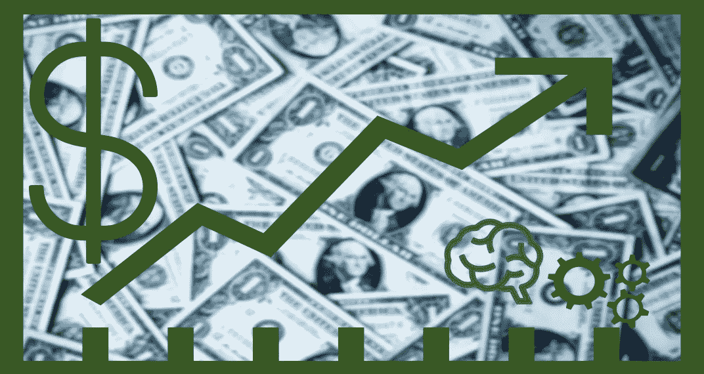
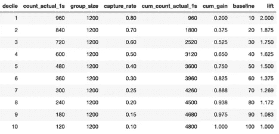
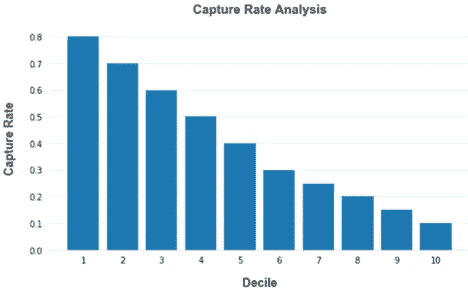
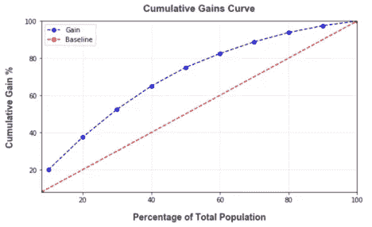
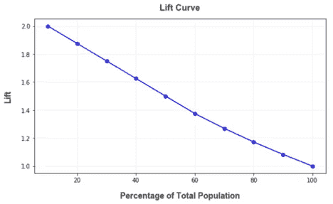

# 向我展示 ROI:业务分类指标

> 原文：<https://towardsdatascience.com/show-me-the-roi-classification-metrics-for-business-9fd00389846b?source=collection_archive---------38----------------------->

## 通过可操作的指标推动业务价值

沙欣·高赫尔博士

分类器的评估指标有助于确定模型从数据中学习的程度以及区分不同类别的能力。准确度、精密度、召回率、F1、AUC 和对数损失是评估分类器性能最常用的指标。在这篇文章中，我将谈论一些其他指标，即。累积收益、提升和捕获率，可用于向业务利益相关方展示分类模型的有效性和价值，使其成为“可操作的洞察”，并有助于在业务运营中战略性地使用预测。我将分享一个 python 实用函数，它将把预测概率和实际类(来自目标列的地面事实或训练数据中的“Y”)作为输入，并计算模型的累积增益、提升和捕获率。这也可以用于设置分类器的阈值。我还将分享一些来自不同垂直行业的用例示例，如[预测性维护](https://docs.microsoft.com/en-us/archive/blogs/machinelearning/evaluating-failure-prediction-models-for-predictive-maintenance)，医疗保健和营销，这些指标可用于推动业务价值。

# 物有所值

在建立机器学习模型以预测事件发生的可能性之后，例如机器故障的可能性、客户流失的可能性、患者发生医疗事件的可能性、成员响应外展的可能性等。下一步通常是设计一个基于模型预测的行动计划。经常出现的问题是最少的病例数是多少(顾客、病人、机器等)。)我可以以获得最佳结果为目标。这个问题的答案可以在捕获率分析、累积增益和提升图表中找到。这些指标相互关联，可以互换使用，但都回答了同一个业务问题，即如何获得最佳性价比。

下面我将简要描述这些指标是什么以及计算它们的步骤。在 [GitHub](https://github.com/shaheeng/ShaheensBlogs/blob/master/Show_me_the_ROI/Show_me_the_ROI.ipynb) 中可以找到 python 实用函数以及所使用的数据。该函数返回的输出如下，将用于绘图。

效用函数度量的输出 _roi

# 捕获率分析

捕获率分析(也称为十分位数分析)提供了一种快速直观的方法来测试模型预测预期结果的能力。为了分析捕获率，从模型中预测的概率按降序排列，并分成 10 个大小相等的区间或十分位数，我们查看每个十分位数中的实际事件率。实际事件率是十分位数中的事件数(实际阳性数)除以十分位数的大小，其中十分位数的大小就是实例总数除以 10。这些被绘制成柱状图，我们从上到下观察各个柱状图的相对高度，高度代表每个十分位数的事件发生率。

*理想模式* —一个好的图形表现出阶梯效应，从顶部的十分位数到底部的十分位数下降。具有显示良好阶梯模式的条形的模型比没有条形的模型更有预测性，因为它表明模型是宁滨，即从最有可能成功到最不可能成功的实例。

*不期望的图形* —一个坏的图形具有不显示阶梯效应的条，并且看起来是无序的或者看起来是相同的高度。这表明该模型并不比随机将宁滨实例分成十分位数表现得更好。

捕获率分析

阅读左边的第一个条形，我们可以看到，通过将 10%的记录作为目标，这些记录被模型列为“最可能的阳性”(前十分位数)，将在目标组中产生 80%的阳性。

# 累积收益图

累积收益图显示了通过使用模型来确定目标或采取行动与随机确定目标相比所能获得的收益。

例如:在预测性维护场景中(该模型通常预测机器出现故障的可能性)，如果您随机抽取 20%的机器进行定期维护，您可能会发现只有 20%的机器会出现故障(这将是您的基准)。但是，如果您的目标是 20%的机器，并且如果模型能够确保 60%将要失败的机器在这个组中，那么这将是您的模型的收益。

在累积增益图中，X 轴是抽样总体的百分比，Y 轴是样本中实际失败的比例。该曲线显示了通过针对案例总数的给定百分比而“获得”的案例总数的百分比。曲线离基线越远，增益越大。

累积增益曲线

在上面的增益图中，我们可以看到，通过使用模型预测的概率瞄准 50%的人口，我们将获得 75%的事件。通过使用来自模型的预测将 40%的人口作为目标，我们将仅获得 65%的事件，而通过将 60%的人口作为目标，我们将获得 82%的事件。

如果业务目标或 KPI 可以通过获得 65%的事件来满足，我们可以通过将所需的百分比映射到适当的临界值来使用它来设置分类器的阈值。阈值决定了如何将预测概率标记为正数或负数

# 电梯图表

提升图来源于累积收益图。在提升图中，X 轴是抽样人口的百分比，Y 轴是使用和不使用预测模型获得的结果之间的比率。这就是累积增益图中累积增益与基线的比值。提升曲线是预测模型通过选择相对较少的案例获得相对较大部分正面信息的有效性的另一种衡量标准，换句话说，就是我们可以有效地撇去奶油。

例如:在医疗保健领域，一个常见的场景是主动接触有风险的患者以进行干预。这可以用于糖尿病或高血压或任何其他疾病的干预。由于资源有限，始终需要优化外展计划，以覆盖大部分真正处于风险中的患者，同时最大限度地减少外展次数。

升力曲线

在上面的提升曲线中，你会注意到，提升将随着我们选择的目标人群的样本而变化。当只针对人口中的一小部分样本(具有高预测概率的实例)时，高提升是好的分类器的信号。随着我们的目标人群样本越来越大，Lift 将继续下降。

在本文中，我们使用 python 来计算分类器的一些业务指标。希望在这些指标的帮助下，您将能够为您的机器学习模型建立 ROI，这将有助于在业务运营中采用该模型。尽情享受吧！

@Shaheen_Gauher

Shaheen Gauher 的职业是人工智能沟通者、智能解决方案推动者和数据科学家。她帮助企业构建和部署预测解决方案，以最佳地利用他们的数据，并使他们能够通过技术和人工智能实现更多目标。她是训练有素的气候科学家和物理学家，并在塔夫茨大学艺术与科学研究生院的数据分析顾问委员会任职。