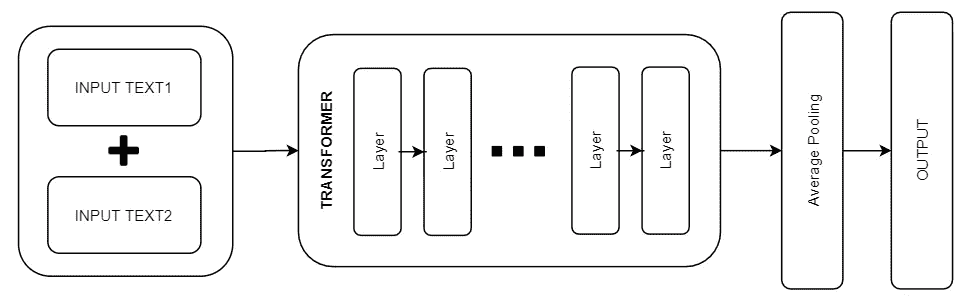
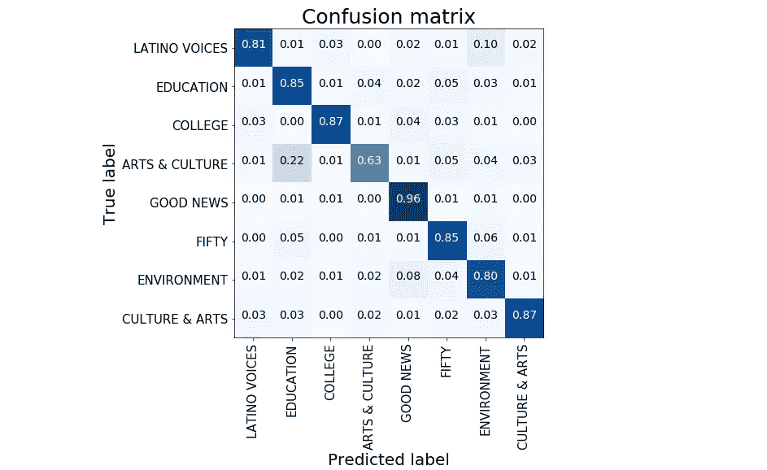
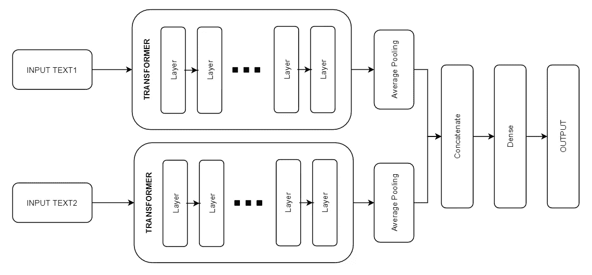
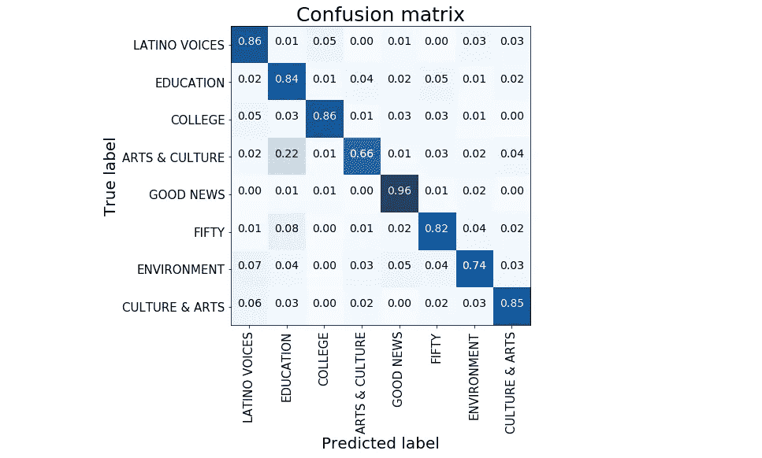
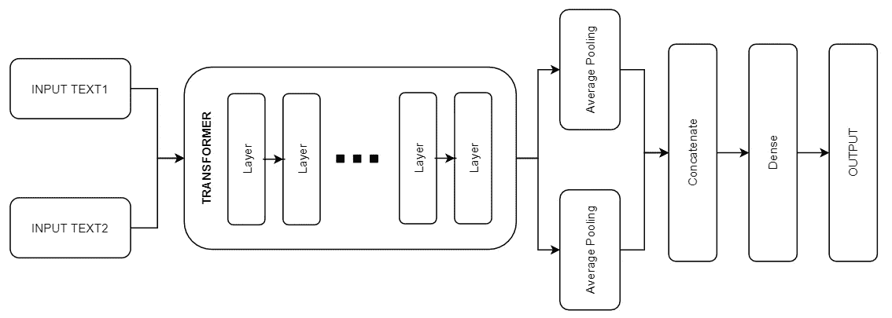
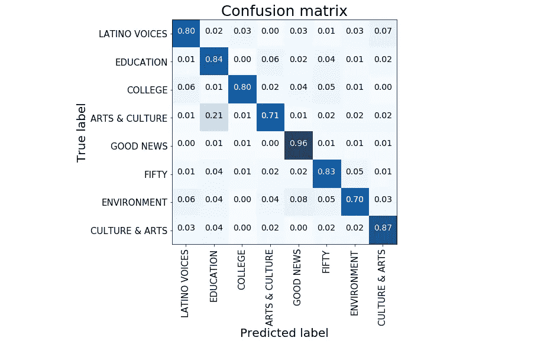

# 用于多文本分类的连体和双 BERT

> 原文：<https://towardsdatascience.com/siamese-and-dual-bert-for-multi-text-classification-c6552d435533?source=collection_archive---------18----------------------->

## 在模型中插入变压器的不同方法

罗尔夫·诺依曼在 [Unsplash](https://unsplash.com?utm_source=medium&utm_medium=referral) 上的照片

对 NLP 的不断研究产生了各种预训练模型的发展。对于各种任务，如文本分类、无监督主题建模和问答，最先进的结果通常会有越来越多的改进。

最伟大的发现之一是在神经网络结构中采用了注意力机制。这项技术是所有被称为**变形金刚网络的基础。**他们应用注意力机制提取关于给定单词上下文的信息，然后将其编码到学习向量中。

作为数据科学家，我们可以利用许多变压器架构来预测或微调我们的任务。在本帖中，我们喜欢经典的 BERT，但同样的推理可以应用于其他任何变压器结构。**我们的范围是在双重和连体结构中使用 BERT，而不是将其用作多纹理输入分类的单一特征提取器**。这篇文章的灵感来自于这里的。

# 数据

我们从 Kaggle 收集了一个数据集。[新闻类别数据集](https://www.kaggle.com/rmisra/news-category-dataset)包含从[赫芬顿邮报](https://www.huffingtonpost.com/)获得的 2012 年至 2018 年约 20 万条新闻标题。我们的范围是根据两种不同的文本来源对新闻文章进行分类:标题和简短描述。我们总共有 40 多种不同类型的新闻。为了简单起见，考虑到我们工作流的计算时间，我们只使用 8 个类的子组。

我们不应用任何类型的预处理清洗；我们让我们的伯特做所有的魔术。我们的工作框架是 **Tensorflow** 和巨大的 **Huggingface** 变形金刚库。更详细地说，我们利用了裸露的 Bert 模型转换器，它输出原始的隐藏状态，而没有任何特定的头在上面。它可以像 Tensorflow 模型子类一样访问，并且可以很容易地在我们的网络架构中进行微调。

# 单伯特

作为第一个竞争对手，我们引入了单一 BERT 结构。它只接收一个文本输入，这是我们两个文本源连接的结果。这是常态:任何模型都可以接收串联特征的输入。对于变压器，这一过程通过将输入与特殊令牌相结合而得到提升。

BERT 期望输入数据具有特定的格式:有特殊的标记来标记句子/文本源的开始([CLS])和结束([SEP])。同时，标记化涉及将输入文本分割成词汇表中可用的标记列表。用词块技术处理未登录词；其中一个单词被逐渐分成子单词，这些子单词是词汇表的一部分。这个过程可以由预先训练好的拥抱脸标记器轻松完成；我们只需要处理填料。

我们以每个文本源的三个矩阵(令牌、掩码、序列 id)结束。它们是我们变压器的输入。在单个 BERT 的情况下，我们只有一个矩阵元组。这是因为我们同时将两个文本序列传递给我们的标记器，这两个文本序列自动连接在一起(用[SEP]标记)。

我们模型的结构非常简单:变压器直接由我们上面构建的矩阵供电。最后，变压器的最终隐藏状态通过平均池操作来减少。概率得分由最终的密集层计算。

我们简单的 BERT 在测试数据上达到了 83%的准确率。这些表现记录在下面的混淆矩阵中。

# 双重伯特

我们的第二种结构可以定义为双 BERT，因为它使用两个不同的变压器。它们具有相同的组成，但是用不同的输入来训练。第一个接收新闻标题，而另一个接收简短的文字描述。输入被编码为总是产生两个矩阵元组(令牌、掩码、序列 id)，每个输入一个。对于两个数据源，我们的转换器的最终隐藏状态随着平均池化而减少。它们被连接起来并通过一个完全连接的层。

通过这些设置，我们可以在测试数据上达到 84%的准确率。

# 暹罗伯特

我们最后的模型是一种连体建筑。它可以这样定义，因为两个不同的数据源在同一个可训练转换器结构中同时传递。输入矩阵与双 BERT 的情况相同。对于两个数据源，我们的转换器的最终隐藏状态是通过一个平均操作来汇集的。由此产生的串联在一个完全连接的层中传递，该层组合它们并产生概率。

我们的连体结构在测试数据上达到了 82%的准确率。

# 摘要

在这篇文章中，我们应用了 BERT 结构来执行多类分类任务。我们实验的附加价值是以各种方式使用变压器来处理多个输入源。我们从一个源中所有输入的经典连接开始，并在保持文本输入分离的情况下结束了模型。双体和连体变体能够实现良好的性能。因此，它们可以被视为传统单变压器结构的良好替代品。

[**查看我的 GITHUB 回购**](https://github.com/cerlymarco/MEDIUM_NoteBook)

保持联系: [Linkedin](https://www.linkedin.com/in/marco-cerliani-b0bba714b/)

**参考文献**

两张床比一张床好

Kaggle: [伯特基 TF2.0](https://www.kaggle.com/akensert/bert-base-tf2-0-now-huggingface-transformer)