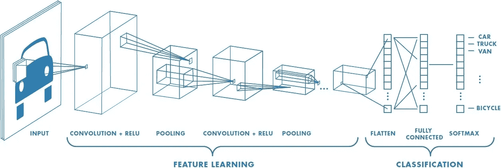
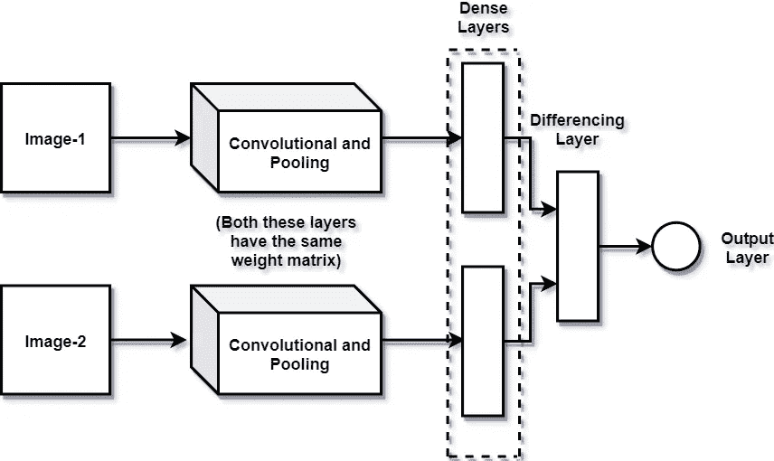
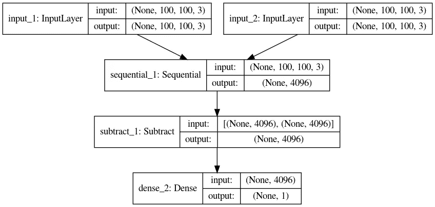
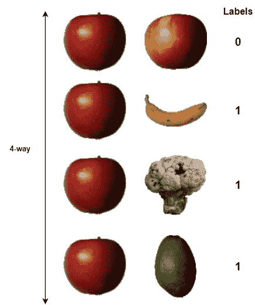
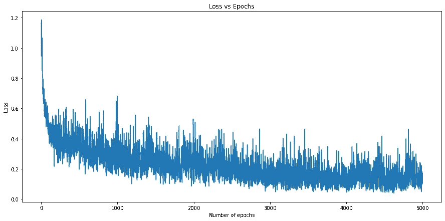
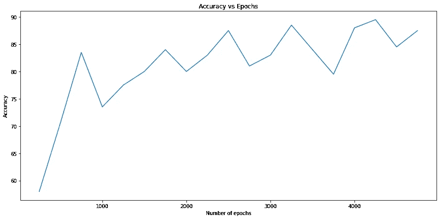

# 暹罗网络

> 原文：<https://towardsdatascience.com/siamese-networks-line-by-line-explanation-for-beginners-55b8be1d2fc6?source=collection_archive---------5----------------------->

## 针对初学者的逐行解释

# 摘要

Siamesse 网络是一类能够一次性学习的神经网络。这篇文章针对深度学习初学者，他们熟悉 python 和卷积神经网络的基础知识。我们将逐行解释如何使用 Python 中的 Keras 实现暹罗网络。当您浏览代码时，如果您觉得有些事情可以用更好的方式解释或完成，请随时发表评论。

图片由 [Gerd Altmann](https://pixabay.com/users/geralt-9301/?utm_source=link-attribution&amp;utm_medium=referral&amp;utm_campaign=image&amp;utm_content=4550606) 从 [Pixabay](https://pixabay.com/?utm_source=link-attribution&amp;utm_medium=referral&amp;utm_campaign=image&amp;utm_content=4550606) 拍摄

# 介绍

让我们假设我们有一个 1000 名员工的公司。我们决定实施面部识别系统来记录你的员工的出勤情况。如果我们使用传统的神经网络，我们将不得不面对两个主要问题。第一个是数据集。从我们每个员工那里收集大量的数据集几乎是不可能的，我们最终会得到每个员工最多 5 张照片。但是传统的 CNN(卷积神经网络)无法学习如此小的集合的特征。我们最终还会得到 1000 个输出类。让我们考虑一下，不知何故，我们从每个员工那里获得了一个巨大的数据集，我们训练了一个非常好的 CNN 模型。当一名新员工加入我们的组织时会发生什么？我们如何将此人纳入我们的面部识别系统？所有这些缺点都可以通过使用连体网络来克服。在这篇文章中，我们将使用暹罗网络进行一次性学习实验，该网络专注于差异而不是特征匹配。

我们计算不同类别的图像之间的相似性得分，而不是使用每个类别的大量数据。这个网络的输入将是属于相同类别或不同类别的两个图像。输出将是范围在 0 和 1 之间的浮点数，其中 1 表示两个图像属于同一类，0 表示它们来自不同的图像。让我首先解释它与使用 CNN 架构的图像分类有何不同。

# 体系结构

在 CNN 模型中，有一系列卷积层和池层，后面是一些密集层和一个可能带有 softmax 函数的输出层。这里的卷积层负责从图像中提取特征，而 softmax 层负责为每个类别提供一个概率范围。然后，我们决定具有最高概率值的神经元的图像类别。

看看[这篇伟大的文章](/a-comprehensive-guide-to-convolutional-neural-networks-the-eli5-way-3bd2b1164a53)了解更多关于 CNN 如何工作的信息。

传统 CNN 架构由[苏米特·萨哈](https://medium.com/u/631ee5e6343e?source=post_page-----55b8be1d2fc6--------------------------------)

对于暹罗网络，除了没有 softmax 层之外，它具有类似的卷积层和池层构成。所以，我们从致密层开始。如前所述，由于网络有两个图像作为输入，我们将得到两个密集层。现在我们计算这两层的差异，并将结果输出到具有 sigmoid 激活函数(0 到 1)的单个神经元。因此，这个网络的训练数据必须以这样一种方式构造，即有一个由两个图像和一个变量 0 或 1 组成的列表。

暹罗网络

**注意:**只有一个网络，两个图像通过同一个网络。只是有两个输入。因此，两个输入将从卷积层和密集层通过相同的权重矩阵。

如果你仍然不清楚这是如何工作的，参考这个[链接](https://www.youtube.com/watch?v=6jfw8MuKwpI)。

# 密码

在这篇文章中，我使用了 Kaggle 的 [Fruits 360](https://www.kaggle.com/moltean/fruits) 数据集。但是，可以随意试验其他数据集。代码托管在 Kaggle 中。如果您对代码有疑问，请随意使用下面的笔记本，亲自体验一下。

[***https://www.kaggle.com/krishnaprasad96/siamese-network***](https://www.kaggle.com/krishnaprasad96/siamese-network)

## 导入库

让我们从导入我们正在使用的库开始。如前所述，这段代码使用 Keras 构建模型，使用 NumPy，pillow 进行数据预处理。

注意:不要将 Keras 作为"*从 tensorflow 导入 Keras*

## 数据预处理

*   **第 1 行:**包含数据集的基础目录
*   第 2 行:表示将用于培训的百分比。其余的将用于测试
*   **第三行:**由于 Fruits 360 是一个用于图像分类的数据集，所以它每个类别都有很多图像。但是对于我们的实验来说，一小部分就足够了
*   **第 6 行:**从文件夹中获取目录列表。每个文件夹都属于一个类
*   **第 10–13 行:**声明三个空列表，记录 X(图片)，y(标签)，cat_list(记录每张图片的类别)
*   **第 16–24 行:**遍历类文件夹，从每个类中选择 10 张图像，将它们转换成 RGB 格式，并附加到一个列表中。在 cat_list[]中记录图像的类别，以备将来参考
*   **第 26–28 行**:将所有列表转换成 NumPy 数组。因为任何图像的范围都是从 0 到 255，所以为了简化，将数组 x 除以 255

## 列车测试分离

*   **第 1 行:**通过乘以 train_test_split 计算将用于训练的类的数量
*   **第 2 行:**从可用的总类中减去 train_size，得到 test_size
*   **第 4 行:**将 train_size 乘以每个类中的文件数，得到训练文件总数
*   **第 7–15 行:**将之前计算的值用于子集 X、Y 和 cat_list

## 生成批次

此部分用于生成用于培训的批处理文件。批处理文件应该具有 X 和 y。在图像分类的通常情况下，如果批处理大小为 64，图像大小为(100，100，3)，则 X 的大小将是大小为 64 的列表，并且列表中的每个元素的大小将为(100，100，3)。

在我们的例子中，因为我们有 2 个输入，所以将有一个大小为 64 的列表(假设为“A”)，并且“A”中的每个元素将有一个长度为 2 的列表(假设为“B”)，并且“B”中的每个元素的大小将为(100，100，3)。为了训练，我们将生成一个批处理，使得一半的输入对 B[0]和 B[1]属于同一类别。给这些图像对赋值 0。对于另一半输入对，B[0]和 B[1]属于不同的类别。给这些图像对赋值 1。

*   **第 3–7 行:**将 x_train、cat_train 的值以及训练规模的开始和结束规模存储在一个临时变量中
*   **第 9–11 行:**将 Y 的 batch_size 的一半指定为 0，其他的指定为 1
*   **第 13 行**:从要使用的培训类别列表中随机生成一个类别列表。另外，追加两个 image_size*batch_size 数组
*   **第 17–25 行**:对于每次迭代，在 batch_x[0]的情况下，从类别列表中指定的类别中选择一个图像。对于 batch_x[1],如果 y[i]为 0，则从同一类别中选择图像，否则从除同一类别之外的任何其他类别中选择 batch_x[1]

## 暹罗网络

*   **第 1 行:**声明输入图像的形状。
*   **第 2 行:**用图像的形状声明两个输入。
*   **第 6–7 行:**声明初始化网络权重和偏差的参数。如论文中所述选择这些值。
*   **第 9–20 行:**声明一个具有 4 个卷积层和最大池层的顺序模型。最后使用一个平整层，然后是一个致密层。
*   **第 22–23 行:**将两个输入传递给同一个模型。
*   **第 25–27 行**:从两幅图像中减去密集层，并使其通过具有 s 形激活功能的单个神经元。
*   **第 29–30 行:**将带有损耗的模型编译为“二元交叉熵”和“亚当”优化器。
*   **第 32 行:****siamese _ net**的绘图模型函数输出如下。

暹罗网络

## 单向一次学习

这是一个验证一次性学习的过程，我们挑选“n”个输入对，使得只有一个输入对属于同一类别，而其他所有输入对都来自不同类别。如果我们考虑 9 路单次验证，并且网络的每个输入需要两个图像，则 x[0]对于所有 9 对都保持恒定，x[1]仅对于 9 对中的 1 属于 x[0]的相同类别，而对于其他所有的都不同。如果所有的 9 对都给了该模型，则预期属于同一类别的对将具有 9 对中的最低值。在这种情况下，我们认为这是一次成功的预测。

输入参数 **n_val** 是指验证步骤的数量。 **n_way** 指每个验证步骤的路数。记住，上面提到的 x[0]在每个验证步骤中都保持不变。

***(更深入的理解，请叉开 Kaggle 的笔记本，尝试从该功能调试每一行)***

*   **第 3–7 行:**将 x_val，cat_test 存储在一个临时变量中
*   **第 9 行:**这与批处理生成中的第 13 行相同，除了我们从测试集中创建了一批随机类别
*   **第 11–24 行**:对于每个验证步骤，我们遍历 n_way，从 class_list 中取出相应的类别列表，从该类别中挑选一个图像，并将其存储在 x[0]中。对于 x[1],如果它是第一次迭代，则从相同的类别中选择一个图像，而对于其他图像，则从不同的类别中选择。这个内部循环几乎与上面讨论的 batch_generation()方法相同。
*   **第 26–31 行:**对于每个验证步骤，使用模型预测输出，并检查结果[0]与其他结果相比是否有最小值。请注意，结果数组将是一个大小为 n_way 的列表。如果是，在 n_correct 上加 1。对所有其他验证步骤重复相同的步骤。
*   **第 32 行:**使用 n_correct 和验证步骤数计算精度。

## 训练模型

训练模型有 4 个超参数(时期，批量大小，n_val，n_way)

*   **第 6–7 行**:声明两个列表，记录损耗和精度值，以便进一步可视化。
*   **第 8–20 行**:对于每个历元，获取 x 和 y 的批次，使用这些输入训练模型，并将损失附加到列表中。对于每“N”(本例中为 250)个时期，通过进行 N 向一次性学习来检查模型的表现。

## 成果和未来工作

上面的代码在 Kaggle 中训练了 5000 个纪元。使用 GPU 将显著减少训练时间。

模型的训练损失

模型的准确性

我们能够在验证集上达到 90%的准确率。为了进一步提高精度，我们可以尝试从预先训练的模型中导入权重，如 VGG-16、雷斯网-50 等。

# 结束的

如果你有任何问题，请告诉我。我会尽力回应。由于这是我的第一篇博文，请告诉我它是否对你的项目有所帮助，或者我是否应该改变解释事物的方式。

我期待着创造更多关于计算机视觉的帖子。让我知道你希望涵盖的主题。黑客快乐！