# Sidetable 为您提供了您不知道自己需要的熊猫方法

> 原文：<https://towardsdatascience.com/sidetable-gives-you-the-pandas-methods-you-didnt-know-you-needed-92be825ff512?source=collection_archive---------41----------------------->

## 快速制作缺失值、频率计数、小计等数据帧🎉

Sidetable 是一个新的 Python 库，它为 pandas 中的探索性数据分析增加了几个方便的方法。在本指南中，我将向您展示如何使用 sidetable，以及它在您的数据科学工作流中的合适位置。

当我们探索 sidetable 时，我们将使用最近添加到 [seaborn](https://seaborn.pydata.org/) 可视化库中的企鹅数据集。企鹅数据集旨在取代过度使用的虹膜数据集。如果没有别的，它增加了一些多样性，并允许我们展示一些企鹅图片。😀


下颚带企鹅。资料来源:pixabay.com

Pandas 是使用 Python 的数据分析师和数据科学家的探索工具。🐼pandas API 很大，面向数据清理和数据争论。新的 [sidetable](https://github.com/chris1610/sidetable) 包为数据帧增加了方便的方法。这些方法使得查看缺失值、每列值的计数、小计和总计变得更加容易。

我们去看看吧！🚀

# 设置

要获得必需的软件包及其依赖项的最新版本，请取消注释并运行以下代码一次。

```
# ! pip install sidetable -U
# ! pip install pandas -U
```

让我们导入包并检查版本。

```
import sys
import pandas as pd
import sidetable 

print(f"Python version {sys.version}")
print(f"pandas version: {pd.__version__}")
print(f"sidetable version: {sidetable.__version__}")Python version 3.7.3 (default, Jun 11 2019, 01:11:15) 
[GCC 6.3.0 20170516]
pandas version: 1.0.5
sidetable version: 0.5.0
```

如果你的 Python 版本低于 3.6，建议你更新一下。如果你的版本低于 1.0，熊猫也一样。要了解更多关于熊猫 1.0 的更新，请点击这里查看我的文章。

# 企鹅数据🐧

我们将直接从托管 seaborn 数据集的 GitHub 存储库中的. csv 文件读取南极企鹅数据集。

数据是由 Kristen Gorman 博士和 LTER 南极洲帕尔默站收集和提供的。点击查看更多信息[。](https://github.com/allisonhorst/palmerpenguins)

让我们将数据放入 pandas DataFrame 并检查前几行。

```
df_penguins = pd.read_csv('https://raw.githubusercontent.com/mwaskom/seaborn-data/master/penguins.csv')
df_penguins.head(2)
```

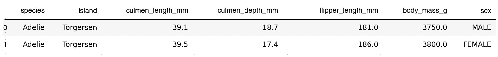

好吧，看起来我们有一些企鹅。👍

或者，如果您安装了 [seaborn](http://seaborn.pydata.org/) 、`import seaborn as sns`并运行`df_penguins = sns.load_dataset('penguins')`，这个数据集可以通过 seaborn 加载。

在将一个新数据集读入 DataFrame 后，我的下一步是使用`df.info()`来获取关于它的一些信息。

```
df_penguins.info()<class 'pandas.core.frame.DataFrame'>
RangeIndex: 344 entries, 0 to 343
Data columns (total 7 columns):
 #   Column             Non-Null Count  Dtype  
---  ------             --------------  -----  
 0   species            344 non-null    object 
 1   island             344 non-null    object 
 2   culmen_length_mm   342 non-null    float64
 3   culmen_depth_mm    342 non-null    float64
 4   flipper_length_mm  342 non-null    float64
 5   body_mass_g        342 non-null    float64
 6   sex                333 non-null    object 
dtypes: float64(4), object(3)
memory usage: 18.9+ KB
```

我们看到了 6 列 344 行的一些基本信息。

让我们看看 sidetable 如何帮助我们探索数据。

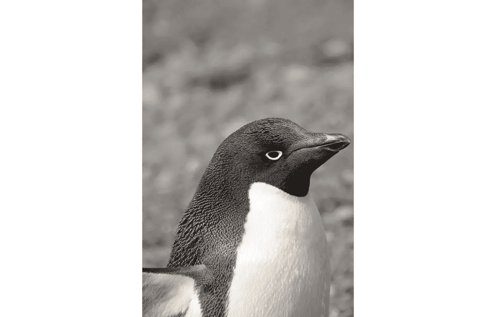

阿德利企鹅。资料来源:pixabay.com

# 探索侧桌

所有侧表方法都使用`.stb`访问器。关于熊猫访问器 API 的更多信息，请参见 sidetable 的作者 Chris Moffit 的这篇文章。

## stb.missing()

我们要检查的第一个侧置 DataFrame 方法是`stb.missing()`。下面是它的使用方法:

```
df_penguins.stb.missing()
```

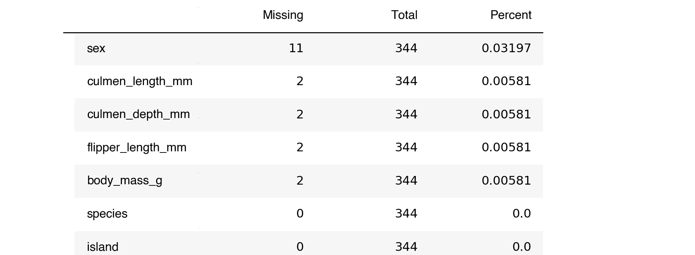

结果是一个数据帧，每列有缺失值的数量，按从多到少排序。它还显示总行数和每列缺失值的百分比。

有了`df.info()`，我们将不得不心算。🤔

或者，我们可以用`df.isna().sum()`按列查看所有缺失的值。

```
df_penguins.isna().sum()species               0
island                0
culmen_length_mm      2
culmen_depth_mm       2
flipper_length_mm     2
body_mass_g           2
sex                  11
dtype: int64
```

但是`df.isna().sum()`没有包括百分比，格式也不好。说到漂亮的格式，让我们让 sidetable 的输出更漂亮。💐

```
df_penguins.stb.missing(style=True)
```

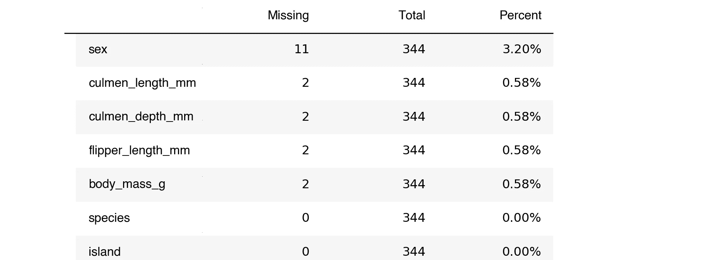

通过`style=True`会清除*百分比的*列格式。

每当我有一堆缺少数据的列时，我打算使用`stb.missing()`。

## stb.freq()

现在让我们看看 sidetable DataFrame 方法`.stb.freq()`，sidetable 包中的主要课程。🍲

让我们看看*物种*类别。

```
df_penguins.stb.freq(['species'])
```

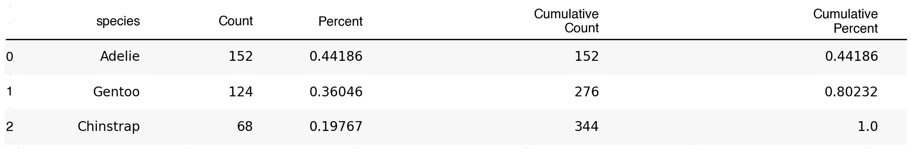

`stb.freq()`的结果就像组合有和没有`normalize=True`参数的 value_counts、累积计数和累积百分比。与`stb.missing()`一样，我们可以通过传递`style=true`使样式更好。🎉

```
df_penguins.stb.freq(['species'], style=True)
```

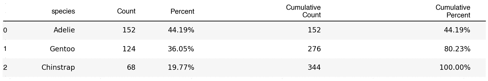

那很方便。😀

注意，所有 sidetable 方法都在数据帧上操作并返回一个数据帧。

```
type(df_penguins.stb.freq(['species']))pandas.core.frame.DataFrame
```

你知道，这些数据是名义上的，而不是顺序的，我们可能不需要累积列。我们可以通过像这样传递`cum_cols=False`来去掉那些列:

```
df_penguins.stb.freq(['species'], style=True, cum_cols=False)
```


巴布亚企鹅。资料来源:pixabay.com

让我们看看如果我们将多个列传递给`stb.freq()`会是什么样子。

```
df_penguins.stb.freq(['species', 'island', 'sex'])
```

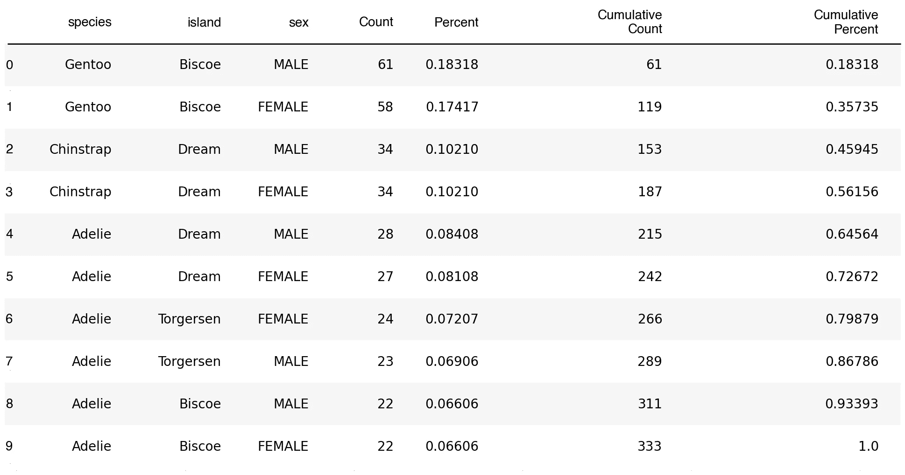

那是相当的崩溃。让我们只看*岛*一栏，探索一些更随意的论点。

```
df_penguins.stb.freq(['island'], style=True)
```

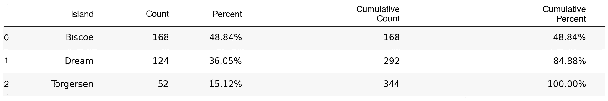

如果我们只想包括占总数 50%的岛屿，会怎么样呢？这个例子有点做作，但是我们试图展示它的功能，所以请配合我。😉

通过`thresh=.5`仅显示占总数 50%的岛屿。

```
df_penguins.stb.freq(['island'], style=True, thresh=.5)
```

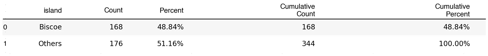

请注意，这可能有点令人困惑。我们没有显示至少占总数 50%的所有岛屿。我们显示了达到累积阈值的所有岛屿。

以下是阈值为 0.9 时的情况。

```
df_penguins.stb.freq(['island'], style=True, thresh=.9)
```

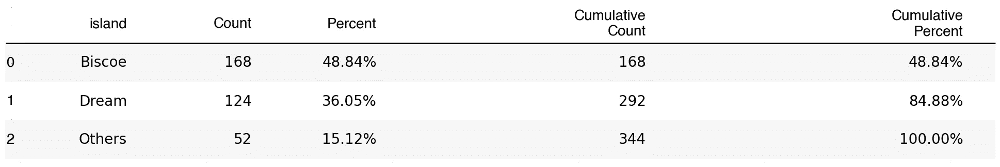

如果你想改变提交值的标签，你可以像这样传递`other_label='my_label'`:

```
df_penguins.stb.freq(['island'], style=True, thresh=.9, other_label='Other Islands')
```

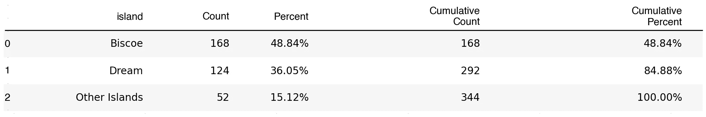

传递`value='my_column'`对该列中的值求和并显示，而不是计算出现次数。这对于当前的数据集来说没有什么意义，但这是一个值得了解的好特性。下面是输出的样子:

```
df_penguins.stb.freq(['island'], value='flipper_length_mm')
```

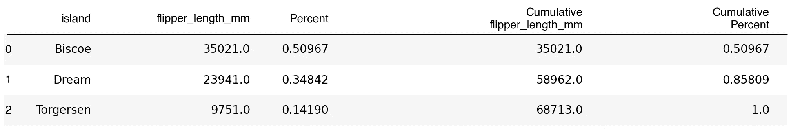

在我们的例子中，原始列没有大写，但是 sidetable 创建的新列是大写的。如果希望列的大小写相匹配，可以调整生成的数据帧。

```
freq_table = df_penguins.stb.freq(['island'])
freq_table.columns = freq_table.columns.str.title()
freq_table
```

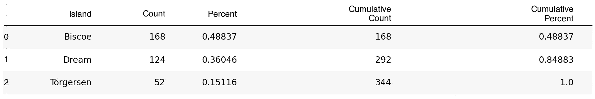

## 其他 EDA 选项

Sidetable 的`stb.freq()`很不错，因为它很轻便，内容丰富。在某些情况下，您可能需要不同的工具。

如果我在寻找数字数据的描述性统计，我经常使用`df.describe()`。

```
df_penguins.describe()
```

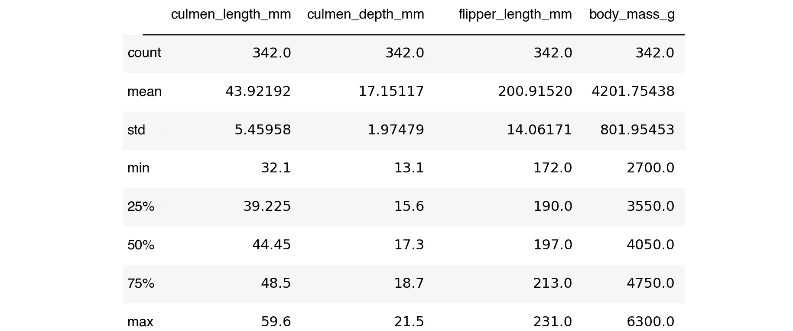

传递`include='all'`显示了一些关于非数字列的信息，但是事情有点混乱。🙁

```
df_penguins.describe(include='all')
```


如果你想要更多关于你的数据的信息，可以查看一下[熊猫简介](https://github.com/pandas-profiling/pandas-profiling)包。它提供了一个全面的报告，包括描述性的统计数据、直方图、相关性等等。挺牛逼的。然而，它可能需要一段时间来运行，并且对于许多用例来说有点多。

现在让我们看看最后一个 sidetable 方法。

## stb .小计()

如果您想显示一个带有显示数字列总和的*总计*行的数据帧，使用`stb.subtotal()`。

```
df_penguins.stb.subtotal().tail()
```

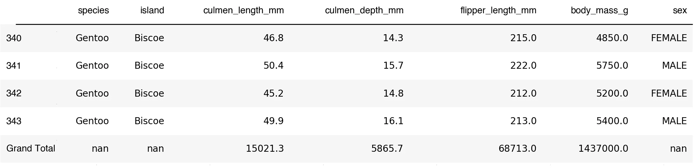

这对于财务文档和其他想要在同一个表中显示数据和总计的情况非常方便。

通过组合`df.groupby()`和`stb.subtotal()`，你得到一个总计和格式良好的小计。

这是一个由*物种*和*性别*组成的分组，以及*岛屿*的数量。

```
df_penguins.groupby(['species', 'sex']).agg(dict(island='count'))
```

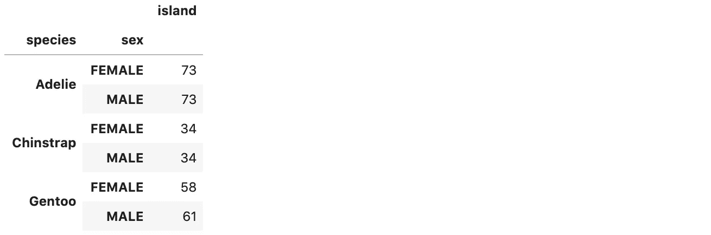

在我们的例子中，这不是什么惊天动地的信息，但是它显示了每个组中的计数。

如果有一些小计和总计，这些信息会更容易理解。`stb.subtotal()`为我们补充那些。🎉

```
df_penguins.groupby(['species', 'sex']).agg(dict(island='count')).stb.subtotal()
```


分类汇总通常对财务数据或序数数据很有帮助。让我在谷歌工作表或微软 Excel 中做预算和财务报告变得更加愉快。

## 包装

您已经看到了如何使用 sidetable 快速显示缺失值，制作格式良好的频率表，以及显示总计和小计。这是一个方便的小图书馆。👍

## 概述

以下是 API 的概述:

*   `stb.missing()` -显示关于缺失值的有用信息。
*   `stb.freq()` -显示列的计数、百分比和累积信息。
*   `stb.subtotal()` -向数据帧添加总计行。如果应用于 groupby，则添加每组的小计信息。

将`style=True`传递给`stb.missing()`和`stb.freq()`会使输出得到很好的格式化。还有许多其他参数可以传递给`stb.freq()`来修改输出。

我希望这篇 sidetable 的介绍对你有所帮助。如果你有，请在你最喜欢的社交媒体上分享，这样其他人也可以找到它。😀

我最初在这里为 Deepnote [发表这篇文章。获得早期访问权后，您可以在那里将文章作为笔记本运行。🚀](https://beta.deepnote.com/article/sidetable-pandas-methods-you-didnt-know-you-needed)

对于这篇文章，我使用了 Ted Petrou[的新的](https://medium.com/u/cf7f60f2eeb3?source=post_page-----92be825ff512--------------------------------) [Jupyter to Medium](https://github.com/dexplo/jupyter_to_medium) 包来帮助从 Jupyter 笔记本转换到 Medium。谢谢你的大包裹，泰德！👍

我写关于数据科学、 [Python](https://memorablepython.com) 、 [SQL](https://memorablesql.com) 和其他技术主题的文章。如果你对这些感兴趣，请注册我的[邮件列表，那里有很棒的数据科学资源](https://dataawesome.com)，点击这里阅读更多内容，帮助你提高技能[。😀](https://medium.com/@jeffhale)

[](https://dataawesome.com)

巴布亚企鹅。资料来源:pixabay.com

快乐的侧桌！🚀