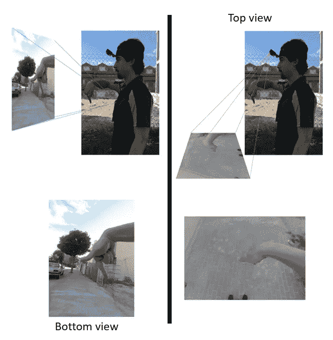
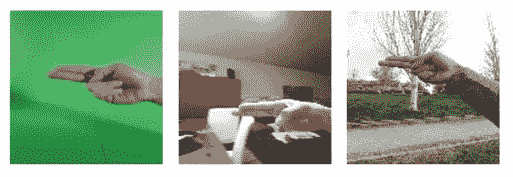
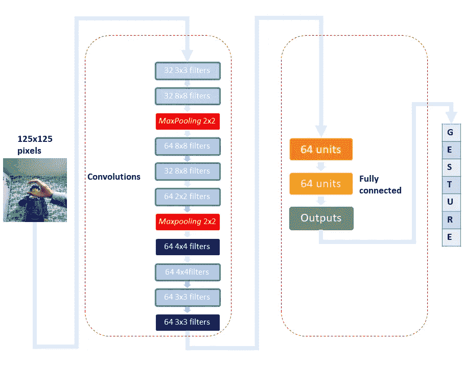
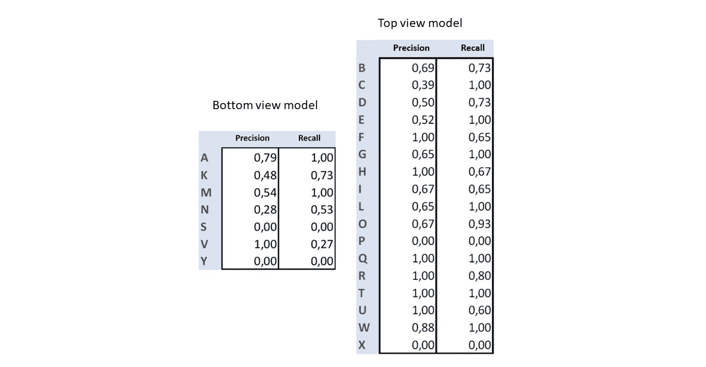

# 使用深度学习的手语识别

> 原文：<https://towardsdatascience.com/sign-language-recognition-using-deep-learning-6549268c60bd?source=collection_archive---------5----------------------->

## 双摄像头第一人称视觉翻译系统

**TL；提出了一种使用卷积神经网络的双 cam 第一视觉翻译系统。开发了一个原型来识别 24 种手势。视觉系统由头戴式摄像机和胸戴式摄像机组成，机器学习模型由两个卷积神经网络组成，每个摄像机一个。**

# 介绍

手语识别是一个多年来一直在研究中解决的问题。然而，在我们的社会中，我们仍然远远没有找到一个完整的解决方案。

在为解决这个问题而开发的工作中，大部分是基于两种基本方法:基于接触的系统，如传感器手套；或者基于视觉的系统，只使用摄像机。后者便宜得多，深度学习的蓬勃发展使其更具吸引力。

这篇文章介绍了一个使用卷积神经网络的双摄像头第一人称视觉手语翻译系统的原型。这篇文章分为三个主要部分:系统设计，数据集，深度学习模型训练和评估。

# 视觉系统

视觉是手语中的一个关键因素，每种手语都旨在被位于另一个人前面的一个人理解，从这个角度来看，一个手势是完全可以观察到的。从另一个角度看一个手势很难或者几乎不可能被理解，因为不是每个手指的位置和动作都能被观察到。

试图从第一视觉的角度理解手语也有同样的局限性，一些手势最终看起来也是一样的。但是，这种模糊性可以通过在不同的位置放置更多的摄像机来解决。这样，一台摄像机看不到的东西，可以被另一台摄像机完美地观察到。

视觉系统由两个摄像头组成:一个头戴式摄像头和一个胸戴式摄像头。有了这两个摄像头，我们可以获得标志的两个不同视图，俯视图和仰视图，它们一起工作来识别标志。

从俯视图和仰视图的角度看，与巴拿马手语中的字母 Q 相对应的标志(图片由作者提供)

这种设计的另一个好处是用户将获得自主权。这在传统方法中是无法实现的，在传统方法中，用户不是残障人士，而是需要在签名人进行签名时拿出带有摄像头的系统并对签名人进行对焦的第三人。

# 资料组

为了开发该系统的第一个原型，使用了来自巴拿马手动字母表的 24 个静态标志的数据集。

巴拿马手语字母(来源: [SENADIS，Lengua de seas paname as](http://www.senadis.gob.pa/pdf/LENGUA_DE_SENAS-web.pdf))

为了将该问题建模为图像识别问题，诸如字母 J、Z、RR 和等动态手势被丢弃，因为它们增加了解决方案的额外复杂性。

## 数据收集和预处理

为了收集数据集，要求四个用户佩戴视觉系统，并在 10 秒钟内执行每个手势，同时两台摄像机以 640x480 像素的分辨率进行记录。

要求用户在三种不同的场景中执行该过程:室内、室外和绿色背景场景。对于室内和室外场景，用户被要求在执行手势时四处移动，以便获得具有不同背景、光源和位置的图像。绿色背景场景是为数据扩充过程设计的，我们将在后面描述。

获得视频后，提取帧并将其缩小到 125x125 像素的分辨率。

从左至右:绿色背景场景，室内和室外(图片由作者提供)

## 数据扩充

由于进入卷积神经网络之前的预处理被简化为仅仅是重新缩放，背景将总是被传递给模型。在这种情况下，模型需要能够识别标志，尽管它可能有不同的背景。

为了提高模型的泛化能力，人为地添加了更多的不同背景的图像来代替绿色背景。这样可以获得更多的数据，而不需要投入太多的时间。

带有新背景的图像(作者提供的图像)

在训练过程中，还添加了另一个数据扩充过程，包括执行一些转换，如一些旋转、光强变化和重新缩放。

旋转、光强度和缩放的变化(图片由作者提供)

选择这两个数据扩充过程是为了帮助提高模型的泛化能力。

## 顶视图和底视图数据集

该问题被建模为具有 24 个类别的多类别分类问题，并且该问题本身被分成两个更小的多类别分类问题。

决定哪些手势将被用顶视图模型分类以及哪些手势将被用底视图模型分类的方法是选择从底视图角度看太相似的所有手势作为将被从顶视图模型分类的手势，并且剩余的手势将被由底视图模型分类。所以基本上，俯视图模型是用来解决歧义的。

因此，数据集分为两部分，每个模型一部分，如下表所示。

# 深度学习模型

作为最先进的技术，卷积神经网络是面对这一问题的选择。它被训练成两个模型:一个模型用于俯视图，一个模型用于仰视图。

## 体系结构

相同的卷积神经网络架构用于俯视图和仰视图模型，唯一的区别是输出单元的数量。

下图显示了卷积神经网络的体系结构。

卷积神经网络体系结构

为了提高模型的泛化能力，在全连接层中使用层间丢弃技术来提高模型性能。

## 估价

这些模型在一个测试集中进行了评估，测试数据对应于系统在室内的正常使用，换句话说，在背景中出现了一个充当观察者的人，类似于上图中的输入图像(*卷积神经网络架构*)。结果如下所示。

虽然模型学会了对一些标志进行分类，比如 Q，R，H；总的来说，结果有点令人沮丧。这些模型的泛化能力似乎不太好。然而，该模型也用显示系统潜力的实时数据进行了测试。

底部视图模型用具有绿色均匀背景的实时视频进行测试。我戴着胸前安装的摄像机以每秒 5 帧的速度捕捉视频，同时在我的笔记本电脑上运行底部视图模型，并尝试用手指拼写单词 fútbol(我最喜欢的西班牙语运动)。每个字母的条目都是通过点击来模拟的。结果如下面的视频所示。

与实时视频一起运行的底视图模型的演示视频

*注意:由于模型的性能，我不得不重复几次，直到我有了一个好的演示视频。*

# 结论

如果我们考虑这种系统需要理解和翻译的所有可能的手势组合，手语识别是一个困难的问题。也就是说，解决这个问题的最好方法可能是将它分成更简单的问题，这里介绍的系统将对应于其中一个问题的可能解决方案。

该系统表现不太好，但它被证明可以仅使用相机和卷积神经网络构建第一人称手语翻译系统。

据观察，该模型往往会将几个符号相互混淆，如 U 和 w。但仔细想想，也许它不需要有完美的性能，因为使用正字法校正器或单词预测器会提高翻译准确性。

下一步是分析解决方案，研究改进系统的方法。通过收集更高质量的数据，尝试更多的卷积神经网络架构，或重新设计视觉系统，可以实现一些改进。

# 结束词

我开发这个项目作为我大学论文工作的一部分，我的动力来自于在新事物中工作的感觉。虽然结果不太好，但我认为这是一个很好的起点，可以让系统变得更好、更大。

如果你对这项工作感兴趣，这里有我的论文的链接

**感谢阅读！**