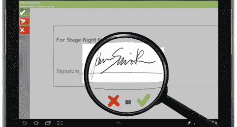
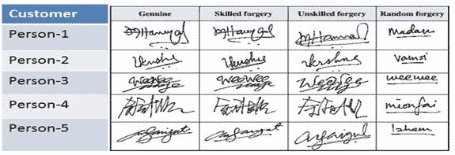
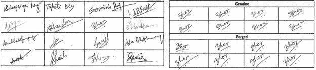
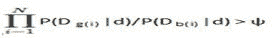
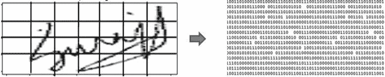
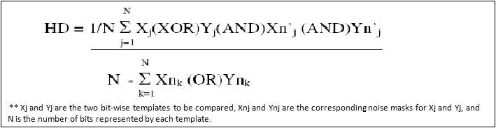
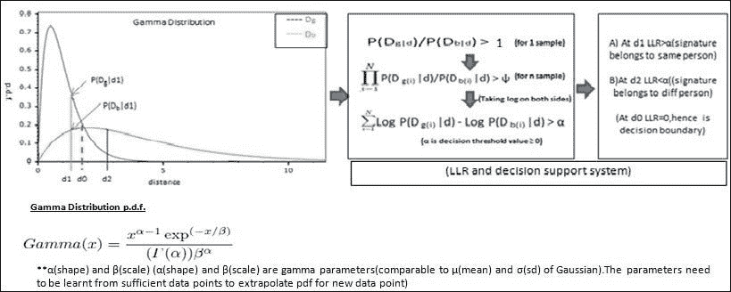
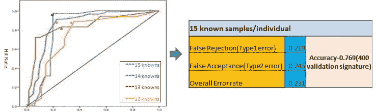

# 签名欺诈检测-一种高级分析方法

> 原文：<https://towardsdatascience.com/signature-fraud-detection-an-advanced-analytics-approach-a795b0e588b2?source=collection_archive---------36----------------------->

签名欺诈检测

在我的[上一篇文章](http://www.linkedin.com/pulse/exploring-role-machine-learning-advanced-analytics-improve-dey-1?trk=prof-post)中，我以一种通用的方式讨论了高级分析在欺诈领域的应用。在这篇文章中，我将深入研究欺诈的一个具体领域——签名伪造。难怪机构和企业认为签名是认证交易的主要方式。人们签署支票，批准文件和合同，验证信用卡交易，并通过签名验证活动。随着签名文档的数量(及其可用性)大幅增加，签名欺诈也在增加。

根据最近的研究，仅支票欺诈每年就给银行造成约 9 亿美元的损失，其中 22%的欺诈支票归因于签名欺诈。显然，美国每年签发的支票超过 275 亿张(根据 2010 年美联储支付研究),对每天处理的数亿张支票进行人工签名的可视化比较是不切实际的。

大数据、基于分布式 Hadoop 的平台(如 MapR)的出现，使得经济高效地存储和处理大量签名图像成为可能。这使企业能够使用全面的历史交易数据，通过开发算法来发现欺诈签名的模式，从而实现传统视觉比较的自动化。

签名的艺术和科学:

在介绍自动签名验证的类型和详细方法之前，让我们了解一些与签名过程相关的概念和一些流行的神话，签名伪造的类型，以及静态签名图像的传统视觉比较的漏洞。

误解:同一个人的真实签名在所有交易中都完全相似

现实:签名的身体动作需要协调大脑、眼睛、手臂、手指、肌肉和神经。考虑到游戏中的所有因素，难怪人们每次都不会签完全相同的名字:一些元素可能会被省略或更改。个性、情绪状态、健康状况、年龄、个人签名的条件、签名可用的空间以及许多其他因素都会影响签名到签名的偏差。

签名伪造的类型:

在现实生活中，签名伪造是一个伪造者主要关注准确性而不是流畅性的事件。

签名伪造分为以下三类:

1.随机/盲目伪造—通常与真实签名很少或没有相似性。这种类型的伪造是在伪造者无法获得真实签名的情况下产生的。

2.不熟练的(描摹)伪造:签名被[描摹在](http://en.wikipedia.org/wiki/Tracing_paper)上，看起来像下面纸上的一个淡淡的凹痕。这个缩进可以作为签名的参考。

3.熟练伪造——由能够接触到一个或多个真实签名样本并能在大量练习后模仿它的犯罪者制造。熟练伪造是所有伪造中最难鉴别的。

有效的签名验证系统必须能够通过可靠的定制算法来检测所有这些类型的伪造。

人工验证难题:

由于主观决定和因专业知识、疲劳、情绪、工作条件等人为因素而变化很大，人工验证更容易出错且不一致，在熟练伪造的情况下(离线方法)会导致以下情况:

错误拒绝:错误地拒绝标记欺诈性交易(当它们不是欺诈性交易时),对客户满意度产生负面影响，通常称为 I 型错误。

虚假接受:真实签名和熟练的伪造，操作者将其作为真实签名接受，导致财务和声誉损失，通常称为第二类错误。

精确验证系统目标是最小化两种类型的误差。

标志性特征:

让我们来了解一下人类文档检查人员区分欺诈和真实的签名特征。以下是用于签名验证的静态和动态特征的非详尽列表:

摇晃的笔迹(静态)

提笔(动态)

修饰的迹象(静态和动态)

字母比例(静态)

签名形状/尺寸(静态)

倾斜/成角度(静态)

两个或多个签名非常相似(静态)

速度(动态)

笔压(动态)

压力变化模式(动态)

加速模式(动态)

曲线的平滑度(静态)

根据验证环境和样本收集条件，并非所有特性都可供分析

自动签名验证系统的类型:

如所讨论的，根据可行的(可用的)签名特征提取和商业/功能需求，市场上存在两种类型的签名验证系统。

a)离线签名验证:部署在无法监控个人实时签名活动的地方。在仔细检查签名的纸质文档的应用中，只有静态的二维图像可用于验证。由于明显原因，在这种类型的验证引擎中，动态特性。为了解决这些重要信息的丢失并产生高度准确的签名比较结果，离线签名验证系统必须模仿人类法医文档检查员使用的方法和途径。这种方法严重依赖于繁琐的图像预处理(图像缩放、大小调整、裁剪、旋转、滤波、梯度方向直方图阈值、哈希标记等)。)和娴熟的机器学习技能。这里主要使用的特征本质上是静态的——图像纹理(小波描述符)、几何和拓扑(形状、大小纵横比等)。)、笔画位置、手写相似性等。

尽管存在许多限制，但在大多数现实生活中，支票交易和数字文档验证签名是预先执行的，并且没有实时签名监控的范围来捕捉动态特征。

对于离线签名验证，机器学习任务可以进一步分类为 1)一般学习(与人无关)-通过以 1∶1 的基础将被质疑的签名与每个已知签名进行比较来执行验证任务，以及 2)特殊学习(与人相关)-验证被质疑的签名是否落入同一个人的多个真实签名的变化范围内。

b)在线签名验证:签名是基于重复动作的反射动作，而不是故意控制肌肉，即使精确的伪造也比真正的签名需要更长的时间才能产生。顾名思义，这种类型的验证系统捕捉关键的动态特征，如速度、加速度和压力等。，是可行的。这种类型的系统更准确，因为即使对于复印机或专家来说，模仿原始签名者的独特行为模式和特征实际上也是不可能的。

实验简介:

让我们讨论一个在模拟环境中的简单的离线验证解决方案。对于该研究，从 40 个人中准备数据，每个人贡献 25 个签名，因此具有 1000 个真实签名。然后随机选择受试者伪造另一个人的签名，15 个/个人，这样就有 600 个(相当于欺诈的过度抽样)伪造。现在有 25 个真实签名/人和 12 个伪造签名/人，数据被随机分成训练(75%)和验证(25%)数据，确保在训练数据中至少有 15 个真实签名/人。目标是建立一个离线算法签名验证系统，该系统采用独立于个人的学习方法，是一个引擎，用于确定验证中的被质疑签名是否属于某个特定的个人。

图:真实签名样本图:个人样本(真实和伪造)

解决方案框架:

独立于个人的监督学习:学习问题被转换成两类分类问题，其中输入由一对签名之间的差异(相异度)组成，并且真实签名出现的几率根据从良好(真实的)和不良(伪造的)群体的距离(配对签名的相异度分数)的适当参数分布中引用的似然比(LR)来计算。然后，将一个人的来自其真实签名的被质疑签名拟合到该分布，以计算 LR 分数，并且基于 LR 和预先指定的阈值(基于最大准确度),对于特定的人，将采取被质疑签名(来自测试数据)是否是真实的分类决定。

模型方程

在哪里

P(Dg(i)|d)是距离 d 处 Dg(真实)分布的概率密度函数值

P(Db(i)|d)是距离 d 处 Db(伪造)分布的概率密度函数值

*   n 是用于 1:1 比较的来自一个人的已知样本的数量

ψ是预先指定的大于 1 的阈值

尽管建模任务是直接的，但是需要大量的图像预处理来基于提取的静态特征计算签名对之间的距离/距离向量(d)。也适合参数模型的选择和最佳截止值的调整。

涉及的步骤:

a)特征提取:这是一个高度技术性的领域，涉及复杂的图像处理，以提取特定人的区别要素和要素组合。

1)图像预处理和网格形成:每个签名经过灰度变换后，进行椒盐噪声去除和倾斜归一化处理。然后，在适当的大小调整、裁剪和其他扩充过程之后，每幅图像都用 4x7 网格重新构建

2)二进制特征向量提取:从像素图像网格和相应的局部直方图单元中提取 GSC(梯度、结构和凹度)特征图，该特征图被量化为 1024 比特的二进制特征向量(G、S 和 C 特征的求和比特)。

图:图像网格和 1024 位二进制特征向量

b)相似性(距离)度量:开发用于成对图像的点对点匹配的高斯界标(exp(ri J2/2σ2))集，并且使用总体相似性或距离度量来计算表示两个签名之间匹配强度的分数。相似性度量将成对数据从特征空间转换到距离空间。几个。这里使用的是汉明距离法。

(很抱歉由于篇幅限制，没有在这里详细说明这些主题，我们将在另一篇文章中讨论。)

c)模型训练(分布拟合):训练数据的这些成对距离(d)被分类成两个向量，所有真实签名对之间的距离的 Dg 向量(样本真正来自相同的人)和所有伪造签名对之间的距离的 Db 向量(样本来自不同的人)。这两个距离向量可以使用已知的分布如高斯或伽马来建模。在这个例子中，伽马分布与数据吻合得很好。

d)似然比(LR)和分类决策:在上述预处理和距离得分(成对相异)点被投影到拟合的密度曲线上以获得 LR 值-P(Dg|d)/ P(Db|d)之后，来自未标记数据(这里来自验证)的特定人的可疑签名与该人的真实签名 1∶1 匹配。如果似然比大于 1，则分类决定是两个样本确实属于同一个人，如果比值小于 1，则它们属于不同的人。如果一个人总共有 N 个已知样本，那么对于一个有问题的样本，可以执行 N 个 1∶1 的验证，并且将似然比相乘。为方便起见，采用对数似然比(LLR)而不是似然比。

图:分布拟合和分类决策

性能评估:尽管有明显的重叠区域，上述分布在区分两个区域(真实和欺诈)方面做得相当好。显然，判决边界由 LLR 的符号给出，并且可以使用阈值α来构造修改后的判决边界，使得 log P(Dg | d)log P(Db | d)>α。定义为[1-((错误接受+错误拒绝)/2)]的模型精度在特定的α值时最大。这涉及模型调整，对于指定数量的已知样本，α的最佳设置表示为工作点。在由不同数量的已知样本(12-15 个)生成的 ROC 曲线中，工作点显示为' * '。整体准确率在 77%左右。

图:模型调优和性能

改进和前进的道路:

通过这个实验和简单的解决方案，达到了适度的准确性。然而，精度可以通过更大的训练数据、与其他模型的拟合和集成来提高，包括非参数方法(深度学习、CNN 等)。).此外，将图像对之间的其他距离度量(例如，Levenshtein 距离、切角距离)合并为附加特征和/或对这些相异特征进行简单/加权平均，将使相异度量更加稳健和可靠，从而为模型增加更多的辨别能力。

最后，尖端的签名验证系统需要具有适应性、灵活性和准确性。这需要对不断增长的数据集进行深入分析，并对生产模型进行持续更新，以便效率随着时间的推移保持稳定，这与人工操作员在高容量情况下获得的结果不同。