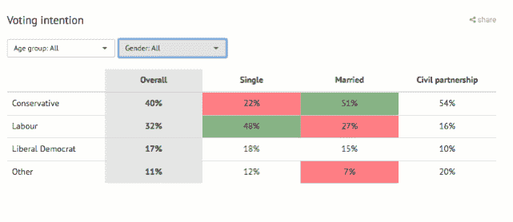
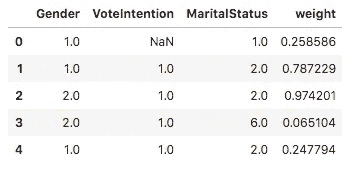
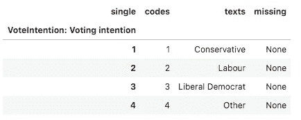
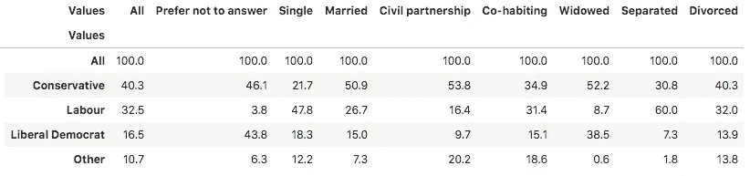
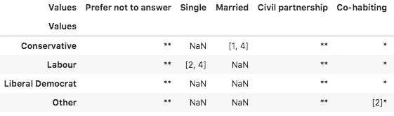
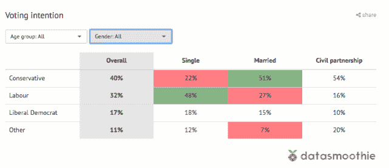

# 使用 Python 测试测量数据的重要性

> 原文：<https://towardsdatascience.com/significance-testing-survey-data-with-python-1e83149257d6?source=collection_archive---------46----------------------->

## 如果驾驶员是盲目的，数据驱动的结果是无用的，但是显著性测试可以为您指明方向



对婚姻状况是否会影响人们投票方式的视觉探索。投票率明显高于平均投票率的群体(最左边一列)显示为绿色，较低的群体显示为红色，不显著的结果显示为白色。

> 世界上大多数人会通过猜测或凭直觉来做决定。他们要么是幸运的，要么是错误的。— *混合面板*

Mixpanel 的[6500 万美元投资者推介](https://mixpanel.com/blog/2014/12/18/open-sourcing-our-pitch-deck-that-helped-us-get-our-865m-valuation/)的开场白引人注目。要么你在用数据，要么你就是个傻子。我想补充一句口头禅。

> 世界上大多数人不去想 ***统计意义*** 。它们将是数据驱动的，但方向是错误的。— *盖尔*

好吧，Mixpanel 的更好，但你明白了。

## 投票意向和婚姻状况

比方说，我们在政治民意调查中发现了一个趋势，可以帮助我们决定谁是我们竞选活动的目标。比如已婚人士。他们投票的方式与单身人士不同吗？我们应该在单身酒吧竞选吗？

开源库 [Quantipy](http://www.github.com/quantipy/quantipy3) 可以读取所有主要的调查平台数据类型，包括 SPSS 的`.sav`文件。这张来自英国 2019 年大选。

```
import quantipy as qp
dataset = qp.DataSet('Elections 2019')
dataset.read_spss('election survey.sav')
```

让我们看看从原始数据中选择的几个列是什么样子的:

```
dataset[['Gender', 
         'VoteIntention', 
         'MaritalStatus', 
         'weight']].head()
```



为了加快计算速度，SPSS 将不同的答案存储为数字，然后使用元数据将这些数字映射到答案。(稍后，我们将讨论如何计算一个`weight`列来改进我们的结果)。现在让我们坚持投票意向:

```
dataset.meta('VoteIntention')
```



比较对元数据的回应，我们看到第一个回应都来自保守派选民，而这些相同回应的婚姻状况各不相同。它会影响人们投票的方式吗？让我们来计算一下:

```
dataset.crosstab('VoteIntention', 
                 'MaritalStatus', 
                 pct=True,        #percentages, not frequencies
                 w='weight')      #weigh the results
```



啊哈！所以，已婚人士投 CON，单身人士投 LAB。也许这是年龄的问题。但是民事伴侣关系中的人是怎么回事呢？他们更有可能投票给保守党而不是工党，在整个人口中，保守党的比例为 54%，工党为 16%，而保守党为 40%，工党为 33%。

在我们开始写新闻稿之前，我们必须问自己:这是真的吗，还是只是数据中的噪音？

## 使用 Python 测试测量数据的重要性

测试调查结果的重要性(sig 测试)可能是一项艰巨的任务。数据本身可能是复杂的，当它被加权以更好地代表被调查的人口时，它变得更加棘手。有时所谓的[有效基数](https://sr.ipsosinteractive.com/SPSSMR/Reporter/doc/en/help/effective_base.htm)应该用于测试，有时不用于测试。市场研究行业还依赖于使用专有程序，如 UNICOM Intelligence(又名 Dimensions)和 Askia，能够复制这些应用程序的结果非常重要。

Quantipy 有助于应对所有这些挑战。让我们运行一个复制维度设置的基本 sig-test，它使用一个汇集的方差并控制由加权和重叠样本引入的偏差。

```
batch = dataset.add_batch(name='vote_intention')
batch.add_downbreak('VoteIntention')
batch.add_crossbreak('MaritalStatus')
batch.weights.append('weight')
batch.set_sigtests([0.05])
stack = dataset.populate(['vote_intention'])
stack.aggregate(['counts', 'cbase'], 
                batches=['vote_intention'], verbose=False)
stack.add_tests(['vote_intention'])
```

在上面的代码中，我们使用 Quantipy 的`batch`机制，以防我们想要计算大量变量来填充我们的表格或 PowerPoint 图表。当我们运行代码时，我们得到一个所谓的`stack`来存储我们所有的结果；计算出的百分比、基数和显著性矩阵。矩阵看起来像这样:



*NaN* 表示无显著差异，星号标记的结果有效基数太低(答卷人太少，不显著)，一组数字表示显著差异。在上面的例子中，已婚的反对者拥有数组[1，4]，因此明显高于单身投票者和同居伴侣。单身选民在工党一栏中有结果[2，4]，因此比已婚选民和同居选民更有可能投票给工党，但重要的是，民事伴侣一栏没有足够多的回应，因此不重要。

我们现在可以利用任何 python 网络应用环境(Django、Flask 等)。)来显示一个交互式的显著性表。下面是一个 Django 应用程序，它使用下拉菜单进行过滤，并将相关的响应子集发送到 sig-test 中。当重要的测试被应用和可视化时，探索数据子组的不同投票意图呈现出一个全新的维度。



民意测验结果意义的交互探索。绿色表示 a 结果明显高于“整体”组，红色表示较低，白色表示没有显著差异(通常是因为回答的数量太低)。

所以，不要发出关于民事伴侣关系中的人们将如何投票的新闻稿，因为需要更多的数据来获得有意义的见解，以了解结果是否重要，或者它是否只是数据中试图将我们引入歧途的噪音。

盖尔·弗雷松是 [Datasmoothie](https://www.datasmoothie.com/) 的联合创始人，这是一个专门从事调查数据分析和可视化自动化的平台。如果你对使用开源软件进行调查数据分析感兴趣，注册我们的时事通讯，名为[自发认知](https://confirmsubscription.com/h/r/123C34C5066BF0AD2540EF23F30FEDED)。