# 基于神经网络的有效波预测

> 原文：<https://towardsdatascience.com/significant-wave-prediction-using-neural-network-7e5ee1b7f674?source=collection_archive---------35----------------------->

## 使用 Pytorch 进行试驾并比较车型

照片由[塞拉斯·拜施](https://unsplash.com/@silasbaisch?utm_source=medium&utm_medium=referral)在 [Unsplash](https://unsplash.com?utm_source=medium&utm_medium=referral) 上拍摄

## 序言

所以，现在我想用 PyTorch 测试一下我的技能。我是 PyTorch 的新手，以前我使用 Tensorflow 建立一个 ML 模型。我已经阅读了所有的基础教程，并准备使用真实的数据建立一个真实的模型。你最喜欢在哪个网站找到真实数据来测试你的模型？对我来说是 kaggle.com。在滚动所有可用的数据集后，我选择[这个 wave 数据集](https://www.kaggle.com/jolasa/waves-measuring-buoys-data-mooloolaba)。下载下来准备玩玩。

## 数据集的第一瞥

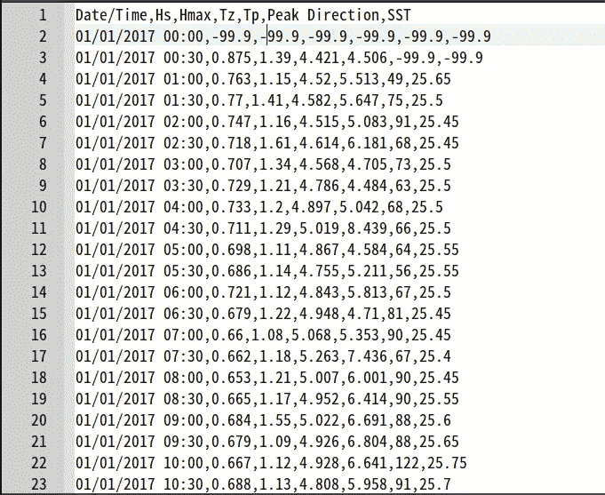

作者图片

这里我们有数据捕获的日期和时间，有效波高(Hs)，最大波高(Hmax)，过零波周期(Tz)(呃，我不知道这是什么)，峰值能量波周期(Tp)(能量？在什么？我不知道)，峰值方向(我想这是波从哪里来的一个方向？)，最后是海面温度(SST)。我们有一个 30 分钟时间分辨率的数据集。`-99.9`是一个我认为没有数据的标志。我对海洋学数据不熟悉，但我会尽力而为。

在所有可用的列中，我所理解的只是 Hs、Hmax 和 SST(当然还有日期和时间)。我会试着预测他的。

## Hs 预测

我只会玩我理解的数据(Hs，Hmax，SST)。让我们看看 Hs 和另外两个变量之间的相关性。在这个过程中，我们必须除掉`-99.9`。因此，在我们选择的 3 个变量中的任何一个变量中包含该数字的数据都将被忽略。这是代码

这是 Hs 和 Hmax 的散点图

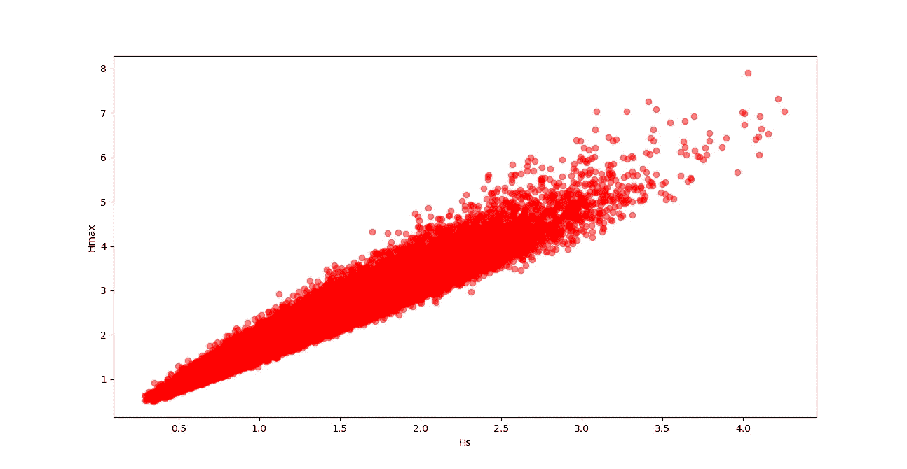

作者图片

看起来非常好。他们的相关系数是 0.97，近乎完美。但是等等，`Hmax`是观测到的最高浪高，`Hs`是最高浪高的平均值。所以**如果我们把这个变量作为 Hs 的一个预测因子**包括进来，那只是多余的 `Hs` **。对于`SST`**

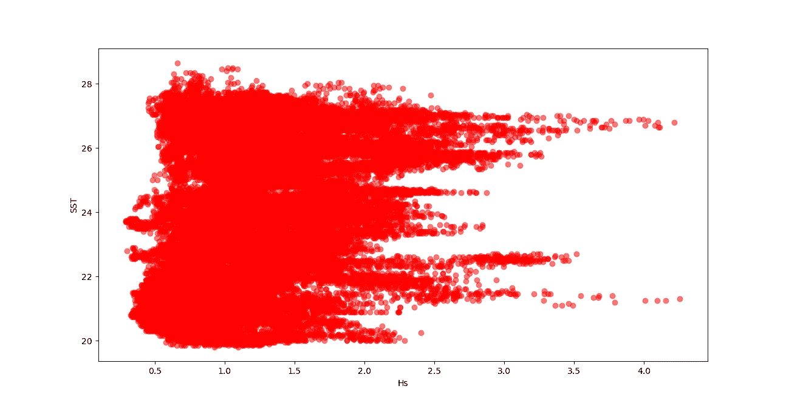

作者图片

相关系数为 0.26。看起来很糟糕。所以最后的选择只是用`Hs`来预测`Hs`。我们将尝试使用`Hs`的历史时间序列来预测未来`Hs`。

对于第一次尝试，我们使用 3 小时的 Hs 数据来预测接下来的 30 分钟。在此之前，我们将首先尝试构建一个参数和标签数据集。如果我们每次尝试对模型进行实验时，都试图合并构建参数、标签部分和模型部分，这将会非常耗时。

现在使用已经构建的参数和标签数据，我们将尝试使用所有数据预测`Hs`。让我们使用一个多层感知器模型。

这里我们用最后的 10000 个数据作为测试数据，剩下的是训练数据。现在，**我们如何对该模型进行基准测试？**让我们**用数据的标准差**。**为什么？**如果你仔细看看标准差的公式，实际上**和只输出数据平均值的模型的 RMSE**是一样的。

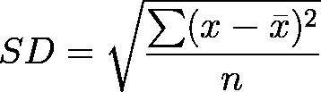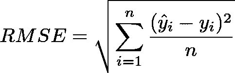

如果我们对数据一无所知，这是最简单的预测方法。Hs 数据的标准偏差为 0.5。所以，模型的误差必须低于这个值才能做出好的预测。

我们 MLP 模型的 RMSE 是

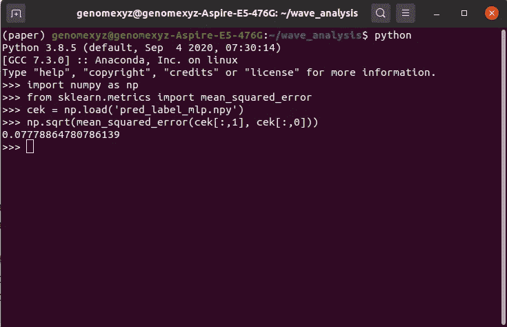

0.077(图片作者)

是`Hs`数据标准差的 0.15。让我们看看这个 MLP 模型的训练和测试误差的图表。

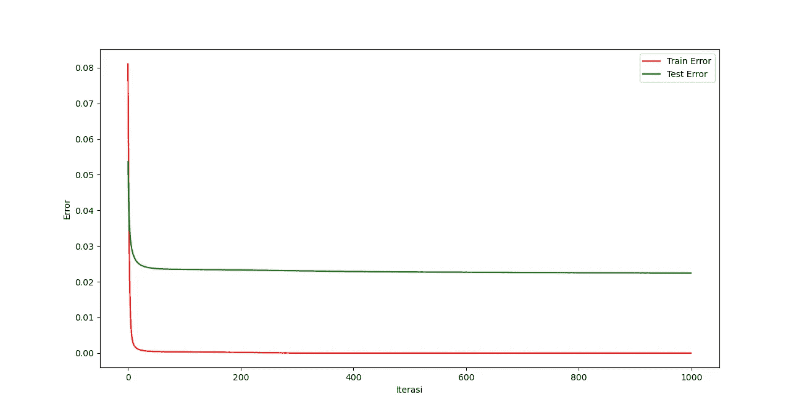

作者图片

在早期阶段，它收敛得非常快，后来它慢下来。无论如何，在我在这里发布这个结果和图表之前，我尝试了 MLP 超参数的许多组合，对于每个超参数的组合，你都会得到稍微不同的结果和图表(是的，**即使你不做任何改变，只是重新运行模型，你也会得到稍微不同的结果**，因为这是神经网络的本质)。我觉得这是目前为止最好的组合。

我们能改善这一点吗？也许，让我们试着使用长短期记忆(LSTM)模型。

RMSE 是

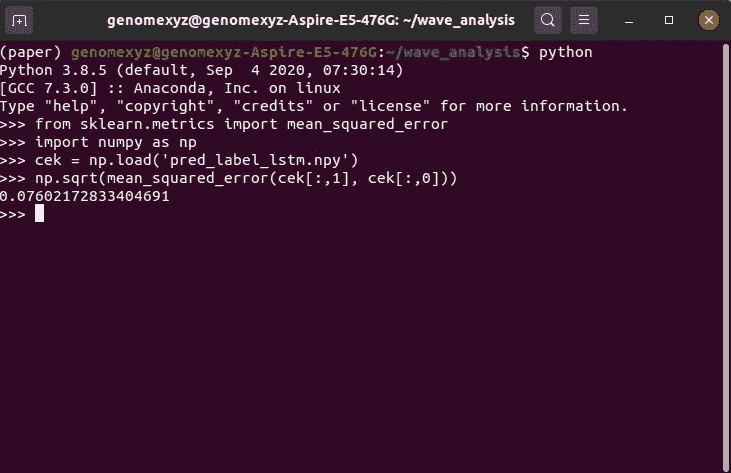

0.76(图片由作者提供)

误差正在改善，但只是一点点。这是 LSTM 的训练和测试图。

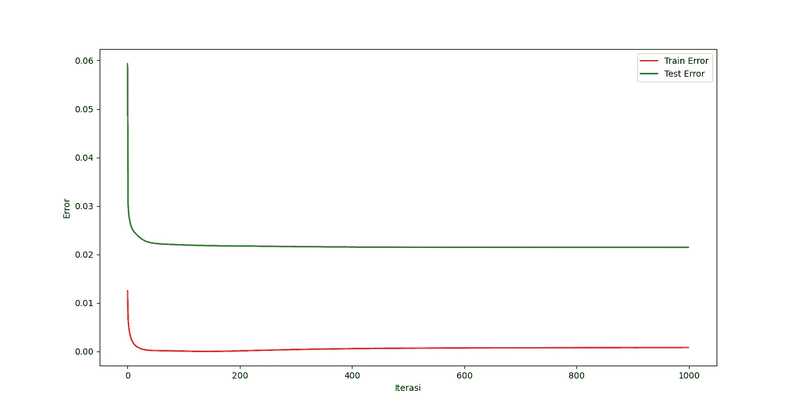

它收敛的方式和 MLP 一样(图片由作者提供)

该模型在早期收敛非常快，之后像 MLP 一样以指数速度减慢。

下一次尝试，让我们只使用一部分数据。让我们只使用第 3400 个数据，然后倒数第 96 个将是测试数据。只需在代码中编辑`testing_data_num`、`all_param`和`all_label`即可。

这是 MLP 的结果

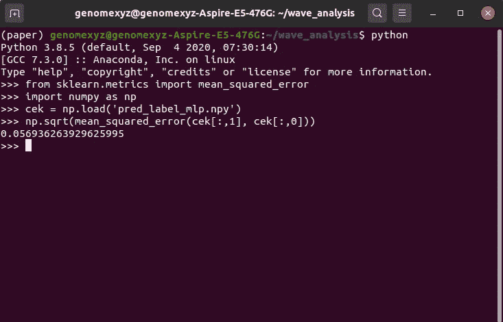

作者图片

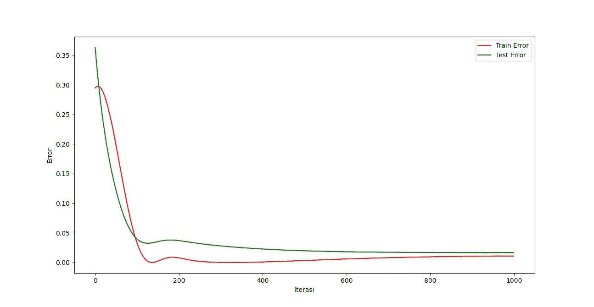

作者图片

对于 LSTM 来说

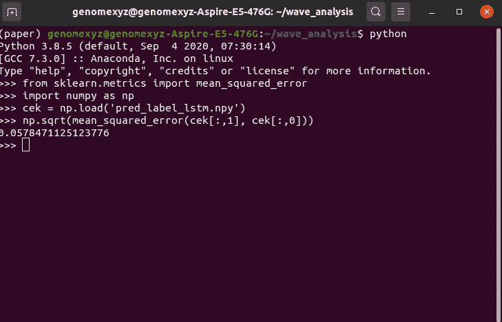

作者图片

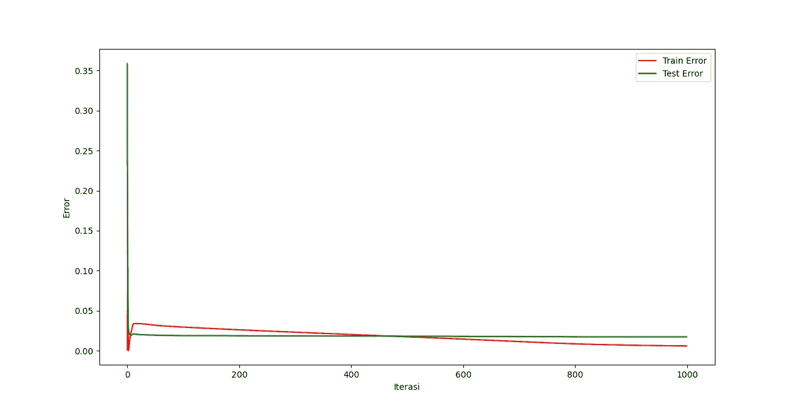

作者图片

耶，越来越好了，但这一次，MLP 比 LSTM 好。正如您在训练和测试图中看到的，尽管训练数据中存在波动，但测试数据的误差在稳步下降。这个故事的寓意是，当你的训练误差增加或波动时不要害怕，这并不意味着同样的事情会发生在你的测试数据中。这只是算法概括你的模型的一种方式。

## 收场白

这就是使用 PyTorch 的试驾。你还可以改进这个模型，比如尝试预测`Hs`但在未来多时间步，或者只是调整超参数以获得更好的结果。你可以在这里得到完整的代码[。另一篇文章再见。](https://github.com/genomexyz/wave_prediction/)

## 参考

[https://www . ka ggle . com/jolasa/waves-measuring-buoys-data-mooloolaba](https://www.kaggle.com/jolasa/waves-measuring-buoys-data-mooloolaba)(波浪数据集)

[https://en.wikipedia.org/wiki/Standard_deviation](https://en.wikipedia.org/wiki/Standard_deviation)