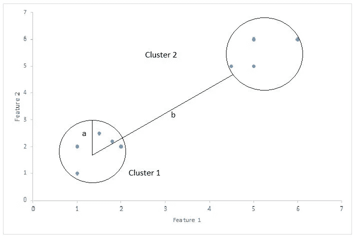
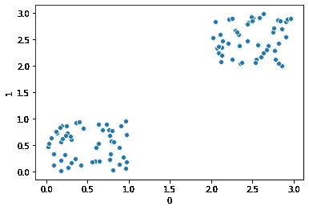
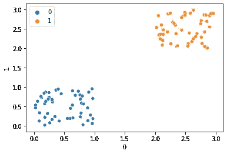
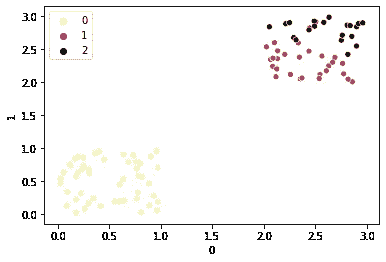

# 轮廓系数

> 原文：<https://towardsdatascience.com/silhouette-coefficient-validating-clustering-techniques-e976bb81d10c?source=collection_archive---------0----------------------->

## 验证聚类技术

在学习和应用了一些有监督的最大似然算法后，如最小二乘回归、逻辑回归、SVM、决策树等。我们大多数人都试图通过实现一些聚类技术，如 K-Means、DBSCAN 或 HDBSCAN，来进行一些实际操作的无监督学习。

我们通常从 K-Means 聚类开始。经过几个教程和中等故事，你将能够轻松实现 k-means 聚类。但是当你实现它的时候，一个问题开始困扰你:我们如何测量它的适合度？监督算法有许多指标来检查它们的拟合优度，如准确性、r 平方值、灵敏度、特异性等。但是，我们可以计算什么来衡量我们的聚类技术的准确性或良好性呢？这个问题的答案是剪影系数或者剪影分数。

# **轮廓系数:**

轮廓系数或轮廓分数是用于计算聚类技术的良好性的度量。它的值范围从-1 到 1。

1:表示聚类彼此相距很远，并且可以清楚地区分。

0:表示聚类无关紧要，或者我们可以说聚类之间的距离不显著。

-1:表示以错误的方式分配簇。



作者图片

剪影得分= (b-a)/max(a，b)

在哪里

a=平均类内距离，即类内各点之间的平均距离。

b=平均聚类间距离，即所有聚类之间的平均距离。

# 计算轮廓分数

**导入库:**

```
import pandas as pd
import numpy as np
import seaborn as sns
from sklearn.cluster import KMeans
from sklearn.metrics import silhouette_score
%matplotlib inline
```

**生成一些随机数据:**

为了运行聚类算法，我们生成 100 个随机点。

```
X= np.random.rand(50,2)
Y= 2 + np.random.rand(50,2)
Z= np.concatenate((X,Y))
Z=pd.DataFrame(Z) #converting into data frame for ease
```

绘制数据:

```
sns.scatterplot(Z[0],Z[1])
```

输出



作者图片

**对两个聚类应用 KMeans 聚类:**

```
KMean= KMeans(n_clusters=2)
KMean.fit(Z)
label=KMean.predict(Z)
```

**计算剪影分数:**

```
print(f'Silhouette Score(n=2): {silhouette_score(Z, label)}')
```

输出:剪影分数(n = 2):0.8062615881652

我们可以说，当轮廓分数接近 1 时，聚类彼此相距很远。

为了检查我们的轮廓分数是否提供了正确的信息，让我们创建另一个散点图，显示带标签的数据点。

```
sns.scatterplot(Z[0],Z[1],hue=label)
```

输出:



作者图片

从上图中可以清楚地看到，每个集群彼此相距很远。

让我们尝试 3 个集群:

```
KMean= KMeans(n_clusters=3)
KMean.fit(Z)
label=KMean.predict(Z)
print(f’Silhouette Score(n=3): {silhouette_score(Z, label)}’)
sns.scatterplot(Z[0],Z[1],hue=label,palette=’inferno_r’) 
```

输出:

侧影分数(n = 3):0.5468638636786



作者图片

正如你在上面的图中看到的，集群没有很好的分开。簇 1 和簇 2 之间的簇间距离几乎可以忽略。这就是为什么 n= 3 的剪影分数(0.596)小于 n=2 的剪影分数(0.806)。

当处理更高维度时，轮廓分数对于验证聚类算法的工作非常有用，因为当维度大于 3 时，我们不能使用任何类型的可视化来验证聚类。

我们还可以使用轮廓分数来检查最佳聚类数。在上面的例子中，我们可以说最佳聚类数是 2，因为它的轮廓得分大于 3 个聚类的得分。