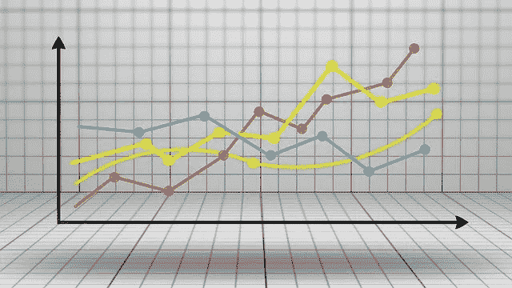
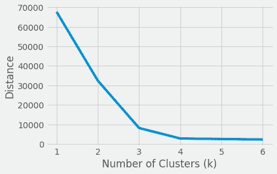
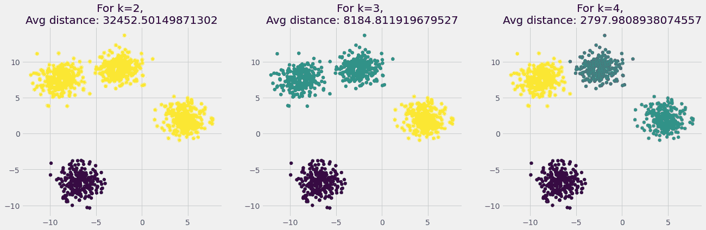
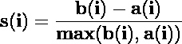
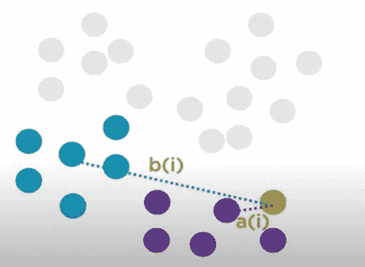
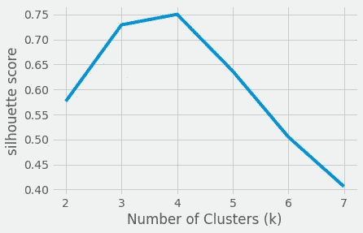
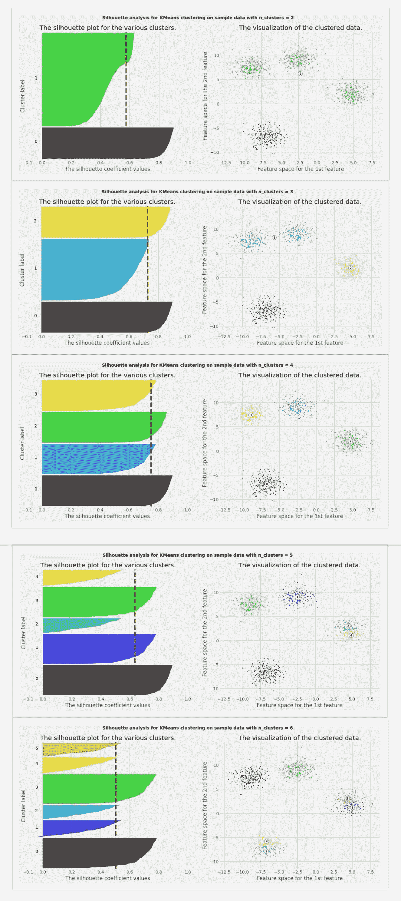

# 轮廓法——比肘法更好的寻找最优聚类的方法

> 原文：<https://towardsdatascience.com/silhouette-method-better-than-elbow-method-to-find-optimal-clusters-378d62ff6891?source=collection_archive---------0----------------------->

## k-Means 聚类中寻找最优聚类的剪影法深度分析



图片由 [Mediamodifier](https://pixabay.com/users/mediamodifier-1567646/?utm_source=link-attribution&amp;utm_medium=referral&amp;utm_campaign=image&amp;utm_content=3033203) 来自 [Pixabay](https://pixabay.com/?utm_source=link-attribution&amp;utm_medium=referral&amp;utm_campaign=image&amp;utm_content=3033203)

H **超参数**是定义模型的模型配置属性，在模型训练期间保持不变。可以通过调整超参数来改变模型的设计。对于 K 均值聚类，有 3 个主要的超参数需要设置，以定义模型的最佳配置:

*   聚类的初始值
*   距离测量
*   聚类数

聚类的初始值对聚类模型有很大的影响，有各种算法来初始化这些值。距离度量用于寻找到聚类中心的聚类中的点，不同的距离度量产生不同的聚类。

聚类数( **k** )是 K-Means 聚类中最重要的超参数。如果我们事先已经知道要将数据分组到的聚类数，那么就没有必要调整 k 的值。例如，对于 MNIST 数字分类数据集，k=10。

如果不知道 k 的最佳值，那么有各种方法可以找到 k 的最佳值。在本文中，我们将介绍两种这样的方法:

*   **肘法**
*   **剪影法**

# 弯头方法:

**肘方法**是一种为数据集寻找最佳聚类数的经验方法。在此方法中，我们选取一系列 K 的候选值，然后使用每个 K 值应用 K 均值聚类。找出聚类中每个点到其质心的平均距离，并在图中表示出来。选择 k 的值，此时**平均距离突然下降**。



(图片由作者提供)，肘法求最优 k

随着聚类数(k)的增加，平均距离减小。要找到最佳聚类数(k ),请观察该图并找到距离急剧下降时的 k 值。这将是 k 的一个最佳点，在这里出现一个弯头。

在上图中，平均距离在 **k=2、3 和 4** 处急剧下降。这里出现了选择 k 的最佳值的困惑。在下图中，观察对于 **k=2、3 和 4** 形成的集群及其平均距离。



(图片由作者提供)，k=2、3 和 4 时形成的簇的散点图

这个数据是 2-D 的，所以很容易可视化并挑选 k 的最佳值，即 k=4。对于更高维的数据，我们可以使用**剪影法**来寻找最佳 k，这是一种比肘法更好的**替代方法。**

# **剪影方法:**

**剪影法**也是一种寻找最佳聚类数以及解释和验证数据聚类一致性的方法。剪影方法计算每个点的剪影系数，该系数测量一个点与其自己的聚类相比与其他聚类相似的程度。通过提供一个**简洁的图形表示**来显示每个对象的分类情况。

> 计算每个点的**轮廓系数**，对所有样本进行平均，得到**轮廓分数**。

剪影值是一个对象与其自己的聚类(**内聚**)相比与其他聚类(**分离**)相似程度的度量。轮廓值的范围在[1，-1]之间，其中高值表示对象与其自己的簇匹配良好，而与相邻簇匹配较差。如果大多数对象都有较高的值，那么集群配置是合适的。如果许多点具有低值或负值，则聚类配置可能具有太多或太少的聚类。

## 计算轮廓系数:

求第 I 个点的轮廓系数的步骤:

1.  计算 a(i):该点与同一聚类中所有其他点的平均距离。
2.  Compute b(i):该点与离其聚类最近的聚类中所有点的平均距离。
3.  使用下述公式计算 s(I)-轮廓系数或第 I 点。



(图片由作者提供)，a(i)和 b(i)的图解表示，根据上述公式计算轮廓系数— s(i)

计算出每个点的轮廓系数后，将其平均以获得轮廓分数。

# 轮廓分析:

轮廓是对聚类算法执行情况的一种度量。在计算了数据集中每个点的轮廓系数之后，绘制它以获得数据集被聚类到 k 个聚类中的程度的可视化表示。轮廓图显示了一个聚类中的每个点与相邻聚类中的点的接近程度，从而提供了一种视觉评估聚类数量等参数的方法。这个度量的范围是[-1，1]。

```
**Important Points:
The Silhouette coefficient of +1** indicates that the sample is far away from the neighboring clusters.
**The Silhouette** coefficient **of 0** indicates that the sample is on or very close to the decision boundary between two neighboring clusters.
**Silhouette** coefficient **<0** indicates that those samples might have been assigned to the wrong cluster or are outliers.
```

## 使用轮廓分析找到“k”的最佳值:

与之前的 Elbow 方法类似，我们选取 K(聚类数)的一系列候选值，然后为每个 K 值训练 K 均值聚类。对于每个 K 均值聚类模型，在图中表示轮廓系数，并观察每个聚类的波动和异常值。



(图片由作者提供)，Silhoutte 得分与聚类数



(图片由作者提供)，KMeans 中每个聚类的轮廓分析和散点图，使用 n_cluster=[2，3，4，5，6]对整个数据进行聚类

## 从上面的轮廓图观察:

*   轮廓图显示了 **3** 的 n_cluster 值是一个糟糕的选择，因为 cluster_label=0 的聚类中的所有点都低于平均轮廓分数。
*   轮廓图显示 **5** 的 n_cluster 值是一个糟糕的选择，因为 cluster_label=2 和 4 的聚类中的所有点都是低于平均的轮廓分数。
*   剪影图显示了 **6** 的 n_cluster 值是一个不好的选择，因为 cluster_label=1、2、4 和 5 的群集中的所有点都是低于平均的剪影分数，并且还由于异常值的存在。
*   剪影分析在决定 2 和 4 之间更加矛盾。
*   当 n_clusters=2 时，cluster_label=1 的聚类的轮廓图的厚度在尺寸上更大，这是由于将 3 个子聚类分组为一个大聚类。
*   对于 n_clusters=4，所有曲线或多或少具有相似的厚度，因此具有相似的大小，这可以被认为是**最佳“k”。**

# 实施:

代码[来源](https://scikit-learn.org/stable/auto_examples/cluster/plot_kmeans_silhouette_analysis.html#sphx-glr-auto-examples-cluster-plot-kmeans-silhouette-analysis-py)，作者编辑

# 结论:

肘和剪影方法用于寻找最佳数量的集群。对于选取 k 值的肘方法，会出现不确定性。侧影分析可用于研究所得聚类之间的分离距离，并且与肘方法相比，被认为是更好的方法。

**剪影分析**还增加了**优势**以发现**异常值(如果存在于聚类**)。

# 参考资料:

[1]维基百科:[剪影(聚类)](https://en.wikipedia.org/wiki/Silhouette_(clustering)#:~:text=The%20silhouette%20value%20is%20a,poorly%20matched%20to%20neighboring%20clusters)，(2020 年 9 月 14 日)

[2] Scikit 学习文档:[选择对 KMeans 聚类进行轮廓分析的聚类数](https://scikit-learn.org/stable/auto_examples/cluster/plot_kmeans_silhouette_analysis.html#sphx-glr-auto-examples-cluster-plot-kmeans-silhouette-analysis-py)

喜欢这篇文章吗？成为 [*中等会员*](https://satyam-kumar.medium.com/membership) *继续无限制学习。如果你使用下面的链接，我会收到你的一小部分会员费，不需要你额外付费。*

[](https://satyam-kumar.medium.com/membership) [## 加入我的推荐链接-萨蒂扬库马尔媒体

### 作为一个媒体会员，你的会员费的一部分会给你阅读的作家，你可以完全接触到每一个故事…

satyam-kumar.medium.com](https://satyam-kumar.medium.com/membership) 

> 感谢您的阅读