# Python 中简单的数据可视化，你会发现很有用

> 原文：<https://towardsdatascience.com/simple-data-visualisations-in-python-that-you-will-find-useful-5e42c92df51e?source=collection_archive---------26----------------------->

## 将这些图用于您的数据科学项目

能够有效地使用数据可视化是数据科学家的一项重要技能。可视化数据有助于我们轻松地消化信息，并提取出难以提取的见解。在本帖中，我们将看看 5 种类型的图，分别是 *Seaborn* 和 *Matplotlib* ，以及它们在数据科学项目中的应用示例。


在 [Unsplash](https://unsplash.com?utm_source=medium&utm_medium=referral) 上[paweczerwiński](https://unsplash.com/@pawel_czerwinski?utm_source=medium&utm_medium=referral)拍摄的照片

2020 年 9 月，Seaborn 发布了一个主要版本:v0.11.0。在这篇文章中，我们将使用这个版本的一些新特性和增强功能。特别是，如果您使用的是早期版本，您会发现第 3 节和第 4 节中示例数据集的列名和分布图的功能是不同的。因此，请确保您的 Seaborn 版本已更新。你可以在这里找到[发布的详细信息。](https://seaborn.pydata.org/whatsnew.html)

# 0.资料组📦

让我们导入包并更新图表的默认设置，以节省调整单个图的时间，并为图表添加一点个人风格:

```
# Import packages
import seaborn as sns
import matplotlib.pyplot as plt# Update default settings
sns.set(style='whitegrid', context='talk', 
        palette=['#62C370', '#FFD166', '#EF476F'])
```

如果你想了解更多关于调整图表默认设置的信息，你可能会发现[这篇文章](/6-simple-tips-for-prettier-and-customised-plots-in-seaborn-python-22f02ecc2393)很有用。我们将使用 Seaborn 内置的企鹅数据集:

```
# Import dataset
df = sns.load_dataset('penguins').rename(columns={'sex': 'gender'})
df
```


# 📍 1.热图:sns.heatmap():

让我们从我最喜欢的一个有很多应用的情节开始。简单地说，热图是一个颜色编码的表格。热图可用于检查缺失值。它有助于了解缺失数据的数量和模式。

```
plt.figure(figsize=(10, 6))
sns.heatmap(df.isnull(), yticklabels=False, cbar=False)
plt.title("Missing values");
```

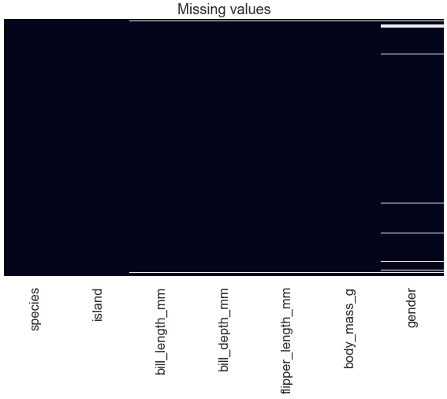

缺失值在该图中显示为白色条带。我们可以立即看到*性别*有更多的缺失值。跨列的连接水平白线(在图的顶部和底部)向我们展示了一种模式，即在一个数字列中有缺失值的记录在其他数字列和*性别*中也有缺失值。

在检查变量之间的关系时，热图也很有用。例如，检查数值变量之间线性关系的相关矩阵可以如下所示:

```
plt.figure(figsize=(8, 3))
sns.heatmap(df.corr(), annot=True, cmap='seismic_r')
plt.title("Correlation matrix");
```

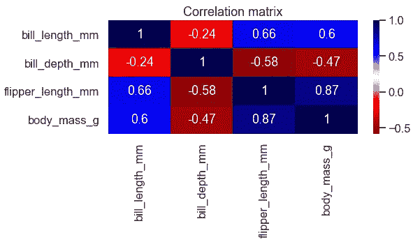

从这个图我们可以看出 *flipper_length_mm* 与 *body_mass_g 有很强的正相关关系(r=0.87)。*

预测能力得分矩阵是检查任何类型关系强度的另一种技术。让我们想象一下预测能力得分矩阵:

```
# Import package
import ppscore as pps# Calculate pps
pps_matrix = pps.matrix(df)# Prepare data to pivot table
pps_pivot = pps_matrix.pivot('x', 'y', 'ppscore')
pps_pivot.index.name, pps_pivot.columns.name = None, None# Plot
plt.figure(figsize=(10, 4))
sns.heatmap(pps_pivot, annot=True, cmap='YlGn')
plt.title("Predictive Power Score Matrix");
```

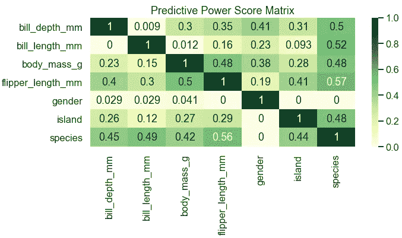

你可以从[这里](/rip-correlation-introducing-the-predictive-power-score-3d90808b9598)了解更多关于预测力评分的信息。

使用监督分类模型时，查看混淆矩阵有助于评估模型性能。为了使它更容易理解，花点额外的精力来标记和格式化它是值得的。现在，让我们建立一个简单的模型来预测*物种*。我们将把*物种*作为这篇文章剩余部分的目标，除了下一部分关于柱状图的后半部分。这里有一个例子:

```
# Import packages
import pandas as pd
from sklearn.model_selection import train_test_split
from sklearn.ensemble import RandomForestClassifier
from sklearn.metrics import confusion_matrix# Create list of numerical column names
numerical = list(df.select_dtypes('number').columns)# Partition data keeping only numerical non-missing columns
X = df.dropna()[numerical]
y = df.dropna()['species']
X_train, X_test, y_train, y_test = train_test_split(X, y, 
                                                    test_size=.3, 
                                                    random_state=1)# Fit simple model to the data
model = RandomForestClassifier(random_state=123)
model.fit(X_train, y_train)# Predict
y_test_pred = model.predict(X_test)# Prepare confusion matrix
cm = confusion_matrix(y_test, y_test_pred)
fig, ax = plt.subplots(figsize=(6, 3.5))
sns.heatmap(cm, annot=True, cbar=False, cmap='BuGn', ax=ax)
ax.set_title('Confusion matrix')
ax.set_xlabel('Predicted')
ax.set_xticklabels(model.classes_)
ax.set_ylabel('Actual')
ax.set_yticklabels(model.classes_, 
                   fontdict={'verticalalignment': 'center'});
```

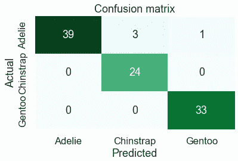

正如您从示例中看到的，热图非常有用和实用。这些是我在探索性分析或建模阶段使用热图的一些最喜欢的方式。如果你需要可视化表格(如数据透视表或交叉制表)并使其更容易阅读，热图是你的好朋友。

# 📍 2.条形图:sns.barplot()和 sns.countplot()

大多数人都熟悉条形图。在条形图中，一个轴告诉我们类别，而另一个轴告诉我们与该类别相关的数值。因此，这对于可视化分类变量很有用。当使用某些类型的机器学习算法时，查看模型的特征重要性可以让我们了解模型认为哪些特征更重要。让我们用它来看看我们在上一节中构建的简单随机森林模型的特性重要性:

```
# Map feature importance to variable names
importances = pd.DataFrame(model.feature_importances_, 
                           index=X_train.columns, 
                           columns=['importance'])
importances.sort_values('importance', ascending=False, inplace=True)# Plot feature importance
plt.figure(figsize=(10, 4))
sns.barplot(data=importances, x=importances.index, y='importance')
plt.title('Feature importance');
```

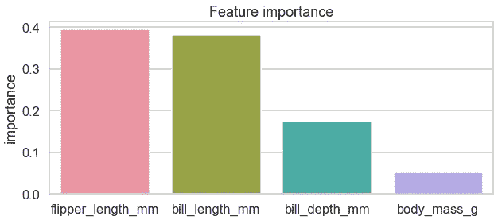

如果有许多特征和/或特征的名称很长，使用这种格式会导致 x 轴上的特征名称重叠，使绘图难以阅读。一个简单的解决方案是交换 x 轴和 y 轴的映射:

```
plt.figure(figsize=(8, 4))
sns.barplot(data=importances, x='importance', y=importances.index)
plt.title('Feature importance');
```

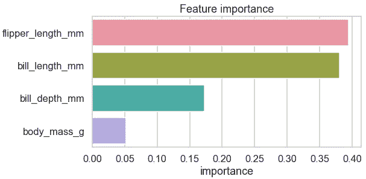

在我们的下一个例子中，我们将使用两个条形图来获得每个分类变量*的不同见解。*第一个条形图将显示类别出现的频率。这有助于看到变量的总体分布，包括是否有任何主导或罕见的类别。为此，我们将使用`sns.countplot()`,它是直方图的分类等价物。第二个条形图将显示变量中每个类别的目标平均值。这有助于检查某些类别是否更有可能或更不可能与目标变量中的特定类相关联。为了说明，我们将添加一个随机的二元目标，将*物种*视为一个特征，并使用循环的*为每个分类变量绘制两个条形图:*

```
# Import package
import numpy as np# Create random target
np.random.seed(123)
df['target'] = np.random.randint(0, 2, df.shape[0])# Create list of categorical column names
categorical = list(df.select_dtypes(exclude='number').columns)# Plot counts for non-numerical variables
for var in categorical:
    fig, ax = plt.subplots(1, 2, figsize=(14, 3.5))    
    sns.countplot(x=var, data=df, ax=ax[0])
    ax[0].set_title(f"Counts of each category in {var}")

    sns.barplot(x=var, y='target', data=df, ax=ax[1])
    ax[1].set_title(f"Mean target by each category in {var}");
```

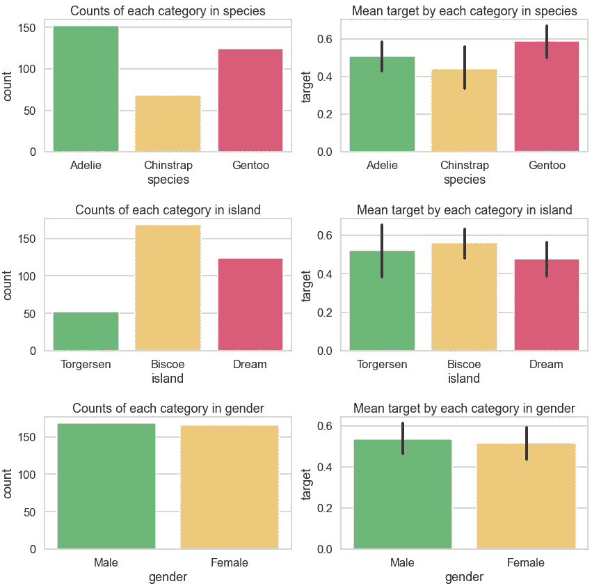

当在探索性分析期间第一次查看数据并试图判断哪些变量对模型可能更有用时，以这种方式可视化分类列非常有用。如果你有一个数字目标，右边的图表也可以。

# 📍 3.直方图:sns.histplot()和密度图:sns.kdeplot()

直方图和核密度图是检查数字列分布的好方法。直方图将数字数据划分为仓，并显示每个仓的频率计数。直方图可以被认为是一种特殊类型的条形图。另一方面，密度图使用核密度估计来显示密度。我们将再次使用循环的*来绘制每个数值变量的直方图和密度图:*

```
for var in numerical:
    fig, ax = plt.subplots(1, 2, figsize=(15, 4))
    sns.histplot(df, x=var, hue='species', bins=30, ax=ax[0])
    ax[0].set_title(f"Histogram for {var}")
    sns.kdeplot(data=df, x=var, hue='species', shade=True, 
                common_norm=False, ax=ax[1])  
    ax[1].set_title(f"Density plot for {var}")
```

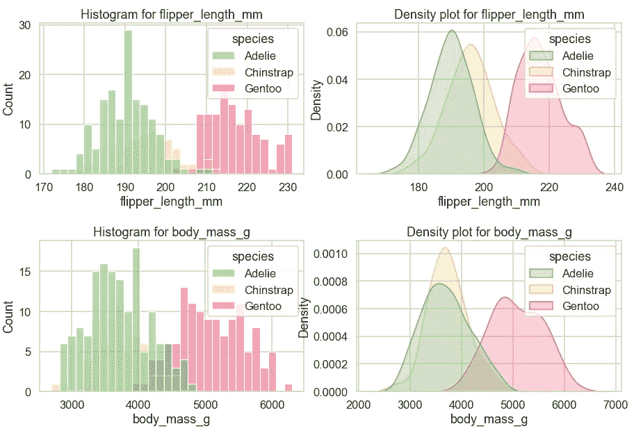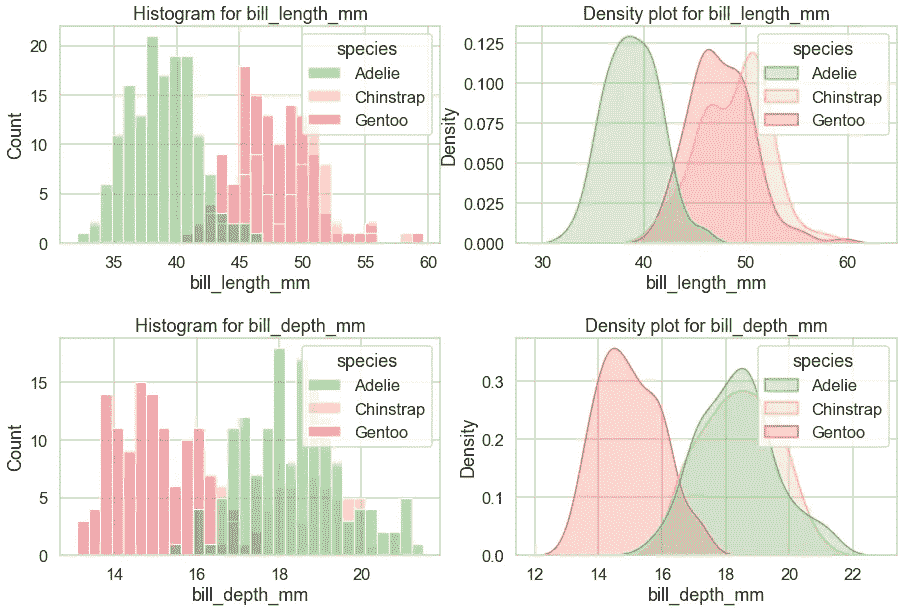

我们使用`hue`参数来绘制*物种*的类别，以观察变量的分布在企鹅物种之间是否不同。因为每个物种的记录数量不同，这已经可以从直方图中看出，我们通过在`sns.kdeplot()`中指定`common_norm=False`来确保每个物种都有自己的标准化内核密度。这里有一个例子来说明我的意思:

```
fig, ax = plt.subplots(1, 2, figsize=(15, 4))
sns.kdeplot(data=df, x=numerical[0], hue='species', shade=True,
            ax=ax[0])
ax[0].set_title(f"common_norm=True")
sns.kdeplot(data=df, x=numerical[0], hue='species', shade=True, 
            common_norm=False, ax=ax[1])  
ax[1].set_title(f"common_norm=False");
```

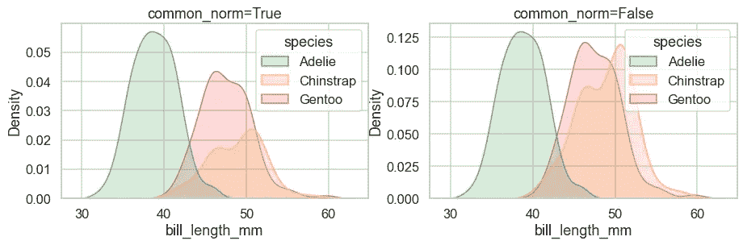

曲线下的面积与第一个图中的物种频率成比例，因为`common_norm=True`将每个人的密度标准化。另一方面，右边的图在物种内是归一化的，所以曲线下的面积在物种间是相等的(注意 y 轴极限的差异)。

# 📍 4.散点图:sns .散点图和二元直方图:sns.histplot()

另一个简单的图是散点图，它对于查看两个数值变量之间的关系很有用。

一般来说，直方图指的是单变量直方图，其中单变量只是*one(uni)variate(变量)的一种花哨说法。*在本节中，我们将查看双变量直方图，以检查两个数值变量之间的关系。

让我们为数字列对的所有组合绘制它们。值得注意的是，这些图中的图例被故意排除在外，因为物种的颜色编码与之前相同，会阻挡一些数据点:

```
previous = []
for i, var in enumerate(numerical):    
    if i > 0:
        for p_var in previous:
            fig, ax = plt.subplots(1, 2, figsize=(15,4))
            sns.histplot(df, x=p_var, y=var, hue='species', 
                         alpha=0.6, ax=ax[0])
            ax[0].get_legend().remove()
            sns.scatterplot(data=df, x=p_var, y=var, hue='species',
                            size='gender', alpha=0.6, ax=ax[1])
            ax[1].get_legend().remove();
    previous.append(var)
```

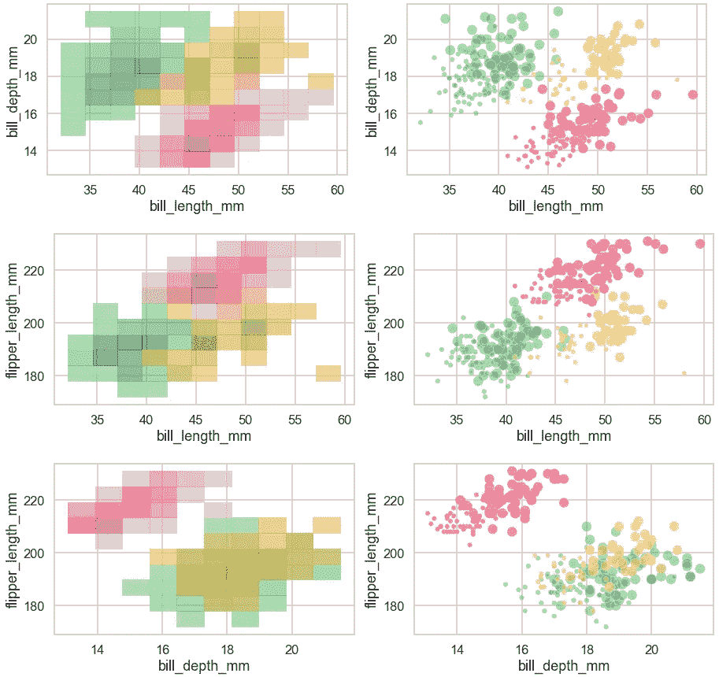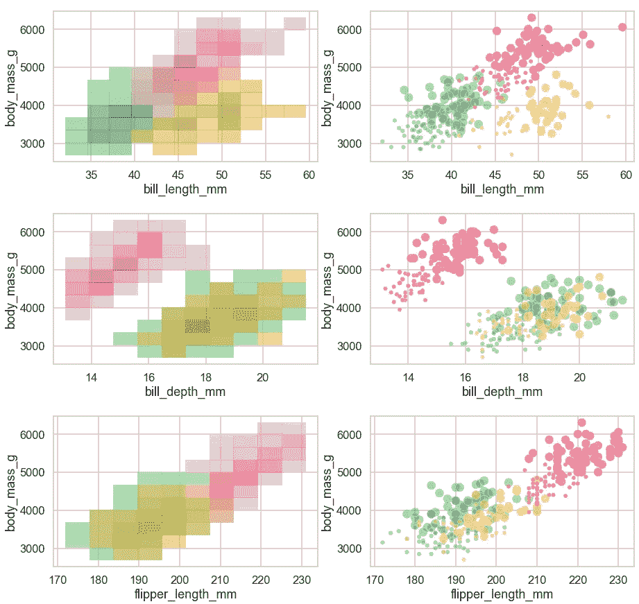

在左边，我们正在看由*物种*进行颜色编码的二元直方图。在右边，我们正在看由*物种*编码的散点图。我们还将*性别*映射到散点图中点的大小。

与上一节不同，这两个图显示了非常相似的见解。这意味着你可以选择你最喜欢的一个，而不是两个都用。

# 📍 5.配对图:sns.pairplot()

在 Seaborn 中有一个很好的功能，可以用一行代码做出我们在第 3 节和第 4 节中看到的类似的图形:

```
sns.pairplot(df.drop(columns='target'), hue='species');
```

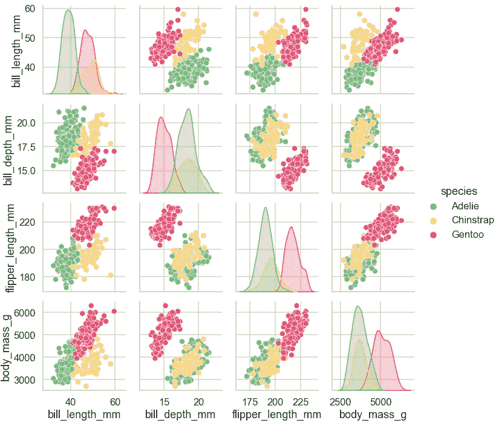

使用`sns.pairplot()`很棒，然而，我确实发现当变量数量增加时，每个图开始变得很小，这使得很难检查。因此，最好将其用于列数较少的数据集。

*您想访问更多这样的内容吗？媒体会员可以无限制地访问媒体上的任何文章。如果您使用* [*我的推荐链接*](https://zluvsand.medium.com/membership)*成为会员，您的一部分会费将直接用于支持我。*

谢谢你看我的帖子。我希望你能在你的数据科学项目中使用这些可视化。

如果你感兴趣，这里有我的一些帖子的链接:

◼️ [在 Seaborn (Python)](/6-simple-tips-for-prettier-and-customised-plots-in-seaborn-python-22f02ecc2393)
◼️ [在 Python 中进行探索性文本分析](/exploratory-text-analysis-in-python-8cf42b758d9e)
◼️️ [给 pandas 用户的 5 个提示](/5-tips-for-pandas-users-e73681d16d17)
◼️️ [在 pandas 中进行数据聚合的 5 个提示](/writing-5-common-sql-queries-in-pandas-90b52f17ad76)
◼️️ [在 pandas 中编写 5 个常见的 SQL 查询](/writing-5-common-sql-queries-in-pandas-90b52f17ad76)
◼️️ [在 pandas 中编写高级 SQL 查询](/writing-advanced-sql-queries-in-pandas-1dc494a17afe)

再见🏃💨