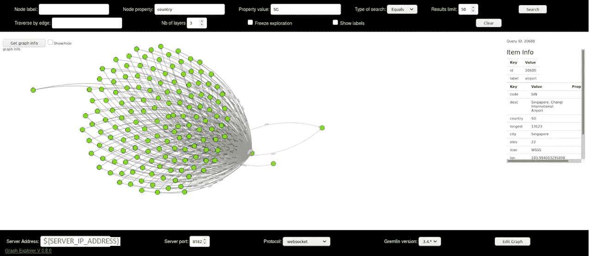

# 图形数据库的简单部署:JanusGraph

> 原文：<https://towardsdatascience.com/simple-deployment-of-a-graph-database-janusgraph-5c8c751d30bf?source=collection_archive---------37----------------------->


参考:[https://unsplash.com/photos/ZiQkhI7417A](https://unsplash.com/photos/ZiQkhI7417A)

我最近一直在寻找一个开源的分布式图形数据库，因为我需要在某个地方持久地存储大量的图形数据。我的主要要求是，我想尽可能多地控制上述数据库背后的底层存储和索引系统。

我偶然发现了 [JanusGraph](https://janusgraph.org/) ，这是 Linux 基金会下的一个图形数据库项目，它建立在 [Apache TinkerPop](https://tinkerpop.apache.org/) 之上，包括 [Gremlin 查询语言](https://en.wikipedia.org/wiki/Gremlin_(query_language))。Tinkerpop 还支持其他许多图形数据库，如 neo4j、Amazon Neptune、DataStax、Azure Cosmos DB 等。我选择 JanusGraph 是因为它的即插即用方法，例如，我可以替换后端存储(如 Cassandra、HBase、BerkeleyDB、ScyllaDB 或 Google Cloud Bigtable)和索引软件(如 Elasticsearch、Solr 或 Lucene)。我还没有评估所有现有的图形数据库，所以我不能说太多关于 JanusGraph 与其他解决方案相比如何。我的意图是首先了解底层技术是如何工作的，然后我才会冒险尝试其他数据库。

尽管如此，由于它的可定制性，探索 JanusGraph 在开始时可能会感到有点令人生畏，至少对于像我这样的第一次尝试者来说是这样。这也是我写这篇文章的原因。我想尽可能简洁地总结我的学习之旅，并指导您完成在远程服务器中部署 JanusGraph、执行查询和可视化数据集所需的步骤。

# 服务器端设置

在服务器中部署 JanusGraph 包括以下步骤。

**设置一个服务器**。在我的情况下，我选择了一个云提供商的廉价虚拟机(25 GB SSD + 1024 MB RAM，Ubuntu 18.04)。因为 JanusGraph 默认运行在端口 8182 上，所以我将这个端口开放给公众访问。为了简单起见(不是最安全的方式)，我简单地通过 iptables 来实现。

```
iptables -A INPUT -p tcp -m tcp — dport 8182 -j ACCEPT
```

**记下您服务器的 IP 地址**为$ {服务器 IP 地址}。您可以通过运行以下命令来做到这一点。

```
ifconfig
```

**拉下并运行骏图 docker。骏利已经提供了其系统的文档化实现。默认的是 BerkeleyDB 作为存储，Lucene 作为索引。下面的代码将从 docker 存储库中提取最新的 janusgraph 图像。**

```
docker run -it -p 8182:8182 janusgraph/janusgraph
```

**将图形数据集复制到 docker。** JanusGraph 支持几种数据格式，其中一种叫做 graphml。在引擎盖下，这些基本上都是邻接矩阵或列表。在我们的实验中，我们将使用 kelvinlawrence.net 的《T2》教程中的机场航线数据集。 *air-routes.graphml* 数据集可以从[这里](https://github.com/krlawrence/graph/blob/master/sample-data/air-routes.graphml)下载。我们需要将 graphml 数据复制到 janusgraph 容器( */opt/janusgraph/data/* )，以便稍后可以通过客户端发出的命令将它加载到 janusgraph。您可以通过运行 *docker ps* 来获取*$ { Janus graph _ DOCKER _ ID }*。

```
docker cp ${YOUR_CUSTOM_LOCATION}/air-routes.graphml ${JANUSGRAPH_DOCKER_ID}:/opt/janusgraph/data/.
```

# 客户端设置

我们将使用三种方法连接服务器:gremlin 控制台、gremlin python 和 graphexp。

## Gremlin 控制台

我们将使用来自 Tinkerpop 的 janusgraph 分叉版本的专用 gremlin 控制台将数据集加载到 janusgraph。

**下载并解压最新发布的骏图。**你可以从[这里](https://github.com/JanusGraph/janusgraph/releases)得到文件。

**为 gremlin 远程连接设置创建一个 remote.yaml 文件**。我们将这个文件称为*$ { REMOTE _ YAML _ LOC }/REMOTE . YAML*

```
hosts: [${SERVER_IP_ADDRESS}]
port: 8182
serializer: { className: org.apache.tinkerpop.gremlin.driver.ser.GryoMessageSerializerV3d0, config: { serializeResultToString: true }}
```

**运行小妖精控制台。我们将在控制台中做一些事情。**

```
${janusgraph_latest_release}/bin/gremlin.sh
```

首先，我们将连接到远程 janusgraph 服务器。这是因为数据存在于服务器中，而这个客户端 gremlin 控制台将仅用于将任何查询转发给前者。

```
:remote connect tinkerpop.server *${REMOTE_YAML_LOC}/remote.yaml* session:remote console
```

**接下来，我们将把 air-routes.graphml 数据加载到 janusgraph 中。我们将使用 janusgraph 的一个名为 graph.io 的 API。**

```
graph.io(graphml()).readGraph(‘/opt/janusgraph/data/air-routes.graphml’)
```

## 小精灵蟒蛇

我们现在想使用 python 查询图表。这个想法是，我们可以获得一些子图，并在本地客户端内存中使用现有的 python 库(如 networkx)进一步分析它们。如果您想要处理整个原始图形(例如，运行 PageRank)，将整个图形加载到您的本地客户端内存可能并不明智。选择 TinkerPop 的 GraphComputer API，您可以通过 VertexProgram 运行 OLAP 算法。更多详情见[此处](http://tinkerpop.apache.org/docs/current/reference/#graphcomputer)。

**用 pip 安装 gremlin-python。**

```
pip install gremlinpython
```

**与远程服务器的 janusgraph** 建立连接。加载图形遍历对象为 *g* 。在 python 控制台中完成这项工作。

```
from gremlin_python.process.anonymous_traversal import traversalfrom gremlin_python.driver.driver_remote_connection import DriverRemoteConnectiong = traversal().withRemote(
DriverRemoteConnection(‘ws://${SERVER_IP_ADDRESS}:8182/gremlin’,’g’))
```

**运行查询。**例如，如果我们想要获得机场列表，我们可以运行以下 gremlin 查询。要获得更多关于可以执行哪些查询的指导，请参考 [Gremlin API](https://tinkerpop.apache.org/gremlin.html) 。这是因为 JanusGraph 是建立在 Gremlin 之上的，因此你也可以参考后者的文档来获得更多信息。

```
g.V().hasLabel(‘airport’).valueMap().toList()
```

## Graphexp

有一些第三方库是为与 JanusGraph 接口而构建的。我发现 [graphexp](https://github.com/bricaud/graphexp) 是最容易使用的软件之一。可以从[这个 github repo](https://github.com/bricaud/graphexp) 下载。

```
git clone [https://github.com/bricaud/graphexp](https://github.com/bricaud/graphexp)
```

**运行 graphexp。只需从浏览器中打开 graphexp.html。**

**输入您的远程服务器地址和端口，执行查询**。在这个例子中，我正在查询新加坡樟宜机场的 ego 网络。



瞧啊。现在，您在远程服务器上有了一个正在运行的图形数据库，您可以从任何客户端计算机上进行查询。

**参考文献**

1.  [https://kelvinlawrence.net/book/Gremlin-Graph-Guide.html](https://kelvinlawrence.net/book/Gremlin-Graph-Guide.html)
2.  [https://docs.janusgraph.org/](https://docs.janusgraph.org/)

# **附加说明**

在某些情况下，您可能希望在数据库中存储多个独立的图形。为此，您必须在部署之前修改您的 janusgraph yaml 配置文件。步骤几乎与 gremlin server 的设置相似(因为 JanusGraph 是建立在 gremlin server 之上的)。粗略地说，您需要做一些事情(这个例子是为 gremlin 服务器中的 TinkerGraph 做的)。

**首先，**编辑 gremlin-server yaml 文件。在这种情况下，我想要创建两个图形，因此我在 yaml 文件的 *graphs* 设置中添加了 *graphA 和 graphB* 。每个图形都在 conf/下的属性文件中定义。

```
graphs: {
  graphA: conf/tinkergraph-empty.properties,
  graphB: conf/tinkergraph-empty.properties
}
```

**其次，**更新初始 groovy 脚本。我们基本上想同时加载 *graphA* 和 *graphB* 。我们还想为它们创建遍历对象。

```
...
org.apache.tinkerpop.gremlin.tinkergraph.structure.TinkerFactory.generateModern(graphA)
org.apache.tinkerpop.gremlin.tinkergraph.structure.TinkerFactory.generateModern(graphB)...globals << [
  gA : graphA.traversal().
withStrategies(ReferenceElementStrategy.instance()), gB : graphB.traversal().
withStrategies(ReferenceElementStrategy.instance())
]...
```

JanusGraph 的另一个有用特性是模式管理(就像任何典型的数据库一样)。然而，这超出了本文的范围。有关如何使用 JanusGraph 的 openManagement API 管理图表的更多信息，请查看这个全面的[教程](https://medium.com/enharmonic/evolving-data-models-with-janusgraph-d0ecf6d3fda3)。